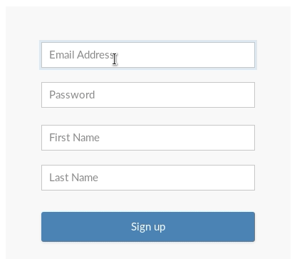
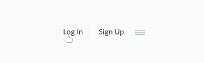
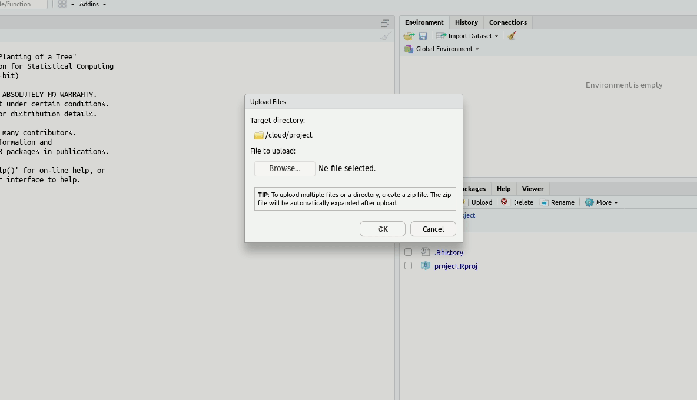

--- 
title: "MSc Conversion in Psychological Studies"
date: "2020-03-17"
bibliography:
- book.bib
- packages.bib
description: This book contains the materials for the one-year MSc Conversion in Psychological Studies/Science.
documentclass: book
link-citations: yes
site: bookdown::bookdown_site
biblio-style: apalike
---


# Overview {-}


In RM2 you will learn core data skills that allow you to manipulate and analyse quantitative data, a key component of an accredited psychology programme. In addition to this book, there are video walkthroughs available on Moodle and you can use Teams to ask any R related questions that you have.

The ability to work with quantitative data is a key skill for psychologists and by using R as our tool we can also promote reproducible research practices. Although it may seem like writing a programming script is more time-consuming than other point-and-click software you may have used, this is not the case! Once you have a script you can easily re-run your analysis without having to go through each step again manually which is a) easier and b) less likely to result in errors if you do something slightly different or forget one of the steps. 

Crucially, with an analysis script other researchers can also see how you got from the raw data to the statistics you report in your final paper. Sharing  analysis scripts online on sites such as the [Open Science Framework](https://osf.io/) is now seen as an important open science practice. Even if you don't continue with quantitative research in the future, the skills you develop on this course will allow you to evaluate quantitative research and to understand what goes on behind the scenes with data before the conclusions are presented.

## How to use this book

For each session there will be a chapter of the book to work through as an activity. **It is crucial that you work through this book consistently throughout the term**. You will learn R much more easily if you work on it each week and give yourself time to build and practice your skills. If you are comfortable with R and/or have programming experience, please feel free to work through this book at your own pace and complete more advanced chapters.

## Intended Learning Outcomes

By the end of this course students will be able to:

* Clean and wrangle data into appropriate forms for analysis
* Visualise data using a range of plots
* Conduct and interpret a core set of statistical tests (t-test, correlation, ANOVA, regression)

<!--chapter:end:index.Rmd-->


# Programming Basics {#ref3}   

## Introduction

In this chapter we will go over some basic programming concepts and terminology, common pitfalls, helpful hints, and where to get help. Those of you who have no programming experience should find this chapter particularly helpful, however, even if you've used R before there may be some helpful hints and tips so please make sure you read through this chapter before moving on.

We don't expect you to memorise the information that is contained in this chapter and some sections of it will make more sense when you start writing your own code - just make sure you know what help is available!

## R and R Studio

For this course, you need two different bits of software, [R](https://www.r-project.org/) and [RStudio](https://www.rstudio.com/products/rstudio/download/#download). R is a programming language that you will write code in and R Studio is an Integrated Development Environment (IDE) which makes working with R easier. Think of it as knowing English and using a plain text editor like NotePad to write a book versus using a word processor like Microsoft Word. You could do it, but it wouldn't look as good and it would be much harder without things like spell-checking and formatting. In a similar way, you can use R without R Studio but we wouldn't recommend it. The key thing to remember is that although you will do all of your work using R Studio for this course, you are actually using two pieces of software which means that from time-to-time, both of them may have separate updates.

If you're at the University of Glasgow, all computers have R and R Studio installed, however, we can only guarantee that the correct packages and updates are installed in the Boyd Orr Level 5 and 6 psychology labs. Both pieces of softwarde are freely available so you we'd reccomend that you install them on your own machine.

If you need help installing R and R Studio, you may find [this page](https://psyteachr.github.io/hack-your-data/r_instructions.html) useful.

### Getting to know R Studio

R Studio has a console that you can try out code in (appearing as the bottom left window in Figure \@ref(fig:img-rstudio)), there is a script editor (top left), a window showing functions and objects you have created in the “Environment” tab (top right window in the figure), and a window that shows plots, files packages, and help documentation (bottom right).

\begin{figure}

{\centering \includegraphics[width=1\linewidth]{images/rstudio} 

}

\caption{RStudio interface}(\#fig:img-rstudio)
\end{figure}

You will learn more about how to use the features included in R Studio throughout this course, however, we highly recommend watching [RStudio Essentials 1](https://www.rstudio.com/resources/webinars/rstudio-essentials-webinar-series-part-1/) from the R Studio team. The video lasts ~30 minutes and gives a tour of the main parts of R Studio. 

## Functions and arguments

**Functions** in R execute specific tasks and normally take a number of **arguments** (if you're into linguistics you might want to think as these as verbs that require a subject and an object). You can look up all the arguments that a function takes by using the help documentation by using the format `?function`. Some arguments are required, and some are optional. Optional arguments will often use a default (normally specified in the help documentation) if you do not enter any value.

As an example, let’s look at the help documentation for the function `rnorm()` which randomly generates a set of numbers with a normal distribution. 

Open up R Studio and in the **console**, type the following code:


```r
?rnorm
```

The help documentation for `rnorm()` should appear in the bottom right help panel. In the usage section, we see that `rnorm()` takes the following form:


```r
rnorm(n, mean = 0, sd = 1)
```

In the arguments section, there are explanations for each of the arguments. `n` is the number of observations we want to create, `mean` is the mean of the data points we will create and `sd` is the standard deviation of the set. In the details section it notes that if no values are entered for `mean` and `sd` it will use a default of 0 and 1 for these values. Because there is no default value for `n` it must be specified otherwise the code won't run.

Let's try an example and just change the required argument `n` to ask R to produce 5 random numbers. Copy and paste the following code into the console.


```r
set.seed(12042016)
rnorm(n = 5)
```

```
## [1] -0.2896163 -0.6428964  0.5829221 -0.3286728 -0.5110101
```

These numbers have a mean of 0 and an SD of 1. Now we can change the additional arguments to produce a different set of numbers.


```r
rnorm(n = 5, mean = 10, sd = 2)
```

```
## [1] 13.320853  9.377956 10.235461  9.811793 13.019102
```

This time R has still produced 5 random numbers, but now this set of numbers has a mean of 10 and an sd of 2 as specified. Always remember to use the help documentation to help you understand what arguments a function requires.


\begin{info}
If you're looking up examples of code online, you may often see code
that starts with the function \texttt{set.seed()}. This function
controls the random number generator - if you're using any functions
that generate numbers randomly (such as \texttt{rnorm()}), running
\texttt{set.seed()} will ensure that you get the same result (in some
cases this may not be what you want to do). We call \texttt{set.seed()}
in this example because it means that you will get the same random
numbers as this book.
\end{info}

### Argument names

In the above examples, we have written out the argument names in our code (e.g., `n`, `mean`, `sd`), however, this is not strictly necessary. The following two lines of code would produce the same result:


```r
rnorm(n = 6, mean = 3, sd = 1)
rnorm(6, 3, 1)
```

Importantly, if you do not write out the argument names, R will use the default order of arguments, that is for `rnorm` it will assume that the first number you enter is `n`. the second number is `mean` and the third number is `sd`. 

If you write out the argument names then you can write the arguments in whatever order you like:


```r
rnorm(sd = 1, n = 6, mean = 3)
```

When you are first learning R, you may find it useful to write out the argument names as it can help you remember and understand what each part of the function is doing. However, as your skills progress you may find it quicker to omit the argument names and you will also see examples of code online that do not use argument names so it is important to be able to understand which argument each bit of code is referring to (or look up the help documentation to check).

In this course, we will always write out the argument names the first time we use each function, however, in subsequent uses they may be omitted.

### Tab auto-complete

One very useful feature of R Studio is the tab auto-complete for functions (see Figure \@ref(fig:img-autocomplete). If you write the name of the function and then press the tab key, R Studio will show you the arguments that function takes along with a brief description. If you press enter on the argument name it will fill in the name for you, just like auto-complete on your phone. This is incredibly useful when you are first learning R and you should remember to use this feature frequently. 

\begin{figure}

{\centering \includegraphics[width=1\linewidth]{images/autocomplete} 

}

\caption{Tab auto-complete}(\#fig:img-autocomplete)
\end{figure}

## Base R and packages {#packages}

When you install R you will have access to a range of functions including options for data wrangling and statistical analysis. The functions that are included in the default installation are typically referred to as **Base R** and there is a useful cheat sheet that shows many Base R functions [here](https://www.rstudio.com/wp-content/uploads/2016/05/base-r.pdf).

However, the power of R is that it is extendable and open source - put simply, if a function doesn't exist or doesn't work very well, anyone can create a new **package** that contains data and code to allow you to perform new tasks. You may find it useful to think of Base R as the default apps that come on your phone and packages as additional apps that you need to download separately.

### Installing and loading packages

In order to use a package, you must first install it. The following code installs the package `tidyverse`, a package we will use very frequently in this course.


```r
install.packages("tidyverse")
```

You only need to install a package once, however, each time you start R you need to load the packages you want to use, in a similar way that you need to install an app on your phone once, but you need to open it every time you want to use it.

To load packages we use the function `library()`. Typically you would start any analysis script by loading all of the packages you need, but we will come back to that in the lab.


```r
library(tidyverse)
```

Now that we've loaded the `tidyverse` package we can use any of the functions it contains but remember, you need to run the `library()` function every time you start R.

\begin{info}
All of the University of Glasgow computers in the Boyd Orr will already
have all of the packages you need for this course so you only need to
install packages if you are using your own machine. Please do not
install any new packages on the university machines.
\end{info}

### Package updates

In addition to updates to R and R Studio, the creators of packages also sometimes update their code. This can be to add functions to a package, or it can be to fix errors. One thing to avoid is unintentionally updating an installed package. When you run `install.packages()` it will always install the latest version of the package and it will overwrite any older versions you may have installed. Sometimes this isn't a problem, however, sometimes you will find that the update means your code no longer works as the package has changed substantially. It is possible to revert back to an older version of a package but try to avoid this anyway.

\begin{danger}
To avoid accidentally overwriting a package with a later version, you
should \textbf{never} include \texttt{install.packages()} in your
analysis scripts in case you, or someone else runs the code by mistake.
\end{danger}

### Package conflicts {#conflicts}

There are thousands of different R packages with even more functions. Unfortunately, sometimes different packages have the same function names. For example, the packages `dplyr` and `MASS` both have a function named `select()`. If you load both of these packages, R will produce a warning telling you that there is a conflict.


```r
library(dplyr)
library(MASS)
```

```
## 
## Attaching package: 'MASS'
```

```
## The following object is masked from 'package:dplyr':
## 
##     select
```

In this case, R is telling you that the function `select()` in the `dplyr` is being hidden (or 'masked') by another function with the same name. If you were to try and use `select()`, R would use the function from the package that was loaded most recently - in this case it would use the function from `MASS`.

If you want to specify which package you want to use for a particular function you can use code in the format `package::function`, for example:


```r
dplyr::select(...)
MASS::select(...)
```

## Objects

A large part of your coding will involve creating and manipulating objects. Objects contain stuff. That stuff can be numbers, words, or the result of operations and analyses.You assign content to an object using `<-`.

Copy and paste the following code into the console and run it. You should see that `name`, `age`, `today`, `new_year`, and `data` appear in the environment pane.


```r
name <- "emily"
age <- 15 + 19 
today <-Sys.Date()
new_year <- as.Date("2020-01-01")
data <- rnorm(n = 10, mean = 15, sd = 3)
```

\begin{figure}

{\centering \includegraphics[width=1\linewidth]{images/objects-enviro} 

}

\caption{Objects in the environment}(\#fig:img-objects-enviro)
\end{figure}

Note that in these examples, `name`,`age`, and `new_year` would always contain the values `emily`, `33`, and the date of New Year's Day 2020, however, `today` will draw the date from the operating system and `data` will be a randomly generated set of data so the values of these objects will not be static.

Importantly, objects can be involved in calculations and can interact with each other. For example:


```r
age + 10
new_year - today
mean(data)
```

```
## [1] 44
## Time difference of -76 days
## [1] 17.66644
```

Finally, you can store the result of these operations in a new object:


```r
decade <- age + 10
```

\begin{try}
You may find it helpful to read \texttt{\textless{}-} as
\texttt{contains}, e.g., \texttt{name} contains the text \texttt{emily}.
\end{try}

You will constantly be creating objects throughout this course and you will learn more about them and how they behave as we go along, however, for now it is enough to understand that they are a way of saving values, that these values can numbers, text, or the result of operations, and that they can be used in further operations to create new variables.

\begin{info}
You may also see objects referred to as `variables'. There is a
difference between the two in programming terms, however, they are used
synonymously very frequently.
\end{info}

## Looking after the environment

If you've been writing a lot of code you may find that the environment pane (or workspace) has become cluttered with many objects. This can make it difficult to figure out which object you need and therefore you run the risk of using the wrong data frame. If you're working on a new dataset, or if you've tried lots of different code before getting the final version, it is good practice to remember to clear the environment to avoid using the wrong object. You can do this in several way.

1. To remove individual objects, you can type `rm(object_name)` in the console. Try this now to remove one of the objects you created in the previous section. 
2. To clear all objects from the environment run `rm(list = ls())` in the console.
3. To clear all objects from the environment you can also click the broom icon in the environment pane. 


\begin{figure}

{\centering \includegraphics[width=1\linewidth]{images/broom} 

}

\caption{Clearing the workspace}(\#fig:img-broom)
\end{figure}

## R sessions

When you open up R and start writing code, loading packages, and creating objects, you're doing so in a new **session**. In addition to clearing the workspace, it can sometimes be useful to start a new session. This will happen automatically each time you start R, however, if you find your code isn't working and you can't figure out why, it might be worth starting a new session. This will clear the environment and detach all loaded packages - think of it like restarting your phone.

To do this, click 'Session - Restart R'. Remember that you will then need to load the packages you need and your data again. 

\begin{figure}

{\centering \includegraphics[width=1\linewidth]{images/new_session} 

}

\caption{The truth about programming}(\#fig:img-session)
\end{figure}

## Help and additional resources

\begin{figure}

{\centering \includegraphics[width=1\linewidth]{images/kitteh} 

}

\caption{The truth about programming}(\#fig:img-kitteh)
\end{figure}

Getting good at programming really means getting good trying stuff out, searching for help online, and finding examples of code to copy. If you are having difficulty with any of the exercises contained in this book then you can ask for help on Teams, however, learning to problem-solve effectively is a key skill that you need to develop throughout this course. 

* Use the help documentation. If you're struggling to understand how a function works, remember the `?function` command.
* If you get an error message, copy and paste it in to Google - it's very likely someone else has had the same problem.
* In addition to these course materials there are a number of excellent resources for learning R:
  * [R Cookbook](http://www.cookbook-r.com/)
  * [StackOverflow](https://stackoverflow.com/)
  * [R for Data Science](https://r4ds.had.co.nz/)
  * Search or use the [#rstats](https://twitter.com/search?f=tweets&q=%23rstats&src=typd) hashtag on Twitter

If you would like to push yourself further with R, we recommend working through [R for Data Science](https://r4ds.had.co.nz/) in full and/or the materials for the [MSc Data Skills course](https://gupsych.github.io/data_skills/) run by Prof. Lisa DeBruine and Dr. Dale Barr at the University of Glasgow.

## Debugging tips

A large part of coding is trying to figure why your code doesn't work and this is true whether you are a novice or an expert. As you progress through this course  you should keep a record of mistakes you make and how you fixed them. In each chapter we will provide a number of common mistakes to look out for but you will undoubtedly make (and fix!) new mistakes yourself.

* Have you loaded the correct packages for the functions you are trying to use? One very common mistake is to write the code to load the package, e.g., `library(tidyverse)` but then forget to run it.
* Have you made a typo? Remember `data` is not the same as `DATA` and `t.test` is not the same as `t_test`.
* Is there a package conflict? Have you tried specifying the package and function with `package::function`?
* Is it definitely an error? Not all red text in R means an error - sometimes it is just giving you a message with information. 

## Test yourself

**Question 1.** Why should you never include the code `install.packages()` in your analysis scripts? <select class='solveme' data-answer='["You (or someone else) may accidentally install a package update that stops your code working"]'> <option></option> <option>You should use library() instead</option> <option>Packages are already part of Base R</option> <option>You (or someone else) may accidentally install a package update that stops your code working</option> <option>You already have the latest version of the package</option></select> 


<div class='solution'><button>Explain This Answer</button>

Remember, when you run `install.packages()` it will always install the latest version of the package and it will overwrite any older versions of the package you may have installed.

</div>
 
<br>
**Question 2.**What will the following code produce?
  

```r
rnorm(6, 50, 10)
```

<select class='solveme' data-answer='["A dataset with 6 numbers that has a mean of 50 and an SD of 10"]'> <option></option> <option>A dataset with 10 numbers that has a mean of 6 and an SD of 50</option> <option>A dataset with 6 numbers that has a mean of 50 and an SD of 10</option> <option>A dataset with 50 numbers that has a mean of 10 and an SD of 6</option> <option>A dataset with 50 numbers that has a mean of 10 and an SD of 6</option></select>  


<div class='solution'><button>Explain This Answer</button>

The default form for `rnorm()` is `rnorm(n, mean, sd)`. If you need help remembering what each argument of a function does, look up the help documentation by running `?rnorm`

</div>
  
<br>
**Question 3.** If you have two packages that have functions with the same name and you want to specify exactly which package to use, what code would you use? 

<select class='solveme' data-answer='["package::function"]'> <option></option> <option>package::function</option> <option>function::package</option> <option>library(package)</option> <option>install.packages(package)</option></select>  


<div class='solution'><button>Explain This Answer</button>

You should use the form `package::function`, for example `dplyr::select`. Remember that when you first load your packages R will warn you if any functions have the same name - remember to look out for this!

</div>
  

<!--chapter:end:01-programming-basics.Rmd-->


# Intro to R {#ref2}

There are nine activities in total for this chapter, but don't worry, they are broken down into very small steps!

## Activity 1: Create the working directory 

If you want to load data into R, or save the output of what you've created (which you almost always will want to do), you first need to tell R where the **working directory** is. All this means is that we tell R where the files we need (such as raw data) are located and where we want to save any files you have created. Think of it just like when you have different subjects, and you have separate folders for each topic e.g. biology, history and so on. When working with R, it's useful to have all the data sets and files you need in one folder. 

We recommend making a new folder called "Research Methods R" with sub-folders for each chapter and saving any data, scripts, and portfolio files for each chapter into these folders. We suggest that you save your work onto a cloud storage server like OneDrive so that you never lose your work.

* Choose a location for your book work and then create the necessary folders for each chapter.

\begin{warning}
Whatever you do, don't call the folder your keep your R work in ``R''.
If you do this, sometimes R has an identity crisis and won't save or
load your files properly.
\end{warning}

## Activity 2: Set the working directory

Once you have created your folders, open R Studio. To set the working directory click `Session` -> `Set Working Directory` -> `Choose Directory` and then select the relevant folder for this chapter as your working directory. 

\begin{figure}

{\centering \includegraphics[width=1\linewidth]{images/working-dir} 

}

\caption{Setting the working directory}(\#fig:img-working-dir)
\end{figure}

## R Markdown for R book work and portfolio assignments

For the R book work and portfolio assignments you will use a worksheet format called R Markdown (abbreviated as Rmd) which is a great way to create dynamic documents with embedded chunks of code. These documents are self-contained and fully reproducible (if you have the necessary data, you should be able to run someone else's analyses with the click of a button) which makes it very easy to share. This is an important part of your open science training as one of the reasons we are using R Studio is that it enables us to share open and reproducible information. Using these worksheets enables you to keep a record of all the code you write during this course, and when it comes time for the portfolio assignments, we can give you a task you can and then fill in the required code. 

For more information about R Markdown feel free to have a look at their main webpage sometime http://rmarkdown.rstudio.com. The key advantage of R Markdown is that it allows you to write code into a document, along with regular text, and then **knit** it using the package `knitr` to create your document as either a webpage (HTML), a PDF, or Word document (.docx). 

## Activity 3: Open and save a new R Markdown document

To open a new R Markdown document click the 'new item' icon and then click 'R Markdown'. You will be prompted to give it a title, call it "Intro to R". Also, change the author name to your GUID as this will be good practice for the portfolio assignments. Keep the output format as HTML.

\begin{figure}

{\centering \includegraphics[width=1\linewidth]{images/new-markdown} 

}

\caption{Opening a new R Markdown document}(\#fig:img-new-markdown)
\end{figure}

Once you've opened a new document be sure to save it by clicking `File` -> `Save as`. Name this file "Intro to R" as well. If you've set the working directory correctly, you should now see this file appear in your file viewer pane in the bottom right hand corner like in the example below (your file names and folders will be different).

\begin{figure}

{\centering \includegraphics[width=1\linewidth]{images/file-dir} 

}

\caption{New file in working directory}(\#fig:img-file-dir)
\end{figure}

## Activity 4: Create a new code chunk

When you first open a new R Markdown document you will see a bunch of welcome text that looks like this:

\begin{figure}

{\centering \includegraphics[width=1\linewidth]{images/markdown-default} 

}

\caption{New R Markdown text}(\#fig:img-markdown-default)
\end{figure}

Do the following steps:  
* Delete **everything** below line 7  
* On line 8 type "About me"  
* Click `Insert` -> `R`  

Your Markdown document should now look something like this:

\begin{figure}

{\centering \includegraphics[width=1\linewidth]{images/new-chunk} 

}

\caption{New R chunk}(\#fig:img-new-chunk)
\end{figure}

What you have created is a **code chunk**. In R Markdown, anything written in the white space is regarded as normal text, and anything written in a grey code chunk is assumed to be code. This makes it easy to combine both text and code in one document.


\begin{warning}
When you create a new code chunk you should notice that the grey box
starts and ends with three back ticks ```. One common mistake is to
accidentally delete these back ticks. Remember, code chunks are grey and
text entry is white - if the colour of certain parts of your Markdown
doesn't look right, check that you haven't deleted the back ticks.
\end{warning}


## Activity 5: Write some code

Now we're going to use the code examples you read about in Programming Basics to add some simple code to our R Markdown document. In your code chunk write the below code but replace the values of name/age/birthday with your own details). Note that text values and dates need to be contained in quotation marks but numerical values do not. Missing and/or unnecessary quotation marks are a common cause of code not working - remember this!


```r
name <- "Emily" 
age <- 34
today <- Sys.Date()
next_birthday <- as.Date("2020-07-11")
```

## Running code

When you're working in an R Markdown document, there are several ways to run your lines of code.

First, you can highlight the code you want to run and then click `Run` -> `Run Selected Line(s)`, however this is very slow.

\begin{figure}

{\centering \includegraphics[width=1\linewidth]{images/run1} 

}

\caption{Slow method of running code}(\#fig:img-run1)
\end{figure}

Alternatively, you can press the green "play" button at the top-right of the code chunk and this will run **all** lines of code in that chunk.

\begin{figure}

{\centering \includegraphics[width=1\linewidth]{images/run2} 

}

\caption{Slightly better method of running code}(\#fig:img-run2)
\end{figure}

Even better though is to learn some of the keyboard shortcuts for R Studio. To run a single line of code, make sure that the cursor is in the line of code you want to run (it can be anywhere) and press `ctrl + enter`. If you want to run all of the code in the code chunk, press `ctrl + shift + enter`. Learn these shortcuts, they will make your life easier!

## Activity 6: Run your code

Run your code using one of the methods above. You should see the variables `name`, `age`, `today`, and `next_birthday` appear in the environment pane in the top right corner.

## Activity 7: Inline code

An incredibly useful feature of R Markdown is that R can insert values into your writing using **inline code**. If you've ever had to copy and paste a value or text from one file in to another, you'll know how easy it can be to make mistakes. Inline code avoids this. It's easier to show you what inline code does rather than to explain it so let's have a go.

First, copy and paste this text exactly (do not change *anything*) to the **white space** underneath your code chunk.


```r
My name is `r name` and I am `r age` years old. It is `r next_birthday - today` days until my birthday.
```

## Activity 8: Knitting your file

Nearly finished! As our final step we are going to "knit" our file. This simply means that we're going to compile our code into a document that is more presentable. To do this click `Knit` -> `Knit to HMTL`. R Markdown will create a new HTML document and it will automatically save this file in your working directory. 

As if by magic, that slightly odd bit of text you copied and pasted now appears as a normal sentence with the values pulled in from the objects you created. 

**My name is Emily and I am 34 years old. It is 116 days until my birthday.**

We're not going to use this function very often in the rest of the course but hopefully you can see just how useful this would be when writing up a report with lots of numbers! R Markdown is an incredibly powerful and flexible format - this book was written using it! If you want to push yourself with R, additional functions and features of R Markdown would be a good place to start.

Before we finish, there are a few final things to note about knitting that will be useful for the portfolio and quantitative project:  

* R Markdown will only knit if your code works - this is a good way of checking for the portfolio assignments whether you've written legal code!  
* You can choose to knit to a Word document rather than HTML. This can be useful for e.g., sharing with others, however, it may lose some functionality and it probably won't look as good so we'd recommend always knitting to HTML.  
* You can choose to knit to PDF, however, this requires an LaTex installation and is quite complicated. If you don't already know what LaTex is and how to use it, do not knit to PDF. If you do know how to use LaTex, you don't need us to give you instructions! 
* R will automatically open the knitted HTML file in the viewer, however, you can also navigate to the folder it is stored in and open the HTML file in your web browser (e.g., Chrome or Firefox).  

## Activity 9: Make R your own

Finally, you can customise how R Studio looks to make it feel more like your own personal version. Click `Tools` - `Global Options` - `Apperance`. You can change the default font, font size, and general apperance of R Studio, including using dark mode. Play around with the settings and see which one you prefe - you're going to spend a lot of time with R, it might as well look nice!

## Finished

And you're done! On your very first time using R you've not only written functioning code but you've written a reproducible output! You could send someone else your R Markdown document and they would be able to produce exactly the same HTML document as you, just by pressing knit.

The key thing we want you to take away from this chapter is that R isn't scary. It might be very new to a lot of you, but we're going to take you through it step-by-step. You'll be amazed at how quickly you can start producing professional-looking data visualisations and analysis.

If you have any questions about anything contained in this chapter or in Programming Basics, please use the Research Methods forum on Teams.

<!--chapter:end:02-intro-to-r.Rmd-->


# Loading data

Part of becoming a psychologist is asking questions and gathering data to enable you to answer these questions effectively. It is very important that you understand all aspects of the research process such as experimental design, ethics, data management and visualisation. 

In this chapter, you will continue to develop reproducible scripts. This means scripts that completely and transparently perform an analysis from start to finish in a way that yields the same result for different people using the same software on different computers. And transparency is a key value of science, as embodied in the “trust but verify” motto. When you do things reproducibly, others can understand and check your work. 

This benefits science, but there is a selfish reason, too: the most important person who will benefit from a reproducible script is your future self. When you return to an analysis after two weeks of vacation, you will thank your earlier self for doing things in a transparent, reproducible way, as you can easily pick up right where you left off. The topic of open science is a big debate in the scientific community at the moment. Some classic psychological experiments have been found not to be replicable and part of the explanation for this has been a historical lack of transparency about data and analysis methods. If you'd like more information on this, you may find the following articles interesting:

[Study delivers bleak verdict on validity of psychology experiment results](https://www.theguardian.com/science/2015/aug/27/study-delivers-bleak-verdict-on-validity-of-psychology-experiment-results)

[Low replicability in psychological science](http://www.apa.org/science/about/psa/2015/09/low-replicability.aspx)

As part of your skill development, it is important that you work with data so that you can become confident and competent in your management and analysis of data. In this course, we will work with real data that has been shared by other researchers. 

### Getting data ready to work with

In this chapter you will learn how to load the packages required to work with our data. You'll then load the data into R Studio before getting it organised into a sensible format that relates to our research question. If you can't remember what packages are, go back and revise \@ref(packages). 

### Activity 1: Set-up

Before we begin working with the data we need to do some set-up. If you need help with any of these steps, you should refer to Intro to R and Programming Basics: 

* Download <a href="ahi-cesd.csv" download>`ahi-cesd.csv`</a> and <a href="participant-info.csv" download>`participant-info.csv`</a> into your chapter folder.  
* Open R and ensure the environment is clear.
* Set the working directory to your chapter folder.  
* Open a new R Markdown document and save it in your working directory. Call the file "Loading Data".    
* Delete the default R Markdown welcome text and insert a new code chunk.  
* You can use the white space to take any notes that might help you for each activity.

### Activity  2: Load in the package

Today we need to use the `tidyverse` package. You will use this package in every single chapter of this course as the functions it contains are those we use for data wrangling, descriptive statistics, and visualisation.

* To load the `tidyverse` type the following code into your code chunk and then run it. 


```r
library(tidyverse)
```

### Open data

For this chapter we are going to be using real data from the following paper:

[Woodworth, R.J., O'Brien-Malone, A., Diamond, M.R. and Schüz, B., 2018. Data from, ‘Web-based Positive Psychology Interventions: A Reexamination of Effectiveness’. Journal of Open Psychology Data, 6(1).](https://openpsychologydata.metajnl.com/articles/10.5334/jopd.35/)

We recommend that you read through this paper and open up the .csv files in order to understand the data better but briefly, the files contains data from two scales, the  Authentic Happiness Inventory (AHI) and the Center for Epidemiological Studies Depression (CES-D) scale, as well as demographic information about participants. 

### Activity 3: Read in data

Now we can read in the data. To do this we will use the function `read_csv()` that allows us to read in .csv files. There are also functions that allow you to read in .xlsx files and other formats, however in this course we will only use .csv files.

* First, we will create an object called `dat` that contains the data in the `ahi-cesd.csv` file. Then, we will create an object called `info` that contains the data in the `participant-info.csv`.


```r
dat <- read_csv ("ahi-cesd.csv")
pinfo <- read_csv("participant-info.csv")
```


\begin{danger}
There is also a function called \texttt{read.csv()}. Be very careful NOT
to use this function instead of \texttt{read\_csv()} as they have
different ways of naming columns. For the portfolio tasks, unless your
results match our exactly you will not get the marks which means you
need to be careful to use the right functions.
\end{danger}

### Activity 4: Check yo' data

You should now see that the objects `dat` and `pinfo` have appeared in the environment pane. Whenever you read data into R you should always do an initial check to see that your data looks like you expected. There are several ways you can do this, try them all out to see how the results differ.

* In the environment pane, click on `dat` and `pinfo`. This will open the data to give you a spreadsheet-like view (although you can't edit it like in Excel)  
* In the environment pane, click the small blue play button to the left of `dat` and `pinfo`. This will show you the structure of the object information including the names of all the variables in that object and what type they are (also see `str(pinfo)`) 
* Use `summary(pinfo)`
* Use `head(pinfo)`
* Just type the name of the object you want to view, e.g., `dat`.

### Activity 5: Join the files together {#join}

We have two files, `dat` and `info` but what we really want is a single file that has both the data and the demographic information about the participants. R makes this very easy by using the function `inner_join()`.

Remember to use the help function `?inner_join` if you want more information about how to use a function and to use tab auto-complete to help you write your code.

The below code will create a new object `all_dat` that has the data from both `dat` and `pinfo` and it will use the columns `id` and `intervention` to match the participants' data. 

* Type and run this code and then view the new dataset using one of the methods from Activity 4.


```r
all_dat <- inner_join(x = dat, # the first table you want to join
                      y = pinfo, # the second table you want to join
                      by = c("id", "intervention")) # columns the two tables have in common
```

### Activity 6: Pull out variables of interest {#ref1}

Our final step is to pull our variables of interest. Very frequently, datasets will have more variables and data than you actually want to use and it can make life easier to create a new object with just the data you need.

In this case, the file contains the responses to each individual question on both the AHI scale and the CESD scale as well as the total score (i.e., the sum of all the individual responses). For our analysis, all we care about is the total scores, as well as the demographic information about participants.

To do this we use the `select()` function to create a new object named `summarydata`.


```r
summarydata <- select(.data = all_dat, # name of the object to take data from
                      ahiTotal, cesdTotal, sex, age, educ, income, occasion,elapsed.days) # all the columns you want to keep
```

* Type and run the above code and then run `head(summarydata)`. If everything has gone to plan it should look something like this:


\begin{tabular}{c|c|c|c|c|c|c|c}
\hline
ahiTotal & cesdTotal & sex & age & educ & income & occasion & elapsed.days\\
\hline
32 & 50 & 1 & 46 & 4 & 3 & 5 & 182.03\\
\hline
34 & 49 & 1 & 37 & 3 & 2 & 2 & 14.19\\
\hline
34 & 47 & 1 & 37 & 3 & 2 & 3 & 33.03\\
\hline
35 & 41 & 1 & 19 & 2 & 1 & 0 & 0.00\\
\hline
36 & 36 & 1 & 40 & 5 & 2 & 5 & 202.10\\
\hline
37 & 35 & 1 & 49 & 4 & 1 & 0 & 0.00\\
\hline
\end{tabular}

Finally, try knitting the file to HTML. And that's it, well done! Remember to save your Markdown in your chapter folder and make a note of any mistakes you made and how you fixed them. You have started on your journey to become a confident and competent member of the open scientific community! 

#### Finished!

There is no portfolio assessment this week, instead, use the time to get comfortable with what we've covered already and revise the activities and support materials presented so far if needed. If you're feeling comfortable with R, you can work your way through this book at your own pace or push yourself by using the additional resources highlighted in \@ref(ref3).

## Debugging tips

* When you downloaded the files from Moodle did you save the file names **exactly** as they were originally? If you download the file more than once you will find your computer may automatically add a number to the end of the file name. `data.csv` is not the same as `data(1).csv`. Pay close attention to names!
* Have you used the **exact** same object names as we did in each activity? Remember, `name` is different to `Name`. In order to make sure you can follow along with this book, pay special attention to ensuring you use the same object names as we do.  
* Have you used quotation marks where needed?  
* Have you accidentally deleted any back ticks (```) from the beginning or end of code chunks?

## Test yourself

1. When loading in a .csv file, which function should you use? 

<select class='solveme' data-answer='["read_csv()"]'> <option></option> <option>read_csv()</option> <option>read.csv()</option></select>


<div class='solution'><button>Explain this answer</button>

Remember, in this course we use `read_csv()` and it is important for the portfolio assignment that you use this function otherwise you may find that the variable names are slightly different and you won't get the marks

</div>
 

<br>

2. The function `inner_join()` takes the arguments `x`, `y`, `by`. What does `by` do?

<select class='solveme' data-answer='["Specifies the column to join by that both tables have in common"]'> <option></option> <option>Specifies the first table to join</option> <option>Specifies the second table to join</option> <option>Specifies the column to join by that both tables have in common</option></select>

3. What does the function `select()` do? 
<br>
<select class='solveme' data-answer='["Keeps only the variables you specify"]'> <option></option> <option>Keeps only the observations you specify</option> <option>Keeps only the variables you specify</option> <option>Keeps only the objects you specify</option></select>

<!--chapter:end:03-loading-data.Rmd-->


# Data wrangling 1

Data comes in lots of different formats. One of the most common formats is that of a two-dimensional table (the two dimensions being rows and columns).  Usually, each row stands for a separate observation (e.g. a subject), and each column stands for a different variable (e.g. a response, category, or group). A key benefit of tabular data is that it allows you to store different types of data-numerical measurements, alphanumeric labels, categorical descriptors-all in one place.

It may surprise you to learn that scientists actually spend far more of time cleaning and preparing their data than they spend actually analysing it. This means completing tasks such as cleaning up bad values, changing the structure of tables, merging information stored in separate tables, reducing the data down to a subset of observations, and producing data summaries. Some have estimated that up to 80% of time spent on data analysis involves such data preparation tasks (Dasu & Johnson, 2003)!

Many people seem to operate under the assumption that the only option for data cleaning is the painstaking and time-consuming cutting and pasting of data within a spreadsheet program like Excel. We have witnessed students and colleagues waste days, weeks, and even months manually transforming their data in Excel, cutting, copying, and pasting data. Fixing up your data by hand is not only a terrible use of your time, but it is error-prone and not reproducible. Additionally, in this age where we can easily collect massive datasets online, you will not be able to organise, clean, and prepare these by hand. 

In short, you will not thrive as a psychologist if you do not learn some key data wrangling skills. Although every dataset presents unique challenges, there are some systematic principles you should follow that will make your analyses easier, less error-prone, more efficient, and more reproducible.

In this lesson you will see how data science skills will allow you to efficiently get answers to nearly any question you might want to ask about your data. By learning how to properly make your computer do the hard and boring work for you, you can focus on the bigger issues.

## Tidyverse

Tidyverse (https://www.tidyverse.org/) is a collection of R packages created by world-famous data scientist Hadley Wickham. 

Tidyverse contains six core packages:  `dplyr`, `tidyr`, `readr`, `purrr`,  `ggplot2`, and `tibble`. Last week when you typed `library(tidyverse)` into R, you will have seen that it loads in all of these packages in one go. Within these six core packages, you should be able to find everything you need to wrangle and visualise your data. 

In this chapter, we are going to focus on the `dplyr` package, which contains six important functions: 

* `select()` Include or exclude certain variables (columns)
* `filter()` Include or exclude certain observations (rows)
* `mutate()` Create new variables (columns)
* `arrange()` Change the order of observations (rows)
* `group_by()` Organize the observations into groups
* `summarise()` Derive aggregate variables for groups of observations

These six functions are known as ’single table verbs’ because they only operate on one table at a time. Although the operations of these functions may seem very simplistic, it’s amazing what you can accomplish when you string them together: Hadley Wickham has claimed that 90% of data analysis can be reduced to the operations described by these six functions. 


## The `babynames` database

To demonstrate the power of the six `dplyr` verbs, we will use them to work with the babynames data from the `babynames` package. The babynames dataset has historical information about births of babies in the U.S.

## Activity 1: Set-up

Do the following. If you need help, consult Intro to R or Programming Basics.

* Open R Studio and set the working directory to your chapter folder. Ensure the environment is clear.  
* Open a new R Markdown document and save it in your working directory. Call the file "Data wrangling 1".    
* If you are working on your own computer, install the package `babynames`. Remember, **never install packages if you are working on a university computer**. 
* Delete the default R Markdown welcome text and insert a new code chunk that loads the packages `tidyverse` and `babynames` using `library()`.  


```r
library(tidyverse)
library(babynames)
```

### Activity 2: Look at the data

The package `babynames` contains an object of the same name that contains all the data about babynames. 

* View a preview of this dataset by typing `babynames` in to the console. You should see the following output:


```r
babynames
```

```
## # A tibble: 1,924,665 x 5
##     year sex   name          n   prop
##    <dbl> <chr> <chr>     <int>  <dbl>
##  1  1880 F     Mary       7065 0.0724
##  2  1880 F     Anna       2604 0.0267
##  3  1880 F     Emma       2003 0.0205
##  4  1880 F     Elizabeth  1939 0.0199
##  5  1880 F     Minnie     1746 0.0179
##  6  1880 F     Margaret   1578 0.0162
##  7  1880 F     Ida        1472 0.0151
##  8  1880 F     Alice      1414 0.0145
##  9  1880 F     Bertha     1320 0.0135
## 10  1880 F     Sarah      1288 0.0132
## # ... with 1,924,655 more rows
```

The first line tells us that the object we are looking at is in a `tibble` with information on five variables with over 1.9 million rows. Yes, this dataset contains 1.8 **million** observations. Interested in analyzing these data by hand? No thanks! A tibble is basically a table of data presenting a two dimensional array of your data. 

Each row in the table represents data about births for a given name and sex in a given year. The variables are:


variable|type             |description
--------|-----------------|--------------------------------------------
  year  |double (numeric) |year of birth
  sex 	|character 	      |recorded sex of baby (F = female, M = male)
  name 	|character 	      |forename given to baby
  n 	  |integer 	        |number of babies given that name
  prop 	|double (numeric) |	proportion of all babies of that sex


The first row of the table tells us that in the year 1880, there were 7065 baby girls born in the U.S. who were given the name Mary, and this accounted for about 7% of all baby girls.

### Activity 3: Your first plot

* Type the code below into the Activity 3 code chunk and run it. 

The code might not make much sense to you right now, but don't worry about not understanding it yet! The point is show you how much you can accomplish with very little code. The code creates a graph showing the popularity of four girl baby names - Alexandra, Beverly, Emily, and Kathleen - from 1880 to 2014.  You should see Figure \@ref(fig:babynames-plot) appear, which shows the proportion of each name across different years -  you can plug in different names if you like and see how the plot changes.


```r
dat <- babynames %>% 
  filter(name %in% c("Emily","Kathleen","Alexandra","Beverly"), sex=="F")

ggplot(data = dat,aes(x = year,y = prop, colour=name))+
  geom_line()  
```

\begin{figure}

{\centering \includegraphics[width=1\linewidth]{04-wrangling-1_files/figure-latex/babynames-plot-1} 

}

\caption{Proportion of four baby names from 1880 to 2014}(\#fig:babynames-plot)
\end{figure}

### Activity 4: Selecting variables of interest

There are two numeric measurements of name popularity, `prop` (the proportion of all babies with each name) is probably more useful than `n`  (total number of babies with that name), because it takes into account that different numbers of babies are born in different years. 

Just like in Chapter \@ref(ref1), if we wanted to create a dataset that only includes certain variables, we can use the `select()` function from the `dplyr` package. Run the below code to only select the columns `year`, `sex`, `name` and `prop`.  


```r
select(.data = babynames, # the object you want to select variables from
       year, sex, name, prop) # the variables you want to select
```

```
## # A tibble: 1,924,665 x 4
##     year sex   name        prop
##    <dbl> <chr> <chr>      <dbl>
##  1  1880 F     Mary      0.0724
##  2  1880 F     Anna      0.0267
##  3  1880 F     Emma      0.0205
##  4  1880 F     Elizabeth 0.0199
##  5  1880 F     Minnie    0.0179
##  6  1880 F     Margaret  0.0162
##  7  1880 F     Ida       0.0151
##  8  1880 F     Alice     0.0145
##  9  1880 F     Bertha    0.0135
## 10  1880 F     Sarah     0.0132
## # ... with 1,924,655 more rows
```

Alternatively, you can also tell R which variables you don't want, in this case, rather than telling R to select `year`, `sex`, `name` and `prop`, we can simply tell it to drop the column `n` using the minus sign `-` before the variable name.


```r
select(.data = babynames, -n)
```

```
## # A tibble: 1,924,665 x 4
##     year sex   name        prop
##    <dbl> <chr> <chr>      <dbl>
##  1  1880 F     Mary      0.0724
##  2  1880 F     Anna      0.0267
##  3  1880 F     Emma      0.0205
##  4  1880 F     Elizabeth 0.0199
##  5  1880 F     Minnie    0.0179
##  6  1880 F     Margaret  0.0162
##  7  1880 F     Ida       0.0151
##  8  1880 F     Alice     0.0145
##  9  1880 F     Bertha    0.0135
## 10  1880 F     Sarah     0.0132
## # ... with 1,924,655 more rows
```

Note that `select()` does not change the original tibble, but makes a new tibble with the specified columns. If you don't save this new tibble to an object, it won't be saved. If you want to keep this new dataset, create a new object. When you run this code, you will see your new tibble appear in the environment pane. 


```r
new_dat <- select(.data = babynames, -n)
```

### Activity 5: Arranging the data

The function `arrange()` will sort the rows in the table according to the columns you supply. Try running the following code:


```r
arrange(.data = babynames, # the data you want to sort
        name) # the variable you want to sort by
```

```
## # A tibble: 1,924,665 x 5
##     year sex   name      n       prop
##    <dbl> <chr> <chr> <int>      <dbl>
##  1  2007 M     Aaban     5 0.00000226
##  2  2009 M     Aaban     6 0.00000283
##  3  2010 M     Aaban     9 0.00000439
##  4  2011 M     Aaban    11 0.00000542
##  5  2012 M     Aaban    11 0.00000543
##  6  2013 M     Aaban    14 0.00000694
##  7  2014 M     Aaban    16 0.00000783
##  8  2015 M     Aaban    15 0.00000736
##  9  2016 M     Aaban     9 0.00000446
## 10  2017 M     Aaban    11 0.0000056 
## # ... with 1,924,655 more rows
```

The data are now sorted in ascending alphabetical order by name. The default is to sort in ascending order. If you want it descending, wrap the name of the variable in the `desc()` function. For instance, to sort by year in descending order, run the following code:


```r
arrange(babynames,desc(year)) 
```

```
## # A tibble: 1,924,665 x 5
##     year sex   name          n    prop
##    <dbl> <chr> <chr>     <int>   <dbl>
##  1  2017 F     Emma      19738 0.0105 
##  2  2017 F     Olivia    18632 0.00994
##  3  2017 F     Ava       15902 0.00848
##  4  2017 F     Isabella  15100 0.00805
##  5  2017 F     Sophia    14831 0.00791
##  6  2017 F     Mia       13437 0.00717
##  7  2017 F     Charlotte 12893 0.00688
##  8  2017 F     Amelia    11800 0.00629
##  9  2017 F     Evelyn    10675 0.00569
## 10  2017 F     Abigail   10551 0.00563
## # ... with 1,924,655 more rows
```

You can also sort by more than one column. What do you think the following code will do?


```r
arrange(babynames, desc(year), desc(sex), desc(prop)) 
```

### Activity 6: Using filter to select observations

We have previously used `select()` to select certain variables or columns, however, frequently you will also want to select only certain observations or rows, for example, only babies born after 1999, or only babies named "Mary". You do this using the verb `filter()`. The `filter()` function is a bit more involved than the other verbs, and requires more detailed explanation, but this is because it is also extremely powerful. 

Here is an example of filter, can you guess what it will do?


```r
 filter(.data = babynames, year > 2000)
```


The first part of the code tells the function to use the object `babynames`. The second argument, `year > 2000`, is what is known as a **Boolean expression**: an expression whose evaluation results in a value of TRUE or FALSE. What `filter()` does is include any observations (rows) for which the expression evaluates to TRUE, and exclude any for which it evaluates to FALSE. So in effect, behind the scenes, `filter()` goes through the entire set of 1.8 million observations, row by row, checking the value of year for each row, keeping it if the value is greater than 2000, and rejecting it if it is less than 2000. To see how a boolean expression works, consider the code below:


```r
years <- 1996:2005
years
years > 2000
```

```
##  [1] 1996 1997 1998 1999 2000 2001 2002 2003 2004 2005
##  [1] FALSE FALSE FALSE FALSE FALSE  TRUE  TRUE  TRUE  TRUE  TRUE
```

You can see that the expression `years > 2000` returns a **logical vector** (a vector of TRUE and FALSE values), where each element represents whether the expression is true or false for that element. For the first five elements (1996 to 2000) it is false, and for the last five elements (2001 to 2005) it is true.

Here are the most commonly used Boolean expressions.

Operator	|Name	                 |is TRUE if and only if
----------|----------------------|---------------------------------
A < B 	  |less than 	           |A is less than B
A <= B 	  |less than or equal    |A is less than or equal to B
A > B 	  |greater than 	       |A is greater than B
A >= B 	  |greater than or equal |A is greater than or equal to B
A == B 	  |equivalence 	         |A exactly equals B
A != B 	  |not equal 	           |A does not exactly equal B
A %in% B 	|in 	                 |A is an element of vector B

If you want only those observations for a specific name (e.g., Mary), you use the equivalence operator `==`. Note that you use double equal signs, not a single equal sign.


```r
filter(babynames, name == "Mary")
```

```
## # A tibble: 268 x 5
##     year sex   name      n     prop
##    <dbl> <chr> <chr> <int>    <dbl>
##  1  1880 F     Mary   7065 0.0724  
##  2  1880 M     Mary     27 0.000228
##  3  1881 F     Mary   6919 0.0700  
##  4  1881 M     Mary     29 0.000268
##  5  1882 F     Mary   8148 0.0704  
##  6  1882 M     Mary     30 0.000246
##  7  1883 F     Mary   8012 0.0667  
##  8  1883 M     Mary     32 0.000284
##  9  1884 F     Mary   9217 0.0670  
## 10  1884 M     Mary     36 0.000293
## # ... with 258 more rows
```

If you wanted all the names except Mary, you use the 'not equals' operator:


```r
filter(babynames, name!="Mary") 
```

```
## # A tibble: 1,924,397 x 5
##     year sex   name          n   prop
##    <dbl> <chr> <chr>     <int>  <dbl>
##  1  1880 F     Anna       2604 0.0267
##  2  1880 F     Emma       2003 0.0205
##  3  1880 F     Elizabeth  1939 0.0199
##  4  1880 F     Minnie     1746 0.0179
##  5  1880 F     Margaret   1578 0.0162
##  6  1880 F     Ida        1472 0.0151
##  7  1880 F     Alice      1414 0.0145
##  8  1880 F     Bertha     1320 0.0135
##  9  1880 F     Sarah      1288 0.0132
## 10  1880 F     Annie      1258 0.0129
## # ... with 1,924,387 more rows
```

And if you wanted names from a defined set - e.g., names of British queens - you can use `%in%`:


```r
filter(babynames, name %in% c("Mary","Elizabeth","Victoria"))
```

```
## # A tibble: 772 x 5
##     year sex   name          n      prop
##    <dbl> <chr> <chr>     <int>     <dbl>
##  1  1880 F     Mary       7065 0.0724   
##  2  1880 F     Elizabeth  1939 0.0199   
##  3  1880 F     Victoria     93 0.000953 
##  4  1880 M     Mary         27 0.000228 
##  5  1880 M     Elizabeth     9 0.0000760
##  6  1881 F     Mary       6919 0.0700   
##  7  1881 F     Elizabeth  1852 0.0187   
##  8  1881 F     Victoria    117 0.00118  
##  9  1881 M     Mary         29 0.000268 
## 10  1882 F     Mary       8148 0.0704   
## # ... with 762 more rows
```


This gives you data for the names in the vector on the right hand side of `%in%`. You can always invert an expression to get its opposite. So, for instance, if you instead wanted to get rid of all Marys, Elizabeths, and Victorias you would use the following:


```r
filter(babynames, !(name %in% c("Mary","Elizabeth","Victoria")))
```

```
## # A tibble: 1,923,893 x 5
##     year sex   name         n   prop
##    <dbl> <chr> <chr>    <int>  <dbl>
##  1  1880 F     Anna      2604 0.0267
##  2  1880 F     Emma      2003 0.0205
##  3  1880 F     Minnie    1746 0.0179
##  4  1880 F     Margaret  1578 0.0162
##  5  1880 F     Ida       1472 0.0151
##  6  1880 F     Alice     1414 0.0145
##  7  1880 F     Bertha    1320 0.0135
##  8  1880 F     Sarah     1288 0.0132
##  9  1880 F     Annie     1258 0.0129
## 10  1880 F     Clara     1226 0.0126
## # ... with 1,923,883 more rows
```

You can include as many expressions as you like as additional arguments to `filter()` and it will only pull out the rows for which all of the expressions for that row evaluate to TRUE. For instance, `filter(babynames, year > 2000, prop > .01)` will pull out only those observations beyond the year 2000 that represent greater than 1% of the names for a given sex; any observation where either expression is false will be excluded. This ability to string together criteria makes `filter()` a very powerful member of the Wickham Six.

**Remember that this section exists. It will contain a lot of the answers to problems you face when wrangling data!**

### Activity 7: Creating new variables {#mutate}

Sometimes we need to create a new variable that doesn’t exist in our dataset. For instance, we might want to figure out what decade a particular year belongs to. To create new variables, we use the function `mutate()`. Note that if you want to save this new column, you need to save it to an object. Here, you are mutating a new column and attaching it to the `new_dat` object you created in Activity 4.


```r
new_dat <- mutate(.data = babynames, # the tibble you want to add a colum to
                  decade = floor(year/10) *10) # new column name = what you want it to contain
new_dat
```

```
## # A tibble: 1,924,665 x 6
##     year sex   name          n   prop decade
##    <dbl> <chr> <chr>     <int>  <dbl>  <dbl>
##  1  1880 F     Mary       7065 0.0724   1880
##  2  1880 F     Anna       2604 0.0267   1880
##  3  1880 F     Emma       2003 0.0205   1880
##  4  1880 F     Elizabeth  1939 0.0199   1880
##  5  1880 F     Minnie     1746 0.0179   1880
##  6  1880 F     Margaret   1578 0.0162   1880
##  7  1880 F     Ida        1472 0.0151   1880
##  8  1880 F     Alice      1414 0.0145   1880
##  9  1880 F     Bertha     1320 0.0135   1880
## 10  1880 F     Sarah      1288 0.0132   1880
## # ... with 1,924,655 more rows
```

In this case, you are creating a new column decade  which has the decade each year appears in. This is calculated using the command `decade = floor(year/10)*10`.

### Activity 8: Grouping and summarising

Most quantitative analyses will require you to summarise your data somehow, for example, by calculating the mean, median or a sum total of your data. You can perform all of these operations using the function `summarise()`.

First, let's use the object `dat` that just has the data for the four girls names, Alexandra, Beverly, Emily, and Kathleen. To start off, we're simply going to calculate the total number of babies across all years that were given one of these four names.

It's useful to get in the habit of translating your code into full sentences to make it easier to figure out what's happening. You can read the below code as "run the function summarise using the data in the object `dat` to create a new variable named `total` that is the result of adding up all the numbers in the column `n`".


```r
summarise(.data = dat, # the data you want to use
          total = sum(n)) # result name = operation
```

```
## # A tibble: 1 x 1
##     total
##     <int>
## 1 2161374
```

`summarise()` becomes even more powerful when combined with the final `dplyr` function, `group_by()`. Quite often, you will want to produce your summary statistics broken down by groups, for examples, the scores of participants in different conditions, or the reading time for native and non-native speakers.

There are two ways you can use `group_by()`. First, you can create a new, grouped object.


```r
group_dat <- group_by(.data = dat, # the data you want to group
                      name) # the variable you want to group by
```

If you look at this object in the viewer, it won't look any different to the original `dat`, however, the underlying structure has changed. Let's run the above summarise code again, but now using the grouped data.


```r
summarise(.data = group_dat, 
          total = sum(n)) 
```

```
## # A tibble: 4 x 2
##   name       total
##   <chr>      <int>
## 1 Alexandra 231364
## 2 Beverly   376914
## 3 Emily     841491
## 4 Kathleen  711605
```

`summarise()` has performed exactly the same operation as before - adding up the total number in the column `n` - but this time it has done is separately for each group, which in this case was the variable `name`.

You can request multiple summary calculations to be performed in the same function. For example, the following code calculates the mean and median number of babies given each name every year.


```r
summarise(group_dat,
          mean_year = mean(n),
          median_year = median(n))
```

```
## # A tibble: 4 x 3
##   name      mean_year median_year
##   <chr>         <dbl>       <dbl>
## 1 Alexandra     1977.        192 
## 2 Beverly       3089.        710.
## 3 Emily         6098.       1392.
## 4 Kathleen      5157.       3098
```

You can also add multiple grouping variables. For example, the following code groups `new_dat` by `sex` and `decade` and then calculates the summary statistics to give us the mean and median number of male and female babies in each decade.


```r
group_new_dat <- group_by(new_dat, sex, decade)
summarise(group_new_dat,
          mean_year = mean(n),
          median_year = median(n))
```

```
## # A tibble: 28 x 4
## # Groups:   sex [2]
##    sex   decade mean_year median_year
##    <chr>  <dbl>     <dbl>       <dbl>
##  1 F       1880      111.          13
##  2 F       1890      128.          13
##  3 F       1900      131.          12
##  4 F       1910      187.          12
##  5 F       1920      211.          12
##  6 F       1930      214.          12
##  7 F       1940      262.          12
##  8 F       1950      288.          13
##  9 F       1960      235.          12
## 10 F       1970      147.          11
## # ... with 18 more rows
```

### Activity 9: Pipes

The final activity for this pre-lab essentially repeats what we've already covered but in a slightly different way. In the previous activities, you created new objects with new variables or groupings and then you called `summarise()` on those new objects in separate lines of code. As a result, you had multiple objects in your environment pane and you need to make sure that you keep track of the different names. 

Instead, you can use **pipes**. Pipes are written as `%>%`and they should be read as "and then". Pipes allow you to string together 'sentences' of code into 'paragraphs' so that you don't need to create intermediary objects. Again, it is easier to show than tell.

The below code does **exactly** the same as all the code we wrote above but it only creates one object.


```r
pipe_summary <- mutate(babynames, decade = floor(year/10) *10) %>%
  filter(name %in% c("Emily","Kathleen","Alexandra","Beverly"), sex=="F") %>%
  group_by(name, decade) %>%
  summarise(mean_decade = mean(n))
```


The reason that this function is called a pipe is because it 'pipes' the data through to the next function. When you wrote the code previously, the first argument of each function was the dataset you wanted to work on. When you use pipes it will automatically take the data from the previous line of code so you don't need to specify it again.

\begin{try}
When learning to code it can be a useful practice to read your code `out
loud' in full sentences to help you understand what it is doing. You can
read the code above as ``create a new variable called decade AND THEN
only keep the names Emily, Kathleen, Alexandra and Beverly that belong
to female babies AND THEN group the dataset by name and decade AND THEN
calculate the mean number of babies with each name per decade.'' Try
doing this each time you write a new bit of code.
\end{try}

Some people find pipes a bit tricky to understand from a conceptual point of view, however, it's well worth learning to use them as when your code starts getting longer they are much more efficient and mean you have to write less code which is always a good thing! 


<!--chapter:end:04-wrangling-1.Rmd-->


# Data wrangling 2

One of the key skills in an researcher's toolbox is the ability to work with data. When you run an experiment you get lots of data in various files. For instance, it is not uncommon for an experimental software to create a new file for every participant you run and for each participant's file to contain numerous columns and rows of data, only some of which are important. Being able to wrangle that data, manipulate it into different layouts, extract the parts you need, and summarise it, is one of the most important skills we will help you learn.

Over this course you will develop your skills in working with data. This chapter focuses on organizing data using the `tidyverse` package that you have read about in Week 1. Over the course, you will learn the main functions for data wrangling and how to use them, and we will use a number of different datasets to give you a wide range of exposure to what Psychology is about, and to reiterate that the same skills apply across different datasets. **The skills don't change, just the data!**

There are some questions to answer as you go along to test your skills: use the example code as a guide and the solutions are at the bottom. Remember to be pro-active in your learning, work together as a community, and if you get stuck use the **[cheatsheets](https://www.rstudio.com/resources/cheatsheets/)**. The key cheatsheet for this activity is the Data Transformation with dplyr.

## Learning to wrangle: Is there a chastity belt on perception

Nearly all data in research methods is stored in two-dimensional tables, either called data-frames, tables or tibbles. There are other ways of storing data that you will discover in time but mainly we will be using tibbles (if you would like more info, type `vignette("tibble")` in the console). A tibble is really just a table of data with columns and rows of information. But within that table you can get different types of data, i.e. numeric, integer, and character.

|Type of Data     | Description                                                  |
|:------------|:-------------------------------------------------------------| 
|Numeric     | Numbers including decimals  |
|Integer     | Numbers without decimals  |
|Character     | Tends to contain letters or be words                       |
|Factor     | Nominal (categorical). Can be words or numbers (e.g., male/1, female/2)                       |


Today we are going to be using data from this paper: [Is there a Chastity Belt on Perception](http://journals.sagepub.com/doi/abs/10.1177/0956797617730892). You can read the full paper if you like, but we will summarise the paper for you. The paper asks, **does your ability to perform an action influence your perception?** For instance, does your ability to hit a tennis ball influence how fast you perceive the ball to be moving? Or to phrase another way, do expert tennis players perceive the ball moving slower than novice tennis players?  This experiment does not use tennis players however, they used the Pong task: "a computerised game in which participants aim to block moving balls with various sizes of paddles". A bit like a very classic retro arcade game. Participants tend to estimate the balls as moving faster when they have to block it with a smaller paddle as opposed to when they have a bigger paddle. You can read the paper to get more details if you wish but hopefully that gives enough of an idea to help you understand the wrangling we will do on the data. We have cleaned up the data a little to start with. Let's begin!

## Activity 1: Set-up

* Download <a href="PongBlueRedBack 1-16 Codebook.csv" download>PongBlueRedBack 1-16 Codebook.csv</a> into your chapter folder.  
* Set the working directory to your chapter folder. Ensure the environment is clear.    
* Open a new R Markdown document and save it in your working directory. Call the file "Data wrangling 2".    
* Delete the default R Markdown welcome text and insert a new code chunk.
* Copy and paste the below code into this code chunk and then run the code.


```r
library("tidyverse")
pong_data <- read_csv("PongBlueRedBack 1-16 Codebook.csv")
summary(pong_data)
```

```
##   Participant     JudgedSpeed      PaddleLength   BallSpeed  
##  Min.   : 1.00   Min.   :0.0000   Min.   : 50   Min.   :2.0  
##  1st Qu.: 4.75   1st Qu.:0.0000   1st Qu.: 50   1st Qu.:3.0  
##  Median : 8.50   Median :1.0000   Median :150   Median :4.5  
##  Mean   : 8.50   Mean   :0.5471   Mean   :150   Mean   :4.5  
##  3rd Qu.:12.25   3rd Qu.:1.0000   3rd Qu.:250   3rd Qu.:6.0  
##  Max.   :16.00   Max.   :1.0000   Max.   :250   Max.   :7.0  
##   TrialNumber     BackgroundColor      HitOrMiss       BlockNumber   
##  Min.   :  1.00   Length:4608        Min.   :0.0000   Min.   : 1.00  
##  1st Qu.: 72.75   Class :character   1st Qu.:0.0000   1st Qu.: 3.75  
##  Median :144.50   Mode  :character   Median :1.0000   Median : 6.50  
##  Mean   :144.50                      Mean   :0.6866   Mean   : 6.50  
##  3rd Qu.:216.25                      3rd Qu.:1.0000   3rd Qu.: 9.25  
##  Max.   :288.00                      Max.   :1.0000   Max.   :12.00
```
  

## Activity 2: Look at your data

Let's have a look at the `pong_data` and see how it is organized. Type `pong_data` in your console window.

In the dataset you will see that each row (observation) represents one trial per participant and that there were 288 trials for each of the 16 participants. The columns (variables) we have in the dataset are as follows:

| Variable       |       Type         |           Description               |
|:--------------:|:-------------------|:------------------------------------|
| Participant        | integer            | participant number                  |
| JudgedSpeed   | integer            | speed judgement (1=fast, 0=slow)    |
| PaddleLength         | integer            | paddle length (pixels)              |
| BallSpeed          | integer            | ball speed (2 pixels/4ms)          |
| TrialNumber         | integer            | trial number                        |
| BackgroundColor      | character          | background display colour           |
| HitOrMiss         | integer            | hit ball=1, missed ball=0       |
| BlockNumber  | integer            | block number (out of 12 blocks)     |

We will use this data to master our skills of the Wickham Six verbs, taking each verb in turn. You should refer to the explanations and example code in Week 1 to help you complete these. There are **6 verbs to work through** and  after that we will briefly recap on two other functions before finishing with a quick look at pipes. Try each activity and ask your peers or your tutor if you need help.


## Activity 3: **`select()`**

Either by inclusion (telling R all the variables you want to keep) or exclusion (telling R which variables you want to drop), select only the `Participant`, `PaddleLength`, `TrialNumber`, `BackgroundColor` and `HitOrMiss` columns from `pong_data` and store it in a new object named `select_dat`.  

## Activity 4: Reorder the variables

`select()` can also be used to reorder the columns in a table as the new table will display the variables in the order that you wrote them. Use `select()` to keep only the columns `Participant`, `JudgedSpeed`, `BallSpeed`, `TrialNumber`, and `HitOrMiss` but have them display in alphabetical order, left to right. Save this table in a new object named `reorder_dat`.

## Activity 5: **`arrange()`** F

Arrange the data by two variables: `HitOrMiss` (putting hits - 1 - first), and `JudgedSpeed` (fast judgement - 1 - first). Do not store this output in a new object.   

## Activity 6: `filter()`

Use `filter()` to extract all Participants that had a fast speed judgement, for speeds 2, 4, 5, and 7, but missed the ball. Store this remaining data in a new object called `pong_fast_miss`


<div class='solution'><button>Helpful Hint</button>


There are three parts to this filter so it is best to think about them individually and then combine them.

1. Filter all fast speed judgements (`JudgedSpeed`)

2. Filter for the speeds 2, 4, 5 and 7 (`BallSpeed`)

3. Filter for all Misses (`HitOrMiss`)

You could do this in three filters where each one uses the output of the preceding one, or remember that filter functions can take more than one argument. Also, because the `JudgedSpeed` and `HitOrMiss` are Integer you will need `==` instead of just `=`.

</div>


<br>

\begin{warning}
The filter function is very useful but if used wrongly can give you very
misleading findings. This is why it is very important to always check
your data after you perform an action. Let's say you are working in
comparative psychology and have run a study looking at how cats, dogs
and horses perceive emotion. Let's say the data is all stored in the
tibble \texttt{animal\_data} and there is a column called
\texttt{animals} that tells you what type of animal your participant
was. Imagine you wanted all the data from just cats:

\texttt{filter(animal\_data,\ animals\ ==\ "cat")}

Exactly! But what if you wanted cats and dogs?

\texttt{filter(animal\_data,\ animals\ ==\ "cat",\ animals\ ==\ "dog")}

Right? Wrong! This actually says ``give me everything that is a cat and
a dog''. But nothing is a cat and a dog, that would be weird - like a
dat or a cog. In fact you want everything that is either a cat
\textbf{or} a dog, which is

filter(animal\_data, animals == ``cat'' \textbar{} animals == ``dog'')`

The vertical line is the symbol for Or. So always pay attention to what
you want and most importantly to what your code produces.
\end{warning}

</div>


## Activity 7: `mutate()` {#recode}

In Chapter \@ref(mutate), you learned how the `mutate()` function lets us create a new variable in our dataset. However, it also has another useful function in that it can be combined with `recode()` to create new columns with recoded values. For example, let's add a new column to `pong_data` in which the background colour is converted into numeric form where `red` will become 1, and `blue` will become 2.


```r
pong_data <- mutate(pong_data, 
                    BackgroundColorNumeric = recode(BackgroundColor, 
                                                    "red" = 1, 
                                                    "blue" = 2))
```

The code here is is a bit complicated but:

* `BackgroundColorNumeric` is the name of your new column, 
* `BackgroundColor` is the name of the old column and the one to take information from
* and 1 and 2 are the new codings of red and blue respectively
* character strings like "red" and "blue" are in quotation marks, numbers are not

The `mutate()` function is also handy for making some calculations on or across columns in your data. For example, say you realise you made a mistake in your experiment where your participant numbers should be 1 higher for every participant, i.e. Participant 1 should actually be numbered as Participant 2, etc. You would do something like:


```r
pong_data <- mutate(pong_data, Participant = Participant + 1)
```

Note here that you are giving the new column the same name as the old column `Participant`. What happens here is that you are **overwriting the old data with the new data**! So watch out, mutate can create a new column or overwrite an existing column, depending on what you tell it to do!  

Imagine you realise there is a mistake in your dataset and that all your trial numbers are wrong. The first trial (trial number 1) was a practice so should be excluded and your experiment actually started on trial 2. 

* Filter out all trials with the number 1 (`TrialNumber` column) from `pong_data`, 
* Then use the `mutate()` function to recount all the remaining trial numbers, starting them at one again instead of two. Overwrite `TrialNumber` in `pong_data` with this new data.

You can either do this in two separate steps and create a new object, or you can uses pipes `%>%` and do it it one line of code. 


<div class='solution'><button>Helpful Hint</button>


Step 1. filter(`TrialNumber` does not equal 1) - remember to store this output in a variable?

Step 2. mutate(`TrialNumber` = TrialNumber minus 1)

</div>
  

## Activity 8: `group_by()`

* Group the data by `BlockNumber` and by `BackgroundColor`, in that order and save it in a new object named `pong_data_group`. 
* View this new object by typing `pong_data_group`into the console.

Enter the number of groups (i.e. a number) you get as a result: <input class='solveme nospaces' size='2' data-answer='["24"]'/>


<div class='solution'><button>Helpful Hint</button>

It is the same procedure as this but with different column names:

`group_by(pong_data, HitOrMiss, BackgroundColor)`

The number of groups should be between the product of the number of background colours (red and blue) and the number of blocks (12).

</div>
  

<br>

`group_by()` is incredibly useful as once the data is organised into groups you can then apply other functions (`filter`, `arrange`, `mutate`...etc.) to the groups within your data that you are interested in, instead of to the entire dataset. For instance, a common second step after `group_by` might be to `summarise` the data...

## Activity 9: Summarising data

The `summarise()` function lets you calculate descriptive statistics for your data. For example, say you want to know the total number of hits there were for different paddle lengths as well as the mean number of hits, or number of hits there were when the background colour was red or blue.

We will do this using pipes, to get you used to using them. Remember to try and read the code out loud and to pronounce `%>%` as 'and then'. Copy and paste the below code into a new code chunk and run the code.


```r
pong_data_hits<- group_by(pong_data, BackgroundColor, PaddleLength) %>% # first group the data
  summarise(total_hits = sum(HitOrMiss, na.rm = TRUE),
            meanhits = mean(HitOrMiss, na.rm = TRUE)) # and then create a new variable called total_hits
```

`summarise()` has a range of internal functions that make life really easy, e.g. `mean`, `sum`, `max`, `min`, etc. See the [dplyr cheatsheet](https://www.rstudio.com/wp-content/uploads/2015/02/data-wrangling-cheatsheet.pdf) for more examples.

\begin{info}
\texttt{na.rm\ =\ TRUE} is an argument that we can add when calculating
descriptive statistics to tell R what to do if there are missing values.
In this dataset, there are no missing values but if there were and we
asked R to calculate the mean, it would return \texttt{NA} as the result
because it doesn't know how to average nothing. Remember this argument
exists, you will use it often and it save you a lot of time!
\end{info}

* View `pong_data_hits` and enter the number of hits made with the small paddle (50) and the red colour background in this box: <input class='solveme nospaces' size='3' data-answer='["517"]'/>

**Note:**

* The name of the column within `pong_data_hits` is `total_hits`; this is what you called it in the above code. You could have called it anything you wanted but always try to use something sensible.

* Make sure to call your variables something you (and anyone looking at your code) will understand and recognize later (i.e. not variable1, variable2, variable3. etc.), and avoid spaces (use_underscores_never_spaces). 


\begin{try}
After grouping data together using the \texttt{group\_by()} function and
then performing a task on it, e.g. \texttt{filter()}, it can be very
good practice to ungroup the data before performing another function.
Forgetting to ungroup the dataset won't always affect further
processing, but can really mess up other things. Again just a good
reminder to always check the data you are getting out of a function a)
makes sense and b) is what you expect.
\end{try}


## Two other useful functions

The Wickham Six verbs let you to do a lot of things with data, however there are thousands of other functions at your disposal. If you want to do something with your data that you are not sure how to do using these functions, do a Google search for an alternative function - chances are someone else has had the same problem and has a help guide. For example, two other functions to note are the `bind_rows()` function and the `count()` functions. 

The `bind_rows()` function is useful if you want to combine two tibbles together into one larger tibble that have the same column structure. For example:    


```r
# a tibble of ball speeds 1 and 2
slow_ball<- filter(pong_data, BallSpeed < 3) 

# a tibble of ball speeds 6 and 7
fast_ball <- filter(pong_data, BallSpeed >= 6) 

# a combined tibble of extreme ball speeds
extreme_balls <- bind_rows(slow_ball, fast_ball) 
```

Finally, the `count()` function is a shortcut that can sometimes be used to count up the number of rows you have for groups in your data, without having to use the `group_by()` and `summarise()` functions. For example, in Task 6 we combined `group_by()` and `summarise()` to calculate how many hits there were based on background colour and paddle length. Alternatively we could have done:


```r
count(pong_data, BackgroundColor, PaddleLength, HitOrMiss)
```

The results are the same, just that in the `count()` version we get all the information, including misses, because we are just counting rows. In the `summarise()` method we only got hits because that was the effect of what we summed. So two different methods give similar answers - coding can be individualised and get the same result!

## Pipes (**`%>%`**) 

Finally, a quick recap on pipes. Here is an example of code that doesn't use pipes to find how many hits there were with the large paddle length and the red background.


```r
# First we group the data accordingly, storing it in `pong_data_group`
pong_data_group <- group_by(pong_data, BackgroundColor, PaddleLength)

# And then we summarise it, storing the answer in `total_hits`
pong_data_hits <- summarise(pong_data_group, total_hits = sum(HitOrMiss))

# And filter just the red, small paddle hits
pong_data_hits_red_small <- filter(pong_data_hits, BackgroundColor == "red", PaddleLength == 250)
```

We can make our code even more efficient, using less code, by stringing our sequence of functions together using pipes. This would look like:


```r
# Same pipeline using pipes
pong_data_hits_red_small <- pong_data %>% # take pong_data and then
  group_by(BackgroundColor, PaddleLength) %>%  # group by BackgroundColor and PaddleLength and then
  summarise(total_hits = sum(HitOrMiss)) %>% # calculate the total number of hits and then
  filter(BackgroundColor == "red", PaddleLength == 250) # only keep the data for the red large paddle
```

One last point on pipes is that they can be written in a single line of code but it's much easier to see what the pipe is doing if each function takes its own line. Every time you add a function to the pipeline, remember to add a `%>%` first and **note that when using separate lines for each function, the `%>%` must appear at the end of the line and not the start of the next line**. Compare the two examples below. The first won't work but the second will because the second puts the pipes at the end of the line where they need to be!


```r
# Piped version that wont work 
data_arrange <- pong_data 
                %>% filter(PaddleLength == "50")
                %>% arrange(BallSpeed) 

# Piped version that will work 
data_arrange <- pong_data %>%
                filter(PaddleLength == "50") %>%
                arrange(BallSpeed) 
```


\begin{try}
Where piping becomes most useful is when we \textbf{string a series of
functions together}, rather than using them as separate steps and having
to save the data each time under a new variable name and getting
ourselves all confused. In the non-piped version we have to create a new
variable each time, for example, \texttt{data}, \texttt{data\_filtered},
\texttt{data\_arranged}, \texttt{data\_grouped},
\texttt{data\_summarised} just to get to the final one we actually want,
which was \texttt{data\_summarised}. This creates a lot of variables and
tibbles in our environment and can make everything unclear and
eventually slow down our computer. The piped version however uses one
variable name, saving space in the environment, and is clear and easy to
read. With pipes we skip unnecessary steps and avoid cluttering our
environment.
\end{try}

### Finished!

We have now learned a number of functions and verbs that you will need as you progress through this book.  You will use them in the next chapter so be sure to go over these and try them out to make yourself more comfortable with them.  If you have any questions please post them on Teams. **Happy Wrangling!**

## Activity solutions {.tabset .tabset-fade .tabset-pills}
Below you will find the solutions to the above questions. Only look at them after giving the questions a good try and speaking to the tutor about any issues.

### Activity 3


<div class='solution'><button>Solution Task 3</button>


```r
# To include variables:
select_dat <- select(pong_data, Participant, PaddleLength, TrialNumber, BackgroundColor, HitOrMiss)

# To exclude variables:
select_dat <-select(pong_data, -JudgedSpeed, -BallSpeed, -BlockNumber)
```

</div>
  

**click the tab to see the solution**
<br>

### Activity 4


<div class='solution'><button>Solution Activity 4</button>


```r
reorder_dat <- select(pong_data, BallSpeed, HitOrMiss, JudgedSpeed, Participant, TrialNumber)
```

</div>
  

**click the tab to see the solution**
<br>


### Activity 5


<div class='solution'><button>Solution Task 2</button>


```r
arrange(pong_data, desc(HitOrMiss), desc(JudgedSpeed))
```

</div>
  

**click the tab to see the solution**
<br>

### Activity 6


<div class='solution'><button>Solution Activity 6</button>


```r
pong_fast_miss< - filter(pong_data, 
                         JudgedSpeed == 1, 
                         BallSpeed %in% c("2", "4", "5", "7"), 
                         HitOrMiss == 0)
```

</div>
  

**click the tab to see the solution**
<br>

### Activity 7


<div class='solution'><button>Solution Activity 7 4</button>


```r
# this is the solution if you used two separate steps

pong_data_filt <- filter(pong_data, TrialNumber >= 2) 
# you can call this variable anything, as long as it makes sense to yourself and others

pong_data <- mutate(pong_data_filt, TrialNumber = TrialNumber - 1)

# this is the solution if you used pipes

pong_data<- filter(pong_data, TrialNumber >= 2) %>%
  mutate(TrialNumber = TrialNumber - 1)
```

</div>
  

**click the tab to see the solution**
<br>


### Activity 8


<div class='solution'><button>Solution Task 5</button>


```r
pong_data_group <- group_by(pong_data, BlockNumber, BackgroundColor)
pong_data_group
```

</div>
 

**click the tab to see the solution**
<br>

### Activity 9


<div class='solution'><button>Solution Activity 9</button>


```r
pong_data <- read_csv("PongBlueRedBack 1-16 Codebook.csv")
pong_data_group <- group_by(pong_data, BackgroundColor, PaddleLength)
pong_data_hits <- summarise(pong_data_group, total_hits = sum(HitOrMiss))
# the answer should give 517
```

</div>
 

**click the tab to see the solution**
<br>

## Debugging tips

* Make sure you have spelt the data file name **exactly** as it is shown. Spaces and everything. Do not change the name of the csv file, fix your code instead. If you have a different name for your file than someone else then your code is not reproducible.
* Remember when uploading data we use `read_csv()` which has an underscore, whereas the data file itself will have a dot in its name, `filename.csv`. 
* Finally, check that the datafile is actually in the folder you have set as your working directory. 

## Test yourself

1. What type of data would these most likely be:

* Male = <select class='solveme' data-answer='["Character"]'> <option></option> <option>Character</option> <option>Numeric</option> <option>Integer</option></select>

* 7.15 = <select class='solveme' data-answer='["Numeric"]'> <option></option> <option>Character</option> <option>Numeric</option> <option>Integer</option></select>

* 137 = <select class='solveme' data-answer='["Integer"]'> <option></option> <option>Character</option> <option>Numeric</option> <option>Integer</option></select>


<div class='solution'><button>Explain these answers</button>

There is a lot of different types of data and as well as different types of levels of measurements and it can get very confusing. It's important to try to remember which is which because you can only do certain types of analyses on certain types of data and certain types of measurements. For instance, you can't take the average of Characters just like you can't take the average of Categorical data. Likewise, you can do any maths on Numeric data, just like you can on Interval and Ratio data. Integer data is funny in that sometimes it is Ordinal and sometimes it is Interval, sometimes you should take the median, sometimes you should take the mean. The main point is to always know what type of data you are using and to think about what you can and cannot do with them.

</div>


<br>

2. Which of the Wickham Six would you use to sort columns from smallest to largest: <select class='solveme' data-answer='["arrange"]'> <option></option> <option>select</option> <option>filter</option> <option>mutate</option> <option>arrange</option> <option>group_by</option> <option>summarise</option></select>

3. Which of the Wickham Six would you use to calculate the mean of a column: <select class='solveme' data-answer='["summarise"]'> <option></option> <option>select</option> <option>filter</option> <option>mutate</option> <option>arrange</option> <option>group_by</option> <option>summarise</option></select>

4. Which of the Wickham Six would you use to remove certain observations - e.g. remove all males: <select class='solveme' data-answer='["filter"]'> <option></option> <option>select</option> <option>filter</option> <option>mutate</option> <option>arrange</option> <option>group_by</option> <option>summarise</option></select> 

5. What does this line of code say? `data %>% filter() %>% group_by() %>% summarise()`: <select class='solveme' data-answer='["take the data and then filter it and then group it and then summarise it"]'> <option></option> <option>take the data and then group it and then filter it and then summarise it</option> <option>take the data and then filter it and then group it and then summarise it</option> <option>take the data and then summarise it and then filter it and then group it</option> <option>take the data and then group it and then summarise it and then filter it</option></select>  

<!--chapter:end:05-wrangling-2.Rmd-->


# Data Wrangling 3

## Data wrangling recap

In the last chapter, we looked at using one-table Wickham verbs to `filter`, `arrange`, `group_by`, `select`, `mutate` and `summarise`. Now we will focus on working with data across two or more tables. The two main verbs we will practice adding to the Wickham six in this chapter are `pivot_longer()` and `inner_join()`and these will help you process your data for the your quantitative project in Research Methods 2.

* `pivot_longer()` allows us to **transform** a table from wide format to long format (more on this below).
* `inner_join()` allows us to **combine** two tables together based on common columns.

\begin{try}
A function is a tool that takes an input, performs some action, and
gives an output. They are nothing more than that. If you think about it
your toaster is a function: it takes bread as an input; it performs the
action of heating it up (nicely sometimes; on both sides would be a
luxury); and it gives an output, the toast. A good thing about the
Wickham six functions is that they are nicely named as verbs to describe
what they do - \texttt{mutate()} mutates (adds on a column);
\texttt{arrange()} arranges columns, \texttt{summarise()} summarises,
etc.

In terms of remembering all the functions, the truth is you don't have
to know them all. However, through practice and repetition, you will
quickly learn to remember which ones are which and what package they
come from. Sort of like where to find your spoons in your kitchen - you
don't look in the fridge, and then the washing machine, and then the
drawer. Nope, you learnt, by repetition, to look in the drawer first
time. It's the same with functions. Keep in mind that research methods
is like a language in that the more you use it and work with it the more
it makes sense.
\end{try}

</div>


### Tidy data 

We will use a type of data organisation known as **tidy data** or sometimes **long-form data**. Any data in this format is easily processed through the `tidyverse` package. However, the data you work with will not always be formatted this way. If that happens then your first step is to put it into tidy data format. There are three fundamental rules defining Tidy Data:

1. Each variable must have its own column.
2. Each observation must have its own row.
3. Each value must have its own cell (i.e. no grouping two variables together, e.g. time/date in one cell). 
    i) A cell is where any specific row and column meet; a single data point in a tibble is a cell. 


\begin{try}
If you've worked with any kind of data before, particularly if you've
used Excel, it's very likely that you will have used \textbf{wide
format} data. In wide format, each participant's data is all in one row
with multiple columns for different data points. This means that the
data set tends to be very wide and you will have as many rows as you
have participants.

This layout can be easy to read, however, it makes programming quite
difficult. Whilst Tidy Data can be conceptually more difficult to
understand at first, it means you can manipulate your data in whatever
way you want very easily.
\end{try}

### Analysing the Autism Spectrum Quotient (AQ)

To continue building your data wrangling skills in this chapter you will tidy data from the Autism Spectrum Quotient (AQ) questionnaire. The AQ10 is a non-diagnostic short form of the AQ with only 10 questions per participant. It is a discrete scale and the higher a participant scores on the AQ10 the more autistic-like traits they are said to display. Anyone scoring 7 or above is recommended for further diagnosis. You can see an example of the AQ10 through this link: <a href="http://docs.autismresearchcentre.com/tests/AQ10.pdf">AQ10 Example</a>.  

There are 66 participants and your goal in this pre-class activity is to find an AQ score for each of them through your data-wrangling skills. 

There are four data files to work with that you should download into your chapter: 

* <a href="responses.csv" download>responses.csv</a> containing the AQ survey responses to each of the 10 questions for the 66 participants
* <a href="qformats.csv" download>qformats.csv</a> containing information on how a question should be coded - i.e. forward or reverse coding
* <a href="scoring.csv" download>scoring.csv</a> containing information on how many points a specific response should get; depending on whether it is forward or reverse coded 
* <a href="pinfo.csv" download>pinfo.csv</a> containing participant information such as Age, Sex and importantly `ID` number.  

<br>

\begin{try}
\texttt{csv} stands for `comma separated variable', and is a very basic
way of transferring data. It really just stores numbers and text and
nothing else. The great thing about being this basic is that it can be
read by many different machines and does not need expensive licenses to
open it.
\end{try}


### Activity 1: Set-up

Do the following. If you need help, consult Chapter \@ref(ref2) and Chapter \@ref(ref3).

* Open R Studio and set the working directory to your chapter folder. Ensure the environment is clear.  
* Open a new R Markdown document and save it in your working directory. Call the file "Data wrangling 3".    
* Download the four .csv files above and save them in your chapter folder. Make sure that you do not change the file names at all.
* Delete the default R Markdown welcome text and insert a new code chunk that loads the package `tidyverse` using the `library()` function. 


### Activity 2: Load in the data

Now you need to load in the `.csv` data files using the `read_csv()` function and save them as variables in the environment. For example, to load in the `responses` file we would type:


```r
responses <- read_csv("responses.csv") 
```

* Add the following lines of code to your Markdown and complete them to load in all four `.csv` data files. Use the above code as an example and name each variable the same as its original file name (minus the .csv part), again as above, e.g. `responses.csv` gets saved as `responses`. Remember to run the lines so that the data loaded in and is stored in your environment. 


```r
responses <-  read_csv()    # survey responses
qformats <-                 # question formats
scoring <-                  # scoring info
pinfo <-                    # participant information
```


### Activity 3: Look at your data

Now that we have the data loaded in it is always best to have a look at it to get an idea of its layout. We showed you ways of doing this before, but you can also use the `glimpse()` or `View()` functions in your Console window and put the name of the data between the brackets to see how it is arranged. Don't add these to your script though they are just one-offs for testing.

* Have a look at the data in `responses` to see if you think it is Tidy or not and answer the following question: The data in `responses` is in <select class='solveme' data-answer='["Wide"]'> <option></option> <option>Tidy</option> <option>Wide</option></select> format


<div class='solution'><button>Explain this answer</button>

The `responses` tibble is far from being tidy; each row represents multiple observations from the same participant, i.e. each row shows responses to multiple questions and there are the same number of rows as there are participants (66) - `wide format`. Remember we want the data in tidy format as described above.
    

</div>
  

### Activity 4: Tidying data {#gather}

We now have all the data we need loaded in, but in order to make it easier for us to get the AQ score for each participant, we need to change the layout of the `responses` tibble to Tidy Data using the `pivot_longer()` function. 

* Type the below code line into the Activity 4 code chunk and run it.


```r
rlong <- pivot_longer(data = responses, # the dataset we want to work on
                names_to = "Question", # the name of the column that will store what is currently the names of each column (question numbers)
                values_to = "Response", # the name of the new column that will store the values (data points)
                Q1:Q10) # the columns we want to put into long-form
```

\begin{warning}
\texttt{pivot\_longer()} is a relatively new function in the tidyverse
package. If you get an error message that says
\texttt{could\ not\ find\ function\ pivot\_longer()} you will need to
update the tidyverse package by reinstalling it. You may also need to
update R itself and other packages such a \texttt{rlang}.
\end{warning}

In case you are wondering if we wanted to go back the way,we would use the `pivot_wider()` function: e.g. `rwide <- pivot_wider(rlong, names_from = Questions, values_from = Response)`. But we do not want to do that here so let's not add this to the code. 

\begin{warning}
In the code above we have used the notation \texttt{Q1:Q10}. This means
'select all the columns from Q1 to Q10. We could have written out the
name of each column individually, for example
\texttt{Q1,\ Q2,\ Q3,\ Q4,\ Q5,\ Q6,\ Q7,\ Q8,\ Q9,\ Q10} but obviously
it is much easier to use the shorthand notation. You must be careful
though to know what you are selecting. R isn't clever enough to realise
that what you want is all the Question columns - it would take any and
all columns that exist between Q1 and Q10. This means that if your
dataset is out of order you may end up selecting columns you didn't mean
to. Always look at your data and make sure you know the layout.
\end{warning}

* Look at the new dataset `rlong`. Compare it to the original dataset `responses` and try to understand how they relate to each other. 

### Activity 5: Combining data {#join}

Now the `responses` data is in tidy format, you are closer to being able to calculate an AQ score for each person. However, you still need some extra information:

* Is the question reverse or forward scored (i.e., is strongly agree a positive or negative response)? This information is found in `qformats`
* How many points are given to give a specific response? This information is found in `scoring`. 

This is a typical analysis situation where different information is in different tables and you need to join them altogether. Both these pieces of information are contained in `qformats` and `scoring` respectively, but we want to join them to `responses` to create one informative tidy table with all the information we need. We can do this through the function `inner_join()`; a function to combine information in two tibbles using a column common to both tibbles.

* Replace the `NULL` values in the below code with the necessary variable names to join `rlong1` and `qformats` by `Question`. If you need extra help, revisit Chapter \@ref(join) - you used the same function then! You can also check the solutions for the answer (but make sure you try yourself first).


```r
rlong2 <- inner_join(x = NULL, y = NULL, by = "NULL")
```

* Now view `rlong2`. You have matched each question with its scoring format, `forward` or `reverse`.


\begin{try}
A lot of questionnaires have some questions that are Forward scored and
some questions that are Reverse scored. What does this mean? Imagine a
situation where your options in replying to a question are: 1 -
extremely agree, 2 - agree, 3 - neutral, 4 - disagree, 5 - extremely
disagree. In a forward-scoring question you would get 1 point for
extremely agree, 2 for agree, 3 for neutral, etc. In a reverse scoring
question you would get 5 for extremely agree, 4 for agree, 3 for
neutral, etc.

The reasoning behind this shift is that sometimes agreeing or
disagreeing might be more favourable depending on how the question is
worded. Secondly, sometimes these questions are used just to catch
people out - imagine if you had two similar questions where one has the
reverse meaning of the other. In this scenario, people should respond
opposites. If they respond the same then they might not be paying
attention.
\end{try}
  
### Activity 6: Combining more data  

Now you need to combine the information in our new table, `rlong2`, with the `scoring` table so you know how many points to attribute each question based on the answer the participant gave, and whether the question was forward or reverse coded. Again, you can use the `inner_join()` function, but this time the common columns found in `rlong2` and `scoring` are `QFormat` and `Response`. To combine by two columns you just write them in sequence as shown below. **Note: when there is more than one common column between two tibbles you are joining, it is best to combine by all the columns to avoid repeat columns names in the new tibble.

* Type the below line into the Activity 6 code chunk, run it, and then view the new object. 


```r
# combine rows in rlong2 and scoring based on QFormat and Response
rscores <- inner_join(rlong2, scoring, c("QFormat", "Response"))
```

### Activity 7: Calculating the AQ scores.

You have now created `rscores` which has information on how each participant responded to each question and how each question should be coded and scored, all within the one tibble. All you need now is to sum the scores for each participant to get their AQ score. 

1. Based on your knowledge from the last chapter, type the below line into your code and replace the NULLs to obtain individual `aq_scores` for each participant.  
2. Save your Markdown and knit it to make sure all your code works. 


```r
aq_scores <- rscores %>% 
             group_by(NULL) %>% # how will you group individual participants?
             summarise(AQ = sum(NULL)) # which column will you sum to obtain AQ scores?
```


<div class='solution'><button>Helpful Hint</button>

Each participant could be grouped by their Id.

If we summed up the value for each Score we might get a full AQ Score for each particpipant.
    

</div>
  


### Activity 8: One last thing on pipes

You now have a complete code to load in your data, convert it to Tidy, combine the tables and calculate an AQ score for each participant. But, if you look at it, some of your code could be more efficient by using pipes. 

Go back through your code and try to rewrite it using pipes `%>%` so that it is as efficient as possible. 


<div class='solution'><button>Helpful Hint</button>


</div>


<br>

You have now recapped one-table and two-table verbs. These are great to know as for example, in the above, it actually only took a handful of reproducible steps to get from messy data to tidy data; could you imagine doing this by hand in Excel through cutting and pasting? Not to mention the mistakes you could make!

If you have any questions, please post them on Teams.

### Activity solutions

Below you will find the solutions to the above questions. Only look at them after giving the questions a good try and trying to find help on Google or Teams about any issues.

#### Activity 2


<div class='solution'><button>Activity 2</button>


```r
responses <- read_csv("responses.csv")                  
qformats <- read_csv("qformats.csv")                 
scoring <- read_csv("scoring.csv")                  
pinfo <- read_csv("pinfo.csv")
```

</div>


**Click the tab to see the solution**

#### Activity 5


<div class='solution'><button>Solution Task 5</button>


```r
rlong2 <- inner_join(x = rlong, y = qformats, by = "Question")
```

</div>


**Click the tab to see the solution**

#### Activity 7


<div class='solution'><button>Solution Task 7</button>


```r
aq_scores <- rscores %>% 
             group_by(Id) %>% # group by the ID number in column Id
             summarise(AQ = sum(Score)) # sum column Score to obtain AQ scores.
```

</div>


**Click the tab to see the solution**

#### Activity 8


<div class='solution'><button>Activity 8</button>


```r
aq_scores2 <- responses %>% # take the data in `responses` and then
  pivot_longer(names_to = "Question", values_to = "Response", Q1:Q10) %>%  # gather up columns Q1 to Q10, put the column names in Question and the scores in Response and then
  inner_join(qformats, "Question") %>% # join with `qformats` and match the data by the column `Question` and then
  inner_join(scoring, c("QFormat", "Response")) %>% # join with `scoring` and match the data by the columns `Qformat` and `Response` and then
  group_by(Id) %>% # group by participant ID and then
  summarise(AQ = sum(Score)) # calculate the total AQ score
```

</div>


**Click the tab to see the solution**

### Test yourself

* You want to put the first three columns of a file called `responses` (Q1, Q2, Q3) into long-form, put the question numbers in a column called `Jam`, the responses in a column called `Strawberry`, and store everything in a tibble called `sandwich`. Fill in the box with what you would write: <input class='solveme nospaces' size='60' data-answer='["sandwich <- pivot_longer(data = responses, names_to = Jam, values_to = Strawberry, Q1:Q3)"]'/>


<div class='solution'><button>Explain this answer</button>


</div>


* Complete the sentence, the higher the AQ score...<select class='solveme' data-answer='["the more autistic-like traits displayed"]'> <option></option> <option>the less autistic-like traits displayed</option> <option>has no relation to autistic-like traits</option> <option>the more autistic-like traits displayed</option></select>  

* Type in the AQ score (just the number) of Participant ID No. 87: <input class='solveme nospaces' size='10' data-answer='["2"]'/>  

* Type how many participants had an AQ score of 3 (again just the number): <input class='solveme nospaces' size='10' data-answer='["13"]'/>  

* The cut-off for the AQ10 is usually said to be around 6 meaning that anyone with a score of more than 6 should be referred for diagnostic assessment. Type in how many participants we should refer from our sample: <input class='solveme nospaces' size='10' data-answer='["6"]'/>  


<div class='solution'><button>Explain these answers</button>

1. From the link above you can see that an appropriate citation for the AQ10 would be (Allison, Auyeung, and Baron-Cohen, (2012))

2. As mentioned, the higher the score on the AQ10 the more autistic-like traits a participant is said to show.

3. You could do this by code with `filter(aq_scores, Id == 87)`, which would give you a tibble of 1x2 showing the ID number and score. If you just wanted the score you could use `pull()` which we haven't shown you that yet: `filter(aq_scores, Id == 87) %>% pull(AQ)`. The answer is an AQ score of 2.

4. Same as above but changing the argument of the filter. `filter(aq_scores, AQ == 3) %>% count()`. The answer is 13. Remember you can do this by counting but the code makes it reproducible and accurate every time. You might make mistakes.

5. `filter(aq_scores, AQ > 6) %>% count()` or `filter(aq_scores, AQ >= 7) %>% count()`. The answer is 6.
        

</div>
  

<!--chapter:end:06-wrangling-3.Rmd-->


# Comparing categories

We have spent the chapters so far focusing on the basics of R and data wrangling. You may think that the tasks we ask you to do in R will get harder as this course progresses but that isn't true. The hardest part of learning R is at the very beginning, trying to learn the new terminology, figuring out how to load in data and wrangle it into the format you need. It may feel like you are still struggling so it's worth reflecting on just how far you've come in a short time.

You can now:

* Understand what functions, arguments, objects, variables, and tibbles are  
* Read data into R  
* Tidy data into an appropriate format  
* Calculate a range of descriptive statistics

That's amazing! Now we're going to move on to performing some simple descriptive comparisons and create a plot to visualise the data. 

### Reminders through association

For this chapter, we're going to use data from [Rogers, T. & Milkman, K. L. (2016). Reminders through association. Psychological Science, 27, 973-986](https://journals.sagepub.com/stoken/default+domain/6XgDSfr6ZHSDs47tx5bu/full). You can read the full paper online but the short version is that the authors looked at how people remember to follow through with the intention of doing something.  Although there are lots of potential reasons (e.g., some people may lack the self-control resources), Rogers and Milkman (2016) propose that some people fail to follow through simply because they forget about their good intentions. If this is the case, the authors argue, then having visual reminders to follow through on their intentions may help people remember to keep them. For example, a person may choose to put a sticker for their gym on their car window, so that every time they get in the car they remember to go to the gym. 

In Study 1, participants took part in an unrelated experiment but at the start of the task they were asked to return a small stack of paper clips to the reception of the building at the end of the study and if they did so the researchers would donate $1 to a charity. They were then asked if they intended to do this. Those in the reminder-through-association (RTA) condition read “Thank you! To remind you to pick up a paper clip, an elephant statuette will be sitting on the counter as you collect your payment.” This message was followed by a picture of the elephant statuette. Those in the control condition simply read “Thank you!”.

What we want to do is to determine whether those in the RTA condition were more likely to remember to return the paper-clips than those in the control condition. In the paper, the authors use an inferential chi-square analysis to do this, however, we're just going to look at the descriptive statistics (although the optional chi-square code is provided if you want to go further).

### Activity 1: Set-up

Do the following. If you need help, consult Chapter \@ref(ref2) and Chapter \@ref(ref3).

* Open R Studio and set the working directory to your chapter folder. Ensure the environment is clear.   
* Open a new R Markdown document and save it in your working directory. Call the file "Comapring categories".    
* Download <a href="RTA_study1.csv" download>RTA_study1.csv</a> and save it in your chapter folder. Make sure that you do not change the file name at all.
* If you are working on your own computer, install the package `lsr`. Remember **do not install packages on university computers, they are already installed**.
* Delete the default R Markdown welcome text and insert a new code chunk that loads the packages `tidyverse` and `lsr` using the `library()` function and loads the data into an object named `intent_data` using `read_csv()`.


```r
library(NULL)
intent_data <- read_csv(NULL)
```

### Activity 2: Look at the data

Using your preferred method, look at the data. It is a fairly simple data file that contains four variables for 87 participants:

* `condition`: this variable indicates which condition participants were in, 1 =  reminder-through-association condition, 2 = control condition
* `intend`: this variable indicates whether participants said they were intending to return the paper-clips, 1 = yes, 0 = no
* `actualdonate`: this variable indicates whether participants actually ended up returning the paper-clips and therefore donating to charity, 1 = yes, 0 = no
* `id`: this variable indicates the participant ID number

### Activity 3: Wrangle and recode the data

We need to do a little bit of wrangling to get our data into the format we need. First, we need to remove all the participants who said that they did not intend to return the paper-clips (`intend = 0`) as we are only interested in whether people follow through on an intention. Second, to make the output easier to read, we're going to recode `condition` to have text labels rather than numerical values. 

* Use `filter()` to remove all participants who said that they did not intend to return the paper-clips
* Use `mutate()` and `recode()` to recode the values in `condition` to make 1 = rta and 2 = control and the values in `actualdonate` to 1 = donated and  0 = no_donation. If you need help with this, consult Chapter \@ref(recode). 
* You can do this in two separate steps, or you can use pipes. Regardless of how you do it, save the final output to an object named `intent_recode`.

The solutions are at the end of this chapter but make sure you try it yourself and ask your peers and tutor for help first.


```r
intent_recode <-
```


<div class='solution'><button>Helpful hint</button>


You will need to put both sides of each recode argument (i.e., 1 and rta) in quotation marks, even though 1 and 2 are numbers, they actually represent categories rather than numerical data.

</div>
 

<br>

`intent_recode` should have data from 77 participants and should look something like this:


\begin{tabular}{c|c|c|c}
\hline
condition & intend & actualdonate & id\\
\hline
rta & 1 & donated & 1\\
\hline
rta & 1 & donated & 2\\
\hline
rta & 1 & donated & 3\\
\hline
rta & 1 & donated & 4\\
\hline
rta & 1 & donated & 5\\
\hline
rta & 1 & donated & 6\\
\hline
\end{tabular}

\begin{warn}
There are several different packages that have a function called
\texttt{recode()} and \texttt{select()}. At the moment, we haven't
loaded them so there won't be any problems however, in the future you
should remember these as potentially problematic functions. To avoid any
issues remember Chapter @ref(conflicts): you can specify exactly which
package you want the function to come from using
\texttt{dplyr::recode()} and \texttt{dplyr::select()}. Remember this -
it may save you a lot of time in the future!
\end{warn}

### Activity 4: Descriptive statistics

Next you need to calculate descriptive statistics. For frequency data these are simply counts so we can use the function `count()` rather than having to use `summarise`. We want to know how many participants are in each group (rta - donated, rta - didn't donate, control - donated, control - didn't donate) so we will need to use `group_by` to display the results for all combinations of `condition` and `actualdonate`.

* Replace the NULLs in the below code to calculate the number of participants in each category and save it to an object named `intent_counts`. 


```r
intent_counts <- intent_recode %>%
  group_by(NULL, NULL) %>%
  count()
```

How many participants in the control condition didn't donate? <input class='solveme nospaces' size='2' data-answer='["22"]'/>  
How many participants in the control condition donated? <input class='solveme nospaces' size='2' data-answer='["16"]'/>  
How many participants in the rta condition didn't donate? <input class='solveme nospaces' size='2' data-answer='["10"]'/>  
How many participants in the rta condition donated? <input class='solveme nospaces' size='2' data-answer='["29"]'/>  

You may also want to calculate the percentage of people who donated in each condition, if so you can adapt the code like this:


```r
intent_percent <- intent_recode %>%
  group_by(condition, actualdonate) %>%
  count() %>%
  ungroup() %>% # ungroups the code
  group_by(condition) %>% # then groups it again but just by condition
  mutate(percent_condition = n/sum(n) * 100)
```


\begin{tabular}{c|c|c|c}
\hline
condition & actualdonate & n & percent\_condition\\
\hline
control & donated & 16 & 42.11\\
\hline
control & no\_donation & 22 & 57.89\\
\hline
rta & donated & 29 & 74.36\\
\hline
rta & no\_donation & 10 & 25.64\\
\hline
\end{tabular}

### `ggplot2()`

Now you have calculated how many participants are in each cell (or combination of the categories), however, it is also useful to create a visualisation of the data - the old saying is true, a picture is worth a thousand words. To make our data visualisations we're going to use the package `ggplot2()` which was loaded as part of the `tidyverse`.

`ggplot()` builds plots by combining layers (see Figure \@ref(fig:img-layers))). If you're used to making plots in Excel this might seem a bit odd at first, however, it means that you can customise each layer and R is capable of making very complex and beautiful figures ([this website](https://www.data-to-viz.com/) gives you a good sense of what's possible).

\begin{figure}

{\centering \includegraphics[width=1\linewidth]{images/layers} 

}

\caption{ggplot2 layers from Field et al. (2012)}(\#fig:img-layers)
\end{figure}

### Activity 5: Bar plot {#bar}

We want to create a simple bar plot of our count data.  

* Type the below code into a new R chunk and run it.   
* The first line (or layer) sets up the base of the graph: the data to use and the aesthetics (what will go on the x and y axis, how the plot will be grouped).    
* `aes()` can take both an `x` and `y` argument, however, with a bar plot you are just asking R to count the number of data points in each group so you don't need to specify this.  
* `fill` will separate the data into each level of the grouping variable and give it a different colour. In this case, there is a different coloured bar for each level of `actualdonate`.  
* The next layer adds a **geom** or a shape, in this case we use `geom_bar()` as we want to draw a bar plot.  
* `position = "dodge"` places the bars next to each other, rather than on top of each other. Try removing this argument and just running the code with `geom_bar()` to see what happens.   


```r
ggplot(data = intent_recode, aes(x = condition, fill = actualdonate)) +
  geom_bar(position = "dodge")
```

\begin{figure}

{\centering \includegraphics[width=1\linewidth]{07-chi-square_files/figure-latex/layer1-1} 

}

\caption{Bar plot of RTA Study 1 data}(\#fig:layer1)
\end{figure}

\begin{warning}
In R terms, \texttt{ggplot2} is a fairly old package. As a result, the
use of pipes wasn't included when it was originally written. As you can
see in the code above, the layers of the code are separated by
\texttt{+} rather than \texttt{\%\textgreater{}\%}. In this case,
\texttt{+} is doing essentially the same job as a pipe - be careful not
to confuse them.
\end{warning}

As you can see, the plot makes it much easier to visualise the data - participants in the RTA condition appear to have been more likely to remember to donate than those in the control condition.

### Activity 6: Make the plot pretty

As mentioned, `ggplot2` allows you to customise all aspects of your plots, so let's tidy ours up a little bit. We're going to do the following:  

* Edit the labels on the x-axis, y-axis and fill  
* Change the colours of the bars to colour-blind friendly options `scale_fill_viridis_d()`  
* Change the theme of the plot to change how it looks visually


```r
ggplot(data = intent_recode, aes(x = condition, fill = actualdonate)) +
  geom_bar(position = "dodge") +
  scale_x_discrete(name = "Condition", labels = c("Control", "RTA")) +
  scale_y_continuous(name = "Count") +
  scale_fill_viridis_d(name = "Behaviour", labels = c("Donated", "Did not donate"), option = "E")+
  theme_classic()
```

\begin{figure}

{\centering \includegraphics[width=1\linewidth]{07-chi-square_files/figure-latex/plot_edits-1} 

}

\caption{Prettier bar plot of RTA Study}(\#fig:plot_edits)
\end{figure}

There are a few things to note about the code we just added on: 

* The first two lines are the same code as we used in Activity 4, what we've done now is add on extra layers.   
* `scale_fill_viridis_d()` has multiple options for colours, try replacing "E" with a letter from A - D and see which one you prefer.
*The `d` in `scale_fill_viridis_d()` stands for discrete, because we have a categorical variable. There is also a `scale_fill_viridis_c()` that you would use if your fill variable was continuous.
* There are multiple themes that you can apply. If you type `theme_` the auto-complete will show you the options - try a few out and see which one you prefer.   
* If you want more information on any of these functions, remember you can look at the help documentation by typing `?function`.  

### Activity 7: Chi-square

So, let's finally run that chi-square analysis to see whether our intuition from the plot holds up and there is a significant association between the grouping variables. As promised, the code is quite simple - type the below code into a new R chunk and run it.


```r
results <- chisq.test(x = intent_recode$condition, # the first grouping variable
                      y = intent_recode$actualdonate, # the second grouping variable
                      correct = FALSE) # whether we want to apply the continuity correction
results
```

```
## 
## 	Pearson's Chi-squared test
## 
## data:  intent_recode$condition and intent_recode$actualdonate
## X-squared = 8.244, df = 1, p-value = 0.004089
```

This code looks a little different to code you've used up until this point as it comes from Base R. The x and y variables use the notation `object$variable` so our x variable could be read as "use the variable `condition` from the object `intent_recode`. The reason that we chose not to apply the continuity correction is because this is what the analysis in the original paper did.

1. What is the chi-square statistic? <input class='solveme nospaces' size='5' data-answer='["8.244"]'/>
2. Is the p-value significant? <select class='solveme' data-answer='["Yes"]'> <option></option> <option>Yes</option> <option>No</option></select>  
3. What are the degrees of freedom for the test? <input class='solveme nospaces' size='1' data-answer='["1"]'/>  


<div class='solution'><button>Explain these answers</button>

1. The chi-square statistic is noted in the output as X-squared. Refer to the lecture for more information on how this number is calculated.  
2. The traditional cut-off for significance is p < .05. This means that if your p-value is smaller than .05 there is a statistically significant association, that is, you would be unlikely to observe this pattern of data by chance if the null hypothesis was true. If p is larger than .05 it means that there is a higher probability that any difference you see would be likely to occur even if the null hypothesis was true. Pay attention to the decimal places, they make a huge difference!  
3. Degrees of freedom are noted as `df` in the output. Refer to the lecture for more information on what they are and how they are calculated.
    
    

</div>


<br>

Go and find the results section in the original paper, do your numbers match the ones they report?

### Activity 8: Additional analysis information

You may have noticed that when you ran the chi-square an object appeared in the environment that saved the results of the analysis. This object is a **list** which is a bit different to the type of objects we've worked with so far. Lists don't just contain one data table or a vector of numbers or characters, they can contain multiple different types of information and multiple different tables. We can see that our object `results` is a list of 9, which means it has 9 components. Click on `results` in the environment pane to view the contents of the list (you could also type `str(results)`).

\begin{figure}

{\centering \includegraphics[width=1\linewidth]{images/lists} 

}

\caption{Contents of a list}(\#fig:img-lists)
\end{figure}

Each of these components can be viewed separately using the same `object$variable` notation we used above. For example, if we wanted to view the observed frequencies (refer to the lecture), we would run the following code:


```r
results$observed
```


\begin{tabular}{l|c|c}
\hline
  & donated & no\_donation\\
\hline
control & 16 & 22\\
\hline
rta & 29 & 10\\
\hline
\end{tabular}

### Assumption checks

The assumptions for chi-square are as follows:

1. The data in the cells should be frequencies, or counts of cases rather than percentages or some other transformation of the data.

2. The levels (or categories) of the variables are mutually exclusive. That is, a particular participant fits into one and only one group of each of the variables.

3. Each subject may contribute data to one and only one cell in the χ2. If, for example, the same subjects are tested over time such that the comparisons are of the same subjects at Time 1, Time 2, Time 3, etc., then χ2 may not be used.

4. The study groups must be independent. This means that a different test must be used if the two groups are related. For example, a different test must be used if the researcher’s data consists of paired samples, such as in studies in which a parent is paired with his or her child.

5. There are 2 variables, and both are measured as categories, usually at the nominal level. While Chi-square has no rule about limiting the number of cells (by limiting the number of categories for each variable), a very large number of cells (over 20) can make it difficult to meet assumption #6 below, and to interpret the meaning of the results.

6. The expected cell frequencies should be greater than 5. 

### Activity 9: Check the expected frequencies

We know that assumptions 1-5 have been met because we know the design of the study and the type of data we have fits these criteria. The final assumption we need to test is that all expected frequencies are greater than 5.  

* Using the same `object$variable` code as in Activity 7, view the expected frequencies

Does the data meet assumption 6? <select class='solveme' data-answer='["Yes - all expected frequencies are > 5"]'> <option></option> <option>Yes - all expected frequencies are > 5</option> <option>No - one or more expected frequencies are < 5</option></select>

### Activity 10: Effect size {#cramer}

Although it wasn't in the original paper, as our last step we will calculate an effect size so that we have a standardised measure of how large the association between our grouping variable is, the effect size measure for chi-square is Cramer's V that you covered in the lecture.

To calculate Cramer's V we're going to use the function `cramersv()` from the `lsr` package. This function is very easy to use - you copy and paste the code you gave to `chisq.test()` in Activity 7.


```r
eff_size <- cramersV(x = intent_recode$condition, y = intent_recode$actualdonate, correct = FALSE)
eff_size
```

```
## [1] 0.327207
```

### Activity 11: Write-up

Now that you've run all of the analyses you can use inline coding to help you write up your results. This isn't something you're going to be tested on in this course but it's a really cool feature of Markdown so for each statistical test we'll show you the code that does it so that you can use it in the future if you wanted to. We're going to replicate the exact write-up of the results from the original paper (with the addition of the effect size). 

In the **white-space** in your Markdown document, copy and paste the following (do not change anything). Note that this will only work if you have called your variables **exactly** the same as the examples in this book:


```r
Those in the reminder-through-association condition performed the intended behavior at a significantly higher rate (`r round(pluck(intent_percent$percent_condition, 3),0)`%, `r pluck(intent_percent$n, 3)` out of `r pluck(intent_percent$n, 3) + pluck(intent_percent$n, 4)`) than did those in the control condition (`r round(pluck(intent_percent$percent_condition, 1),0)`, `r pluck(intent_percent$n, 1)` out of `r pluck(intent_percent$n, 1) + pluck(intent_percent$n, 2)`)), χ2(`r results$parameter`, N = `r length(intent_recode$id)`) = `r round(results$statistic,2)`, p = `r round(results$p.value, 3)`, V = `r round(eff_size, 2)`.
```

This will knit as:

> Those in the reminder-through-association condition performed the intended behaviour at a significantly higher rate (74%, 29 out of 39) than did those in the control condition (42, 16 out of 38)), χ2(1, N = 77) = 8.24, p = 0.004,V = 0.33.

If you're feeling comfortable with R at this point, push yourself to reverse-engineer what each bit of this inline code is doing so that you could use it yourself (remember the `?help` function).

#### Finished!

And you're done! The second and final R Portfolio for RM1 will be available on Moodle and again will only assess you on code we have covered in this book. If you need to, take the time over the break to revise what we've covered so far - if you can get comfortable with the content of the last few chapters, RM2 won't pose a problem. If you're OK with, or even enjoying R so far then please feel free to work through this book at your own pace ahead of the scheduled content

### Activity solutions

#### Activity 1


<div class='solution'><button>Activity 1</button>


```r
library(tidyverse)
intent_data <- read_csv("RTA_study1.csv")
```

</div>
  

**click the tab to see the solution**
<br>

#### Activity 3


<div class='solution'><button>Activity 3</button>


```r
# solution using pipes

intent_recode <- intent_data %>%
  filter(intend == 1) %>%
  mutate(condition = recode(condition, "1" = "rta", "2" = "control"),
         actualdonate = recode(actualdonate, "1" = "donated", "0" = "no_donation"))

# solution using separate steps

intent_filter <- filter(intent_data, intend == 1)
intent_recode <- mutate(intent_filter, condition = recode(condition, "1" = "rta", "2" = "control"),
                        actualdonate = recode(actualdonate, "1" = "donated", "0" = "no_donation"))
```

</div>
  

**click the tab to see the solution**
<br>

#### Activity 9


<div class='solution'><button>Activity 9</button>


```r
results$expected
```

</div>
  

**click the tab to see the solution**
<br>

### Test yourself

** This question is currently borked

1. You have a dataset where gender has been coded numerically. You want to recode this to use text labels. Which code will work? <select class='solveme' data-answer='["mutate(gender = recode(gender, \"1\" = \"male\", \"2\" = \"female\", \"3\" = \"nonbinary\"))"]'> <option></option> <option>mutate(gender = recode(gender, "male" = "1", "female" = "2", "nonbinary" = "3"))</option> <option>mutate(gender = recode(gender, male = 1, "female = 2, nonbinary = 3))</option> <option>mutate(gender = recode(gender, "1" = "male", "2" = "female", "3" = "nonbinary"))</option></select>


<div class='solution'><button>Explain this answer</button>

The first option has the new and old codes in the wrong position, the second option is missing quotation marks, the third option is correct.
    

</div>
 

<br>

2. From the below code, what would the plot have on the x-axis? <select class='solveme' data-answer='["gender"]'> <option></option> <option>exp_data</option> <option>gender</option> <option>score</option></select>


```r
ggplot(data = exp_data, aes(gender, score))
```

3. From the below code, how would the bars in the plot be positioned? <select class='solveme' data-answer='["On top of each other"]'> <option></option> <option>On top of each other</option> <option>Next to each other</option></select>  


```r
ggplot(data, aes(x = condition, fill = actualdonate)) +
  geom_bar()
```


<div class='solution'><button>Explain this answer</button>


</div>
 

<br>

4. Which of the following is not an argument of `chisq.test()` (you may need to look at the help documentation to answer this question)? <select class='solveme' data-answer='["continuity"]'> <option></option> <option>x</option> <option>y</option> <option>p</option> <option>continuity</option></select>
  

<!--chapter:end:07-chi-square.Rmd-->


# Correlations

As [Miller and Haden (2013)](https://drive.google.com/file/d/0B1fyuTuvj3YoaFdUR3FZaXNuNXc/view) state at the start of Chapter 11, correlations are **used to detect and quantify relationships among numerical variables**. In short, you measure two variables and the correlation analysis tells you whether or not they are related in some manner - positively or negatively; one increases as the other increases; one decreases as the other increases; etc.. 

To actually carry out a correlation is very simple and we will show you that today in a little while: you just need the `cor.test()` function.  The harder part of correlations is really wrangling the data and interpreting what the results mean. You are going to run a few correlations today to give you good practice at running and interpreting the relationships between two variables. 

**Note:** When dealing with correlations you should always refer to relationships and not predictions. In a correlation, X does not predict Y, that is regression which we will look at later this semester. In a correlation, all we can say is whether X and Y are related. So try to get the correct terminology and please feel free to pull us up if we say the wrong thing in class. It is an easy slip of the tongue to make!

## Activity 1: Set-up

In this chapter we will use the examples in Miller and Haden (2013), Chapter 11, looking at the relationship between four variables: reading ability, intelligence (IQ), the number of minutes per week spent reading at home (Home); and the number of minutes per week spent watching TV at home (TV). You can see in this situation that it would be unethical to manipulate these variables so measuring them as they exist in the environment is most appropriate; hence the use of correlations.

Do the following. If you need help, consult Chapter \@ref(ref3) and Chapter \@(ref2).

* Open R Studio and set the working directory to your Week 5 folder. Ensure the environment is clear.    
* Open a new R Markdown document and save it in your working directory. Call the file "Week 5".    
* Download <a href="MillerHadenData.csv" download>MillerHadenData.csv</a> and save it in your Week 5 folder. Make sure that you do not change the file name at all.  
* If you are working on your own computer, install the packages `Hmisc`, `car`, and `broom`. Remember **do not install packages on university computers, they are already installed**.
* Delete the default R Markdown welcome text and insert a new code chunk that loads the packages `broom`, `car`, `lsr`, `Hmisc`, and `tidyverse` (in that order) using the `library()` function and loads the data into an object named `mh` using `read_csv()`

## Activity 2: Look at your data

* Look at your data, you can do this by clicking on the object in the environment, or using `summary(mh)` or `head(mh)`. 

As in Miller and Haden, we have 5 columns: 

1. The participant (`Participant`), 
2. Reading Ability score (`Abil`), 
3. Intelligence score (`IQ`), 
4. Number of minutes spent reading at home per week (`Home`), 
5. And number of minutes spent watching TV per week (`TV`). 

For the chapter we will focus on Reading Ability and IQ but for further practice you can look at other relationships in your free time.  
A probable hypothesis for today could be that as Reading Ability increases so does Intelligence (think of the issue with causality and direction). Phrasing the hypothesis more formally, we hypothesise that the reading ability of school children, as measured through a standardized test, and intelligence, again measured through a standardized test, are positively correlated.  

## Activity 3: Assumptions

First, however, we must check some assumptions of the correlation tests. The main assumptions we need to check are:

1. Is the data interval, ratio, or ordinal?
2. Is there a data point for each participant on both variables?
3. Is the data normally distributed in both variables?
4. Does the relationship between variables appear linear?
5. Does the spread have homoscedasticity?

We will look at these in turn.

### Assumption 1: Level of Measurement

If we want to run a Pearson correlation then we need interval or ratio data; Spearman correlations can run with ordinal, interval or ratio data. What type of data do we have?  

* The type of data in this analysis is most probably <select class='solveme' data-answer='["interval"]'> <option></option> <option>ratio</option> <option>interval</option> <option>ordinal</option> <option>nominal</option></select> as the data is <select class='solveme' data-answer='["continuous"]'> <option></option> <option>continuous</option> <option>discrete</option></select> and there is unlikely to be a true zero


<div class='solution'><button>Hints on data type</button>


* Are the variables continuous? 
* Is the difference between 1 and 2 on the scale equal to the difference between 2 and 3?

</div>
  

### Assumption 2: Pairs of Data
All correlations must have a data point for each participant in the two variables being correlated. This should make sense as to why - you can't correlate against an empty cell! So now go check that you have a data point in both columns for each participant. 

It looks like that everyone has data in all the columns but let's test our skills a little whilst we are here.  Answer the following questions:

1. How is missing data represented in a tibble? <select class='solveme' data-answer='["NA"]'> <option></option> <option>an empty cell</option> <option>NA</option> <option>a large number</option> <option>don't know</option></select>
2. Which code would leave you with just the participants who were missing Reading Ability data in mh: 
<select class='solveme' data-answer='["filter(mh, is.na(Abil)"]'> <option></option> <option>filter(mh, is.na(Ability)</option> <option>filter(mh, is.na(Abil)</option> <option>filter(mh, !is.na(Ability)</option> <option>filter(mh, !is.na(Abil)</option></select>
3. Which code would leave you with just the participants who were not missing Reading Ability data in mh: <select class='solveme' data-answer='["filter(mh, !is.na(Abil)"]'> <option></option> <option>filter(mh, is.na(Ability)</option> <option>filter(mh, is.na(Abil)</option> <option>filter(mh, !is.na(Ability)</option> <option>filter(mh, !is.na(Abil)</option></select>


<div class='solution'><button>Hints on removing missing data points</button>


* `filter(dat, is.na(variable))` versus `filter(dat, !is.na(variable))`

</div>
  

### Assumption 3-5: Normality, linearity, homoscedasticity

The remaining assumptions are all best checked through visualisations. You can use histograms and QQ-plots to check that the data (`Abil` and `IQ`) are both normally distributed, and you can use a scatterplot of IQ as a function of Abil to check whether the relationship is linear, with homoscedasticity, and without outliers. There are various options and tests for assessing these assumptions but today we will just use visual checks.

* Run the below code to create a histogram for `Abil`.


```r
ggplot(data = mh, aes(x = Abil)) +
  geom_histogram()
```

\begin{figure}

{\centering \includegraphics[width=1\linewidth]{08-week-5_files/figure-latex/abil-hist-1} 

}

\caption{Histogram of Abil}(\#fig:abil-hist)
\end{figure}

This code should look very similar to the code you used to create a bar plot in Chapter \@ref(bar). We have specified that we want to display `Abil` on the x-axis and that the shape we want to produce is a histogram, hence `geom_histogram()`. Just like `geom_bar()`, you do not need to specify the y-axis because if it's a histogram, it's always a count.

* Write and run the code to produce another histogram for the variable `IQ`.

The QQ-plots require us to use the package `car` rather than `ggplot2`. You can make QQ-plots in `ggplot2` but they aren't as useful, however, the code is still very simple.

* Run the below code to create a QQ-plot for `Abil`.


```r
qqPlot(x = mh$Abil)
```

\begin{figure}

{\centering \includegraphics[width=1\linewidth]{08-week-5_files/figure-latex/qq-abil-1} 

}

\caption{QQ-plot for Abil}(\#fig:qq-abil)
\end{figure}

```
## [1] 15  4
```

The QQ-plot includes a **confidence envelope** (the blue dotted lines). The simple version is that if your data points fall within these dotted lines then you can assume normality. The `ggplot2` version of QQ-plots make it more difficult to add on this confidence envelope, which is why we're using a different package. `qqPlot()` will also print the IDs of the data points that are potentially problematic. In this case, the 4th and 15th data point in `Abil` are flagged to review.

* Write and run the code to create a QQ-plot for `IQ`.

In order to assess linearity and homoscedasticity, we can create a scatterplot using `ggplot2`. This code is slightly different to what you have already done with `ggplot()` in that with a scatterplot you need to specify both the x and y axis in `aes()`.

The first geom, `geom_point()` adds in the data points, the second geom, `geom_smooth` adds in the line of best fit. The shaded area around the line is a **confidence interval**.


```r
ggplot(data = mh, aes(x = Abil, y = IQ)) +
  geom_point()+
  geom_smooth(method = lm) # if you don't want the shaded CI, add se = FALSE to this
```

\begin{figure}

{\centering \includegraphics[width=1\linewidth]{08-week-5_files/figure-latex/unnamed-chunk-5-1} 

}

\caption{Scatterplot of scores}(\#fig:unnamed-chunk-5)
\end{figure}

* Remember that `ggplot2` works on layers and that you customise each layer. Edit the above code to add in layer of `scale_x_continuous()` that changes the label `Abil` to `Reading Ability`.

Based on the above visualisations:

* Is the assumption of normality met for both variables? <select class='solveme' data-answer='["Yes"]'> <option></option> <option>Yes</option> <option>No</option></select>
* Is the assumption of linearity met for both variables? <select class='solveme' data-answer='["Yes"]'> <option></option> <option>Yes</option> <option>No</option></select>
* Is the assumption of homoscedasticity met for both variables? <select class='solveme' data-answer='["Yes"]'> <option></option> <option>Yes</option> <option>No</option></select>


<div class='solution'><button>Explain these answers</button>

When assessing assumptions through the use of visualisations your decision will always be a judgement call. In this dataset, we only have data from 25 participants therefore it is very unlikely we would ever observe perfect normality and linearity in this dataset. It is likely that a researcher would assume that this data is approximately normal, that there is no evidence of a non-linear relationship, and that the spread of data points around the line is relatively even.

Many students become fixated with needing a 'perfect' dataset that follows an exactly normal distribution. This is unlikely to ever happen with real data - learn to trust your instincts!
    

</div>

<br>

Look at the scatterplot and think back to the lecture, how would you describe this correlation in terms of direction and strength? 

## Activity 4: Descriptive statistics

Many researchers (and indeed members of the School of Psychology!) disagree as to whether you need to report descriptive statistics such as the mean and SD for a correlation. The argument against reporting them is that the scatterplot is actually the descriptive of the correlation that you would use to describe the potential relationship in regards to your hypothesis. 

The counter argument is that providing descriptive statistics can still be informative about the spread of data for each variable, for example, in the current example it would make it easier to understand whether the participants as a whole compare to the population IQ score.

There's no fixed answer to this question but the person writing this book takes the second view that you should always report descriptive statistics so that's what we're going to do.

* Calculate the mean score and standard deviation for `Abil` and `IQ` using `summarise()` 
* Name the output of the calculations `Abil_mean`, `Abil_SD`, `IQ_mean`, and `IQ_SD`. Make sure to use these exact spellings otherwise later activities won't work.
* Store the output of this in an object called `descriptives` and then view the object. It should look something like this:  


\begin{tabular}{c|c|c|c}
\hline
Abil\_mean & Abil\_SD & IQ\_mean & IQ\_SD\\
\hline
55.12 & 6.08 & 100.04 & 9.04\\
\hline
\end{tabular}


## Activity 5: Correlation

Finally we will run the correlation using the `cor.test()` function.  Remember that for help on any function you can type `?cor.test` in the console window.  The `cor.test()` function requires:

* the column name of Variable 1
* the column name of Variable 2
* the type of correlation you want to run: e.g. `pearson`, `spearman`
* the type of NHST tail you want to run: e.g. `one.sided`, `two.sided`

For example, if your data is stored in `dat` and you want to do a two-sided pearson correlation of the variables (columns) `X` and `Y`, then you would do:


```r
cor.test(dat$X, dat$Y, method = "pearson", alternative = "two.sided")
```

* Based on your answers to the assumption tests, spend a couple of minutes deciding with your group which correlation method to use (e.g. pearson or spearman) and the type of NHST tail to set (e.g. two.sided or one.sided). 
* Run the correlation between IQ and Ability and save it in an object called `results`.
* View the output by typing `results` in the console

As you can see from the environment, the output from the correlation has saved as a list. This can make it a little more difficult to work with so we're going to use a function from the `broom` package that we loaded to make the table a bit tidier. The following code is going to overwrite the object results with the tidy version.

* Run the below code and then view the object by clicking on `results` in the environment.


```r
results <- results %>% # take the object results and then
  tidy()              # tidy it up
```

## Activity 6: Interpreting the correlation 

You should now have a tibble called `results` that gives you the output of the correlation between Reading Ability and IQ for the school children measured in Miller and Haden (2013) Chapter 11. All that is left to do now, is interpret the output. 

Look at `results`and then with your group, answer the following questions:

1. What is the value of Pearson's *r* to 2 decimal places? <input class='solveme nospaces' size='20' data-answer='[".45"]'/>
2. The direction of the relationship between Ability and IQ is: <select class='solveme' data-answer='["positive"]'> <option></option> <option>positive</option> <option>negative</option> <option>no relationship</option></select>
3. The strength of the relationship between Ability and IQ is: <select class='solveme' data-answer='["medium"]'> <option></option> <option>strong</option> <option>medium</option> <option>weak</option></select>
4. Based on $\alpha = .05$ the relationship between Ability and IQ is: <select class='solveme' data-answer='["significant"]'> <option></option> <option>significant</option> <option>not significant</option></select>
5. The hypothesis was that the reading ability of school children, as measured through a standardized test, and intelligence, again through a standardized test, are positively correlated. Based on the results we can say that the hypothesis: <select class='solveme' data-answer='["is supported"]'> <option></option> <option>is supported</option> <option>is not supported</option> <option>is proven</option> <option>is not proven</option></select> 


<div class='solution'><button>Explain these answers</button>


1. The test statistic, in this case the r value, is usually labelled as the `estimate`.
2. If Y increases as X increases then the relationship is positive. If Y increases as X decreases then the relationship is negative. If there is no change in Y as X changes then there is no relationship
3. Depending on the field most correlation values greater than .5 would be strong; .3 to .5 as medium, and .1 to .3 as small. 
4. The field standard says less than .05 is significant and our p-value is less than .05.
5. Hypotheses can only be supported or not supported, never proven. In this case, our results matched our hypothesis therefore it is supported.

</div>
  

## Activity 7: Write-up

Copy and paste the below **exactly** into **white space** in your R Markdown document and then knit the file. 


```r
The mean IQ score was `r round(pluck(descriptives$IQ_mean),2)` (`r round(pluck(descriptives$IQ_SD),2)`) and the mean reading ability score was `r round(pluck(descriptives$Abil_mean),2)` (`r round(pluck(descriptives$Abil_SD),2)`). A Pearson\`s correlation found a significant, medium positive correlation between the two variables (r (`r results$parameter`) = `r round(results$estimate, 2)`, *p* = `r round(results$p.value, 3)`).
```

It will magically transform into:

>The mean IQ score was 100.04(9.04) and the mean reading ability score was 55.12(6.08). A Pearson\`s correlation found a significant, medium positive correlation between the two variables (r (23) = 0.45, *p* = 0.024)

## Activity 8: Scatterplot matrix

Above we ran one correlation and if we wanted to do a different correlation then we would have to edit the `cor.test()` line and run it again. However, when you have lots of variables in a dataset, to get a quick overview of patterns, one thing you might want to do is run all the correlations at the same time or create a matrix of scatterplots at the one time. You can do this with functions from the `Hmisc` and `lsr` packages. We will use the Miller and Haden data here again which you should still have in a tibble called `mh`. 


* Run the following line. The `pairs()` function from the `Hmisc` library creates a matrix of scatterplots which you can then use to view all the relationships at the one time.


```r
pairs(mh)
```

\begin{figure}

{\centering \includegraphics[width=1\linewidth]{08-week-5_files/figure-latex/pairs-1} 

}

\caption{Scatterplot matrix}(\#fig:pairs)
\end{figure}

Notice something wrong? `pairs()` will create scatterplots for **all** variables in your data (as will `correlate()` below). This means that it has correlated the Participant ID number as well, which is totally meaningless.

* Overwrite `mh` and use `select()` to get rid of the `Participant` column then run `pairs(mh)` again.


## Activity 9: Multiple correlations

To perform multiple correlations in one go, we will use the `correlate()` function from the `lsr` package. If you look at the help documentation for `correlate()` you will see that it takes the following form:


```r
correlate(x, y=NULL, test=FALSE, corr.method="pearson", p.adjust.method="holm") 
```

You can use `correlate()` similar to `cor.test()` and specify a specific variable for both `x` and `y` to perform a single correlation. However, you can also provide a data frame that has multiple variables as `x` and it will run all possible correlations between the variables.   

* `test` controls whether or not p-values will be computed. The default setting for this is `FALSE`. You will almost always want to change this to `TRUE`.  
* `corr.method()` controls which correlation is computed, the default is `pearson` but if you needed to run the non-parametric version you could change this to `spearman`.  
* `p.adjust.method` is the reason we are using the `lsr` package. In the lectures we discussed the problem of multiple comparisons - the idea that if you run lots and lots of tests you're likely to produce a significant p-value just by chance. This argument applies a correction to the p-value that adjusts for the number of correlations you have performed. There are several different methods which you can look up in the help documentation, the default setting is a Bonferroni-Holm correction.  
* Because you're running multiple correlations and some may be positive and some may be negative, there is no option to specify a one or two-tailed test.   

There's one last thing we need to do before we run the correlation. `lsr` is an older package and doesn't like working with tibbles, so we need to convert our tibble to a data frame, an older type of object.   

* Run the below code. It will overwrite the tibble `mh` with a data frame.  


```r
mh <- as.data.frame(mh)
```

OK, finally let's run the correlations.  

* Run the below code to calculate then view the correlation results


```r
corr_results <- correlate(x = mh, # our data
                          test = TRUE, # compute p-values
                          corr.method = "pearson", # run a pearson test 
                          p.adjust.method = "holm") # use the holm correction
corr_results
```

`corr_results` is a list with 5 components and you can view each of these separately just like you did with chi-square, for example, trying running the below code to view just the correlation values:


```r
corr_results$correlation
```


1. Is the correlation between `Abil` and `Home` positive or negative? <select class='solveme' data-answer='["Positive"]'> <option></option> <option>Positive</option> <option>Negative</option></select>
2. This means that as `Abil` scores increase, `Home` scores will <select class='solveme' data-answer='["Increase"]'> <option></option> <option>Increase</option> <option>Decrease</option></select>
3. What is the strongest positive correlation? <select class='solveme' data-answer='["Abil * Home"]'> <option></option> <option>Abil * IQ</option> <option>Abil * Home</option> <option>Abil * TV</option></select>
4. What is the strongest negative correlation? <select class='solveme' data-answer='["Home * TV"]'> <option></option> <option>Abil * TV</option> <option>IQ * TV</option> <option>Home * TV</option></select>
5. Is the correlation between `Abil` and `IQ` significant? <select class='solveme' data-answer='["No"]'> <option></option> <option>Yes</option> <option>No</option></select>
6. Is the correlation between `Abil` and `Home` significant? <select class='solveme' data-answer='["Yes"]'> <option></option> <option>Yes</option> <option>No</option></select>
7. How would you describe the strength of the correlation between `Home` and `TV`? <select class='solveme' data-answer='["Strong"]'> <option></option> <option>Weak</option> <option>Medium</option> <option>Strong</option></select>
8. Think back to the lecture. Why are we not calculating an effect size?


<div class='solution'><button>Explain these answers</button>

1. Negative correlations are denoted by a negative r value.  
    2. Positive correlations = as one score goes up so does the other, negative correlations = as one score goes up the other goes down.  
    3 & 4. Remember that correlations take values from -1 - 1 and that the nearer to one in either direction the stronger the correlation (i.e., an r value of 0 would demonstrate a lack of any relationship.  
    5 & 6. The traditional cut-off for significance is .05. Anything below .05 is considered significant. Be careful to pay attention to decimal places.  
    7. Cohen's guidelines recommend weak = 1. - .3, medium = .3 - .5, strong > .5.  
    8. Because r is an effect size.

</div>
  
<br>  


### Finished!

Well done! You can now add correlations to the list of things you can do in R. If you have any questions, please post them on Slack or Moodle.

## Activity solutions

### Activity 1


<div class='solution'><button>Activity 1</button>


```r
library("broom")
library("car")
library("lsr")
library("Hmisc")
library("tidyverse")
mh <- read_csv("MillerHadenData.csv")
```

</div>
  

**click the tab to see the solution**
<br>

### Activity 3


<div class='solution'><button>Activity 3</button>


```r
# histogram
ggplot(data = mh, aes(x = IQ)) +
  geom_histogram()

# qqplot
qqPlot(x = mh$IQ)

# edited scatterplot
ggplot(data = mh, aes(x = Abil, y = IQ)) +
  geom_point()+
  geom_smooth(method = lm)+
  scale_x_continuous(name = "Reading Ability")
```

</div>
  

**click the tab to see the solution**
<br>

### Activity 5


<div class='solution'><button>Activity 5</button>


```r
results <- cor.test(mh$Abil, mh$IQ, method = "pearson", alternative = "two.sided")
```

</div>
  

**click the tab to see the solution**
<br>


### Activity 8


<div class='solution'><button>Activity 8</button>


```r
mh <- mh %>%
  select(-Participant)
pairs(mh)
```

</div>
  

**click the tab to see the solution**
<br>

<!--chapter:end:08-week-5.Rmd-->


# Missing Data 

In this chapter we're going to focus on how to deal with missing data and to reinforce the concept of tidy data. So far, we've given you complete datasets to work with, however, you will find that real data is often much messier than this, for example, participants may not answer some items in your questionnaire or may not turn up for repeated testing sessions. 

## Activity 1: Set-up

Do the following. If you need help, consult Chapter \@ref(ref3) and Chapter \@ref(ref2).

* Open R Studio and set the working directory to your Week 6 folder. Ensure the environment is clear. * Open a new R Markdown document and save it in your working directory. Call the file "Week 6".    
* Download <a href="messy.csv" download>messy.csv</a>and save it in your Week 6 folder. Make sure that you do not change the file name at all.  
* Delete the default R Markdown welcome text and insert a new code chunk that loads the `tidyverse` using the `library()` function and loads the data into an object named `messy` using `read_csv()`


## Activity 2: Look at the data

`messy` is simulated data for an experiment looking at the effect of note-taking on test performance and whether this is affected by being a native speaker. Participants are first given a pre-test to judge their baseline knowledge, then they watch a lecture and take notes. Immediately after the lecture is finished they take another test. Finally, they are tested after a week delay. The dataset has six variables:

* `id` = the participant ID number  
* `speaker` = if the participant is a native or non-native English speaker  
* `gender` = if the participant is male, female, or non-binary  
* `pre` = pre-test score before any notes were taken  
* `post` = post-test score immediately after the lecture  
* `delay` = test score after one week delay

As you can see, there are a number of missing values in the columns `speaker` and `gender` (perhaps due to participants not wanting to divulge that information, perhaps due to experimenter error), and `delay` (due to participants not returning to be tested for the final session).

The best way to get a sense of how many missing data points you have is to use `summary()`. Because `speaker` and `gender` are text rather than numbers, in order to see how many values are missing we first need to convert them to factors.

* Run the below code  


```r
messy <- messy %>%
  mutate(speaker = as.factor(speaker), # overwrite `speaker` with `speaker` as a factor
         gender = as.factor(gender))

summary(messy)
```

As you can see, there are 20 data points missing in each of `speaker`, `gender`, and `delay` (but importantly, this isn't from just 20 participants).There are several different approaches to dealing with missing data. We will cover the most common.

## Activity 3: Listwise deletion

One method for dealing with missing data is **listwise deletion**. This approach removes any participant with a single missing value. So if there is missing data in any of the six columns in the dataset, that participant will be removed and you will only be left with complete datasets. We can achieve this using `drop_na`

* Run the below code and then view the object.  


```r
messy_listwise <- drop_na(messy)
```

As you can see `messy_listwise` now only contains data from participants with a complete set of data. This might seem like a good thing, and sometimes it is the most appropriate option, however, there are a couple of important points to consider. 

First, `gender` isn't part of our experiment - it's not one of the IVs, it's just there as demographic information. We wouldn't include `gender` in any of our analyses but because of listwise deletion we have deleted experimental data if the participant was missing `gender`. This is related to the second problem which is that using full listwise deletion may result in the loss of a lot of data. Look at the environment pane - the original dataset had 200 participants, after using `drop_na()` we only have 143 so we've lost over 25% of our data by doing this. If this was real data we would also want to check if the missing values were coming from one particular group (i.e., non-random attrition).

One option is to amend the use of `drop_na()` so that it doesn't include `gender` and we can do this using the same code as we would if we were using `select()`.

* Run the below code. How many observations does `messy_listwise2` have? <input class='solveme nospaces' size='3' data-answer='["161"]'/>


```r
messy_listwise2 <- drop_na(messy, -gender)
```

## Pairwise deletion

The alternative to listwise deletion is **pairwise deletion** when cases are removed depending upon the analysis. For example, if we were to calculate the correlations between `pre`, `post`, and `delay` without removing participants with missing data in the `delay` condition, R would use different numbers of participants in each correlation depending on missing data which you can see in the `Sample Sizes` section.


```
## 
## CORRELATIONS
## ============
## - correlation type:  pearson 
## - correlations shown only when both variables are numeric
## 
##         pre     post    delay   
## pre       .    0.428*** 0.518***
## post  0.428***     .    0.554***
## delay 0.518*** 0.554***     .   
## 
## ---
## Signif. codes: . = p < .1, * = p<.05, ** = p<.01, *** = p<.001
## 
## 
## p-VALUES
## ========
## - total number of tests run:  3 
## - correction for multiple testing:  holm 
## 
##         pre  post delay
## pre       . 0.000 0.000
## post  0.000     . 0.000
## delay 0.000 0.000     .
## 
## 
## SAMPLE SIZES
## ============
## 
##       pre post delay
## pre   200  200   180
## post  200  200   180
## delay 180  180   180
```

## Activity 3: `na.rm = TRUE`

When running inferential tests like correlations and t-tests, R will usually know when to ignore missing values. However, if you're calculating descriptive statistics or if you want to calculate the average score of a number of different items, you need to explicitly tell R to ignore the missing values.

* Run the below code to calculate the mean score for each testing condition.


```r
summarise(messy, 
          pre_mean = mean(pre),
          post_mean = mean(post),
          delay_mean = mean(delay)
          )
```


\begin{tabular}{c|c|c}
\hline
pre\_mean & post\_mean & delay\_mean\\
\hline
10 & 17 & NA\\
\hline
\end{tabular}

The mean score for `delay` shows as `NA`. This is because R is trying to calculate an average of a dataset and including the missing value and this creates a logical problem (how do you take the average of nothing?). In order to calculate the mean we have to tell R to ignore the missing values by adding `na.rm = TRUE` to our code. You can read this as "remove the NAs? Yes".

* Run the below code. What is the mean score for the `delay` condition to 2 decimal places? <input class='solveme nospaces' size='5' data-answer='["13.57"]'/>


There are other options, for example, some researchers will replace missing values with a particular score (e.g., the mean) using `replace_na()` or you might have a cut-off such as participants need to answer at least 80% of all questionnaire items to be included. If you're doing a quantitative dissertation, these are things to discuss with your supervisor. The key thing is to know your data.

## Activity 4: Tidy data  

For the rest of this chapter we're going to focus on tidy data. You already covered this in Chapter \@ref(gather) when we introduced `gather()` but this is a very common task so it's worth repeating. 

Remember the rules of tidy data:

1. Each variable must have its own column.
2. Each observation must have its own row.
3. Each value must have its own cell (i.e. no grouping two variables together, e.g. time/date in one cell).

There are a number of different types of variable you might have in your dataset.  

* Demographic variables like subject ID, age, and gender  
* Independent/predictor variables like experimental condition (but these could also be demographic groups like gender or native speaker status)  
* Dependent variables like score, reaction time, questionnaire response  

How many variables does `messy` have? <select class='solveme' data-answer='["5"]'> <option></option> <option>4</option> <option>5</option> <option>6</option> <option>7</option></select>


<div class='solution'><button>Explain this answer</button>

There are five variables. There are two demographic variables `id` and `gender`. There are two independent variables, `speaker` which is a between-subject variable, and test time which is a within-subject variable. Finally, there is one dependent variable, the participant's score. 
    

</div>
  
<br>

* Use `gather()` to tidy the `messy` data and save it as a new object named `tidy`. Refer back to Chapter \@ref(gather) if you need help with the code. Your tidy dataset should look like this:


\begin{tabular}{c|c|c|c|c}
\hline
id & speaker & gender & test\_time & score\\
\hline
S001 & native & female & pre & 13.91\\
\hline
S002 & native & male & pre & 4.35\\
\hline
S003 & native & female & pre & 15.58\\
\hline
S004 & native & nonbinary & pre & 8.36\\
\hline
S005 & native & nonbinary & pre & 7.68\\
\hline
S006 & native & male & pre & 17.58\\
\hline
\end{tabular}

## Activity 5: Questionnaire data

One very common type of data you are likely to work with is questionnaire data.

* Download the <a href="questionnaire_data.csv" download>questionnaire_data.csv</a> and <a href="scale_info.csv" download>scale_info.csv</a> and load them into new objects named `qdat` and `scales` using `read_csv()` and then view the objects.  

Again, this is simulated data that we're using for the purpose of this activity but this is a problem you're very likely to face. 

* There are nine questions in total.  
* There are two scales, one scale asks about attitudes to homosexual people and has two sub-scales, attitudes to lesbians and attitudes to gay men. The second scale asks about gender role beliefs.  
* Questions 1 - 6 are from the homosexuality attitude scale (Q1 - Q3 lesbians, Q4 - Q6 gay men). 
* Questions 7 - 9 are from the gender role beliefs scale.  


First, we're going to gather up all of the questions into one column using `gather()`.

* Run the below code to gather the data. 


```r
qdat_tidy <- qdat %>%
  gather(key = item, value = response, Q1:Q9)
```

Next, we want to add in the information in `scales`.

* Join `qdat_tidy` and `scales` by "item" using `inner_join()`. If you need help with this, refer back to Chapter \@ref(join).


Your data should look like this:


\begin{tabular}{r|l|r|l}
\hline
id & item & response & scale\\
\hline
1 & Q1 & 1 & lesbian\\
\hline
2 & Q1 & 1 & lesbian\\
\hline
3 & Q1 & 4 & lesbian\\
\hline
4 & Q1 & 3 & lesbian\\
\hline
5 & Q1 & 3 & lesbian\\
\hline
6 & Q1 & 3 & lesbian\\
\hline
\end{tabular}

## Activity 6: Calculating scale scores

Commonly with questionnaire data you will need to calculate the average response for a scale or a sub-scale for each participant. You can do this using `group_by()` and `summarise()` that you should now be familiar with.


```r
qdat_scores <- qdat_tidy %>%
  group_by(id, scale) %>%
  summarise(mean_score = mean(response)) 
```


\begin{tabular}{c|c|c}
\hline
id & scale & mean\_score\\
\hline
1 & gay & 3.67\\
\hline
1 & gender\_roles & 5.00\\
\hline
1 & lesbian & 3.33\\
\hline
2 & gay & 2.67\\
\hline
2 & gender\_roles & 3.00\\
\hline
2 & lesbian & 1.67\\
\hline
\end{tabular}

What you do now will largely depend upon the exact design of your study. You might want to keep the data like this which would make it easy to perform operations on each of the three scales simultaneously. For example, you could easily create a plot that shows the scores.


```r
ggplot(qdat_scores, aes(scale, mean_score)) +
  geom_boxplot()
```

\begin{figure}

{\centering \includegraphics[width=1\linewidth]{09-week-6_files/figure-latex/img-scale-1} 

}

\caption{Boxplots of scale scores}(\#fig:img-scale)
\end{figure}

## Activity 7: `spread()` back to wide-form

You may also want to transform the dataset back to wide-form if, for example, you wanted to run correlations between the variables. You can do this using `spread()` a function we haven't used but essentially works like the reverse of `gather()`.


```r
qdat_wide <- qdat_scores%>%
  spread(key = scale, # the values in this column will become the name of the columns
         value = mean_score) # the values in this column will fill the cells
```


\begin{tabular}{c|c|c|c}
\hline
id & gay & gender\_roles & lesbian\\
\hline
1 & 3.67 & 5.00 & 3.33\\
\hline
2 & 2.67 & 3.00 & 1.67\\
\hline
3 & 4.67 & 6.00 & 4.33\\
\hline
4 & 4.67 & 5.67 & 4.00\\
\hline
5 & 3.67 & 4.67 & 3.67\\
\hline
6 & 4.33 & 4.67 & 3.67\\
\hline
\end{tabular}

## Finished!

And you're done! This isn't a comprehensive tutorial on every type of dataset you will come across and the concept of tidy data will take practice but hopefully this should give you a good starting point for when you have your own real, messy data.

## Activity solutions

### Activity 1


<div class='solution'><button>Activity 1</button>


```r
library("tidyverse")
messy <- read_csv("messy.csv")
```

</div>
  

**click the tab to see the solution**
<br>

### Activity 4


<div class='solution'><button>Activity 4</button>


```r
tidy <- gather(data = messy, key = test_time, value = score, pre:delay)
```

</div>
  

**click the tab to see the solution**
<br>

### Activity 5


<div class='solution'><button>Activity 5</button>


```r
# loading in the data
qdat <- read_csv("questionnaire_data.csv")
scales <- read_csv("scale_info.csv")

# join the datasets

qdat_tidy <- inner_join(x = qdat_tidy, y = scales, by = "item")
```

</div>
  

**click the tab to see the solution**
<br>


<!--chapter:end:09-week-6.Rmd-->


# t-tests

Two-sample designs are very common as often we want to know whether there is a difference between groups on a particular variable.  There are different types of two-sample designs depending on whether or not the two groups are independent (e.g. different participants on different conditions) or not (e.g. same participants on different conditions).  In this lab we will perform one test of each type.

\begin{try}
One of the really confusing things about research design is that there
are many names for the same type of design.

\begin{itemize}
\tightlist
\item
  Independent and between-subjects design typically mean the same thing
  - different participants in different conditions
\item
  Within-subjects, dependent, paired samples, and repeated-measures tend
  to mean the same participants in all conditions
\item
  Matched pairs design means different people in different conditions
  but you have matched participants across the conditions so that they
  are effectively the same person (e.g.~age, IQ, Social Economic Status,
  etc)
\item
  Mixed design is when there is a combination of within-subjects and
  between-subjects designs in the one experiment. For example, say you
  are looking at attractiveness and dominance of male and female faces.
  Everyone might see both male and female faces (within) but half of the
  participants do ratings of attractiveness and half do ratings of
  trustworthiness (between).
\end{itemize}
\end{try}


For the independent t-test we will be using data from Schroeder and Epley (2015). You can take a look at the Psychological Science article here:

[Schroeder, J. and Epley, N. (2015). The sound of intellect: Speech reveals a thoughtful mind, increasing a job candidate's appeal. Psychological Science, 26, 277--891.](https://doi.org/10.1177/0956797615572906)

The abstract from this article explains more about the different experiments conducted (we will be specifically looking at the dataset from Experiment 4, courtesy of the [Open Stats Lab](https://sites.trinity.edu/osl/data-sets-and-activities/t-test-activities):

> A person's mental capacities, such as intellect, cannot be observed directly and so are instead inferred from indirect cues. We predicted that a person's intellect would be conveyed most strongly through a cue closely tied to actual thinking: his or her voice. Hypothetical employers (Experiments 1-3b) and professional recruiters (Experiment 4) watched, listened to, or read job candidates' pitches about why they should be hired. These evaluators (the employers) rated a candidate as more competent, thoughtful, and intelligent when they heard a pitch rather than read it and, as a result, had a more favourable impression of the candidate and were more interested in hiring the candidate. Adding voice to written pitches, by having trained actors (Experiment 3a) or untrained adults (Experiment 3b) read them, produced the same results. Adding visual cues to audio pitches did not alter evaluations of the candidates. For conveying one's intellect, it is important that one's voice, quite literally, be heard.

To summarise, 39 professional recruiters from Fortune 500 companies evaluated job pitches of M.B.A. candidates from the University of Chicago Booth School of Business. The methods and results appear on pages 887--889 of the article if you want to look at them specifically for more details. The original data, in **wide** format, can be found at the [Open Stats Lab](https://drive.google.com/open?id=0Bz-rhZ21ShvOei1MM24xNndnQ00) website for later self-directed learning. Today however, we will be working with a modified version in "tidy" format which can be downloaded from Moodle. 

## Activity 1: Set-up

Your task is to reproduce the results from the article (p. 887). 

* Open R Studio and set the working directory to your Week 7 folder. Ensure the environment is clear.   
* Open a new R Markdown document and save it in your working directory. Call the file "Week 7".    
* Download <a href="evaluators.csv" download>evaluators.csv</a> and <a href="ratings.csv" download>rating.csv</a> and save them in your Week 7 folder. Make sure that you do not change the file name at all.    
* Delete the default R Markdown welcome text and insert a new code chunk that loads `broom`, `car`, `lsr`,  and `tidyverse` using the `library()` function and loads the data into an object named `evaluators` using `read_csv()`


## Activity 2: Explore the dataset

There are a few things we should do to explore the dataset and make working with it a bit easier. You have done all of these tasks before, use the book search function if you can't remember how to do them. As always the solutions are at the bottom but you will learn faster if you can solve the problem yourself.

* Use `mutate()` and `recode()` to recode `sex` into a new variable `sex_labels` so that `1` = `male` and `2` = `female`. Be careful - there are multiple functions in different packages called recode, make sure to specify `dplyr::recode()` to get the right one.
* Use `mutate()` and `as.factor()` to overwrite `sex_labels` and `condition` as factors.  
* Use `summary()` to get an overview of the missing data points in each variable.


* How many participants were noted as being female: <input class='solveme nospaces' size='2' data-answer='["30"]'/>
* How many participants were noted as being male: <input class='solveme nospaces' size='1' data-answer='["4"]'/>
* How many data points are missing for `sex`? <input class='solveme nospaces' size='1' data-answer='["5"]'/>

## Activity 3: Ratings

We are now going calculate an overall intellect rating given by each evaluator - how intellectual the evaluators thought candidates were overall depending on whether or not the evaluators **read** or **listened** to the candidates' resume pitches. This is calculated by averaging the ratings of `competent`, `thoughtful` and `intelligent` for each evaluator; held within `ratings.csv`. **Note:** we are not looking at ratings to individual candidates; we are looking at overall ratings for each evaluator. This is a bit confusing but makes sense if you stop to think about it a little.

We will then combine the overall intellect rating with the overall impression ratings and overall hire ratings for each evaluator, with the end goal of having a tibble called `ratings2` - which has the following structure:


\begin{tabular}{r|l|r|l|l}
\hline
eval\_id & Category & Rating & condition & sex\_labels\\
\hline
1 & hire & 6.000 & listened & female\\
\hline
1 & impression & 7.000 & listened & female\\
\hline
1 & intellect & 6.000 & listened & female\\
\hline
2 & hire & 4.000 & listened & female\\
\hline
2 & impression & 4.667 & listened & female\\
\hline
2 & intellect & 5.667 & listened & female\\
\hline
\end{tabular}

The following steps describe how to create the above tibble - if you're feeling comfortable with R, try yourself without using our code. The trick when doing data analysis and data wrangling is to first think about what you want to achieve - the end goal - and then think about what functions you need to use to get there. 

Steps 1-3 calculate the new `intellect` rating. Steps 4 and 5 combine this rating to all other information.

1. Load the data found in `ratings.csv` into a tibble called `ratings`. 

2. `filter()` only the relevant variables (**thoughtful**, **competent**, **intelligent**) into a new tibble (call it what you like - we use `iratings`), and calculate a mean `Rating` for each evaluator.  

3. Add on a new column called `Category` where every entry is the word `intellect`. This tells us that every number in this tibble is an intellect rating.  

4. Now create a new tibble called `ratings2` and filter into it just the "impression" and "hire" ratings from the original `ratings` tibble. Next, bind this tibble with the tibble you created in step 3 to bring together the intellect, impression, and hire ratings, in `ratings2`.  

5. Join `ratings2` with the `evaluator` tibble that we created in Task 1. Keep only the necessary columns as shown above and arrange by Evaluator and Category.


```r
# 1. load in the data
ratings <- read_csv("ratings.csv")

# 2. first step: pull out the ratings associated with intellect
iratings <- ratings %>%
  filter(Category %in% c("competent", "thoughtful", "intelligent"))

# second step: calculate means for each evaluator
imeans <- iratings %>%
  group_by(eval_id) %>%
  summarise(Rating = mean(Rating))

# 3. add Category variable 
# this way we can combine with 'impression' and 'hire' into a single table, very useful!
imeans2 <- imeans %>%
  mutate(Category = "intellect")

# 4. & 5. combine into a single table
ratings2 <- ratings %>%
  filter(Category %in% c("impression", "hire")) %>%
  bind_rows(imeans2) %>%
  inner_join(evaluators, "eval_id") %>%
  select(-age, -sex) %>%
  arrange(eval_id, Category)
```

## Activity 4: Visualisation

You should **always** visualise your data before you run a statistical analysis. Not only will it help you interpret the results of the test but it will give you a better understanding of the spread of your data. For comparing two means, we can take advantage of the many plotting options R provides so we don't have to settle for a boring (and more importantly, uninformative, bar plot).

To visualise our data we are going to create a violin-boxplot.

`geom_violin()` represents density. The fatter the plot, the more data points there are for that . The reason is is called a violin plot is because if your data are normally distributed it should look something like a violin.  
`geom_boxplot()` shows the median and inter-quartile range (see [here](https://towardsdatascience.com/understanding-boxplots-5e2df7bcbd51) if you would like more information). The boxplot can also give you a good idea if the data are skewed - the median line should be in the middle of the box, if it's not, chances are the data are skewed.  
`geom_pointrange()` will show the mean and confidence intervals. If you're conducting a test that is comparing means, it's a good idea to add in the means.  

* Run the below code to produce the plot. It is a good idea to save code 'recipes' for tasks that you will likely want to repeat in the future. You do not need to memorise lines of code, you only need to understand how to alter examples to work with your specific data set.
* Try setting `trim = TRUE`, `show.legend = FALSE` and altering the value of `width` to see what these arguments do.  


```r
# create summary data to use with `geom_pointrange()`
summary_dat<-ratings2%>%
  group_by(condition)%>%
  summarise(mean = mean(Rating),
            min = mean(Rating) - qnorm(0.975)*sd(Rating)/sqrt(n()), #confidence intervals
            max = mean(Rating) + qnorm(0.975)*sd(Rating)/sqrt(n()))


ggplot(ratings2, aes(x = condition, y = Rating)) +
  geom_violin(trim = FALSE) +
  geom_boxplot(aes(fill = condition), width = .2, show.legend = FALSE) + 
  geom_pointrange(data = summary_dat,
                  aes(x = condition, y = mean, ymin=min, ymax=max),
                  shape = 20, 
                  position = position_dodge(width = 0.1), show.legend = FALSE)
```

* Look at the plot. In which condition did the evaluators give the higher ratings? <select class='solveme' data-answer='["listened"]'> <option></option> <option>listened</option> <option>read</option></select>

## Activity 5: Assumptions

Before we run the t-test we need to check that the data meet the assumptions for a Welch t-test.

1. The data are interval/ratio
2. The data are independent
3. The residuals are normally distributed for each group

We know that 1 and 2 are true from the design of the experiment, the measures used, and by looking at the data. To test assumption 3, we can create a QQ-plot of the **residuals**. For a between-subject t-test the residuals are the difference between the mean of each group and each data point. E.g., if the mean of group A is 10 and a participant in group A scores 12, the residual for that participant is 2.

* Run the below code to calculate then plot the residuals. Based upon the plot, do the data meet the assumption of normality? <select class='solveme' data-answer='["Yes"]'> <option></option> <option>Yes</option> <option>No</option></select>


```r
ratings2 <- ratings2 %>%
  group_by(condition) %>%
  mutate(group_resid = Rating - mean(Rating)) %>%
  ungroup()

qqPlot(ratings2$group_resid)
```

We can also use a new test that will statistically test the residuals for normality, the **Shapiro-Wilk** test. `shapiro.wilk()` from Base R assesses if the distribution is significantly different from a normal distribution, so, if the test is significant it means your data is not normal, and if it is non-significant it means it is approximately normal. 

* Run the below code. According to the Shapiro-Wilk test, is the data normally distributed? <select class='solveme' data-answer='["Yes"]'> <option></option> <option>Yes</option> <option>No</option></select>


```r
shapiro.test(x = ratings2$group_resid)
```


<div class='solution'><button>Explain this answer</button>

The p-value is .2088 which is more than .05, the cut-off for statistical significance. 
    

</div>
  
<br>

* Think back to the lecture. If you ran a Student's t-test instead of a Welch t-test, what would the 4th assumption be? <select class='solveme' data-answer='["Homogeneity of variance"]'> <option></option> <option>Homogeneity of variance</option> <option>Homoscedascity</option> <option>Nominal data</option></select>    
* Why should you always use a Welch test instead of a Student t-test? <select class='solveme' data-answer='["Because it performs better if sample sizes and variances are unequal and gives the same result when sample sizes and variances are equal"]'> <option></option> <option>Because it rhymes with squelch which is a funny word</option> <option>Because you are more likely to obtain a signifcant p-value than with Student's t-test when sample sizes and variances are equal</option> <option>Because it performs better if sample sizes and variances are unequal and gives the same result when sample sizes and variances are equal</option></select>.

## Activity 6: Running the t-test

We are going to conduct t-tests for the Intellect, Hire and Impression ratings separately; each time comparing evaluators' overall ratings for the listened group versus overall ratings for the read group to see if there was a significant difference between the two conditions: i.e. did the evaluators who **listened** to pitches give a significant higher or lower rating than evaluators that **read** pitches.

* First, calculate the mean and SD for each condition and category.


```r
group_means <- ratings2 %>%
  group_by(condition, Category) %>%
  summarise(m = mean(Rating), sd = sd(Rating))
```

* Next, create separate data sets for the intellect, hire, and impression data using `filter()`. We have completed intellect for you.


```r
intellect <- filter(ratings2, Category == "intellect")
hire <- 
impression <- 
```

As you may have realised by now, most of the work of statistics involves the set-up - running the tests is generally very simple. To conduct the t-test we will use `t.test()` from Base R. This function uses a style of code you haven't come across yet but that is very important to get used to, **formula syntax**.


```r
results_intellect <- t.test(Rating ~ condition, paired = FALSE, data = intellect) %>% tidy()
```

* `~` is called a tilde. It can be read as 'by'.  
* The variable on the left of the tilde is the dependent or outcome variable. 
* The variable(s) on the right of the tilde is the independent or predictor variable.  
* You can read the below code as 'run a t-test for rating score by condition'.
* `paired = FALSE` indicates that we do not want to run a paired-samples test and that our data is from a between-subjects design.  

Just like we did with the correlation, we are also going to use `tidy()` to convert the output to a more manageable format.

* Run the above code and then view the `results_intellect`.

The output is in a nice table format that makes it easy to extract individual values but it is worth explaining what each variable means:

* `estimate` is the difference between the two means
* `estimate1` is the mean of group 1  
* `estimate2` is the mean of group 2  
* `statistic` is the t-statistic  
* `p.value` is the p-value  
* `parameter` is the degrees of freedom  
* `con.low` and `conf.high` are the confidence interval of the `estimate`
* `method` is the type of test, Welch, Student, paired, or one-sample
* `alternative` is whether the test was one or two-tailed  

* Complete the code to run the t-tests for the hire and impression ratings and view the results.


```r
results_hire <- 
results_impression <- 
```

\begin{warning}
What do you do if the data don't meet the assumption of normality? There
are a few options.

\begin{enumerate}
\def\labelenumi{\arabic{enumi}.}
\tightlist
\item
  Transform your data to try and normalise the distribution. We won't
  cover this but if you'd like to know more,
  \href{https://www.researchgate.net/profile/Jason_Osborne2/publication/200152356_Notes_on_the_Use_of_Data_Transformations/links/0deec5295f1eb10df8000000.pdf}{this
  page} is a good start.
\item
  Use a non-parametric test. The non-parametric equivalent of the
  independent t-test is the Mann-Whitney and the equivalent of the
  paired-samples t-test is the Wilcoxon. See the Supplementary Analyses
  chapter for more information.
\item
  Do nothing.
  \href{https://www.rips-irsp.com/articles/10.5334/irsp.82/}{Delacre,
  Lakens \& Leys, 2017} argue that with a large enough sample
  (\textgreater{}30), the Welch test is robust and that using a two-step
  process actually causes more problems than it solves.
\end{enumerate}
\end{warning}

## Activity 8: Correcting for multiple comparisons

Because we've run three t-tests we risk inflating our chances of a Type 1 errors due to familywise error. To correct for this we can apply a correction for multiple comparisons.

To do this first of all we need to join all the results of the t-tests 
together using `bind_rows()`. First, you specify all of the individual tibbles you want to join and give them a label, and then you specify what the ID column should be named.


```r
results <- bind_rows(hire = results_hire, impression = results_impression, intellect = results_intellect, .id = "test")
```


\begin{tabular}{c|c|c|c|c|c|c|c|c|c|c}
\hline
test & estimate & estimate1 & estimate2 & statistic & p.value & parameter & conf.low & conf.high & method & alternative\\
\hline
hire & 1.825397 & 4.714286 & 2.888889 & 2.639949 & 0.0120842 & 36.85591 & 0.4241979 & 3.226596 & Welch Two Sample t-test & two.sided\\
\hline
impression & 1.894333 & 5.968333 & 4.074000 & 2.817175 & 0.0080329 & 33.80061 & 0.5275086 & 3.261158 & Welch Two Sample t-test & two.sided\\
\hline
intellect & 1.986722 & 5.635000 & 3.648278 & 3.478555 & 0.0014210 & 33.43481 & 0.8253146 & 3.148130 & Welch Two Sample t-test & two.sided\\
\hline
\end{tabular}

Now, we're going to add on a column of adjusted p-values using `p.adj()` and `mutate()`. 

* Run the below code and then view the adjusted p-values. Are they larger or smaller than the original values? <select class='solveme' data-answer='["Larger"]'> <option></option> <option>Larger</option> <option>Smaller</option></select>


```r
results <- results %>%
  mutate(p.adjusted = p.adjust(p = p.value, # the column that contains the original p-values
                               method = "bonferroni")) # type of correction to apply
```

## Activity 7: Effect size

Before we interpret and write-up the results our last task is to calculate the effect size which for a t-test is Cohen's D. To do this, we will use the function `cohensD()` from the `lsr` package. The code is very simple, it is very similar to the syntax for `t.test()`. The only difference is rather than `paired = FALSE`, you must specify `method = "unequal"` which indicates that we conducted a Welch test (see the help documentation for more information). 

* Run the below code and then calculate the effect sizes for hire and impression


```r
intellect_d <- cohensD(Rating ~ condition, method = "unequal", data = intellect)
hire_d <- 
impression_d <- 
```

## Activity 8: Interpreting the results

* Were your results for `hire` significant? Enter the mean estimates and t-test results (means and t-value to 2 decimal places, p-value to 3 decimal places). Use the adjusted p-values:

    + Mean `estimate1` (listened condition) = <input class='solveme nospaces' size='4' data-answer='["4.71"]'/>  
    
    + Mean `estimate2` (read condition) = <input class='solveme nospaces' size='4' data-answer='["2.89"]'/>  
    
    + t(<input class='solveme nospaces' size='2' data-answer='["37"]'/>) = <input class='solveme nospaces' size='4' data-answer='["2.62"]'/>, p = <input class='solveme nospaces' size='5' data-answer='["0.036",".036"]'/>  
    

* Were your results for `impression` significant? Enter the mean estimates and t-test results (means and t-value to 2 decimal places, p-value to 3 decimal places):

    + Mean`estimate1` (listened condition) = <input class='solveme nospaces' size='4' data-answer='["5.97"]'/>  
    
    + Mean `estimate2` (read condition) = <input class='solveme nospaces' size='4' data-answer='["4.07"]'/>  
    
    + t(<input class='solveme nospaces' size='2' data-answer='["37"]'/>) = <input class='solveme nospaces' size='4' data-answer='["2.85"]'/>, p = <input class='solveme nospaces' size='5' data-answer='["0.024",".024"]'/> 

* According to Cohen's (1988) guidelines, the effect sizes for all three tests are <select class='solveme' data-answer='["Large"]'> <option></option> <option>Small</option> <option>Medium</option> <option>Large</option></select>

## Activity 9: Write-up

Copy and paste the below **exactly** into **white space** in your R Markdown document and then knit the file to replicate the results section in the paper (p.887). 

* Note that we haven't replicated the analysis exactly - the authors of this paper conducted Student's t-test whilst we have conducted Welch tests and we've also applied a multiple comparison correction. Look back at the paper and see what differences this makes. 


```r
The pattern of evaluations by professional recruiters replicated the pattern observed in Experiments 1 through 3b (see Fig. 7). Bonferroni-corrected t-tests found that in particular, the recruiters believed that the job candidates had greater intellect---were more competent, thoughtful, and intelligent---when they listened to pitches (M = `r results_intellect$estimate1%>% round(2)`, SD = `r round(group_means$sd[3], 2)`) than when they read pitches (M = `r results_intellect$estimate1%>% round(2)`, SD = `r round(group_means$sd[6], 2)`), t(`r round(results_intellect$parameter, 2)`) = `r round(results$statistic,2)`, p < `r results$p.adjusted[3] %>% round(3)`, 95% CI of the difference = [`r round(results_intellect$conf.low, 2)`, `r round(results_intellect$conf.high, 2)`], d = `r round(intellect_d,2)`. 

The recruiters also formed more positive impressions of the candidates---rated them as more likeable and had a more positive and less negative impression of them---when they listened to pitches (M = `r results_impression$estimate1%>% round(2)`, SD = `r round(group_means$sd[2], 2)`) than when they read pitches (M = `r results_impression$estimate2%>% round(2)`, SD = `r round(group_means$sd[5], 2)`, t(`r round(results_impression$parameter,2)`) = `r round(results_impression$statistic,2)`, p < `r results$p.adjusted[2] %>% round(3)`, 95% CI of the difference = [`r round(results_impression$conf.low, 2)`, `r round(results_impression$conf.high, 2)`], d = `r round(impression_d, 2)`. 

Finally, they also reported being more likely to hire the candidates when they listened to pitches (M = `r results_hire$estimate1 %>% round(2)`, SD = `r round(group_means$sd[1], 2)`) than when they read the same pitches (M = `r results_hire$estimate2 %>% round(2)`, SD = `r round(group_means$sd[4],2)`), t(`r round(results_hire$parameter,2)`) = `r round(results_hire$statistic,2)`, p < `r results$p.adjusted[1] %>% round(3)`, 95% CI of the difference = [`r round(results_hire$conf.low, 2)`, `r round(results_hire$conf.high, 2)`], d = `r round(hire_d,2)`.
```


> The pattern of evaluations by professional recruiters replicated the pattern observed in Experiments 1 through 3b (see Fig. 7). Bonferroni-corrected t-tests found that in particular, the recruiters believed that the job candidates had greater intellect---were more competent, thoughtful, and intelligent---when they listened to pitches (M = 5.63, SD = 1.61) than when they read pitches (M = 5.63, SD = 1.91), t(33.43) = 2.64, 2.82, 3.48, p < 0.004, 95% CI of the difference = [0.83, 3.15], d = 1.12. 

> The recruiters also formed more positive impressions of the candidates---rated them as more likeable and had a more positive and less negative impression of them---when they listened to pitches (M = 5.97, SD = 1.92) than when they read pitches (M = 4.07, SD = 2.23, t(33.8) = 2.82, p < 0.024, 95% CI of the difference = [0.53, 3.26], d = 0.91. 

> Finally, they also reported being more likely to hire the candidates when they listened to pitches (M = 4.71, SD = 2.26) than when they read the same pitches (M = 2.89, SD = 2.05), t(36.86) = 2.64, p < 0.036, 95% CI of the difference = [0.42, 3.23], d = 0.84.

## Activity 10: Paired-samples t-test

For the final activity we will run a paired-samples t-test for a within-subject design but we will do this much quicker than for the Welch test and just point out the differences in the code.

For this example we will again draw from the [Open Stats Lab](https://sites.trinity.edu/osl/data-sets-and-activities/t-test-activities) and look at data from the following paper:

[Mehr, S. A., Song. L. A., & Spelke, E. S. (2016). For 5-month-old infants, melodies are social. Psychological Science, 27, 486-501.](https://journals.sagepub.com/stoken/default+domain/d5HcBHg85XamSXGdYqYN/full)

Parents often sing to their children and, even as infants, children listen to and look at their parents while they are singing. Research by Mehr, Song, and Spelke (2016) sought to explore the psychological function that music has for parents and infants, by examining the hypothesis that particular melodies convey
important social information to infants. Specifically, melodies convey information about social affiliation.

The authors argue that melodies are shared within social groups. Whereas children growing up in one culture may be exposed to certain songs as infants (e.g., “Rock-a-bye Baby”), children growing up in other cultures (or even other groups within a culture) may be exposed to different songs. Thus, when a novel person (someone who the infant has never seen before) sings a familiar song, it may signal to the infant that this new person is a member of their social group.

To test this hypothesis, the researchers recruited 32 infants and their parents to complete an experiment. During their first visit to the lab, the parents were taught a new lullaby (one that neither they nor their infants had heard before). The experimenters asked the parents to sing the new lullaby to their child every day for the next 1-2 weeks. Following this 1-2 week exposure period, the parents and their infant returned to the lab to complete the experimental portion of the study. Infants were first shown a screen with side-by-side videos of two unfamiliar people, each of whom were silently smiling and looking at the infant. The researchers recorded the looking behaviour (or gaze) of the infants during this ‘baseline’ phase. Next, one by one, the two unfamiliar people on the screen sang either the lullaby that the parents learned or a different lullaby (that had the same lyrics and rhythm, but a different melody). Finally, the infants saw the same silent video used at baseline, and the researchers again recorded the looking behaviour of the infants during this ‘test’ phase. For more details on the experiment’s methods, please refer to Mehr et al. (2016) Experiment 1. 


* First, download <a href="Mehr Song and Spelke 2016 Experiment 1.csv" download>Mehr Song and Spelke 2016 Experiment 1.csv</a> and run the below code to load and wrangle the data into the format we need - this code selects only the data we need for the analysis and renames variables to make them easier to work with.


```r
gaze <- read_csv("Mehr Song and Spelke 2016 Experiment 1.csv") %>%
  filter(exp1 == 1) %>%
  select(id, Baseline_Proportion_Gaze_to_Singer,Test_Proportion_Gaze_to_Singer) %>%
  rename(baseline = Baseline_Proportion_Gaze_to_Singer,
         test = Test_Proportion_Gaze_to_Singer)
```

## Activity 12: Assumptions

The assumptions for the paired-samples t-test are a little different (although very similar) to the independent t-test.

1. The dependent variable must be continuous (interval/ratio).  
2. All participants should appear in both conditions/groups. 
3. The difference scores should be normally distributed. 

Aside from the data being paired rather than independent, the key difference is that for the paired-samples test, the assumption of normality if that the differences between each pair of scores are normally distributed, rather than the scores themselves.

* Run the below code to calculate the difference scores and then conduct the Shapriro-Wilk and QQ-plot as with the independent test.


```r
gaze <- gaze %>%
  mutate(diff = baseline - test)
```

As you can see, from both the Shapiro-Wilk test and the QQ-plot, the data meet the assumption of normality so we can proceed.

## Activity 13: Descriptives and visualisations

It made sense to keep the data in wide-form until this point to make it easy to calculate a column for the difference score, but now we will transform it to tidy data so that we can easily create descriptives and plot the data using `tidyverse` tools.

* Run the below code to tidy the data and calculate descriptives and then create the same violin-boxplot as you did for the independent t-test (hint: it is perfectly acceptable to copy and paste the code from above and change the data and variable names).


```r
gaze_tidy <- gaze %>%
  gather(key = time, value = looking, baseline, test) %>%
  select(-diff) %>%
  arrange(time, id)

gaze_descriptives <- gaze_tidy %>%
  group_by(time) %>%
  summarise(mean_looking = mean(looking, na.rm = TRUE),
            sd_looking = sd(looking, na.rm = TRUE))
```

## Activity 14: Paired-samples t-test

Finally, we can calculate the t-test and the effect size. The code is almost identical to the independent code with two differences:

1. In `t.test()` you should specify `paired = TRUE` rather than `FALSE`
2. In `cohensD()` you should specify `method = paired` rather than `unequal`

* Run the t-test and calculate the effect size. Remember to use `tidy()`.


```r
gaze_test <- 
gaze_d <- 
```


\begin{warning}
When you run \texttt{cohensD} you will get a warning that tells you
``Results will be incorrect if cases do not appear in the same order for
both levels of the grouping factor''. What this means it that R has to
figure out which pairs of data belong together and it does this by
position. It will assume that the first data point in the baseline
condition will be the same participant as the first data point in the
test condition. The easiest way to ensure this is the case is to use
\texttt{arrange()} to sort your data. If you look back at the code we
used to tidy the data above you will see that we manually sorted the
data at the end. This will avoid any problems.
\end{warning}

The output of the paired-samples t-test is very similar to the independent test, with one exception. Rather than providing the means of both conditions, there is a single `estimate`. This is the mean difference score between the two conditions.

* Enter the mean estimates and t-test results (means and t-value to 2 decimal places, p-value to 3 decimal places):

    + Mean `estimate` = <input class='solveme nospaces' size='5' data-answer='["-0.07"]'/>  
    
    + t(<input class='solveme nospaces' size='2' data-answer='["31"]'/>) = <input class='solveme nospaces' size='4' data-answer='["2.42"]'/>, p = <input class='solveme nospaces' size='5' data-answer='["0.022",".022"]'/> 
    
## Activity 15: Write-up

Copy and paste the below **exactly** into **white space** in your R Markdown document and then knit the file to replicate the results section in the paper (p.489). 


```r
At test, however, the infants selectively attended to the now-silent singer of the song with the familiar melody; the proportion of time during which they looked toward her was...greater than the proportion at baseline (difference in proportion of looking: M = `r gaze_test$estimate %>% round(2)`, SD = `r sd(gaze$diff, na.rm = TRUE) %>% round(2)`, 95% CI = [`r gaze_test$conf.low %>% round(2)`, `r gaze_test$conf.high %>% round(2)`]), t(`r gaze_test$parameter`) = `r gaze_test$statistic %>% round(2)`, p = `r gaze_test$p.value %>% round(3)`, d = `r gaze_d %>% round(2)`.
```

>At test, however, the infants selectively attended to the now-silent singer of the song with the familiar melody; the proportion of time during which they looked toward her was...greater than the proportion at baseline (difference in proportion of looking: M = -0.07, SD = 0.17, 95% CI = [-0.13, -0.01]), t(31) = -2.42, p = 0.022, d = 0.43.

### Finished!

That was a long lab but now that you've done three types of statistical tests (chi-square, correlations, t-test) hopefully you will see that it really is true that the hardest part is the set-up and the data wrangling. As we've said before, you don't need to memorise lines of code - you just need to remember where to find examples and to understand which bits of them you need to change. Play around with the examples we have given you and see what changing the values does.

## Activity solutions

### Activity 1


<div class='solution'><button>Activity 1</button>


```r
library("broom")
library("car")
library("lsr")
library("tidyverse")
evaluators <- read_csv("evaluators.csv")
```

</div>
  

**click the tab to see the solution**
<br>

### Activity 2


<div class='solution'><button>Activity 2</button>


```r
evaluators <- evaluators %>%
  mutate(sex_labels = dplyr::recode(sex, "1" = "male", "2" = "female"),
         sex_labels = as.factor(sex_labels),
         condition = as.factor(condition))
summary(evaluators)
```

</div>
  

**click the tab to see the solution**
<br>

### Activity 6


<div class='solution'><button>Activity 6</button>


```r
intellect <- filter(ratings2, Category == "intellect")
hire <- filter(ratings2, Category == "hire")
impression <- filter(ratings2, Category == "impression")
```

</div>
  

**click the tab to see the solution**
<br>

### Activity 7


<div class='solution'><button>Activity 7</button>


```r
intellect_d <- cohensD(Rating ~ condition, method = "unequal", data = intellect)
hire_d <- cohensD(Rating ~ condition, method = "unequal", data = hire)
impression_d <- cohensD(Rating ~ condition, method = "unequal", data = impression)
```

</div>
  

### Activity 12


<div class='solution'><button>Activity 12</button>


```r
shapiro.test(x = gaze$diff)

qqPlot(gaze$diff)
```

</div>


**click the tab to see the solution**
<br>

### Activity 13


<div class='solution'><button>Activity 13</button>


```r
# create summary data to use with `geom_pointrange()`
summary_gaze<-gaze_tidy%>%
  group_by(time)%>%
  summarise(mean = mean(looking),
            min = mean(looking) - qnorm(0.975)*sd(looking)/sqrt(n()), #confidence intervals
            max = mean(looking) + qnorm(0.975)*sd(looking)/sqrt(n()))


ggplot(gaze_tidy, aes(x = time, y = looking)) +
  geom_violin(trim = FALSE) +
  geom_boxplot(aes(fill = time), width = .2, show.legend = FALSE) + 
  geom_pointrange(data = summary_gaze,
                  aes(x = time, y = mean, ymin=min, ymax=max),
                  shape = 20, 
                  position = position_dodge(width = 0.1), show.legend = FALSE)
```

</div>


**click the tab to see the solution**
<br>

### Activity 14


<div class='solution'><button>Activity 14</button>


```r
gaze_test <- t.test(looking ~ time, paired = TRUE, data = gaze_tidy) %>% tidy()
gaze_d <- cohensD(looking ~ time, method = "paired", data = gaze_tidy)
```

</div>


**click the tab to see the solution**
<br>

<!--chapter:end:10-week-7.Rmd-->


# Visualisation {#vis}

In this chapter we are going to focus on visualising data using `ggplot2`. You've already created a number of different plots including bar charts, scatterplots, histograms, qq-plots, and violin-boxplots, but now we will show you how to customise your plots further to give you a better idea of the range and flexibility of visualising data in R. 

In this chapter, you won't be asked to write any code yourself, we will give you all the example code. Instead, play with the arguments, change TRUE to FALSE and vice-versa, change the values and colours. This will help you learn what each bit does. 

For all of the activities in this chapter we are going to use data from  Experiment 3 of [Zhang, T., Kim, T., Brooks, A. W., Gino, F., & Norton, M. I. (2014). A "present" for the future: The unexpected value of rediscovery. Psychological Science, 25, 1851-1860.](https://journals.sagepub.com/doi/abs/10.1177/0956797614542274).

To help you understand the data we're visualising, here is the abstract:

> Although documenting everyday activities may seem trivial, four studies reveal that creating records of the present generates unexpected benefits by allowing future rediscoveries. In Study 1, we used a time-capsule paradigm to show that individuals underestimate the extent to which rediscovering experiences from the past will be curiosity provoking and interesting in the future. In Studies 2 and 3, we found that people are particularly likely to underestimate the pleasure of rediscovering ordinary, mundane experiences, as opposed to extraordinary experiences. Finally, Study 4 demonstrates that underestimating the pleasure of rediscovery leads to time-inconsistent choices: Individuals forgo opportunities to document the present but then prefer rediscovering those moments in the future to engaging in an alternative fun activity. Underestimating the value of rediscovery is linked to people’s erroneous faith in their memory of everyday events. By documenting the present, people provide themselves with the opportunity to rediscover mundane moments that may otherwise have been forgotten.

## Activity 1: Set-up

Do the following. If you need help, consult Chapter \@ref(ref3) and Chapter \@(ref2).

* Open R Studio and set the working directory to your Week 8 folder. Ensure the environment is clear.   
* Open a new R Markdown document and save it in your working directory. Call the file "Week 8".    
* Download <a href="Zhang et al. 2014 Study 3.csv" download>Zhang et al. 2014 Study 3.csv</a> and save it in your Week 8 folder. Make sure that you do not change the file name at all.
* Delete the default R Markdown welcome text and insert a new code chunk that loads the package `tidyverse` using the `library()` function. 
* Run the below code to load and wrangle the data into tidy data.


```r
library(tidyverse)
zhang_data <- read_csv("Zhang et al. 2014 Study 3.csv")%>%
  select(Gender, Age,Condition, T1_Predicted_Interest_Composite, T2_Actual_Interest_Composite)%>%
  mutate(subject = row_number())%>%
  gather(key = time,
         value = interest,
         T1_Predicted_Interest_Composite,T2_Actual_Interest_Composite)%>%
  mutate(Condition = recode(Condition, "1" = "Ordinary", "2" = "Extraordinary"))%>%
  mutate(time = recode(time, "T1_Predicted_Interest_Composite" = "time1_interest", "T2_Actual_Interest_Composite" = "time2_interest"),
         Gender = recode(Gender, "1" = "male", "2" = "female")) %>%
  filter(Gender %in% c("male", "female"))
```

## Activity 2: Histograms

First, let's create histograms for `interest` to check the distribution. 
The first line of code creates the `ggplot()` object and specifies which dataset is being used, and what should be represented on the x and y-axis. Because this is a histogram, you only need to specify the variable on the x-axis because y is always frequency

### Basic histogram

The code below will create a simple histogram with default appearance and no customisation. You wouldn't use this graph in a paper, but if you just want to quickly check your distributions, for e.g., normality, this code might be enough. 


```r
ggplot(zhang_data, aes(interest))+ 
  geom_histogram()
```

\begin{figure}

{\centering \includegraphics[width=1\linewidth]{11-week-8_files/figure-latex/hist1-1} 

}

\caption{Basic histogram}(\#fig:hist1)
\end{figure}

### Colour and fill

The next section of code will change the appearance. Plots in ggplot2 are highly customisable - [R for Data Science](https://r4ds.had.co.nz/data-visualisation.html) has an excellent chapter on `ggplot` if you would like additional information. 

Adding `binwidth` to `geom_histogram()` changes the bins of the histogram, i.e., how wide the bars are. The default is 30. Sometimes this may be appropriate but often you will want to change the binwidth. What value you give will depend upon your data.

`colour()` changes the colour of the line around the bars. `fill()` changes the fill of the bars. 


```r
ggplot(zhang_data, aes(x = interest))+ 
  geom_histogram(binwidth = .3, 
                 colour = "black",  
                 fill = "grey") 
```

\begin{figure}

{\centering \includegraphics[width=1\linewidth]{11-week-8_files/figure-latex/hist2-1} 

}

\caption{Histogram with colour changes}(\#fig:hist2)
\end{figure}

### Axis labels

The next section of code changes the labels on the graphs. Note that the labels are an additional layer (i.e., it comes after an `+`, rather than being an argument to `geom_histogram()`).

The function you use will depend on your data, the most common are `scale_x/y_continuous` and `scale_x/y_discrete` depending on whether you are displaying continuous or categorical data. Again, each axis is a separate layer. 

These scale functions control all the information about the axis, from the label to the breaks, to the minimum and maximum values. For more information use the help documentation. 

For our labelling purposes, there are two main arguments:

1. `name()` controls the main name of the axis
2. `labels()` controls the name of the breaks  

For our histogram we will just change the main axis labels. 


```r
ggplot(zhang_data, aes(x = interest))+ 
  geom_histogram(binwidth = .3, 
                 colour = "black",  
                 fill = "grey") + 
  scale_x_continuous(name = "Mean interest score (1-7)") +
  scale_y_continuous(name = "Count") 
```

\begin{figure}

{\centering \includegraphics[width=1\linewidth]{11-week-8_files/figure-latex/hist3-1} 

}

\caption{Histogram with label changes}(\#fig:hist3)
\end{figure}

### Density curve

The following section adds a normal density curve to the histogram, which can be useful for checking the assumption of normality.

To add the line you must change the `geom_histogram()` to use density on the y-axis (the default is count) and add a `stat_function()` layer that draws the line.


```r
ggplot(zhang_data, aes(interest))+ 
  geom_histogram(binwidth = .3, 
                 colour = "black", 
                 fill = "grey",
                 aes(y = ..density..))+ # change y-axis to density
  scale_x_continuous(name = "Mean interest score (1-7)") +
  scale_y_continuous(name = "Count") +
  stat_function(fun = dnorm, # this adds a normal density function curve
                colour = "red", # this makes it red
                args = list(mean = mean(zhang_data$interest, na.rm = TRUE),
                           sd = sd(zhang_data$interest, na.rm = TRUE)))
```

\begin{figure}

{\centering \includegraphics[width=1\linewidth]{11-week-8_files/figure-latex/hist4-1} 

}

\caption{Histogram with normal density curve}(\#fig:hist4)
\end{figure}

## Activity 3: Scatterplots

### Basic scatterplot

Now let's make a scatterplot plotting `Age` and `interest` to see if there is any relationship between the two. We need to specify both the x and y-axis variables. The following code will produce a very simple scatterplot. Again, you wouldn't use this graph in a paper, but for eye-balling your data it would suffice. 


```r
ggplot(zhang_data, aes(x = interest,y = Age))+
       geom_point()
```

\begin{figure}

{\centering \includegraphics[width=1\linewidth]{11-week-8_files/figure-latex/scat1-1} 

}

\caption{Basic scatterplot}(\#fig:scat1)
\end{figure}

### Axis labels

From this plot it doesn't look like there is much of a relationship between age and interest ratings. We can now change the labels using the same scale functions as before. 


```r
ggplot(zhang_data, aes(x = interest,y = Age))+
       geom_point()+
  scale_x_continuous(name = "Mean interest score (1-7)") + 
  scale_y_continuous(name = "Age")
```

\begin{figure}

{\centering \includegraphics[width=1\linewidth]{11-week-8_files/figure-latex/scat2-1} 

}

\caption{Scatterplot with label changes}(\#fig:scat2)
\end{figure}

### Adding a regression line

It's often useful to add a regression line or line of best fit to a scatterplot. The regression line is added with `geom_smooth()` and by default will also provide a 95% confidence interval. You can specify what type of line you want to draw, most often you will need `method = lm`, i.e., a linear model or a straight line. Look up the help documentation for `geom_smooth()` and see what other methods you can use. 


```r
ggplot(zhang_data, aes(x = interest,y = Age))+
  geom_point()+
  scale_x_continuous(name = "Mean interest score (1-7)") + 
  scale_y_continuous(name = "Age")+
  geom_smooth(method=lm) # if you don't want the shaded CI, add se = FALSE to this
```

\begin{figure}

{\centering \includegraphics[width=1\linewidth]{11-week-8_files/figure-latex/scat3-1} 

}

\caption{Scatterplot with regression line}(\#fig:scat3)
\end{figure}

### Grouped scatterplots

We can use ggplot to show how the relationship might differ for different populations within our data. We do this by adding `colour()` to `aes()` and setting it as whatever variable we would like to distinguish between. In this case, we will see how the relationship between age and interest differs for the male and female participants. There are a few participants with missing gender so we will first filter them out.


```r
zhang_data %>%
  filter(Gender %in% c("male", "female")) %>%
           ggplot(aes(x = interest,y = Age, colour = Gender))+
  geom_point()+
  scale_x_continuous(name = "Mean interest score (1-7)") + 
  scale_y_continuous(name = "Age")+
  geom_smooth(method=lm)
```

\begin{figure}

{\centering \includegraphics[width=1\linewidth]{11-week-8_files/figure-latex/scat4-1} 

}

\caption{Grouped scatterplot}(\#fig:scat4)
\end{figure}

And here's that plot with the labels tidied up. Notice the use of `scale_color_discrete()` to adjust the labels for Gender. 

\begin{warning}
When you change the \texttt{labels}, R will simply overwrite the names
in the dataset. If you wanted to actually change the order of the
categories (e.g., have male as the red line) you need to change the
order of the factor. We will do this later, for now, just be sure that
you're changing the name of the right category (i.e., female comes
first))
\end{warning}


```r
ggplot(zhang_data, aes(x = interest,y = Age, colour = Gender))+
  geom_point()+
  scale_x_continuous(name = "Mean interest score (1-7)") + 
  scale_y_continuous(name = "Age")+
  geom_smooth(method=lm)+
  scale_color_discrete(name = "Gender",
                       labels = c("Female", "Male"))
```

\begin{figure}

{\centering \includegraphics[width=1\linewidth]{11-week-8_files/figure-latex/scat5-1} 

}

\caption{Grouped scatterplot with adjusted labels}(\#fig:scat5)
\end{figure}

## Activity 4: Boxplots

### Basic boxplot

The following code will produce a simple boxplot for eye-balling your data.


```r
ggplot(zhang_data, aes(x = Condition, y = interest))+
  geom_boxplot()
```

\begin{figure}

{\centering \includegraphics[width=1\linewidth]{11-week-8_files/figure-latex/bp1-1} 

}

\caption{Basic boxplot}(\#fig:bp1)
\end{figure}

### Adding data points

If we add another layer `geom_point()` we can add our raw data points to our boxplots to make them more informative.


```r
ggplot(zhang_data, aes(x = Condition, y = interest))+
  geom_boxplot()+
  geom_point()
```

\begin{figure}

{\centering \includegraphics[width=1\linewidth]{11-week-8_files/figure-latex/bp2-1} 

}

\caption{Boxplot with overplotting}(\#fig:bp2)
\end{figure}

However, this plot suffers from **over-plotting**, that is, there are multiple data points on top of each other. We can change this by using `geom_jitter()`, which adds a layer of points that are jittered so that each one is visible.

`height` and `width` affect how much each point is jittered. Play around with the values to see how it affects the data points. 


```r
ggplot(zhang_data, aes(x = Condition, y = interest))+
  geom_boxplot()+
  geom_jitter(height = 0, width = .1)
```

\begin{figure}

{\centering \includegraphics[width=1\linewidth]{11-week-8_files/figure-latex/bp3-1} 

}

\caption{Boxplot with jittered data}(\#fig:bp3)
\end{figure}

### Adding colour

We may want to add colour to our graph (and for consistency, we'll sort out the labels). We do this by adding the 'fill' argument to the ggplot aesthetic by specifying which variable the colour of the fill should be organised by. 


```r
ggplot(zhang_data, aes(x = Condition, y = interest, fill = Condition))+
  geom_boxplot()+
  geom_jitter(height = 0, width = .1)+
  scale_x_discrete(name = "Condition") + # note the x-axis is discrete
  scale_y_continuous(name = "Mean interest rating (1-7)")+
  scale_fill_discrete(guide = FALSE) # this suppresses the legend because we don't need it
```

\begin{figure}

{\centering \includegraphics[width=1\linewidth]{11-week-8_files/figure-latex/bp4-1} 

}

\caption{Boxplot with colour}(\#fig:bp4)
\end{figure}

### Boxplots for multiple factors

When you only have one IV, using the fill command to change the colour is a little redundant, as the colours don't add any additional information. It makes more sense to use colour to represent an additional IV. 

For this example, we'll use `Condition` and `time` as IVs. `fill()` now specifies a second IV, rather than repeating the IV on the x-axis as in the previous plot. 

With multiple IVs the command to overlay the raw data points changes as the data points also need dodged (try running the code with the previous geom_jitter function to see what happens)


```r
ggplot(zhang_data, aes(x = Condition, y = interest, fill = time))+
  geom_boxplot()+
  geom_point(position=position_jitterdodge(jitter.width = .1))
```

\begin{figure}

{\centering \includegraphics[width=1\linewidth]{11-week-8_files/figure-latex/bp5-1} 

}

\caption{Boxplot for two factors}(\#fig:bp5)
\end{figure}

### Colour-blind friendly options

There is one more fill option that we can use. Rather than specifying `scale_fill_discrete()`, we can use `scale_fill_viridis_d()`. This function does exactly the same thing but it uses a colour-blind friendly palette (which also prints in black and white). There are 5 different options for colours and you can see them by changing `option` to A, B, C, D or E. Personally I like option E with `alpha = .6` (to control transparency) but that's not an official School position.


```r
ggplot(zhang_data, aes(x = Condition, y = interest, fill = time))+
  geom_boxplot(alpha = .6)+
  geom_point(position=position_jitterdodge(jitter.width = .1)) +
  scale_fill_viridis_d(option = "E")
```

\begin{figure}

{\centering \includegraphics[width=1\linewidth]{11-week-8_files/figure-latex/unnamed-chunk-3-1} 

}

\caption{Boxplots with friendly colours}(\#fig:unnamed-chunk-3)
\end{figure}

## Activity 5: Reordering factors

R orders categorical variables alphabetically. For gender it didn't really matter whether male or female was represented first and for time 1 and 2 it makes sense for them to be in this order but we may want to change the order of Condition (in my mind it makes more sense for Ordinary to come first, but that may just be me).

To do this we can use `mutate()` and `fct_level()` to change the factor levels to the order we want.


```r
zhang_data <- zhang_data %>%
  mutate(Condition = fct_relevel(Condition, c("Ordinary", "Extraordinary")))
```

Now we can re-run the boxplot. That's better. 


```r
ggplot(zhang_data, aes(x = Condition, y = interest, fill = time))+
  geom_boxplot(alpha = .6)+
  geom_point(position=position_jitterdodge(jitter.width = .1)) +
  scale_fill_viridis_d(option = "E")
```

\begin{figure}

{\centering \includegraphics[width=1\linewidth]{11-week-8_files/figure-latex/bp6-1} 

}

\caption{Boxplot with reordered factors}(\#fig:bp6)
\end{figure}

## Activity 6: Bar Charts  

### Basic bar chart

Bar charts should only be used for counts because they can distort your understanding of the data if you use them to represent means (see [here for a great example](https://www.autodeskresearch.com/publications/samestats). 

First, we'll do a bar chart for the count of male and females in our sample.


```r
ggplot(zhang_data, aes(x=Gender))+
  geom_bar()
```

\begin{figure}

{\centering \includegraphics[width=1\linewidth]{11-week-8_files/figure-latex/bc1-1} 

}

\caption{Basic bar chart}(\#fig:bc1)
\end{figure}

### Bar charts with two factors

We can also use `fill()` to separate gender by Condition


```r
ggplot(zhang_data, aes(x=Gender, fill = Condition))+
  geom_bar(position = "dodge", alpha = .6) + # the position argument places the bars next to each other, rather than on top of each other, try removing this
  scale_fill_viridis_d(option = "E")
```

\begin{figure}

{\centering \includegraphics[width=1\linewidth]{11-week-8_files/figure-latex/bc2-1} 

}

\caption{Bar chart with two factors}(\#fig:bc2)
\end{figure}

## Activity 7: Violin plots 

### Basic violin plot

Violin plots are so-called because with a normal distribution the shape would look something like a violin. They show density, i.e., the fatter the violin the more data points there are for that value.


```r
ggplot(zhang_data, aes(x = Condition, y = interest))+
  geom_violin()
```

\begin{figure}

{\centering \includegraphics[width=1\linewidth]{11-week-8_files/figure-latex/vp1-1} 

}

\caption{Basic violin plot}(\#fig:vp1)
\end{figure}

### Violin plots with raw data points

Like the boxplot, we can also add the raw data points to our violin plot, making sure to use jitter  to avoid over-plotting.


```r
ggplot(zhang_data, aes(x = Condition, y = interest))+
  geom_violin()+
  geom_jitter(height = 0, width = .1)
```

\begin{figure}

{\centering \includegraphics[width=1\linewidth]{11-week-8_files/figure-latex/vp2-1} 

}

\caption{Violin plot with data points}(\#fig:vp2)
\end{figure}

\begin{warning}
It's important to remember that R is very literal. \texttt{ggplot2}
works on a system of layers. It will add new geoms on top of existing
ones and it won't stop to think whether this is a good idea. Try running
the above code but put \texttt{geom\_jitter()} first and then add
\texttt{geom\_violin()}. The order of your layers matters.
\end{warning}

## Activity 8: Violin-boxplots {#viobox}

One increasingly common graph is a violin + boxplot + summary plot that shows a huge amount of information about your data in a single plot. You've already come across these when you looked at t-tests.

This plot first requires you to calculate summary data for the variables that you want to plot. We need to calculate the mean of our DV, standard error, and SD and we need to do this grouped by the IV.


```r
summary_data<-zhang_data%>%
  group_by(Condition)%>%
  summarise(mean = mean(interest, na.rm = TRUE),
            min = mean(interest) - sd(interest)/sqrt(n()), # standard error
            max = mean(interest) + sd(interest)/sqrt(n()),
            sd = sd(interest)
            )
```

Once you've done this you can then create the plot. By now you should have a good understand of what each of the layers are doing. Change them to make the plot look how you want.


```r
ggplot(zhang_data, aes(x = Condition, y = interest, fill = Condition))+
  geom_violin(alpha = .6, trim = FALSE)+
  geom_boxplot(width = .2, alpha = .7)+
  geom_pointrange(data = summary_data,
                  aes(Condition, mean, ymin=min, ymax=max),
                  shape = 20, 
                  position = position_dodge(width = 0.9)) +
  scale_fill_viridis_d(option = "E", label = c("Ordinary", "Extraordinary"))+
  scale_y_continuous(name = "Mean interest rating (1-7)")
```

\begin{figure}

{\centering \includegraphics[width=1\linewidth]{11-week-8_files/figure-latex/vbp1-1} 

}

\caption{Violin-boxplot with summary data}(\#fig:vbp1)
\end{figure}

## Activity 9: Faceting

`ggplot2` contains a facet function that produces different plots for each level of a grouping variable which can be very useful when you have more than two factors, for example, for a three-way ANOVA. The following code displays produces violin-boxplots for Condition ~ interest, but separately for male and female participants. 


```r
ggplot(zhang_data, aes(x = Condition, y = interest, fill = time))+
  geom_violin(alpha = .6, trim = FALSE)+
  geom_boxplot(width = .2, alpha = .6, position = position_dodge(.9))+
  scale_fill_viridis_d(option = "E") +
  facet_wrap(~Gender)
```

\begin{figure}

{\centering \includegraphics[width=1\linewidth]{11-week-8_files/figure-latex/facet1-1} 

}

\caption{Violin-boxplot facetted by gender}(\#fig:facet1)
\end{figure}

If you want to add `geom_pointrange()` to this then you would need to calculate a new `summary_data` that also grouped by Gender (because it requires the mean, se, and SD for all four combinations, rather than just two).


```r
summary_data2<-zhang_data%>%
  group_by(Condition, Gender, time)%>% # add Gender to group_by()
  summarise(mean = mean(interest, na.rm = TRUE),
            min = mean(interest) - sd(interest)/sqrt(n()),
            max = mean(interest) + sd(interest)/sqrt(n()),
            sd = sd(interest)
            )

ggplot(zhang_data, aes(x = Condition, y = interest, fill = time))+
  geom_violin(alpha = .6, trim = FALSE)+
  geom_boxplot(width = .2, alpha = .6, position = position_dodge(.9))+
  scale_fill_viridis_d(option = "E") +
  facet_wrap(~Gender)+
  geom_pointrange(data = summary_data2,
                  aes(Condition, mean, ymin=min, ymax=max),
                  shape = 20, 
                  position = position_dodge(width = 0.9))
```

\begin{figure}

{\centering \includegraphics[width=1\linewidth]{11-week-8_files/figure-latex/sumdat2-1} 

}

\caption{Violin-boxplot facetted by gender with summary data}(\#fig:sumdat2)
\end{figure}

### Facet labelling

Finally, changing the labels within the facets is a little more complicated - there's no additional scale layer, instead, you adjust this inside `facet_wrap()` using `labeller`. This has always felt unintuitive to me and I have to look it up every single time so don't worry if it is confusing - just remember where to look for the example. 


```r
ggplot(zhang_data, aes(x = Condition, y = interest, fill = Condition))+
  geom_violin(alpha = .6, trim = FALSE)+
  geom_boxplot(width = .2, alpha = .6)+
  scale_fill_viridis_d(option = "E") +
  facet_wrap(~Gender, labeller = labeller(Gender = (c(female = "Female", male = "Male"))))+
  geom_pointrange(data = summary_data,
                  aes(Condition, mean, ymin=min, ymax=max),
                  shape = 20, 
                  position = position_dodge(width = 0.9))
```

\begin{figure}

{\centering \includegraphics[width=1\linewidth]{11-week-8_files/figure-latex/facet2-1} 

}

\caption{Facetted plot with updated labels}(\#fig:facet2)
\end{figure}

## Activity 10: Split-violins and raincloud plots

Finally, we're going to do something a bit snazzy. As well as the functions that are included in packages, anyone can also write custom functions and share the code. One such custom function allows us to create **raincloud plots** which are highly informative and very pretty. See [here](https://wellcomeopenresearch.org/articles/4-63) for more information about their creation and function.

### Split-violin plots

Because the functions we need don't exist in a package we can load, we need to create them. Copy and paste all of the below code without changing anything. You do not need to understand this code. I certainly don't. When you run this, you should see `geom_split_violin` appear in the Environment pane under Functions. 


```r
GeomSplitViolin <- ggproto(
  "GeomSplitViolin", 
  GeomViolin, 
  draw_group = function(self, data, ..., draw_quantiles = NULL) {
    data <- transform(data, 
                      xminv = x - violinwidth * (x - xmin), 
                      xmaxv = x + violinwidth * (xmax - x))
    grp <- data[1,'group']
    newdata <- plyr::arrange(
      transform(data, x = if(grp%%2==1) xminv else xmaxv), 
      if(grp%%2==1) y else -y
    )
    newdata <- rbind(newdata[1, ], newdata, newdata[nrow(newdata), ], newdata[1, ])
    newdata[c(1,nrow(newdata)-1,nrow(newdata)), 'x'] <- round(newdata[1, 'x']) 
    if (length(draw_quantiles) > 0 & !scales::zero_range(range(data$y))) {
      stopifnot(all(draw_quantiles >= 0), all(draw_quantiles <= 1))
      quantiles <- ggplot2:::create_quantile_segment_frame(data, draw_quantiles)
      aesthetics <- data[rep(1, nrow(quantiles)), setdiff(names(data), c("x", "y")), drop = FALSE]
      aesthetics$alpha <- rep(1, nrow(quantiles))
      both <- cbind(quantiles, aesthetics)
      quantile_grob <- GeomPath$draw_panel(both, ...)
      ggplot2:::ggname("geom_split_violin", 
                       grid::grobTree(GeomPolygon$draw_panel(newdata, ...), quantile_grob))
    } else {
      ggplot2:::ggname("geom_split_violin", GeomPolygon$draw_panel(newdata, ...))
    }
  }
)

geom_split_violin <- function (mapping = NULL, 
                               data = NULL, 
                               stat = "ydensity", 
                               position = "identity", ..., 
                               draw_quantiles = NULL, 
                               trim = TRUE, 
                               scale = "area", 
                               na.rm = FALSE, 
                               show.legend = NA, 
                               inherit.aes = TRUE) {
  layer(data = data, 
        mapping = mapping, 
        stat = stat, 
        geom = GeomSplitViolin, 
        position = position, 
        show.legend = show.legend, 
        inherit.aes = inherit.aes, 
        params = list(trim = trim, 
                      scale = scale, 
                      draw_quantiles = draw_quantiles, 
                      na.rm = na.rm, ...)
  )
}
```

The split-violin is a version of the violin-boxplot that is good for visualising interactions. If you look at the faceted graph we made, there's actually quite a lot of unnecessary space used up because we only need half of the violin to see the distribution - the other half is just repeating the same information. 


```r
ggplot(zhang_data, aes(x = Condition, y = interest, fill = Gender))+
  geom_split_violin(trim = FALSE, alpha = .5)+
  geom_boxplot(width = .2, position = position_dodge(.25))+
  scale_fill_viridis_d(option = "E") +
  geom_pointrange(data = summary_data2,
                  aes(Condition, mean, ymin=min, ymax=max),
                  shape = 20, 
                  position = position_dodge(width = 0.25),
                  colour = "white")
```

\begin{figure}

{\centering \includegraphics[width=1\linewidth]{11-week-8_files/figure-latex/sv1-1} 

}

\caption{Split-violin plot}(\#fig:sv1)
\end{figure}

### Raincloud plots

The second custom function is `geom_flat_violin`. Copy and paste all of this code and again you should see it appear in your Environment pane. 


```r
"%||%" <- function(a, b) {
  if (!is.null(a)) a else b
}

geom_flat_violin <- function(mapping = NULL, data = NULL, stat = "ydensity",
                             position = "dodge", trim = TRUE, scale = "area",
                             show.legend = NA, inherit.aes = TRUE, ...) {
  layer(
    data = data,
    mapping = mapping,
    stat = stat,
    geom = GeomFlatViolin,
    position = position,
    show.legend = show.legend,
    inherit.aes = inherit.aes,
    params = list(
      trim = trim,
      scale = scale,
      ...
    )
  )
}

GeomFlatViolin <-
  ggproto("Violinist", Geom,
          setup_data = function(data, params) {
            data$width <- data$width %||%
              params$width %||% (resolution(data$x, FALSE) * 0.9)
            
            # ymin, ymax, xmin, and xmax define the bounding rectangle for each group
            data %>%
              group_by(group) %>%
              mutate(ymin = min(y),
                     ymax = max(y),
                     xmin = x,
                     xmax = x + width / 2)
            
          },
          
          draw_group = function(data, panel_scales, coord) {
            # Find the points for the line to go all the way around
            data <- transform(data, xminv = x,
                              xmaxv = x + violinwidth * (xmax - x))
            
            # Make sure it's sorted properly to draw the outline
            newdata <- rbind(plyr::arrange(transform(data, x = xminv), y),
                             plyr::arrange(transform(data, x = xmaxv), -y))
            
            # Close the polygon: set first and last point the same
            # Needed for coord_polar and such
            newdata <- rbind(newdata, newdata[1,])
            
            ggplot2:::ggname("geom_flat_violin", GeomPolygon$draw_panel(newdata, panel_scales, coord))
          },
          
          draw_key = draw_key_polygon,
          
          default_aes = aes(weight = 1, colour = "grey20", fill = "white", size = 0.5,
                            alpha = NA, linetype = "solid"),
          
          required_aes = c("x", "y")
  )
```

This plot is similar to the split-violin, but it adds in the raw data points and looks a bit like a raincloud as a result. 
  
First, we will run the plot for just one variable, Condition, so we'll use summary_data. Again, try changing the arguments to see how you can control different aspects of the plot, in particular, try removing `coord_flip()` to see what happens.


```r
ggplot(zhang_data, aes(x = Condition, y = interest))+
  geom_flat_violin(position = position_nudge(x = .25, y = 0), 
                   trim=FALSE, alpha = 0.75) +
  geom_point(aes(color = Condition), 
             position = position_jitter(width = .2, height = 0.05), 
             size = .5, alpha = .75, show.legend = FALSE)+
  geom_boxplot(width = .1, outlier.shape = NA, alpha = 0.5)+
  coord_flip()+
  geom_pointrange(
    data = summary_data,
    aes(Condition, mean, ymin=min, ymax=max),
    shape = 20, 
    position = position_dodge(width = 0.9))
```

\begin{figure}

{\centering \includegraphics[width=1\linewidth]{11-week-8_files/figure-latex/rc1-1} 

}

\caption{Raincloud plot for one factor}(\#fig:rc1)
\end{figure}

### Raincloud plots with multiple factors

Now we can run the code for a 2 x 2 plot, adding in Gender to `fill` argument and changing to `summary_data2`. This is quite a complicated plot, do not worry if you are struggling to understand the code but remember, you just need to understand which bits to change. 
  

```r
ggplot(zhang_data, aes(x = Condition, y = interest, fill = Gender))+
  geom_flat_violin(position = position_nudge(x = .25, y = 0), 
                   trim=FALSE, alpha = 0.6) +
  geom_point(position = position_jitter(width = .05, height = 0.05), 
             size = .5, alpha = .7, show.legend = FALSE)+
  geom_boxplot(width = .1, outlier.shape = NA, alpha = 0.5, position = "dodge")+
  geom_pointrange(
    data = summary_data2,
    aes(Condition, mean, ymin=min, ymax=max),
    shape = 20, 
    position = position_dodge(width = 0.1),
    show.legend = FALSE) +
  scale_fill_viridis_d(option = "E")
```

\begin{figure}

{\centering \includegraphics[width=1\linewidth]{11-week-8_files/figure-latex/rc2-1} 

}

\caption{Raincloud plot for two factors}(\#fig:rc2)
\end{figure}

### Finished!

And you're done! As we've said throughout this chapter, you do not need to remember all of this code, you just need to remember what's possible and where to find the examples that you can modify. 


<!--chapter:end:11-week-8.Rmd-->


# Power and error

Until now we have mainly spent time on data-wrangling, visualising our data, and running inferential tests. In the lectures you have also learned about additional aspects of inferential testing and trying to reduce certain types of error in your analyses:

* **Type I error** - rejecting the null hypothesis when it is true (otherwise called **alpha** or $\alpha$). Probably better recalled as **False Positives** 
* **Type II error** - retaining the null hypothesis when it is false (otherwise called **beta** or $\beta$). Probably better recalled as **False Negatives**

Building from there we have started to discuss the idea of **power** ($1-\beta$) which you should understand as the long-run probability of correctly rejecting the null hypothesis when it is false; i.e. saying there is an effect when there is not one. In short, **the higher the power of your study the better**, with the field standard proposed as $power >= .8$. Often in fact Registered Reports are required to have a power of at least $power >= .9$.

In the past a number of studies have fallen short of the field standard and it is this lack of power that is thought to be a key issue in the replication crisis. This makes sense because, if you think about it, if previous studies only have a $power = .5$ then they only have a .5 probability of correctly rejecting the null hypothesis. As such there may be a large number of studies where the null hypothesis has been rejected when it should not have been; the field becomes noisy at that point and you are unsure which studies will replicate.  It is issues like this that led us to redevelop our courses and why we really want you to understand power as much as possible.

When designing an experiment any good researcher will consider four key elements of a study. The **APES**:

* **alpha** - most commonly thought of as the significance level (i.e., your p-value); usually set at $\alpha = .05$
* **power** - typically set at $power = .8$
* **effect size** - size of the relationship/difference between two variables
* **sample size** - number of participants you ran in your study

And the beautiful thing is that **if you know three of these elements then you can calculate the fourth**. The two most common calculations prior to a study would be:

1. to determine the appropriate sample size required to obtain the effect size that you are interested in. I.e. you know everything except the sample size. Generally, **the smaller the effect size, the more participants you will need**, assuming power and alpha are held constant at **.8** and **.05** respectively.
2. to determine the smallest effect size you can reliably detect given your sample size. I.e. you know everything except the effect size. For example, say you are using an open dataset (like the mini-project) and you know they have run 100 participants, you can't add any more participants, but you want to know what is the minimum effect size you could reliably detect in this dataset.

**Note:** Most papers would discourage you from calculating what is called Observed Power. This is where you calculate the power after running the study, based on your effect size and sample size. Similarly, this would be running an analysis on an open dataset, finding the outcome, and then calculating the power based on the outcome. Avoid this. You can read more about why, here, in your own time if you like: [Lakens (2014) Observed Power, and what to do if your editor asks for post-hoc power analyses](http://daniellakens.blogspot.com/2014/12/observed-power-and-what-to-do-if-your.html)

So let's jump into this a bit now and start running some analyses to help further our understanding of alpha, power, effect sizes and sample size!

## Effect Size

We will focus on effect sizes for t-tests for this worksheet.  There are a number of different effect sizes to choose from in the field but today we will look at one type of effect size - **Cohen's d**: the standardised difference between two means (in units of SD). The thing to note is that the formula is slightly different depending on the type of t-test used and it can sometimes change depending on who you read. For this worksheet, let's go with the following formulas:

* One-sample t-test & paired-sample t-test:  

> $d = t\ / \sqrt(N)$

* Independent t-test: 

> $d = 2t\ / \sqrt(df)$


Let's now try out some calculations. We will start with just looking at effect sizes from t-tests before calculating power in later tasks.

## Activity 1: Set-up

Do the following. 

* Open R Studio and set the working directory to your Week 9 folder.  
* Open a new R Markdown document and save it in your working directory. Call the file "Week 9".    
* Delete the default R Markdown welcome text and insert a new code chunk that loads the packages `pwr`, `broom`, and `tidyverse` using the `library()` function. You may need to install `pwr` if you are working on your own machine but remember **never install packages on a university machine**.

## Activity 2: Effect size from a one-sample t-test

* You run a one-sample t-test and discover a significant effect, t(25) = 3.24, p < .05. Using the above formulas, calculate `d` and determine whether the effect size is small, medium or large.


<div class='solution'><button>Helpful hint</button>


    
* Use the appropriate formula from above for the one-sample t-tests. 
* You have been given a t-value and df (degrees of freedom), you still need to determine `n` before you calculate `d`. 
* According to Cohen (1988), the effect size is small (.2 to .5), medium (.5 to .8) or large (> .8).
    
    

</div>
  

Answering the following questions to check your answers. The solutions are at the bottom if you need them:

* Enter, in digits, how many people were run in this study: <input class='solveme nospaces' size='2' data-answer='["26"]'/>
* Which of these codes is the appropriate calculation of `d` in this instance:<select class='solveme' data-answer='["d = t/sqrt(N)"]'> <option></option> <option>d = t/sqrt(N)</option> <option>d = 2t/sqrt(df)</option></select>
* Enter the correct value of `d` for this analysis rounded to 2 decimal places: <input class='solveme nospaces' size='4' data-answer='["0.64",".64"]'/>
* According to Cohen (1988), the effect size for this t-test would probably be considered: <select class='solveme' data-answer='["medium"]'> <option></option> <option>small</option> <option>medium</option> <option>large</option></select>  

## Activity 3: Effect size from between-subjects t-test

* You run a between-subjects t-test and discover a significant effect, t(30) = 2.9, p < .05. Calculate `d` and determine whether the effect size is small, medium or large.


<div class='solution'><button>Helpful hint</button>


    
* Use the appropriate formula above for between-subjects t-tests. 
* According to Cohen (1988), the effect size is small (.2 to .5), medium (.5 to .8) or large (> .8).
    
    

</div>
  

Answer the following questions to check your answers. The solutions are at the bottom if you need them:

* Enter, in digits, how many people were run in this study: <input class='solveme nospaces' size='2' data-answer='["32"]'/>
* Which of these codes is the appropriate calculation of `d` in this instance:<select class='solveme' data-answer='["d = 2t/sqrt(df)"]'> <option></option> <option>d = t/sqrt(N)</option> <option>d = 2t/sqrt(df)</option></select>
* Enter the correct value of `d` for this analysis rounded to 2 decimal places:  <input class='solveme nospaces' size='4' data-answer='["1.06"]'/>
* According to Cohen (1988), the effect size for this t-test would probably be considered: <select class='solveme' data-answer='["large"]'> <option></option> <option>small</option> <option>medium</option> <option>large</option></select>


## Activity 4: t-value and effect size for a between-subjects Experiment

* You run a between-subjects design study and the descriptives tell you: **Group 1**, M = 10, SD = 1.3, n = 30; **Group 2**, M = 11, SD = 1.7, n = 30. Calculate `t` and `d` for this between-subjects experiment.


<div class='solution'><button>Helpful hint</button>


    
* Before you can calculate `d` (using the appropriate formula for a between-subjects experiment), you need to first calculate `t` using the formula:  

`t = (Mean1 - Mean2)/sqrt((var1/n1) + (var2/n2))`

* `var` stands for variance in the above formula. Variance is not the same as the standard deviation, right? Variance is measured in squared units. So for this equation, if you require variance to calculate `t` and you have the standard deviation, then you need to remember that `var = SD^2`.
* Now you have your t-value, but for calculating `d` you also need degrees of freedom. Think about how you would calculate `df` for a between-subjects experiment, taking `n` for both Group 1 and Group 2 into account.
* Remember that convention is that people report the `t` and `d` values as positive.

    

</div>
   

Answer the following questions to check your answers. The solutions are at the bottom if you need them:

* Enter the correct `t-value` for this test, rounded to two decimal places: <input class='solveme nospaces' size='5' data-answer='["2.56","-2.56"]'/>

* Which of these codes is the appropriate calculation of `d` in this instance:<select class='solveme' data-answer='["d = 2t/sqrt(df)"]'> <option></option> <option>d = t/sqrt(N)</option> <option>d = 2t/sqrt(df)</option></select>
* Based on the above t-value above, enter the correct value of `d` for this analysis rounded to 2 decimal places: <input class='solveme nospaces' size='4' data-answer='[".67","0.67"]'/>
* According to Cohen (1988), the effect size for this t-test would probably be described as: <select class='solveme' data-answer='["medium"]'> <option></option> <option>small</option> <option>medium</option> <option>large</option></select>

We've asked you to calculate Cohen's D by hand above to reinforce your understanding of what `d` actually means, however, if you were conducting a t-test in R, chances are that you would get R is calculate this for you.

* Think back to the t-test chapter. What is the name of the function for calculating Cohen's D? <input class='solveme nospaces' size='7' data-answer='["cohensD"]'/>. What package does this come from? <input class='solveme nospaces' size='3' data-answer='["lsr"]'/>

**Excellent!** Now that you are comfortable with calculating effect sizes, we will look at using them to establish appropriate sample sizes for a given power. Remember, in analysis, in nearly all occasions we should set the effect size as the minimum effect size we are interested. This can be determined through discussion, through previous studies, through pilots studies, or through rules of thumb like Cohen (1988). However, also keep in mind that the lower the effect size, the larger the sample size you will need. Everything is a trade-off.

## Activity 5: `pwr.t.test()`

Today we will use the functions `pwr.t.test()`, `pwr.r.test()` and `pwr.chisq.test` from the package `pwr` to run power calculations for t-tests, correlations and chi-square.

Remember that for more information on this function, simply do `?pwr.t.test` in the console. On doing this you will see that `pwr.t.test()` takes a series of inputs:

* **n** - Number of observations (**per sample**)
* **d** - Effect size (Cohen's d) - difference between the means divided by the pooled standard deviation
* **sig.level** - Significance level (Type I error probability) or $\alpha$
* **power** - Power of test (1 minus Type II error probability) or $1-\beta$
* **type** - Type of t test : `one.sample`, `two.sample`, or `paired`
* **alternative** - the type of hypothesis; `"two.sided", "greater", "less"`

The function works on a leave one out principle. You give it all the information you have and it returns the element you are missing.  So, for example, say you needed to know how many people per group (n) you would need to detect an effect size of `d = .4` with `power = .8`, `alpha = .05` in a `two.sample` (between-subjects) t-test on a `two.sided` hypothesis test.  

* Run the below code:


```r
pwr.t.test(d = .4,
           power = .8,
           sig.level = .05,
           alternative = "two.sided",
           type = "two.sample")
```

The output tells you that you would need 99.0803248 people **per condition**. But you only get whole people and we like to be conservative on our estimates so we would actually run 100 **per condition**. That is a lot of people!!!

To make the output of `pwr.t.test()` easier to work with, we're going to amend the code to just give us exactly the number that we want. 

* `tidy()` will tidy the output and store it in a table (you have used this before)
* `pull()` will pull out a single value (in this case `n` but it could be anything)
* `ceiling()` rounds up to give us the next highest whole number


```r
pwr.t.test(d = .4,
           power = .8,
           sig.level = .05,
           alternative = "two.sided",
           type = "two.sample") %>% 
  tidy() %>% 
  pull(n) %>%
  ceiling()
```

## Activity 6: Sample size for standard power one-sample t-test

* Assuming you are interested in detecting a minimum Cohen's d of **d = .23**, what would be the minimum number of participants you would need in a one-sample t-test, assuming **power = .8**, $\alpha$ **= .05**, on a two-sided hypothesis? 

Using a pipeline, store the answer as a single, rounded value called `sample_size_t` (i.e. use `tidy() %>% pull() %>% ceiling()`).


<div class='solution'><button>Helpful hint</button>


* Use the list of inputs above as a kind of check-list to clearly determine which inputs are known or unknown. This can help you enter the appropriate values to your code.
* The structure of the `pwr.t.test()` would be very similar to the one shown above except two.sample would become one.sample
* You will also need to use `tidy() %>% pull(n)` to help you obtain the sample size and `%>% ceiling()` to round up to the nearest whole participant.

</div>
  

Answer the following question to check your answers. The solutions are at the bottom if you need them:

* Enter the minimum number of participants you would need in this one-sample t-test: <input class='solveme nospaces' size='3' data-answer='["151"]'/>

## Activity 7: Effect size from a high power between-subjects t-test

* Assuming you run a between-subjects t-test with 50 participants per group and want a power of .9, what would be the minimum effect size you can reliably detect? Assume standard $\alpha$ and alternative hypothesis settings.

Answer the following questions to check your answers. The solutions are at the bottom if you need them:

* Based on the information given, what will you set `type` as in the function? <select class='solveme' data-answer='["two.sample"]'> <option></option> <option>one.sample</option> <option>two.sample</option></select>
* Based on the output, enter the minimum effect size you can reliably detect in this test, rounded to two decimal places: <input class='solveme nospaces' size='4' data-answer='[".65","0.65"]'/>
* According to Cohen (1988), the effect size for this t-test is <select class='solveme' data-answer='["medium"]'> <option></option> <option>small</option> <option>medium</option> <option>large</option></select>
* Say you run the study and find that the effect size determined is d = .50. Given what you know about power, select the statement that is true: <select class='solveme' data-answer='["the study is underpowered as the analysis indicates you can detect only effect sizes larger than d = .65"]'> <option></option> <option>the study is sufficiently powered as the analysis indicates you can detect only effect sizes smaller than d = .65</option> <option>the study is underpowered as the analysis indicates you can detect only effect sizes larger than d = .65</option></select>

## Activity 8: Sample size for a correlation

Now, we're going to do the same thing but for a correlation analysis using `pwr.r.test`. The structure of this function is very similar to `pwr.t.test()` and works on the same leave-one-out principle:

* **n** - Number of observations
* **r** - Correlation coefficient
* **sig.level**	- Significance level (Type I error probability)
* **power** - Power of test (1 minus Type II error probability)
* **alternative** - a character string specifying the alternative hypothesis, must be one of `two.sided` (default), `greater` (a positive correlation) or `less` (a negative correlation).

* Assuming you are interested in detecting a minimum correlation of **r = .4** (in either direction), what would be the minimum number of participants you would need for a correlation analysis, assuming **power = .8**, $\alpha$ **= .05**? 

Using a pipeline, store the answer as a single, rounded value called `sample_size_r` (i.e. use `tidy() %>% pull() %>% ceiling()`).

* Enter the minimum number of participants you would need in this correlation: <input class='solveme nospaces' size='2' data-answer='["46"]'/>

## Activity 9: Effect size for a correlation analysis

* You run a correlation analysis with 50 participants and the standard power and alpha levels and you have hypothesised a positive correlation, what would be the minimum effect size you can reliably detect? 

Answer the following questions to check your answers. The solutions are at the bottom if you need them:

* Based on the information given, what will you set `alternative` as in the function? <select class='solveme' data-answer='["greater"]'> <option></option> <option>two.sided</option> <option>greater</option> <option>less</option></select>
* Based on the output, enter the minimum effect size you can reliably detect in this test, rounded to two decimal places: <input class='solveme nospaces' size='4' data-answer='[".34","0.34"]'/>
* According to Cohen (1988), the effect size for this correlation is <select class='solveme' data-answer='["medium"]'> <option></option> <option>small</option> <option>medium</option> <option>large</option></select>
* Say you run the study and find that the effect size determined is d = .24. Given what you know about power, select the statement that is true: <select class='solveme' data-answer='["the study is underpowered as the analysis indicates you can detect only effect sizes larger than d = .34"]'> <option></option> <option>the study is sufficiently powered as the analysis indicates you can detect only effect sizes smaller than d = .24</option> <option>the study is underpowered as the analysis indicates you can detect only effect sizes larger than d = .34</option></select>

## Activity 10: Effect size for chi-square

Again, `pwr.chisq.test()` is very similar to the t-test and correlation functions. 

* **w** - Effect size (you can enter Cramer's V which we calculated in Chapter \@ref(cramer))
* **N	** - Total number of observations
* **df** - degree of freedom 
* **sig.level** - Significance level (Type I error probability)
* **power** - Power of test (1 minus Type II error probability)

Imagine you were conducting a chi-square analysis with 30 observations, 1 df, and conventional alpha and power.

* Using `pwr.chisq.test()`, what is the smallest effect size that you could reliably detect, rounded to 2 decimal places? <input class='solveme nospaces' size='.51' data-answer='["0.51"]'/>


## Activity 11: Power of published research

Thus far we have used hypothetical situations - now go look at the paper on the [Open Stats Lab](https://sites.trinity.edu/osl/data-sets-and-activities/t-test-activities) website called Does Music Convey Social Information to Infants? (we have used this dataset in the t-test chapter). You can download the pdf and look at it, but here we will determine the power of the significant t-tests reported in Experiment 1 under the Results section on Pg489. There is a one-sample t-test and a paired-samples t-test to consider, summarised below. Assume testing was at power = .8, alpha = .05. Based on your calculations are either of the stated effects underpowered?

1. one-sample: t(31) = 2.96, p = .006, d = 0.52
2. paired t-test: t(31) = 2.42, p = .022, d= 0.43


<div class='solution'><button>Helpful hint</button>


    
* To calculate n: `n = df + 1`.
    

</div>


Which of the t-tests do you believe to be underpowered? Why do you think this may be? Additional information about this can be found in the solution to task 8 at the end of this activity.

### Finished!

**Great!** Hopefully you are now starting to see the interaction between alpha, power, effect sizes, and sample size. We should always want really high powered studies and depending on the size of the effect we are interested in (small to large), and our $\alpha$ level, this will mean we will need to run more or less participants to make sure our study is well powered. Points to note:

* Lowering the $\alpha$ level (e.g. .05 to .01) will reduce the power.
* Lowering the effect size (e.g. .8 to .2) will reduce the power.
* Increasing power (.8 to .9) will require more participants.

A high-powered study looking to detect a small effect size at a low alpha will require a large number of participants!

There are additional functions in the `pwr` package for other types of statistical analyses. We will include these calculates as part of the ANOVA and regression chapters. 

If you want more examples of power to reinforce your understanding, go back and calculate the power of the t-tests, correlations, and chi-squares from earlier chapters. 


## Activity solutions

Below you will find possible solutions to the above tasks. But first, be sure to try the tasks before looking at the solutions and only look at them when you have exhausted all possibilities and yourself.  If that is the case, and you are sure you want to do this, then here are the potential solutions.

### Activity 1


<div class='solution'><button>Activity 1</button>


```r
library(pwr)
library(broom)
library(tidyverse)
```

</div>

<br>
Click on the tab to reveal the solution

### Activity 2


<div class='solution'><button>Activity 2</button>


```r
d <- 3.24 / sqrt(25 +1)

# effect is medium to large; d = .64
```

</div>

<br>
Click on the tab to reveal the solution

### Activity 3


<div class='solution'><button>Activity 3</button>


```r
d <- (2*2.9) / sqrt(30)

# effect is large; d = 1.06
```

</div>

<br>
Click on the tab to reveal the solution

### Activity 4

<div class='solution'><button>Activity 4</button>


```r
t = (10 - 11)/sqrt((1.3^2/30) + (1.7^2/30))

d = (2*t)/sqrt((30-1) + (30-1))

# t = 2.56
# d = .67

# Remember that convention is that people report the t and d as positive.
```

</div>

<br>
Click on the tab to reveal the solution

### Activity 6

<div class='solution'><button>Activity 6</button>


```r
sample_size_t <- pwr.t.test(d = .23,
                            power = .8, 
                            sig.level = .05, 
                            alternative = "two.sided", 
                            type = "one.sample") %>% tidy() %>% pull(n) %>% ceiling()

sample_size_t
```

[1] 151

</div>

<br>
Click on the tab to reveal the solution

### Activity 7

<div class='solution'><button>Activity 7</button>


```r
pwr.t.test(n = 50,
           power = .9, 
           sig.level = .05, 
           alternative = "two.sided", 
           type = "two.sample")
```

     Two-sample t test power calculation 

              n = 50
              d = 0.654752
      sig.level = 0.05
          power = 0.9
    alternative = two.sided

NOTE: n is number in *each* group

</div>

<br>
Click on the tab to reveal the solution


### Activity 8

<div class='solution'><button>Activity 8</button>


```r
sample_size_r <- pwr.r.test(r = .4, 
                            sig.level = .05, 
                            power = .8, 
                            alternative = "two.sided") %>%
  tidy() %>% pull(n) %>% ceiling()
```

</div>

<br>
Click on the tab to reveal the solution


### Activity 9

<div class='solution'><button>Activity 9</button>


```r
pwr.r.test(n = 50,
           sig.level = .05, 
           power = .8, 
           alternative = "greater")
```

     approximate correlation power calculation (arctangh transformation) 

              n = 50
              r = 0.3443671
      sig.level = 0.05
          power = 0.8
    alternative = greater

</div>

<br>
Click on the tab to reveal the solution

### Activity 10

<div class='solution'><button>Activity 10</button>


```r
pwr.chisq.test(N = 30,
               df = 1,
           sig.level = .05, 
           power = .8)
```

     Chi squared power calculation 

              w = 0.5114954
              N = 30
             df = 1
      sig.level = 0.05
          power = 0.8

NOTE: N is the number of observations

</div>

<br>
Click on the tab to reveal the solution

### Activity 11

<div class='solution'><button>Activity 11</button>


```r
# Achievable Cohen d for Example 1
pwr.t.test(power = .8, 
           n = 32, 
           type = "one.sample", 
           alternative = "two.sided", 
           sig.level = .05)
```

     One-sample t test power calculation 

              n = 32
              d = 0.5112738
      sig.level = 0.05
          power = 0.8
    alternative = two.sided

```r
# This study seems ok as the authors could achieve an effect size as low as .51 and found an effect size at .52

# Achievable Cohen d for Example 2
pwr.t.test(power = .8, 
           n = 32, 
           type = "paired", 
           alternative = "two.sided", 
           sig.level = .05) 
```

     Paired t test power calculation 

              n = 32
              d = 0.5112738
      sig.level = 0.05
          power = 0.8
    alternative = two.sided

NOTE: n is number of *pairs*

```r
# this effect might not be reliable given that the effect size found was much lower than the achievable effect size. The issue here is that the researchers established their sample size based on a previous effect size and not on the minimum effect size that they would find important. If an effect size as small as .4 was important then they should have powered all studies to that level and ran the appropriate n ~52 babies (see below). Flipside of course is that obtaining 52 babies isnt easy; hence why some people consider the Many Labs approach a good way ahead.

# Below you could calculate the actual sample size required to achieve a power of .8:

sample_size <- pwr.t.test(power = .8,
                          d = .4, 
                          type = "paired", 
                          alternative = "two.sided", 
                          sig.level = .05) %>%
tidy() %>% pull(n) %>% ceiling()

sample_size
```

[1] 52

</div>

<br>
Click on the tab to reveal the solution.

<!--chapter:end:12-week-9.Rmd-->


# One-way ANOVA

### Background: Intrusive memories

In the lecture we worked through calculating an ANOVA by hand in order to gain a conceptual understanding. However, when you run an ANOVA, typically the computer does all of these calculations for you. In this chapter we'll show you how to run a one-factor and factorial ANOVA using the `afex` package and post-hoc tests using a package called `emmeans`. 

In this example we will be using data from experiment 2 of [James, E. L., Bonsall, M. B., Hoppitt, L., Tunbridge, E. M., Geddes, J. R., Milton, A. L., & Holmes, E. A. (2015). Computer game play reduces intrusive memories of experimental trauma via reconsolidation-update mechanisms. Psychological Science, 26, 1201-1215](https://www.ncbi.nlm.nih.gov/pmc/articles/PMC4526368/).

The abstract for the paper is as follows:

> Memory of a traumatic event becomes consolidated within hours. Intrusive memories can then flash back repeatedly into the mind's eye and cause distress. We investigated whether reconsolidation - the process during which memories become malleable when recalled - can be blocked using a cognitive task and whether such an approach can reduce these unbidden intrusions. We predicted that reconsolidation of a reactivated visual memory of experimental trauma could be disrupted by engaging in a visuospatial task that would compete for visual working memory resources. We showed that intrusive memories were virtually abolished by playing the computer game Tetris following a memory-reactivation task 24 hr after initial exposure to experimental trauma. Furthermore, both memory reactivation and playing Tetris were required to reduce subsequent intrusions (Experiment 2), consistent with reconsolidation-update mechanisms. A simple, non-invasive cognitive-task procedure administered after emotional memory has already consolidated (i.e., > 24 hours after exposure to experimental trauma) may prevent the recurrence of intrusive memories of those emotional events.

### Activity 1: Set-up

Do the following.  
* Open R Studio and set the working directory to your Week 10 folder. Ensure the environment is clear.  
* Open a new R Markdown document and save it in your working directory. Call the file "Week 10".  
* Download <a href="James Holmes_Expt 2_DATA.csv" download>James Holmes_Expt 2_DATA.csv</a> and extract the files in to your Week 10 folder.  
* In a new code chunk, type and run the code that loads `pwr`, `lsr`, `car`, `broom`, `afex`, `emmeans` and `tidyverse` using the `library()` function and loads the data into an object named `dat` using `read_csv()`. If you are working on your own machine you may need to install `afex` and `emmeans` but as always **do not install packages on university machines**.  
* Add (hint: mutate) a column to `dat` called `subject`that equals `row_number()` to act as a participant ID which is currently missing from the data set.  


### Activity 2: Data wrangling

There are a lot of columns in this data set that we don't need for this analysis and the names of the variable are also long and difficult to work with. 

* Create a new object called `dat2` that just has the three columns we need - use `select()` to select the columns `subject`, `Condition`, and  `Days_One_to_Seven_Image_Based_Intrusions_in_Intrusion_Diary`
* Use `rename()` to rename `Days_One_to_Seven_Image_Based_Intrusions_in_Intrusion_Diary` to `intrusions`
* See if you can do this all in one pipeline
* Hint: `new_name = old_name`


### Activity 3: Numbers and factors

In addition to the names of the variables being too long, the levels of `Condition` are named 1,2,3,4 which R will think is a number rather than a category. We're going to overwrite the column `Condition` with a column that recodes these numbers as a factor. Copy and paste the code below into your Markdown and then run it.


```r
dat2 <- dat2 %>%
  mutate(Condition = as.factor(Condition))
```

**This is a really important step**. If you forget to recode variables as factors and R treats them as numbers, a lot of things won't work. Trust us, we've spent a lot of time trying to figure out what was wrong because we forgot to do this step!

### Activity 4: Create summary statistics

Next we want to calculate some descriptive statistics. We're really interested in the scores from each experimental group rather than overall.

* Create an object called `sum_dat`that contains the mean, standard deviation and standard error for the number of intrusions grouped by `Condition`  
* Use the pipe to achieve this in one pipeline  
* Your table should have four columns, `Condition`, `mean`, `sd`, and `se`.  


<div class='solution'><button> Hint</button>


```
## 
## 
## * Use group_by(some_grouping_variable) %>% summarise(...)
## * standard error = sd/sqrt(n) =  sd/sqrt(length(some_variable_name)
```

</div>


### Activity 5: Visualisation

Now we can visualise the data. In the original paper they use a bar plot, which we will reproduce later but for now let's use a better plot that gives us more information about the data. 

* Create the below violin-boxplot with number of intrusions on the y-axis and condition on the x-axis (see the Visualisation chapter for more info). 
* Change the labels on the x-axis to something more informative (hint: `scale_x_discrete(labels = c("label names")`)  

\begin{figure}

{\centering \includegraphics[width=1\linewidth]{13-week-10_files/figure-latex/violin-plot-1} 

}

\caption{Number of intrusions by condition}(\#fig:violin-plot)
\end{figure}

We can see from this plot that there are outliers in each of the groups. This information isn't present in the bar plot, which is why it's not a good idea to use them but we will reproduce it anyway.The below code shows you how to produce the bar plot that is presented in the paper. Try and figure out what each bit of code is doing in the plot (remember to use the help documentation for each function) and see what happens when you change the values for each argument.


```r
ggplot(sum_dat, aes(x = Condition, y = mean, fill = Condition))+
  stat_summary(fun.y = mean, geom = "bar", show.legend = FALSE)+
  geom_errorbar(aes(ymin = mean - se, ymax = mean + se), width = 0.25)+
  scale_y_continuous(limits = c(0,7), 
                     breaks = c(0,1,2,3,4,5,6,7), 
                     name = "Intrusive-Memory Frequency (Mean for the Week")+
  scale_x_discrete(labels = c("No-task control", "Reactivation plus Tetris", "Tetris only",
                                "Reactivation only"))
```

\begin{figure}

{\centering \includegraphics[width=1\linewidth]{13-week-10_files/figure-latex/bar-plot-1} 

}

\caption{Bar plot of instrusions by condition}(\#fig:bar-plot)
\end{figure}

### Activity 6: One-way ANOVA

Now we can run the one-way ANOVA using `aov_ez` from the `afex` package and save it to the object `mod`. As well as running the ANOVA, the `aov_ez` function also conducts a Levene's test for homogeneity of variance so that we can test our final assumption.

`aov_ez()` will likely produce some messages that look like errors, do not worry about these, they are just letting you know what it's done. 

* Copy and paste the below code to run and then view the results of the ANOVA using `anova(mod)`.


```r
mod <- aov_ez(id = "subject", # the column containing the subject IDs
              dv = "intrusions", # the DV 
              between = "Condition", # the between-subject variable
              es = "pes", # sets effect size to partial eta-squared
              type = 3, # this affects how the sum of squares is calculated, set this to 3
              data = dat2)

anova(mod)
```

Just like with the t-tests and correlations, we can use `tidy()` to make the output easier to work with.

* Run the below code to transform the output. Don't worry about the warning message, it is just telling you it doesn't know how to automatically rename the columns so it will keep the original names.


```r
mod_output <- (mod$anova_table) %>% tidy()
```

```
## Warning in tidy.anova(.): The following column names in ANOVA output were
## not recognized or transformed: num.Df, den.Df, MSE, ges
```

* `term` = the IV  
* `num.Df` = degrees of freedom effect
* `den.Df` = degrees of freedom residuals
* `MSE` = Mean-squared errors
* `statistic` = F-statistic
* `ges` = effect size  
* `p.value` = p.value

You should refer to the lecture for more information on what each variable means and how it is calculated.

* Is the overall effect of Condition significant? <select class='solveme' data-answer='["Yes"]'> <option></option> <option>Yes</option> <option>No</option></select>
* What is the F-statistics to 2 decimal places? <input class='solveme nospaces' size='4' data-answer='["3.79"]'/>
* According to the rules of thumb, the effect size is <select class='solveme' data-answer='["Large"]'> <option></option> <option>Small</option> <option>Medium</option> <option>Large</option></select>


### Activity 7: Assumption checking

You may be wondering why we haven't yet checked the assumptions. Well, unlike the t-tests and correlations, in order to test the assumptions we need to use the model we created with `aov_ez()`, so we couldn't assess them all until this point. For a one-way independent ANOVA, the assumptions are the same as for a Student's t-test:

1. The DV is interval or ratio data
2. The observations should be independent
3. The residuals should be normally distributed
4. There should be homogeneity of variance between the groups

We know that 1 and 2 are met because of the design of our study. To test 3, as we have done before we can look at the QQ-plot of the residuals and test for normality with the Shapiro-Wilk test. The residuals have been stored as one of the components of `mod`. To access them we specify `mod$aov$residuals`.


```r
qqPlot(mod$aov$residuals)
```

\begin{figure}

{\centering \includegraphics[width=1\linewidth]{13-week-10_files/figure-latex/fig-qq-1} 

}

\caption{qq-plot for model residuals}(\#fig:fig-qq)
\end{figure}

```r
shapiro.test(mod$aov$residuals)
```

```
## [1] 11 60
## 
## 	Shapiro-Wilk normality test
## 
## data:  mod$aov$residuals
## W = 0.87739, p-value = 4.252e-06
```

There are a few things to note about the assumption test results. First, look at the p-value for the Shapiro-Wilk test - `4.252e-06`. Whenever you see the `e` at the end of a number it means that R is using **scientific notation**. Scientific notation is a way of writing very large or very small numbers. Because the number after the `e` is negative it means the number should be divided by 10 to the power of six. Put simply, move the decimal place six places to the left and you will get the standard number. When reporting p-values in your results section, you should not use scientific notation, instead you should round to 3 decimal places.

* What is the value of `4.252e-06`? <select class='solveme' data-answer='[".000004252"]'> <option></option> <option>.004252</option> <option>42.52</option> <option>.000004252</option></select>

If you want R to round this for you to make it easier to read, you could use the below code to save it to an object, tidy it and then round the p.value. Just remember that in APA style you should never write "p = 0", instead, you should write "p < .001" (because p will never equal actual zero, it can just be very, very, very small).


```r
shapiro <- shapiro.test(mod$aov$residuals) %>% #run the test
  tidy() %>% # tidy the output
  mutate(p.value = round(p.value, digits = 3)) # overwrite the p-value with one rounded to 3 decimal places
```

The second thing to note is that from both the qq-plot and the Shapiro-Wilk test it is clear that the assumption of normality has not been met. Is this a problem? Well, Field et al. (2009) say that if the sample sizes for each group are equal then ANOVA is robust to violations of both normality and of homogeneity of variance. There's also a good discussion of this [here](https://link.springer.com/article/10.3758/s13428-017-0918-2) but it is a bit technical. We can check how many participants are in each condition using `count()`:


```r
dat2 %>% count(Condition)
```


\begin{tabular}{c|c}
\hline
Condition & n\\
\hline
1 & 18\\
\hline
2 & 18\\
\hline
3 & 18\\
\hline
4 & 18\\
\hline
\end{tabular}

Thankfully the sample sizes are equal so we should be OK to proceed with the ANOVA. It is not clear whether normality was checked in the original paper.

For the last assumption, we can test homogeneity of variance with Levene's test and the function `test_levene()` from `afex`. The code for this is very simple, you just need to supply the ANOVA model we created earlier `mod`.


```r
test_levene(mod)
```

```
## Levene's Test for Homogeneity of Variance (center = center)
##       Df F value  Pr(>F)  
## group  3  2.9551 0.03854 *
##       68                  
## ---
## Signif. codes:  0 '***' 0.001 '**' 0.01 '*' 0.05 '.' 0.1 ' ' 1
```

The results from Levene's test show that the assumption of homogeneity of variance has also not been met. The paper does indicate this might be the case as it specifies that the ANOVAs do not assume equal variance, however, the results of the ANOVA that are reported are identical to our results above where no correction has been made although the post-hoc tests are Welch tests (you can tell this because the degrees of freedom have been adjusted and are not whole numbers).

Whilst all of this might seem very confusing - we imagine you might be wondering what the point of assumption testing is given that it seems to be ignored - we're showing you this for three reasons: 

1. To reassure you that sometimes the data can fail to meet the assumptions and it is still ok to use the test. To put this in statistical terms, many tests are **robust** to mild deviations of normality and unequal variance, particularly with equal sample sizes. 
2. As a critical thinking point, to remind you that just because a piece of research has been published does not mean it is perfect and you should always evaluate whether the methods used are appropriate. 
3. To reinforce the importance of pre-registration where these decisions could be made in advance, and/or open data and code so that analyses can be reproduced exactly to avoid any ambiguity about exactly what was done. In this example, given the equal sample sizes and the difference in variance between the groups isn't too extreme, it looks like it is still  appropriate to use an ANOVA but the decisions and justification for those decisions could have been more transparent.


### Activity 8: Post-hoc tests

For post-hoc comparisons, as mentioned, the paper appears to have computed Welch t-tests but there is no mention of any multiple comparison correction. We could reproduce these results by using `t.test` for each of the contrasts.

For example, to compare condition 1 (the control group) with condition 2 (the reactivation plus tetris group) we could run:


```r
dat2 %>%
  filter(Condition %in% c("1", "2")) %>%
  droplevels() %>% 
  t.test(intrusions ~ Condition, data = .)
```

\begin{info}
Because \texttt{Condition} has four levels, we can't just specify
\texttt{intrustion\ \textasciitilde{}\ Condition} because a t-test
compares two groups and it wouldn't know which of the four to compare so
first we have to filter the data and use a new function
\texttt{droplevels()}. It's important to remember that when it comes to
R there are two things to consider, the data you can see and the
underlying structure of that data. In the above code we use
\texttt{filter()} to select only conditions 1 and 2 so that we can
compare them. However, that doesn't change the fact that R ``knows''
that \texttt{Condition} has four levels - it doesn't matter if two of
those levels don't have any observations any more, the underlying
structure still says there are four groups. \texttt{droplevels()} tells
R to remove any unused levels from a factor. Try running the above code
but without \texttt{droplevels()} and see what happens.
\end{info}

However, a quicker and better way of doing this that allows you apply a correction for multiple comparisons easily is to use `emmeans()` which computes all possible pairwise comparison t-tests and applies a correction to the p-value. 

First, we use `emmeans()` to run the comparisons and then we can pull out the contrasts and use `tidy()` to make it easier to work with.

* Run the code below. Which conditions are significantly different from each other? Are any of the comparisons different from the ones reported in the paper now that a correction for multiple comparisons has been applied?


```r
mod_pairwise <-emmeans(mod$aov, pairwise ~ Condition, adjust = "bonferroni")
mod_contrasts <- mod_pairwise$contrasts %>% tidy()
```

\begin{warning}
The inquisitive amongst you may have noticed that \texttt{mod} is a list
of 5 and seemingly contains the same thing three times:
\texttt{anova\_table}, \texttt{aov} and \texttt{Anova}. The reasons
behind the differences are too complex to go into detail on this course
(see \href{https://rcompanion.org/rcompanion/d_04.html}{here} for more
info) but the simple version is that \texttt{anova\_table} and
\texttt{Anova}use one method of calculating the results (type 3 sum of
squares) and \texttt{aov} uses a different method (type 1 sum of
squares). What's important for your purposes is that you need to use
\texttt{anova\_table} to view the overall results (and replicate the
results from papers) and \texttt{aov}to run the follow-up tests and to
get access to the residuals (or \texttt{lm()} for factorial ANOVA). As
always, precision and attention to detail is key.
\end{warning}

### Activity 9: Power and effect size

Finally, we can replicate their power analysis using `pwr.anova.test`.

> On the basis of the effect size of d = 1.14 from Experiment 1, we assumed a large effect size of f = 0.4. A sample size of 18 per condition was required in order to ensure an 80% power to detect this difference at the 5% significance level.


```r
pwr.anova.test(k = 4, f = .4, sig.level = .05, power = .8)
```

```
## 
##      Balanced one-way analysis of variance power calculation 
## 
##               k = 4
##               n = 18.04262
##               f = 0.4
##       sig.level = 0.05
##           power = 0.8
## 
## NOTE: n is number in each group
```

We've already got the effect size for the overall ANOVA, however, we should also really calculate Cohen's D using `cohensD` from `lsr` for each of the pairwise comparisons. This code is a little complicated because you need to do it separately for each comparison, bind them all together and then add them to `mod_contrasts` - just make sure your understand which bits of the code you would need to change to run this on different data.


```r
d_1_2 <- cohensD(intrusions ~ Condition, 
                 data = filter(dat2, Condition %in% c(1,2)) %>% 
                   droplevels())

d_1_3 <- cohensD(intrusions ~ Condition, 
                 data = filter(dat2, Condition %in% c(1,3)) %>%
                   droplevels()) 

d_1_4 <- cohensD(intrusions ~ Condition, 
                 data = filter(dat2, Condition %in% c(1,4)) %>%
                   droplevels())

d_2_3 <- cohensD(intrusions ~ Condition, 
                 data = filter(dat2, Condition %in% c(2,3)) %>% 
                   droplevels())

d_2_4 <- cohensD(intrusions ~ Condition, 
                 data = filter(dat2, Condition %in% c(2,4)) %>% 
                   droplevels())

d_3_4 <- cohensD(intrusions ~ Condition, 
                 data = filter(dat2, Condition %in% c(3,4)) %>%
                   droplevels())

pairwise_ds <- c(d_1_2,d_1_3,d_1_4,d_2_3,d_2_4,d_3_4)

mod_contrasts <- mod_contrasts %>%
  mutate(eff_size = pairwise_ds)
```


\begin{warning}
What are your options if the data don't meet the assumptions and it's
really not appropriate to continue with a regular one-way ANOVA? As
always, there are multiple options and it is a judgement call.

\begin{enumerate}
\def\labelenumi{\arabic{enumi}.}
\tightlist
\item
  You could run a non-parametric test, the Kruskal-Wallis for
  between-subject designs and the Friedman test for within-subject
  designs. There is more information about how to do this in Chapter
  @ref(refsup).
\item
  If normality is the problem, you could try transforming the data.
  Field et al. (2009) has a good section on data transformation.
\item
  You could use bootstrapping, which is not something we will cover in
  this course at all. Again, Field et al. (2009) covers this although it
  is a little complicated.
\end{enumerate}
\end{warning}

### Activity 10: Write-up

The below code replicates the write-up in the paper, although has changed the Welch t-test for the pairwise comparisons.


```r
Second, and critically, for the 7-day diary postintervention, there was a significant difference between groups in overall intrusion frequency in daily life, F(`r mod_output$num.Df`, `r mod_output$den.Df`) = `r mod_output$statistic %>% round(2)`, p = `r mod_output$p.value %>% round(3)`, ηp2 = .`r mod_output$ges %>% round(2)`. Planned comparisons demonstrated that relative to the no-task control group, only those in the reactivation-plus-Tetris group, t(`r mod_contrasts$df[1]`) = `r mod_contrasts$statistic[1] %>% round(2)`, p = `r mod_contrasts$p.value[1] %>% round(2)`, d = `r mod_contrasts$eff_size[1] %>% round(2)`, experienced significantly fewer intrusive memories; this finding replicated Experiment 1. Critically, as predicted by reconsolidation theory, the reactivation-plus-Tetris group had significantly fewer intrusive memories than the Tetris-only group, t(`r mod_contrasts$df[4]`) = `r mod_contrasts$statistic[4] %>% round(2)`, p = `r mod_contrasts$p.value[4] %>% round(2)`, d = `r mod_contrasts$eff_size[4] %>% round(2)`, as well as the reactivation-only group, t(`r mod_contrasts$df[5]`) = `r mod_contrasts$statistic[5] %>% round(2)`, p = `r mod_contrasts$p.value[5] %>% round(2)`, d = `r mod_contrasts$eff_size[5] %>% round(2)`. Further, there were no significant differences between the no-task control group and the reactivation-only group, t(`r mod_contrasts$df[3]`) = `r mod_contrasts$statistic[3] %>% round(2)`, p = `r mod_contrasts$p.value[3] %>% round(2)`, or between the no-task control group and the Tetris-only group, t(`r mod_contrasts$df[2]`) = `r mod_contrasts$statistic[2] %>% round(2)`, p = `r mod_contrasts$p.value[2] %>% round(2)`
```

Second, and critically, for the 7-day diary postintervention, there was a significant difference between groups in overall intrusion frequency in daily life, F(3, 68) = 3.79, p = 0.014, ηp2 = .0.14. Planned comparisons demonstrated that relative to the no-task control group, only those in the reactivation-plus-Tetris group, t(68) = 3.04, p = 0.02, d = 1, experienced significantly fewer intrusive memories; this finding replicated Experiment 1. Critically, as predicted by reconsolidation theory, the reactivation-plus-Tetris group had significantly fewer intrusive memories than the Tetris-only group, t(68) = -1.89, p = 0.38, d = 0.84, as well as the reactivation-only group, t(68) = -2.78, p = 0.04, d = 1.11. Further, there were no significant differences between the no-task control group and the reactivation-only group, t(68) = 0.26, p = 1, or between the no-task control group and the Tetris-only group, t(68) = 1.15, p = 1

### Activity solutions 
Below this line you will find the solutions to the above tasks. Only look at them after giving the tasks a good try and speaking to the tutor about any issues

#### Activity 1

<div class="solution"><button>Activity 1</button>

```r
library("pwr")
library("lsr")
library("car")
library("broom")
library("afex")
library("emmeans")
library("tidyverse")

dat <- read_csv("James Holmes_Expt 2_DATA.csv")%>%
  mutate(subject = row_number())
```
</div>

** Click tab to see solution **

#### Activity 2

<div class="solution"><button>Activity 2</button>

```r
dat2 <- dat%>%
  select(subject,Condition,Days_One_to_Seven_Image_Based_Intrusions_in_Intrusion_Diary)%>%
  rename(intrusions = Days_One_to_Seven_Image_Based_Intrusions_in_Intrusion_Diary)
```
</div>

** Click tab to see solution **


#### Activity 4

<div class="solution"><button>Activity 4</button>

```r
sum_dat<-dat2%>%
  group_by(Condition)%>%
  summarise(mean = mean(intrusions),
            sd = sd(intrusions),
            se = sd/sqrt(length(intrusions)))
```
</div>

** Click tab to see solution **

#### Activity 5

<div class="solution"><button>Activity 5</button>

```r
ggplot(dat2, aes(x = Condition, y = intrusions))+
  geom_violin(trim = FALSE)+
  geom_boxplot(width = .2)
```
</div>

** Click tab to see solution **

<!--chapter:end:13-week-10.Rmd-->


# Factorial ANOVA

For the second week of ANOVA we're going to look at an example of a factorial ANOVA. You'll learn more about interpreting these in the second lecture, but for now, we'll just focus on the code. 

We're going to reproduce the analysis from Experiment 3 of [Zhang, T., Kim, T., Brooks, A. W., Gino, F., & Norton, M. I. (2014). A "present" for the future: The unexpected value of rediscovery. Psychological Science, 25, 1851-1860.](https://journals.sagepub.com/doi/abs/10.1177/0956797614542274). You may remember this study from the Chapter \@ref(vis) pre-class activity. 

This experiment has a 2 x 2 mixed design:

* The first IV is time (time1, time2) and is within-subjects 
* The second IV is type of event (ordinary vs. extraordinary) and is a between-subjects factor 
* The DV we will use is `interest` 

### Activity 1: Set-up

* Open R Studio and set the working directory to your Week 10 folder. Ensure the environment is clear. 
* Open a new R Markdown document and save it in your working directory. Call the file "Week 11". 
* Download <a href="Zhang et al. 2014 Study 3.csv" download>Zhang et al. 2014 Study 3.csv</a> and extract the files in to your Week 11 folder. 
* If you are working on your own computer, install the package `rcompanion`. Remember **do not install packages on university computers, they are already installed**.
* Type and run the code that loads `pwr`, `rcompanion`, `lsr`, `car`, `broom`, `afex`, `emmeans` and `tidyverse` using the `library()` function.


Run the below code to load the data and wrangle it into the format we need. You don't need to write this code yourself but do make sure you can understand what each line is doing - a good way to do this when the code uses pipes (`%>%`) is to highlight and run each line progressively so you can see how it builds up. Line-by-line the code:

* Reads in the data file
* Select the three columns we need  
* Adds on a column of subject IDs  
* Tidies the data
* Recodes the values of `Condition` from numeric to text labels
* Recodes the values of `time` to be easier to read/write


```r
factorial <- read_csv("Zhang et al. 2014 Study 3.csv")%>%
  select(Condition, T1_Predicted_Interest_Composite, T2_Actual_Interest_Composite)%>%
  mutate(subject = row_number())%>%
  gather(key = time,
         value = interest,
         T1_Predicted_Interest_Composite,T2_Actual_Interest_Composite)%>%
  mutate(Condition = dplyr::recode(Condition, "1" = "Ordinary", "2" = "Extraordinary"))%>%
  mutate(time = dplyr::recode(time, "T1_Predicted_Interest_Composite" = "time1_interest",
                       "T2_Actual_Interest_Composite" = "time2_interest")) %>%
  mutate(Condition = as.factor(Condition))
```

### Activity 2: Descriptive statistics

* Calculate descriptive statistics (mean, standard error min and max, SD) for `interest`  for each `Condition` for each `time` (hint: you will need to `group_by()` two variables) and store it in an object named `sum_dat_factorial`. These are known as the cells means.
* Hint: for the standard error code, refer back to \@ref(viobox)


### Activity 3: Violin-boxplots

We're going to produce two kinds of plots to visualise our data. First, we'll produce violin-boxplots so that we can see the distribution of our data.

* Write the code that produces the below violin-boxplots for the scores in each group. 
  * Hint 1: you will need to add in the second IV in the first call to ggplot as a fill argument (aes(x,y,fill)). 
  * Hint 2: you will need to add `position = position_dodge(.9)` to geom_boxplot to get the plots to align. 

You don't need to replicate the exact colour scheme used below, see if you can play around with the settings to whatever colour scheme you think works best.

\begin{figure}

{\centering \includegraphics[width=1\linewidth]{14-week-11_files/figure-latex/plt1-1} 

}

\caption{Violin-boxplot by condition and time}(\#fig:plt1)
\end{figure}

### Activity 4: Interaction plots

Now we're going to produce an interaction plot that makes it easier to see how the IVs are interacting, which requires some ggplot2 functions we haven't come across yet. Rather than using the raw data in `dat_factorial`, we use the means that we produced in `sum_dat_factorial`. This type of plot requires two geoms, one to draw the points, and one to draw the lines that connect them. 

This plot reproduces the plot used in the paper.

* Run the code and then play around with how it looks by changing the arguments for e.g., colour, line-type, and the theme.


```r
ggplot(sum_dat_factorial, aes(x = time, y = mean, group = Condition, shape = Condition)) +
  geom_point(size = 3) +
  geom_line(aes(linetype = Condition))+
  scale_x_discrete(labels = c("Time 1", "Time 2"))+
  theme_classic()
```

\begin{figure}

{\centering \includegraphics[width=1\linewidth]{14-week-11_files/figure-latex/plot2-1} 

}

\caption{Interaction plot}(\#fig:plot2)
\end{figure}

### Activity 5: ANOVA

* Complete the below code to run the factorial ANOVA. Remember that you will need to specify both IVs and that one of them is between-subjects and one of them is within-subjects. Look up the help documentation for `aov_ez` to find out how to do this. 

* Save the ANOVA model to an object called `mod_factorial`
* Use `tidy()` and save the output to an object named `factorial_output`.
* Hint: refer to pre-class Activity 6


```r
mod_factorial <- aov_ez(id = "NULL",
               data = NULL, 
               between = "NULL", 
               within = "NULL",
               dv = "NULL", 
               type = 3,
               es = "NULL") 

factorial_output <- NULL
```

Look at the results. Remember the pre-class information about how to read p-values in scientific notation.

* Is the main effect of condition significant? <select class='solveme' data-answer='["No"]'> <option></option> <option>Yes</option> <option>No</option></select>
* Is the main effect of time significant? <select class='solveme' data-answer='["Yes"]'> <option></option> <option>Yes</option> <option>No</option></select>
* Is the two-way interaction significant? <select class='solveme' data-answer='["Yes"]'> <option></option> <option>Yes</option> <option>No</option></select>

### Activity 6: Assumption checking

The assumptions for a factorial ANOVA are the same as the one-way ANOVA.

1. The DV is interval or ratio data
2. The observations should be independent
3. The residuals should be normally distributed
4. There should be homogeneity of variance between the groups

As before, we know assumption 2 is met from the design of the study. Assumption 1 throws up an interesting issue which is the problem of ordinal data. Ordinal data is the kind of data that comes from Likert scales and is very, very common in psychology. The problem is that ordinal data isn't interval or ratio data, there's a  fixed number of values it can take (the values of the Likert scale) and you can't claim that the distance between the values is equal (is the difference between strongly agree and agree the same as the difference between agree and neutral?). 

Technically, we shouldn't use an ANOVA to analyse ordinal data - *but almost everyone does*. Most people would argue that if there are multiple Likert scale items that are averaged (which is the case in our study) and this averaged data is normally distributed, then it is not a problem. There is a minority (who are actually correct) that argue you should use non-parametric methods or more complicated tests such as ordinal regression for this type of data. Whichever route you choose, you should understand the data you have and you should be able to justify your decision.

* To test assumption 3, extract the residuals from the model (`mod_factorial$lm$residuals`), create a qq-plot and conduct a Shapiro-Wilk test.

* Are the residuals normally distributed? <select class='solveme' data-answer='["No, but given the sample it is probably acceptable to proceed"]'> <option></option> <option>Yes</option> <option>No</option> <option>No, but given the sample it is probably acceptable to proceed</option></select> 

For the final assumption, we can again use `test_levene()` to test homogeneity of variance.

* Conduct Levene's test. Is assumption 4 met? <select class='solveme' data-answer='["Yes"]'> <option></option> <option>Yes</option> <option>No</option></select>


### Activity 7: Post-hoc tests

Because the interaction is significant, we should follow this up with post-hoc tests using `emmeans()` to determine which comparisons are significant. If the overall interaction is not significant, you should not conduct additional tests.

`emmeans()` requires you to specify the `aov` object, and then the factors you want to contrast. For an interaction, we use the notation `pairwise ~ IV1 | IV2` and you specify which multiple comparison correction you want to apply. Finally, you can use `tidy()` to tidy up the output of the contrasts and save it into a tibble.

* Run the below code and view the results. 


```r
# run the tests
posthoc_factorial <- emmeans(mod_factorial$aov, 
                             pairwise ~ time| Condition, 
                             adjust = "bonferroni")

# tidy up the output of the tests
contrasts_factorial <- posthoc_factorial$contrasts %>%
  tidy()
```

Note that because there are two factors, we could also reverse the order of the IVs. Above, we get the results contrasting time 1 and time 2 for each condition. Instead, we could look at the difference between ordinary and extraordinary events at each time point.

* Run the below code and look at the output of `contrast_factorial` and `contrasts_factorial2` carefully making sure you understand how to interpret the results. You will find it useful to refer to the interaction plot we made earlier.


```r
posthoc_factorial2 <- emmeans(mod_factorial$aov, 
                             pairwise ~ Condition| time, 
                             adjust = "bonferroni") 

contrasts_factorial2 <- posthoc_factorial2$contrasts %>%
  tidy()
```

Because our main effects (condition and time) only have two levels, we don't need to do any post-hoc tests to determine which conditions differ from each other, however, if one of our factors had three levels then we could use `emmeans()` to calculate the contrast for the main effects, like we did for the one-way ANOVA. 

Finally, to calculate effect size for the pairwise comparisons we again need to do this individually using 'cohensD()` from `lsr`. 

* Run the below code to add on effect sizes to `contrasts_factorial` and `contrasts_factorial2`.


```r
d_extra_t1_t2 <- cohensD(interest ~ time, 
                         data = (filter(factorial, Condition == "Extraordinary") %>% droplevels())) 

d_ord_t1_t2 <- cohensD(interest ~ time, 
                         data = (filter(factorial, Condition == "Ordinary") %>% droplevels())) 


Condition_ds <- c(d_extra_t1_t2, d_ord_t1_t2)

contrasts_factorial <- contrasts_factorial %>%
  mutate(eff_size = Condition_ds)

d_time1_extra_ord <- cohensD(interest ~ Condition, 
                         data = (filter(factorial, time == "time1_interest") %>% droplevels())) 

d_time2_extra_ord <- cohensD(interest ~ Condition, 
                         data = (filter(factorial, time == "time2_interest") %>% droplevels()))


time_ds <- c(d_time1_extra_ord, d_time2_extra_ord)

contrasts_factorial2 <- contrasts_factorial %>%
  mutate(eff_size = time_ds)
```

### Activity 8: Write-up

* p-values of < .001 have been entered manually. There is a way to get R to produce this formatting but it's overly complicated for our purposes. If you want to push yourself, look up the [papaja](https://github.com/crsh/papaja) package. 
* The values of partial eta-squared do not match between our analysis and those reported in the paper. I haven't figured out why this is yet - if you know, please get in touch!
* We have replaced the simple effects in the main paper with our pairwise comparisons. 

First we need to calculate descriptives for the main effect of time as we didn't do this earlier.


```r
time_descrip <- factorial %>% 
  group_by(time) %>%
  summarise(mean_interest = mean(interest, na.rm = TRUE),
            sd_interest = sd(interest, na.rm = TRUE),
            min = mean(interest) - qnorm(0.975)*sd(interest)/sqrt(n()),
            max = mean(interest) + qnorm(0.975)*sd(interest)/sqrt(n()))
```

Copy and paste the below into **white-space**.


```r
We conducted the same repeated measures ANOVA with interest as the dependent measure and again found a main effect of time, F(`r factorial_output$num.Df[2]`, `r factorial_output$den.Df[2]`) = `r factorial_output$statistic[2] %>% round(2)`, p < .001, ηp2 = `r factorial_output$ges[2] %>% round(3)`; anticipated interest at Time 1 (M = `r time_descrip$mean_interest[1] %>% round(2)`), SD = `r time_descrip$sd_interest[1]%>% round(2)`), 95% CI = [`r time_descrip$min[1]%>% round(2)`, `r time_descrip$max[1]%>% round(2)`]) was lower than actual interest at Time 2 (M = `r time_descrip$mean_interest[2]%>% round(2)`, SD = `r time_descrip$sd_interest[2]%>% round(2)`, 95% CI = [`r time_descrip$min[2]%>% round(2)`, `r time_descrip$max[2]%>% round(2)`]).We also observed an interaction between time and type of experience, F(`r factorial_output$num.Df[3]`, `r factorial_output$den.Df[3]`) = `r factorial_output$statistic[3] %>% round(3)`, p = `r factorial_output$p.value[3] %>% round(2)`, ηp2 = `r factorial_output$ges[3] %>% round(3)`. Pairwise comparisons revealed that for ordinary events, predicted interest at Time 1 (M = `r sum_dat_factorial$mean[3]%>% round(2)`, SD = `r sum_dat_factorial$sd[3]%>% round(2)`, 95% CI = [`r sum_dat_factorial$min[3]%>% round(2)`, `r sum_dat_factorial$max[3]%>% round(2)`]) was lower than experienced interest at Time 2 (M = `r sum_dat_factorial$mean[4]%>% round(2)`, SD = `r sum_dat_factorial$sd[4]%>% round(2)`, 95% CI = [`r sum_dat_factorial$min[4]%>% round(2)`, `r sum_dat_factorial$max[4]%>% round(2)`]), t(`r contrasts_factorial$df[2]%>% round(2)`) = `r contrasts_factorial$statistic[2]%>% round(2)`, p < .001, d = `r contrasts_factorial$eff_size[2]%>% round(2)`. Although predicted interest for extraordinary events at Time 1 (M = `r sum_dat_factorial$mean[1]%>% round(2)`, SD = `r sum_dat_factorial$sd[1]%>% round(2)`, 95% CI = [`r sum_dat_factorial$min[1]%>% round(2)`, `r sum_dat_factorial$max[1]%>% round(2)`]) was lower than experienced interest at Time 2 (M = `r sum_dat_factorial$mean[2]%>% round(2)`, SD = `r sum_dat_factorial$sd[2]%>% round(2)`, 95% CI = [`r sum_dat_factorial$min[2]%>% round(2)`, `r sum_dat_factorial$max[2]%>% round(2)`), t(`r contrasts_factorial$df[1]%>% round(2)`) = `r contrasts_factorial$statistic[1]%>% round(2)`, p < .001, d = `r contrasts_factorial$eff_size[1]%>% round(2)` , the magnitude of underestimation was smaller than for ordinary events.
```

> We conducted the same repeated measures ANOVA with interest as the dependent measure and again found a main effect of time, F(1, 128) = 25.88, p < .001, ηp2 = 0.044; anticipated interest at Time 1 (M = 4.2), SD = 1.12), 95% CI = [4.01, 4.4]) was lower than actual interest at Time 2 (M = 4.69, SD = 1.19, 95% CI = [4.49, 4.9]).We also observed an interaction between time and type of experience, F(1, 128) = 4.445, p = 0.04, ηp2 = 0.008. Pairwise comparisons revealed that for ordinary events, predicted interest at Time 1 (M = 4.04, SD = 1.09, 95% CI = [3.9, 4.18]) was lower than experienced interest at Time 2 (M = 4.73, SD = 1.24, 95% CI = [4.58, 4.89]), t(128) = -5.05, p < .001, d = 0.59. Although predicted interest for extraordinary events at Time 1 (M = 4.36, SD = 1.13, 95% CI = [4.22, 4.5]) was lower than experienced interest at Time 2 (M = 4.65, SD = 1.14, 95% CI = [4.51, 4.79), t(128) = -2.12, p < .001, d = 0.25 , the magnitude of underestimation was smaller than for ordinary events.

### Activity 9: Transforming data

In this chapter we decided that the violation of the assumption of normality was ok so that we could replicate the results in the paper. But what if we weren't happy with this or if the violation had been more extreme? One option to deal with normality is to **transform your data**. If you want more information on this you should consult Chapter \@ref(refsup). 

There are various options for how you can transform data but we're going to use Tukeys Ladder of Powers transformation. This finds the power transformation that makes the data fit the normal distribution as closely as possible with this type of transformation.

* Run the below code. This will use `mutate()` to add a new variable to the data-set, `interest_tukey` which is going to be our transformed DV. The function `transformTukey()` is from the `rcompanion` package. Setting `plotit = TRUE` will automatically create qqPlots and histograms so that we can immediately visualise the new variable. 


```r
factorial <- factorial %>%
  mutate(interest_tukey = transformTukey(interest, plotit=TRUE))
```


Now that you've transformed the DV we can re-run the ANOVA with this new variable.


```r
tukey_factorial <- aov_ez(id = "subject",
               data = factorial, 
               between = "Condition", 
               within = "time",
               dv = "interest_tukey", 
               type = 3)

tukey_factorial
```

Notice that doing this hasn't changed the pattern of the ANOVA results, the p-values for the main effects and interactions are very slightly different but the overall conclusions remain the same. This is likely because the violations of normality was quite mild and there is a large sample size, however, with the transformation we can be more confident in our results and it may not always be the case that the transformed ANOVA is the same if the violations were more extreme. 

#### Finished!

And we're done! There's only one more week of R left. I know that for some of you, you will be breathing a sigh of relief but we really want you to reflect on just how far you've come and the skills that you've learned. Even if you don't continue with quantitative research, your understanding of how data is manipulated and how the final results of journal articles actually happen will have substantially increased and that level of critical awareness is an all-round good skill to have. 

### Activity solutions

#### Activity 1

<div class="solution"><button>Activity 1</button>

```r
library("pwr")
library("rcompanion")
library("car")
library("broom")
library("afex")
library("emmeans")
library("tidyverse")
```
</div>

** Click tab to see solution **


#### Activity 2

<div class="solution"><button>Activity 2</button>

```r
sum_dat_factorial<-factorial%>%
  group_by(Condition, time)%>%
  summarise(mean = mean(interest, na.rm = TRUE),
            min = mean(interest) - qnorm(0.975)*sd(interest)/sqrt(n()), 
            max = mean(interest) + qnorm(0.975)*sd(interest)/sqrt(n()),
            sd = sd(interest)
            )
```
</div>

** Click tab to see solution **


#### Activity 3

<div class="solution"><button>Activity 3</button>

```r
ggplot(factorial, aes(x = time , y = interest, fill = Condition))+
  geom_violin(trim = FALSE, alpha = .6)+
  geom_boxplot(position = position_dodge(.9), width = .2, colour = "white", alpha = .7)+
  scale_x_discrete(labels = c("Time 1", "Time 2"))+
  scale_fill_viridis_d(option = "E")+
  geom_pointrange(data = sum_dat_factorial,
                  aes(time, mean, ymin=min, ymax=max),
                  shape = 20, 
                  position = position_dodge(width = 0.9))
```
</div>

** Click tab to see solution **

#### Activity 5

<div class="solution"><button>Activity 5</button>

```r
mod_factorial <- aov_ez(id = "subject",
               data = factorial, 
               between = "Condition", 
               within = "time",
               dv = "interest", 
               type = 3) 

factorial_output <- anova(mod_factorial) %>% tidy()
```

</div>

** Click tab to see solution **

#### Activity 6

<div class="solution"><button>Activity 6</button>

```r
# normality testing
qqPlot(mod_factorial$lm$residuals)
shapiro.test(mod_factorial$lm$residuals)

# levene's test
test_levene(mod_factorial)
```

</div>

** Click tab to see solution **

<!--chapter:end:14-week-11.Rmd-->


# Regression

In this activity, you will be working with real data and using regression to explore the question of whether there is a relationship between statistics anxiety and engagement in course activities.  The hypothesis is that students who are more anxious about statistics are less likely to engage in course-related activities. This avoidance behaviour could ultimately be responsible for lower performance for these students (although we won't be examining the assessment scores in this activity).

We are going to analyse data from the STARS Statistics Anxiety Survey, which was administered to students in the third-year statistics course in Psychology at the University of Glasgow. All the responses have been anonymised by associating the responses for each student with an arbitrary ID number (integer).

The STARS survey (Cruise, Cash, & Bolton, 1985) is a 51-item questionnaire, with each response on a 1 to 5 scale, with higher numbers indicating greater anxiety.

Cruise, R. J., Cash, R. W., & Bolton, D. L. (1985). Development and validation of an instrument to measure statistical anxiety. *Proceedings of the American Statistical Association, Section on Statistical Education*, Las Vegas, NV.


As a measure of engagement in the course, we will use data from Moodle usage analytics. Over the course of the term, there were eight optional weekly on-line sessions that students could attend for extra support. The variable `n_weeks` in the `psess.csv` file tells you how many (out of eight) a given student attended.

Our hypothesis was that greater anxiety would be reflected in lower engagement.  Answer the following question.

If our hypothesis is correct then there should be <select class='solveme' data-answer='["a negative"]'> <option></option> <option>a positive</option> <option>no</option> <option>a negative</option></select> correlation between students' mean anxiety levels and `n_weeks`.

## Activity 1: Setup

Do the following. If you need help, consult Chapter @\ref(ref3) and Chapter \@(ref2).

* Open R Studio and set the working directory to your Week 12 folder. Ensure the environment is clear.   
* Open a new R Markdown document and save it in your working directory. Call the file "Week 12".    
* Download <a href="L3_stars.csv" download>L3_stars.csv</a> and <a href="psess.csv" download>psess.csv</a> and save them in your Week 12 folder. Make sure that you do not change the file name at all.    
* Delete the default R Markdown welcome text and insert a new code chunk that loads `pwr`, `car`, `broom`, and `tidyverse` using the `library()` function.
* Load the two CSV datasets into variables called `stars` and `engage` using `read_csv()`.


## Activity 2: Tidy the data

* Take a look at both of the datasets you loaded in (you can use just type the name to output them out to the console).

The next thing we need to do is to calculate a mean anxiety score for each student (recall that individual students are identified by the `ID` variable).

Recall the difference between *wide* and *tidy* data. In wide data, each row represents an individual case, with observations for that case in separate columns; in tidy data, each row represents a single observation, and the observations are grouped together into cases based on the value of a variable (for these data, the `ID` variable).

* The STARS data are currently in <select class='solveme' data-answer='["wide"]'> <option></option> <option>wide</option> <option>tidy</option></select> format.

Before we calculate means, you need to use `gather()` to restructure the STARS data into the appropriate "tidy" format; i.e., so that it looks like the table below.


\begin{tabular}{c|c|c}
\hline
ID & Question & Score\\
\hline
3 & Q01 & 1\\
\hline
3 & Q02 & 1\\
\hline
3 & Q03 & 1\\
\hline
3 & Q04 & 1\\
\hline
3 & Q05 & 1\\
\hline
3 & Q06 & 1\\
\hline
\end{tabular}

* Write and run the code to do tidy the STARS data, and store the resulting table as `stars2`.


## Activity 3: Calculate mean anxiety for each student

* Now that you've got the data into a tidy format, use `summarise()` and `group_by()` to calculate mean anxiety scores (`mean_anxiety`) for each student (`ID`). Store the resulting table in a variable named `stars_means`. 


## Activity 4: Join the datasets together

* In order to perform the regression analysis, combine the data from `stars_means` with `engage` using `inner_join()`. Call the resulting table `joined`. It should look like this:


## Activity 5: Calculate descriptives for the variables overall

It is also useful to calculate descriptives statistics for the sample overall so that you can check that the sample scores are what you were expecting (e.g., are they comparable to previous studies and samples?). This is also useful for the write-up.

* Run the below code. Read each line and ensure you understand what is being calculated.


```r
descriptives <- joined %>%
  summarise(mean_anx = mean(mean_anxiety, na.rm = TRUE),
            min_anx = mean(mean_anxiety,na.rm = TRUE) - qnorm(0.975)*sd(mean_anxiety,na.rm = TRUE)/sqrt(n()), 
            max_anx = mean(mean_anxiety,na.rm = TRUE) + qnorm(0.975)*sd(mean_anxiety,na.rm = TRUE)/sqrt(n()),
            sd_anx = sd(mean_anxiety, na.rm = TRUE),
            mean_weeks = mean(n_weeks, na.rm = TRUE),
            min_weeks = mean(n_weeks) - qnorm(0.975)*sd(n_weeks,na.rm = TRUE)/sqrt(n()), 
            max_weeks = mean(n_weeks) + qnorm(0.975)*sd(n_weeks,na.rm = TRUE)/sqrt(n()),
            sd_weeks = sd(n_weeks, na.rm = TRUE))
```


## Activity 6: Visualisations

* Now that youwe have all of the variables in one place, write the code to reproduce the exact scatterplot below (using ggplot2).

\begin{figure}

{\centering \includegraphics[width=1\linewidth]{15-week-12_files/figure-latex/scatter-1} 

}

\caption{Scatteplot of mean anxiety and attendance}(\#fig:scatter)
\end{figure}

* According to the scatterplot, <select class='solveme' data-answer='["as anxiety increases, engagement decreases"]'> <option></option> <option>there is no apparent relationship</option> <option>as anxiety increases, engagement decreases</option> <option>as anxiety increases, engagement increases</option></select>


## Activity 7: Run the regression

The `lm()` function from Base R is the main function to estimate a *L*inear *M*odel (hence the function name `lm`). `lm()` uses formula syntax that you have seen before, i.e., `DV ~ predictor`.  

* Use the `lm()` function to predict `n_weeks` (DV) from `mean_anxiety` (predictor).  Store the result of the call to `lm()` in the variable `mod`.  To see the results, use `summary(mod)`.


```r
mod <- lm(n_weeks ~ mean_anxiety, joined)
mod_summary <- summary(mod)
```

Answer the following questions about the model. You may wish to refer to the lecture notes to help you answer these questions.

1. The estimate of the y-intercept for the model, rounded to three decimal places, is <input class='solveme nospaces' size='5' data-answer='["9.057"]'/>
2. To three decimal places, if the GLM for this model is $Y_i = \beta_0 + \beta_1 X_i + e_i$, then $\beta_1$ is <input class='solveme nospaces' size='6' data-answer='["-2.173"]'/>
3. To three decimal places, for each unit increase in anxiety, `n_weeks` decreases by <input class='solveme nospaces' size='5' data-answer='["2.173"]'/>
4. To two decimal places, what is the overall F-ratio of the model? <input class='solveme nospaces' size='5' data-answer='["11.99"]'/>
5. Is the overall model significant? <select class='solveme' data-answer='["Yes"]'> <option></option> <option>Yes</option> <option>No</option></select>
6. What proportion of the variance does the model explain? <input class='solveme nospaces' size='5' data-answer='["23.39"]'/>


<div class='solution'><button>Explain these answers</button>

1. In the summary table, this is the estimate of the intercept.
2. In the summary table, this is the estimate of mean_anxiety, i.e., the slope.
3. In the summary table, this is also the estimate of mean_anxiety, the slope is how much it decreases so you just remove the - sign. 
4. In the summary table, the F-ratio is noted as he F-statistic.
5. The overall model p.value is .001428 which is less than .05, therefore significant. 
6. The variance explained is determined by R-squared, you simply multiple it by 100 to get the percent. You should always use the adjusted R-squared value.
    

</div>
  
<br>

## Activity 8: Assumption checking

It's now time to check the assumptions, which for regression are a little bit more involved than they were for ANOVA.

1. The outcome/DV is a interval/ratio level data 
2. The predictor variable is interval/ratio or categorical (with two levels)
3. All values of the outcome variable are independent (i.e., each score should come from a different participant)
4. The predictors have non-zero variance
5. The relationship between outcome and predictor is linear
6. The residuals should be normally distributed
7. There should be homoscedasticity (homogeneity of variance, but for the residuals)

Assumptions 1-3 are nice and easy. We know this from the data we have and the design of the study. Assumption 4 simply means that there is some spread in the data - for example, there's no point running a regression with age as a variable if all your participants are 20 years old. We can check this using the scatterplot we created in Activity 4 and we can see that this assumption is met, we do indeed have a spread of scores. 

Assumption 5 could also be checked with the scatterplot but there are some nice regression-specific functions from `car` that we can use.

* Run the below code. It will produce the scatterplot with a linear line and the line that best fits the data. If these two lines are quite similar (they will never be perfect) then you can assume linearity.


```r
crPlots(mod)
```

Assumption 6 can be tested as we have done before with a qqplot and a Shapiro-Wilk test.


```r
qqPlot(mod$residuals)
```

\begin{figure}

{\centering \includegraphics[width=1\linewidth]{15-week-12_files/figure-latex/normality-1} 

}

\caption{qqplot for residuals}(\#fig:normality)
\end{figure}

```r
shapiro.test(mod$residuals)
```

```
## [1] 13 11
## 
## 	Shapiro-Wilk normality test
## 
## data:  mod$residuals
## W = 0.91652, p-value = 0.008764
```

The qqplot doesn't look too bad, on the basis of this alone we would probably assume normality. However, the Shapiro-Wilk test is significant which suggests something isn't quite right. The Shaprio-Wilk has been criticised for rejecting the null hypothesis (i.e., concluding that the data are not normal) too often and it's argued that if the qqplot and the Shapiro test disagree, it's better to rely on the qqplot. There is a good discussion [about it here](https://stats.stackexchange.com/questions/2492/is-normality-testing-essentially-useless) if you'd like to know more. For now, we will proceed cautiously and check the final assumption before we make a decision about what to do.

The final assumption of homoscedasticity means that the error in the model is fairly constant at all points (i.e., if you looked at the scatterplot, the data points wouldn't be bunched together at one end and spread out at the other). We can test this using the non-constant error variance test from `car`.

* Run the below code. If the test is significant, the assumption has been violated. Based upon the results, can we assume homoscedasticity? <select class='solveme' data-answer='["Yes"]'> <option></option> <option>Yes</option> <option>No</option></select>


```r
ncvTest(mod)
```

Returning to the issue of normality, all of the other assumptions have been met and the qqplot suggests that any deviation from normality is very mild. Based upon this evidence, it seems justified to proceed with the original regression.

## Activity 9: Power and effect size

First we can calculate the minimum effect size we were able to detect given the sample size and design of the study using `pwr.f2.test()`. As usual, we fill in all the information we have and set the effect size argument, in this case `f2`, to `NULL`.


```r
pwr.f2.test(u = 1, v = 35, f2 = NULL, sig.level = .05, power = .8)
```

* Based on the power analysis, what is the minimum effect size we were able to detect rounded to 2 decimal places? <input class='solveme nospaces' size='0.22' data-answer='[".22"]'/>  
* According to Cohen's guidelines, this would be a <select class='solveme' data-answer='["Medium"]'> <option></option> <option>Small</option> <option>Medium</option> <option>Large</option></select> effect.

There is no formula to calculate our observed f^2^, we must do it manually using the formula from the lecture.


```r
f2 <- mod_summary$adj.r.squared/(1 - mod_summary$adj.r.squared)
```

* Is the observed effect size larger than the minimum effect size we could detect? <select class='solveme' data-answer='["Yes, our study is sufficiently powered"]'> <option></option> <option>Yes, our study is sufficiently powered</option> <option>No, our study is underpowered</option></select>

## Activity 10: Write-up

We need to manually calculate the p-value for the inline coding as you can't extract it from the `lm()` model. Run the below code to do this.


```r
f <-mod_summary$fstatistic
mod_p <- pf(f[1], f[2], f[3], lower=FALSE) 
```

Now, copy and paste the below code into **white-space** and knit the document.


```r
A simple linear regression was performed with engagment (M = `r descriptives$mean_weeks %>% round(2)`, SD = `r descriptives$sd_anx %>% round(2)`) as the outcome variable and statistics anxiety (M = `r descriptives$mean_anx %>% round(2)`, SD = `r descriptives$sd_anx %>% round(2)`) as the predictor variable. The results of the regression indicated that the model significantly predicted course engagement (F(`r mod_summary$fstatistic[2]`, `r mod_summary$fstatistic[3]`) = `r mod_summary$fstatistic[1] %>% round(2)`, p < .001, Adjusted R2 = `r mod_summary$adj.r.squared %>% round(2)`, f2 = .63), accounting for `r (mod_summary$adj.r.squared %>% round(2))*100`% of the variance. Anxiety was a significant positive predictor (β = `r mod$coefficients[2] %>% round(2)`, p < `mod_p %>% round(3)`.
)
```

A simple linear regression was performed with engagement (M = 4.54, SD = 0.56) as the outcome variable and statistics anxiety (M = 2.08, SD = 0.56) as the predictor variable. The results of the regression indicated that the model significantly predicted course engagement (F(1, 35) = 11.99, p < .001, Adjusted R2 = 0.23, f^2^ = .63), accounting for 23% of the variance. Anxiety was a significant positive predictor (β = -2.17, p < 0.001.
)


## Activity solutions

### Activity 1

<div class="solution"><button>Activity 1</button>

```r
library("pwr")
library("rcompanion")
library("car")
library("broom")
library("afex")
library("emmeans")
library("tidyverse")
```
</div>

** Click tab to see solution **

### Activity 2

<div class="solution"><button>Activity 2</button>

```r
library("pwr")
stars2 <- gather(stars, "Question", "Score", Q01:Q51) %>%
  arrange(ID)
head(stars2) %>% knitr::kable(align = 'c')
```
</div>

** Click tab to see solution **

### Activity 3

<div class="solution"><button>Activity 3</button>

```r
stars_means <- stars2 %>%
  group_by(ID) %>%
  summarise(mean_anxiety = mean(Score, na.rm = TRUE),
            min = mean(Score) - qnorm(0.975)*sd(Score)/sqrt(n()), 
            max = mean(Score) + qnorm(0.975)*sd(Score)/sqrt(n()),
            sd = sd(Score))
```
</div>

** Click tab to see solution **

### Activity 4

<div class="solution"><button>Activity 4</button>

```r
joined <- inner_join(stars_means, engage, "ID")
```
</div>

** Click tab to see solution **

### Activity 5

<div class="solution"><button>Activity 5</button>

```r
ggplot(joined, aes(mean_anxiety, n_weeks)) +
  geom_point() +
  geom_smooth(method = "lm")
```
</div>

** Click tab to see solution **


<!--chapter:end:15-week-12.Rmd-->


# Multiple regression

There is currently much debate (and hype) surrounding smartphones and their effects on well-being, especially with regard to children and teenagers.  We'll be looking at data from this recent study of English adolescents:

> Przybylski, A. & Weinstein, N. (2017). A Large-Scale Test of the Goldilocks Hypothesis. *Psychological Science*, *28*, 204--215.

This was a large-scale study that found support for the "Goldilocks" hypothesis among adolescents: that there is a "just right" amount of screen time, such that any amount more or less than this amount is associated with lower well-being.  This was a huge survey study: the data contain responses from over 120,000 participants! 

Fortunately, the authors made the data from this study openly available, which allows us to dig deeper into their results. In this exercise, we will look at whether the relationship between screen time and well-being is modulated by participants' (self-reported) gender.

The dependent measure used in the study was the [Warwick-Edinburgh Mental Well-Being Scale (WEMWBS)](https://warwick.ac.uk/fac/med/research/platform/wemwbs/). This is a 14-item scale with 5 response categories, summed together to form a single score ranging from 14-70.

At [Przybylski & Weinstein's page for this study on the Open Science Framework](https://osf.io/82ybd/), you can find the [participant survey](https://osf.io/82ybd/) which asks a large number of additional questions (see page 14 for the WEMWBS questions and pages 4-5 for the questions about screen time). Within the same page you can also find the [raw data](https://osf.io/82ybd/); however, for the purpose of this exercise, you will be using local pre-processed copies of the data which can be downloaded from Moodle.

Przybylski and Weinstein looked at multiple measures of screen time, but we will be focusing on smartphone use.  They found that decrements in well-being started to appear when respondents reported more than one hour of weekly smartphone use.  Our question: Does the negative association between hours of use and well-being (beyond the one-hour point) differ for boys and girls?

Note that in this analysis, we have:

- a continuous$^*$ DV, well-being;

- a continuous$^*$ predictor, screen time;

- a categorical predictor, gender.

$^*$these variables are only quasi-continuous, inasmuch as only discrete values are possible. However, there are a sufficient number of discrete categories that we can treat them as effectively continuous.

What we want to do is to estimate two slopes relating screen time to well-being, one for girls and one for boys, and then statistically compare these slopes. So this problem seems simultaneously like a situation where you would run a regression (to estimate the slopes) but also one where you would need a t-test (to compare two groups).

But the expressive power of regression allows us to do this all within a single model. As the [Bishop blog showed](http://deevybee.blogspot.com/2017/11/anova-t-tests-and-regression-different.html), *an independent groups t-test is just a special case of ordinary regression with a single categorical predictor; ANOVA is just a special case of regression where all predictors are categorical.*  So although we can express any ANOVA design using regression, the converse is not true: we cannot express every regression design in ANOVA. Regression allows us to have any combination of continuous and categorical predictors in the model. The only inconvenience with running ANOVA models as regression models is that you have to take care in how you numerically code the categorical predictors.

## Activity 1: Set-up

* Open R Studio and set the working directory to your Week 13 folder. Ensure the environment is clear.    
* Open a new R Markdown document and save it in your working directory. Call the file "Week 13".    
* Download <a href="wellbeing.csv" download>wellbeing.csv</a>, <a href="participant_info.csv" download>participant_info.csv</a> and <a href="screen_time.csv" download>screen_time.csv</a> and save them in your Week 13 folder. Make sure that you do not change the file names at all.    
* Delete the default R Markdown welcome text and insert a new code chunk that loads `pwr`, `car`, `broom`, and `tidyverse` using the `library()` function.
* Load the CSV datasets into variables called `pinfo`, `wellbeing` and `screen` using `read_csv()`.


## Activity 2: Look at the data

Take a look at the resulting tibbles `pinfo`, `wellbeing`, and `screen`.  The `wellbeing` tibble has information from the WEMWBS questionnaire; `screen` has information about screen time use on weekends (variables ending with `we`) and weekdays (variables ending with `wk`) for four types of activities: using a computer (variables starting with `Comph`; Q10 on the survey), playing video games (variables starting with `Comp`; Q9 on the survey), using a smartphone (variables starting with `Smart`; Q11 on the survey) and watching TV (variables starting with `Watch`; Q8 on the survey).  If you want more information about these variables, look at the items 8-11 on pages 4-5 of the the [PDF version of the survey on the OSF website](https://osf.io/82ybd/).

* The variable corresponding to *gender* is located in the table named <select class='solveme' data-answer='["pinfo"]'> <option></option> <option>pinfo</option> <option>wellbeing</option> <option>screen</option></select> and this variable is called <input class='solveme nospaces' size='6' data-answer='["male"]'/>.

* The WEMWBS data is in <select class='solveme' data-answer='["wide"]'> <option></option> <option>long</option> <option>wide</option></select> format, and contains observations from <input class='solveme nospaces' size='10' data-answer='["102580","102,580"]'/> participants on <input class='solveme nospaces' size='2' data-answer='["15"]'/> items.

* Individual participants in this dataset are identified by the variable named <input class='solveme nospaces' size='9' data-answer='["Serial"]'/> [be sure to type the name *exactly*, including capitalization].  This variable will allow us to link information across the three tables.

* Run `summary()` on the three data-sets. Are there any missing data points? <select class='solveme' data-answer='["No"]'> <option></option> <option>Yes</option> <option>No</option></select>


## Activity 3: Compute the well-being score for each respondent

The WEMWBS well-being score is simply the *sum* of all the items. 

* Write the code to create a new table called `wemwbs`, with two variables: `Serial`, and `tot_wellbeing`, the total WEMWBS score.


<div class='solution'><button>Hint</button>

- "gather" the table from wide to long

</div>


<div class='solution'><button>Another Hint</button>

- `group_by()`; `summarise(tot_wellbeing = ...)`

</div>


**Sanity check:** Verify for yourself that the scores all fall in the 14-70 range.  Przybylski and Weinstein reported a mean of 47.52 with a standard deviation of 9.55. Can you reproduce these values?


<div class='solution'><button>Hint</button>

- `summarise()`, `min()`, `max()`

</div>

<br>
* Now visualise the distribution of `tot_wellbeing` in a histogram using ggplot2.


<div class='solution'><button>Hint</button>

- `geom_histogram()`

</div>


<div class='solution'><button>Solution</button>


```r
ggplot(wemwbs, aes(tot_wellbeing)) + geom_histogram() 
```

```
## `stat_bin()` using `bins = 30`. Pick better value with `binwidth`.
```

\begin{figure}

{\centering \includegraphics[width=1\linewidth]{16-week-13_files/figure-latex/wemwbs_histogram-1} 

}

\caption{**CAPTION THIS FIGURE!!**}(\#fig:wemwbs_histogram)
\end{figure}


</div>


The distribution of well-being scores is <select class='solveme' data-answer='["negatively skewed"]'> <option></option> <option>symmetric</option> <option>negatively skewed</option> <option>positively skewed</option></select>.

## Activity 4: Visualise the relationship

Let's take a quick look at the relationship between screen time (for the four different technologies) and measures of well-being.  Here is code to do this. 

* Run the below code and try and explain in words what each line of code is doing (remember, pronounce `%>%` as "and then"). You may find it easier to look at each of the tables that are produced.


```r
screen_long <- screen %>%
  gather("var", "hours", -Serial) %>%
  separate(var, c("variable", "day"), "_")

screen2 <- screen_long %>%
  mutate(variable = dplyr::recode(variable,
               "Watch" = "Watching TV",
               "Comp" = "Playing Video Games",
               "Comph" = "Using Computers",
               "Smart" = "Using Smartphone"),
     day = dplyr::recode(day,
              "wk" = "Weekday",
              "we" = "Weekend"))

dat_means <- inner_join(wemwbs, screen2, "Serial") %>%
  group_by(variable, day, hours) %>%
  summarise(mean_wellbeing = mean(tot_wellbeing))

ggplot(dat_means, aes(hours, mean_wellbeing, linetype = day)) +
  geom_line() +
  geom_point() +
  facet_wrap(~variable, nrow = 2)
```

\begin{figure}

{\centering \includegraphics[width=1\linewidth]{16-week-13_files/figure-latex/combined-1} 

}

\caption{Relationship between wellbeing and screentime usage by technology and weekday}(\#fig:combined)
\end{figure}

The graph makes it evident that smartphone use of more than 1 hour per day is associated with increasingly negative well-being.  Note that we have combined the tables using an `inner_join()`, such that we only include data for which we have observations across the `wemwbs` and `screen2` tables.

In the next step, we are going to focus in on the smartphone/well-being relationship.

## Activity 5: Smartphone and well-being for boys and girls

For this analysis, we are going to collapse weekday and weekend use for smartphones.

* Create a new table, `smarttot`, that has the that has mean number of hours per day of smartphone use for each participant, averaged over weekends/weekdays. 
* You will need to filter the dataset to only include smartphone use and not other technologies. 
* You will also need to group the results by the participant ID (i.e., `serial`). 
* The final data-set should have two variables: `Serial` (the participant) and `hours_per_day`.
* You will need to use the data-set `screen2` to do this.

<br>

* Next, create a new tibble called `smart_wb` that only includes (filters) participants from `smarttot` who used a smartphone for more than one hour per day each week, and then combine (join) this table with the information in `wemwbs` and `pinfo`.**


## Activity 6: Mean-centering variables

As discussed in the lecture, When you have continuous variables in a regression, it is often sensible to transform them by *mean centering*.  You mean center a predictor `X` simply by subtracting the mean (`X_centered = X - mean(X)`). This has two useful consequences:

- the model intercept reflects the prediction for $Y$ at the mean value of the predictor variable, rather than at the zero value of the unscaled variable;

- if there are interactions in the model, any lower-order effects can be given the same interpretation as they receive in ANOVA (main effects, rather than simple effects).

For categorical predictors with two levels, these become coded as -.5 and .5 (because the mean of these two values is 0).

* Use `mutate` to add two new variables to `smart_wb`: `tothours_c`, calculated as a mean-centered version of the `tothours` predictor; and `male_c`, recoded as -.5 for female and .5 for male.
* To create `male_c` you will need to use `if_else(male == 1, .5, -.5)` You can read this code as "if the variable `male` equals 1, recode it as .5, if not, recode it as -.5".
* Finally, recode `male` and `male_c` as factors, so that R knows not to treat them as a real numbers.


## Activity 7: Visualise the relationship

* Reverse-engineer the below plot. Calculate mean well-being scores for each combination of `male` and `tothours`, and then create a scatterplot plot that includes separate regression lines for each gender.
* You may find it useful to refer to Chapter \@ref(vis). 

\begin{figure}

{\centering \includegraphics[width=1\linewidth]{16-week-13_files/figure-latex/plots-1} 

}

\caption{Relationship between mean wellbeing and smartphone use by gender}(\#fig:plots)
\end{figure}


Write an interpretation of the above plot in plain English.


<div class='solution'><button>Possible solution</button>

Girls show lower overall well-being compared to boys.  In addition, the slope for girls appears more negative than that for boys; the one for boys appears relatively flat.  This suggests that the negative association between well-being and smartphone use is stronger for girls.

</div>


## Activity 8: Running the regression

Now we're going to see if there is statistical support for our above interpretation of the graph.

For the data in `smart_wb`, use the `lm()` function to calculate the multiple regression model:

$Y_i = \beta_0 + \beta_1 X_{1i}  + \beta_2 X_{2i}  + \beta_3 X_{3i} + e_i$

where

- $Y_i$ is the well-being score for participant $i$;
- $X_{1i}$ is the mean-centered smartphone use variable for participant $i$;
- $X_{2i}$ is gender (-.5 = female, .5 = male);
- $X_{3i}$ is the interaction between smartphone use and gender ($= X_{1i} \times X_{2i}$)

Then use `summary()` to view the results and store this in an object called `mod_summary()`.


<div class='solution'><button>Hint</button>

- R formulas look like this: `y ~ a + b + a:b` where `a:b` means interaction

</div>


* The interaction between smartphone use and gender is shown by the variable <select class='solveme' data-answer='["thours_c:male_c"]'> <option></option> <option>thours_c</option> <option>male_c</option> <option>thours_c:male_c</option></select>, and this interaction was <select class='solveme' data-answer='["significant"]'> <option></option> <option>significant</option> <option>nonsignificant</option></select> at the $\alpha = .05$ level.

* To 2 decimal places, what proportion of the variance in well-being scores does the overall model explain? <input class='solveme nospaces' size='4' data-answer='["9.38"]'/>

* The p-value for the overall model fit is `< 2.2e-16`. Is this significant? <select class='solveme' data-answer='["Yes"]'> <option></option> <option>Yes</option> <option>No</option></select>

* What is the most reasonable interpretation of these results? <select class='solveme' data-answer='["smartphone use was more negatively associated with wellbeing for girls than for boys"]'> <option></option> <option>smartphone use harms girls more than boys</option> <option>smartphone use harms boys more than girls</option> <option>there is no evidence for gender differences in the relationship between smartphone use and well-being</option> <option>smartphone use was more negatively associated with wellbeing for girls than for boys</option></select>

## Activity 9: Assumption checking

Now it's time to test those pesky assumptions. The assumptions for multiple regression are the same as simple regression but there is one additional assumption, that of multicollinearity, the idea that predictor variables should not be too highly correlated.

1. The outcome/DV is a interval/ratio level data 
2. The predictor variable is interval/ratio or categorical (with two levels)
3. All values of the outcome variable are independent (i.e., each score should come from a different participant)
4. The predictors have non-zero variance
5. The relationship between outcome and predictor is linear
6. The residuals should be normally distributed
7. There should be homoscedasticity (homogeneity of variance, but for the residuals)
8. Multicollinearity: predictor variables should not be too highly correlated

From the work we've done so far we know that assumptions 1 - 4 are met. Unlike when we did simple regression we can't use `crPlots()` to test for linearity when there is an interaction, but we know from looking at the grouped scatterplot that this assumption has been met.

Normally we would test for normality with a qqplot and a Shapiro-Wilk test. However, because this dataset is so large, the Shapiro-Wilk is not appropriate (if you try to run the test it will produce a warning telling you that the sample size must be between 3 and 5000). This is because as we have mentioned before, with extremely large sample sizes the Shapiro-Wilk test will find that any deviation from normality is significant. Therefore we should judge normality based upon the qqplots.

* Create a qqplot of the model residuals. Can we assume normality? <select class='solveme' data-answer='["Yes"]'> <option></option> <option>Yes</option> <option>No</option></select>

We also have this problem for testing homoscedasticity with `ncvTest()` so we need to rely on plots again. To check for homoscedasticity we can use `plot()` from Base R that will produce a bunch of helpful plots ([more information here](https://www.r-bloggers.com/how-to-detect-heteroscedasticity-and-rectify-it/)). The residuals vs leverage plot shows a flat red line so, whilst it isn't perfect, we can assume that with such a large sample size regression is still an appropriate analysis. 


```r
par(mfrow=c(2,2)) # 4 charts in 1 panel
plot(mod)
```

\begin{figure}

{\centering \includegraphics[width=1\linewidth]{16-week-13_files/figure-latex/plots2-1} 

}

\caption{Regression assumption plots}(\#fig:plots2)
\end{figure}

Finally, to check for multicollinearity we can use `vif()` to calculate the variance inflation factor. Essentially, this function estimates how much the variance of a coefficient is “inflated” because of linear dependence with other predictors, i.e., that a predictor isn't actually adding any unique variance to the model, it's just really strongly related to other predictors. [You can read more about this here](https://statisticalhorizons.com/multicollinearity). Thankfully, VIF is not affected by large samples like the other tests.

There are various rules of thumb, but most converge on a VIF of above 2 - 2.5 for any one predictor being problematic.

* Run the below code. Do any of the predictors show evidence of multicollinearity? <select class='solveme' data-answer='["There is no evidence of multicollinearity"]'> <option></option> <option>thours_c</option> <option>male_c</option> <option>thours_c:male_c</option> <option>There is no evidence of multicollinearity</option></select>


```r
vif(mod)
```

## Activity 10: Power and effect size

Finally, we'll calculate power and effect size as usual.

* Using the code from Week 12 calculate the minimum effect size we could reliably observe given our sample size and design but for 99% power. Report this to 2 decimal places <input class='solveme nospaces' size='0.00' data-answer='[".00"]'/>


* What is the observed effect size for the study to 2 decimal places? <input class='solveme nospaces' size='0.10' data-answer='[".10"]'/>  
* Is the study sufficiently powered? <select class='solveme' data-answer='["Yes"]'> <option></option> <option>Yes</option> <option>No</option></select>

## Activity 11: Write-up

Now, copy and paste the below code into **white-space** and then knit the document. Note that the p-values are entered manually because of the APA `p < .001` formatting.


```r
All continuous predictors were mean-centered and deviation coding was used for categorical predictors. The results of the regression indicated that the model significantly predicted course engagement (F(`r mod_summary$fstatistic[2]`, `r mod_summary$fstatistic[3] %>% round(2)`) = `r mod_summary$fstatistic[1] %>% round(2)`, p < .001, Adjusted R2 = `r mod_summary$adj.r.squared %>% round(2)`, f^2^ = .63), accounting for `r (mod_summary$adj.r.squared %>% round(2))*100`% of the variance. Total screen time was a significant negative predictor of wellbeing scores (β = `r mod$coefficients[2] %>% round(2)`, p < .001, as was gender (β = `r mod$coefficients[3] %>% round(2)`, p < .001, with girls having lower wellbeing scores than boys. Importantly, there was a significant interaction between screentime and gender (β = `r mod$coefficients[4] %>% round(2)`, p < .001), smartphone use was more negatively associated with wellbeing for girls than for boys. 
```

> All continuous predictors were mean-centered and deviation coding was used for categorical predictors. The results of the regression indicated that the model significantly predicted course engagement (F(3, \ensuremath{7.1029\times 10^{4}}) = 2450.89, p < .001, Adjusted R2 = 0.09, f2 = .63), accounting for 9% of the variance. Total screen time was a significant negative predictor of well-being scores (β = -0.77, p < .001, as was gender (β = 5.14, p < .001, with girls having lower well-being scores than boys. Importantly, there was a significant interaction between screen time and gender (β = 0.45, p < .001), smartphone use was more negatively associated with well-being for girls than for boys.

## Finished!

And you're done! Not just with this week but with the R component of RM2! Well, aside from the final portfolio worksheet. The progress that you have made is truly astonishing. Even if you struggled with R and haven't quite understood every single line of code we've shown, what you're capable of with data wrangling and visualisation alone makes you some of the most highly competitive psychology graduates in the world. 

Regardless of whether you continue with quantitative methods and using R, remember the more important critical skills that you have learned as part of this process. The next time you see a dataset or you see data being talked about in the news, think about all work that was put into getting the data into the final format. More importantly, think about all the decisions that the researcher needed to make along the way and how that might have affected the outcome. 

 


## Activity solutions

### Activity 3

<div class="solution"><button>Activity 3</button>

```r
wemwbs <- wellbeing %>%
  gather("var", "score", -Serial) %>%
  group_by(Serial) %>%
  summarise(tot_wellbeing = sum(score))

# sanity check values

wemwbs %>% summarise(mean = mean(tot_wellbeing),
                     sd = sd(tot_wellbeing),
                     min = min(tot_wellbeing), 
                     max = max(tot_wellbeing))
```
</div>

### Activity 5

<div class="solution"><button>Activity 5</button>

```r
smarttot <- screen2 %>%
  filter(variable == "Using Smartphone") %>%
  group_by(Serial) %>%
  summarise(tothours = mean(hours))

smart_wb <- smarttot %>%
  filter(tothours > 1) %>%
  inner_join(wemwbs, "Serial") %>%
  inner_join(pinfo, "Serial") 
```
</div>

### Activity 6

<div class="solution"><button>Activity 6</button>

```r
smart_wb <- smarttot %>%
  filter(tothours > 1) %>%
  inner_join(wemwbs, "Serial") %>%
  inner_join(pinfo, "Serial") %>%
  mutate(thours_c = tothours - mean(tothours),
         male_c = ifelse(male == 1, .5, -.5))
```
</div>

### Activity 7

<div class="solution"><button>Activity 7</button>

```r
smart_wb_gen <- smart_wb %>%
  group_by(tothours, male) %>%
  summarise(mean_wellbeing = mean(tot_wellbeing))

ggplot(smart_wb_gen, aes(tothours, mean_wellbeing, color = male)) +
  geom_point() +
  geom_smooth(method = "lm") +
  scale_color_discrete(name = "Gender", labels = c("Female", "Male"))+
  scale_x_continuous(name = "Total hours smartphone use") +
  scale_y_continuous(name = "Mean well-being score")
```
</div>

### Activity 8

<div class="solution"><button>Activity 8</button>

```r
mod <- lm(tot_wellbeing ~ thours_c * male_c, smart_wb)
# alternatively: 
# mod <- lm(tot_wellbeing ~ thours_c + male_c + thours_c:male_c, smart_wb)

mod_summary <- summary(mod)
```
</div>

### Activity 9

<div class="solution"><button>Activity 9</button>

```r
qqPlot(mod$residuals)
```
</div>

### Activity 10

<div class="solution"><button>Activity 9</button>

```r
pwr.f2.test(u = 3, v = 71029, f2 = NULL, sig.level = .05, power = .99)
f2 <- mod_summary$adj.r.squared/(1 - mod_summary$adj.r.squared)
```
</div>

<!--chapter:end:16-week-13.Rmd-->


# Portfolio instructions

Just like you've done throughout this book so far, we're going to use R Markdown for the portfolio worksheets.

**There are just a couple of important rules we need you to follow to make sure this all runs smoothly.**

1. These worksheets will ask you to fill in your answers and not change any other information. For example, if we ask you to replace NULL with your answer, only write in the code you are giving as your answer and nothing else. To illustrate -

**Task 1 read in your data**


```r
data <- NULL
```

The task above is to read in the data file we are using for this task - the correct answer is ```data <- read_csv(data.csv)```. You would replace the NULL with:

**Solution to Task 1**  


```r
data <- read_csv("data.csv")
```

This means that we can look for your code and if it is in the format we expect to see it in, we can give you the marks! If you decide to get all creative on us then we can't give you the marks as 'my_work_Nov_2018.csv' isn't the filename we have given to you to use. So don't change the file, variable or data frame names as we need these to be consistent. 

2. We will look for your answers within the boxes which start and end with ``` and have {r task name} in them e.g. 

<div class='verbatim'><code>&#96;&#96;&#96;{r tidyverse, messages=FALSE}</code>

```r
library(tidyverse)
```

<code>&#96;&#96;&#96;</code></div>

These are called code chunks and are the part of the worksheet that we can read and pick out your answers. If you change these in any way we can't read your answer and therefore we can't give you marks. You can see in the example above that the code chunk (the grey zone), starts and ends with these back ticks (usually found on top left corner of the keyboard). This code chunk has the ticks and text which makes it the part of the worksheet that will contain code. The {r tidyverse} part tells us which task it is (e.g., loading in tidyverse) and therefore what we should be looking for and what we can give marks for - loading in the package called tidyverse in the example above. If this changes then it won't be read properly, so will impact on your grade.

The easiest way to use our worksheets is to think of them as fill-in-the-blanks and keep the file names and names used in the worksheet the same. If you are unsure about anything then use the forums on Moodle and Teams to ask any questions. 


<!--chapter:end:17-portfolio-instructions.Rmd-->


# Dissertation analysis guide

In this final chapter we're going to provide a guide for how to get started working with your dissertation data. It's important to note that this guide won't work for every project and every kind of data - and nothing in this chapter should supersede advice your supervisor has given you. Rather, this chapter is here to help guide you through the initial steps of working with quantitative data and to show you how what you have learned in RM2 maps on to your dissertation project. 

## Before R

Before you touch R, you need to make sure you understand your design, data, and analysis plan. This will make your work in R considerably easier. Before you start coding, make sure you have answers to the following questions:

### Study design

* What is the design of your study?
* What are your variables?
  * Are they IVs/predictors/correlation variables?
  * How many levels do they have?
	* Are they between or within-subject?
* What are your DVs?
	* How will you calculate them? For example, do you need to take a mean of several of questionnaire items or reaction times from multiple trials?
* What are your hypotheses?
* Do you have any demographic data included in the data files?
* Thinking back to the concept of tidy data, how many variables will you have?  

### Data wrangling considerations

* What does each variable in your data set represent?  
  * Do you want to rename any variables to make them easier to work with?
    * Do you have a convention for naming variables? For example, I use all lower-case variables and words are always separated by underscores, e.g., `group_data`.  
  * Are there any variables that are not necessary for the analysis? For example, consent forms.
  * Are there minimum and maximum values for any of your variables? 
* Do you have multiple data sets you need to join together? 
  * Do they have a common variable? For example, does each file have the participant ID or a question number?
* Do you need to create any new variables? For example, the mean or sum of a number of questionnaire items to give a total scale score?  
* What type of data should each variable be?
  * Are there any variables that you need to convert to factors?  
* Do you need to recode any variables? For example, 1 = male, 2 = female, or perhaps reverse coding questionnaire responses.
* Do you have a rule for outlier exclusion/replacement?  
* Do you need to exclude any participants? For example, if they score below a certain threshold, if they are non-native speakers etc.
* Is there any missing data for each variable?
  * What will you do about missing data?
* Do you need to tidy your data?


### Data analysis

* What descriptive statistics do you need to calculate for each variable?
  * Do you need to calculate descriptive by groups?
  * Are the descriptive statistics similar to values reported in other studies that have used the same measures. Are they similar? If not, what is the explanation?
* How will you visualize your data?
* Do you need to transform your data?
* Do you need to conduct any kind of reliability analysis?
* What type of inferential tests are you going to conduct?  
  * Where appropriate, do you need to perform one or two-tailed hypothesis testing?  
  * Do you need to do any dummy coding for regression models?  
* What assumptions do you need to test in order to perform your analyses?
  * What will you do if your data do not meet these assumptions?
* Do you need to apply a correction for multiple comparison testing? If so, which one?
* Do you need to calculate measures of effect size? If so, which ones?


If this looks like a lot of work - it is. It's important to remember that a lot of the problems that students face with R are really nothing to do with R. In order to wrangle and analyse your data you first need to understand the data that you have. If you don't know what your independent and dependent variables are or what analysis you're supposed to be running, it doesn't matter what statistical software you are using, you won't be able to complete your task. Don't rush or skip any part of the preparation, it will make coding much harder. If you know the answers to all of the above questions then it means you're ready to get started in R.  

## Exploring and cleaning your data

The following sections will not provide comprehensive instructions on how to use the example code, nor will they cover every function you may need to use. You should refer to the RM2 materials, help documentation, and online resources, however, these examples may give you an idea of where to start.

As a first step you should explore your dataset to understand its properties and then perform some basic cleaning operations that will facilitate further analysis. 

### `summary()`

A useful first step is to run `summary()`. Check the output for:

* Missing data  
* What type of data each variable is  
* If the variable names are easy to work with, for example `Participant Age` is difficult to work with because it has two capital letters and a space. Renaming this as `age` will make your coding easier.  
* Any suspicious values, for example, if your likert scale is 1-7 you shouldn't have a maximum score of 10. If you have standardised IQ scores, you may want to check that a score of 200 or 20 isn't a typo.  
* If you make any changes, run `summary()` again


```r
summary(data)
```

### Visualisations

To get an overview of the data and spot any potential issues such as outliers you should plot histograms and boxplots to eyeball the distributions. 


```r
ggplot(data, aes(x = variable)) +
  geom_histogram()

ggplot(data, aes(x = condition, y = score)) +
  geom_boxplot()
```


### Renaming variables


```r
data <- rename(data, new_name = old_name)
```

### Converting to factors

This is incredibly important. Don't skip this step otherwise things might go very wrong much further down the line. 


```r
data <- mutate(data, variable = as_factor(variable))
```

### Dropping irrelevant variables


```r
data <- select(data, -consent1)
```

### Recoding variables


```r
data <- mutate(data, variable = recode(variable, "old_code" = "new_code"))
```

### Exclude participants/data 


```r
data <- filter(data, variable != "value") # exclude anyone with value
data <- filter(data, variable == "value") # include only those with value
data <- filter(data, variable %in% c("value1", "value2")) # include all specified values
data <- filter(data, variable > 10) # keep data if value of variable is more than 10
data <- filter(data, variable <= 10) # keep data if value of variable is less than or equal to 10
```

### Reliability

If you are using a scale, for example, as part of a questionnaire study you may need to calculate reliability and you should do this before you calculate the aggregated scale scores. There are several options about how you do this and you should consult your supervisor but one option is to use `alpha()` from the `psych` package. 


```r
data %>%
  select(Q1:Q5) %>%
  psych::alpha()
```


## Transforming data

The above steps should leave you with a good understanding of your data and all  the variables you need for your analysis. The next step is to correct any problems with the data by replacing or transforming individual values. You may also need to create new variables, for example the total score for a questionnaire or mean reaction times or accuracy.

### Replace missing values


```r
data <- data %>% 
  mutate(variable = replace_na(data$variable, 0)) # replace NAs in variable with 0

data <- data %>% replace_na(list(gender = "unknown", # replace NAs in `gender` with "unknown"
                              score = 0,          # replace NAs in `score` with 0  
                              rt = mean(data$rt, na.rm = TRUE)))  # replace NAs in `rt` with mean of `rt`
```

### Convert implausible values

In the case of implausible values (such as a score or 10 on a 7-point likert scale), you may wish to recode these as missing, or as the mean (or some other value).


```r
data <- data %>% 
  mutate(q1= ifelse(q1 > 10, NA, q1)) # if the value in q1 is more than 10 replace it with NA, if it's not, keep the value as it is

data <- data %>%
  mutate(rt = ifelse(rt > 1000, mean(rt, na.rm = TRUE), rt)) # if the value in rt is more than 1000, replace it with the mean rt, if it's below 1000, keep the value as it is
```

### Calculate z-scores

You may want to calculate z-scores in order to remove outliers. You could then use `filter()` on the new z-score variable you have created. 


```r
data <- data %>% mutate(z_scores = scale(scores))
```

There are a few other types of transformations we can do to correct for problems with normality. [This page](https://rcompanion.org/handbook/I_12.html) gives a good overview of all the options.

### Log transformation

A popular method of transformation is to calculate the log of a variable.


```r
data <- data %>% mutate(variable_log = log(variable))
```

### Square root

Another popular method is to perform a square root transformation.


```r
data <- data %>% mutate(variable_sqrt = sqrt(variable))
```

### Calculating new variables

You may wish to calculate the sum or the mean of a number of variables. For example, if you have 9 questions and you want the sum of questions 1-5 and the mean of questions 6 - 9 and your data is is wide-form:


```r
data <- data %>%
  mutate(sum_scoreq1q5 = rowSums(select(., Q1:Q5)),
         mean_scoreq6q10 = rowMeans(select(., Q6:Q9)))
```

If your data is in long-form you may want to use functions such as `gather()`, `spread()` and `summarise()`. See RM2 Lab 3 for more info on this.

### Tidy data

It is at this point that you should tidy the dataset using functions such as `gather()`. Refer back to the RM1 Lab 2 and RM2 Lab 3. You may also wish to have a wide-form version of your data depending upon the analyses you are conducting. 

## Summarising and visualising data

### Descriptive statistics

At this point you may want to calculate descriptive statistics for variables of interest. Refer back to RM1 Lab 2 and Lab 3 for more information on these functions.


```r
data %>% # produce descriptives for the total data set
  summarise(mean_score = mean(score, na.rm = true),
            sd_score = sd(score, na.rm = TRUE),
            median_score = median(score))

data %>% # produce descriptives for each of the grouping variables
  group_by(gender, condition) %>%
  summarise(mean_score = mean(score, na.rm = true),
            sd_score = sd(score, na.rm = TRUE),
            median_score = median(score))
```

You may also find the function `describe()` from the `psych` package useful (you may need to install this package but as always, **do not install packages on university computers**). `describe()` produces a full range of descriptive statistics including skew, kurtosis and standard error. 


```r
library(psych)
describe(data)
```

`describeBy()` produces descriptives by a grouping variable.


```r
describeBy(data, group = "gender")
```

### Data visualisation

At this point you should plot your data using a method that reflects the analysis you wish to conduct (e.g., a scatterplot for a correlation, a violn-boxplot for a t-test). For the plots and code specific to each type of analysis, please refer to the relevant chapters. You should ensure that your plots are as informative as possible and display the spread of the data using functions such as `geom_violin()`, and `geom_point()`. Avoid purely aggregated plots like bar charts representing means. 

## Inferential statistics

You are now ready to conduct your inferential analyses. For details on how to perform different tests, please refer to relevant chapters. Ensure that you understand how each test relates to each of your hypotheses.

## Assumption tests

Depending upon the analysis, you may be able to conduct assumption checks before the inferential tests are conducted, however, for methods such as ANOVA and regression, you need to check the model residuals and therefore this can't be done until afterwards.

Foe details on what assumption checks to conduct for each statistical test, please refer to the relevant chapters. 


<!--chapter:end:18-dissertation.Rmd-->


# Supplementary Analyses {#refsup}

**WARNING** This chapter is still under construction.


This chapter will contain a number of supplementary analyses. These are beyond the core content of the MSc Conversion course. Some of them are taken from the undergraduate course where there is more time for statistics, and some of them are just for fun. You may find some of the function useful for your dissertation or if you want to stretch yourself with the mini-project so it's worth having a browse.WW

## Data transformation

This section has been adapted from materials made available by [Greg Anderson at Bates College](http://abacus.bates.edu/~ganderso/biology/bio270/homework_files/Data_Transformation.pdf). 

The following brief overview of Data Transformation is compiled from Howell (pp. 318-324,
2007) and Tabachnick and Fidell (pp. 86-89, 2007). See the references at the end of this handout for a more complete discussion of data transformation. Most people find it difficult to accept the idea of transforming data. Tukey (1977) probably had the right idea when he called data transformation calculations “reexpressions” rather than “transformations.” A researcher is merely reexpressing what the data have to say in other terms. However, it is important to recognize that conclusions that you draw on transformed data do not always transfer neatly to the original measurements. Grissom (2000) reports that the means of transformed variables can occasionally reverse the difference of means of the original variables. While this is disturbing, and it is important to think about the meaning of what you are doing, but it is not, in itself, a reason to rule out the use of transformations as a viable option.

If you are willing to accept that is it permissible to transform one set of measures into another, then many possibilities become available for modifying the data to fit more closely the underlying assumptions of statistical tests. An added benefit about most of the transformations is that when we transform the data to meet one assumption, we often come closer to meeting other assumptions as well. For example, a square-root transformation may help equate group variances, and because it compresses the upper end of a distribution more than it compresses the lower end, it may also have the effect of making positively skewed distributions more nearly normal in shape. If you decide to transform, it is important to check that the variable is normally or nearly normally distributed after transformation. That is, make sure it worked.

When it comes to reporting our data… although it is legitimate and proper to run a statistical test, such as the one-way analysis of variance, on the transformed values, we often report means in the unit of the untransformed scale. This is especially true when the original units are intrinsically meaningful. Howell (2007) urges researchers to look at both the converted (transformed) and unconverted (original) means and make sure that they are telling the same basic story. Do not convert standard deviations – you will do serious injustice if you try that. And be sure to indicate to your readers what you have done. It is not uncommon to see both the converted and unconverted values reported. Tabachnick and Fidell (2007) point out that, although data transformations are recommended as a remedy for outliers and for failures of normality, linearity, and homoscedasticity, they are not universally recommended. The reason is that an analysis is interpreted from the variables that are in it, and transformed variables are sometimes harder to interpret. 

You should not get the impression that data transformations should be applied routinely to all your data. As a rule of thumb, “If it’s not broken, don’t fix it.” If your data are reasonably distributed (i.e., are more or less symmetrical and have few, if any, outliers) and if your variances are reasonably homogeneous, there is probably nothing to be gained by applying a transformation. If you have markedly skewed data or heterogeneous variances, however, some form of data transformation may be useful. Furthermore, it is perfectly legitimate to shop around for a transformation that makes the necessary changes to the variance and shape. The only thing you should not do it to try out every transformation, looking for one that gives you a significant result. You are trying to optimize the data, not the resulting F.

As suggested by Tabachnick and Fidell (2007) and Howell (2007), the following guidelines
should be used when transforming data.


\begin{tabular}{l|l|l}
\hline
Problem & Transformation & R function\\
\hline
Moderately positive skewness & Square-root & `sqrt(var)`\\
\hline
Substantially positive skewness & Logarithmic (Log 10) & `log10(var)`\\
\hline
Substantially positive skewness (with zero values) & Logarithmic (Log 10) & `log10(var + C)`\\
\hline
Moderately negative skewness & Square-Root & `sqrt(var + K)`\\
\hline
Substantially negative skewness & Logarithmic (Log 10) & `log10(K - var)`\\
\hline
\end{tabular}

`C` = a constant added to each score so that the smallest score is 1.  
`K` = a constant from which each score is subtracted so that the smallest score is 1; usually equal to the largest score + 1.

**References**  

Howell, D. C. (2007). Statistical methods for psychology (6th ed.). Belmont, CA: Thomson
Wadsworth.  
Grissom, R. J. (2000). Heterogeneity of variance in clinical data. *Journal of Consulting and Clinical Psychology, 68*, 155-165.  
Tabachnick, B. G., & Fidell, L. S. (2007). *Using multivariate statistics (5th ed.)*. Boston: Allyn and Bacon.  
Tukey, J. W. (1977). *Exploratory data analysis*. Reading, MA: Addison-Wesley.
  
Also see:  
  
Hoaglin, D. C., Mosteller, F., & Tukey, J. W. (1983). *Understanding robust and exploratory data analysis*. New York: Wiley.

## Permutation tests

This section has been adapated from the Level 2 class on permutation tests written by Dr. Phil McAleer. The original [can be viewed here](https://psyteachr.github.io/ug2-practical/permutation-tests-a-skill-set.html).

### Overview

In this week's lab you will perform your first hypothesis test using a procedure known as a **permutation test**. We will help you learn how to do this through building and running data simulation procedures. In order to complete this lab you will require the following skills which we will teach you today:

  + Skill 1: Generating random numbers with `base::rnorm()` 
  + Skill 2: Permuting values with `base::sample()`  
  + Skill 3: Creating a "tibble" (a type of data table) using `tibble::tibble()`
  + Skill 4: Computing and extracting a difference in group means using `dplyr::pull()` and `purrr::pluck()`
  + Skill 5: Creating your own custom functions using `base::function()`
  + Skill 6: Repeating operations using `base::replicate()`
  
To many, a lot of statistics must seem a bit like blind faith as it deals with estimating quantities we haven't observed (or can't observe), e.g. the mean of a whole population. As such we have to know if we can trust our procedures for making estimations and inferences because we rarely get a chance to compare the estimated values to the true values to see if they match up. One way to test a procedure, and in turn learn about statistics, is through data simulation. In simulations **we create** a population and then draw samples and run tests on the data, i.e. on this **known** population. By running lots of simulations we can test our procedures and make sure they are acting as we expect them to. This approach is known as a **Monte Carlo simulation**, named after the city famous for the many games of chance that are played there. 

\begin{info}
You can go read up on the Monte Carlo approach if you like. It can
however get quite indepth, as having a brief glance at the wikipedia
entry on it highlights. The main thing to keep in mind is that the
method involves creating a population and continually taking samples
from that population in order to make an inference. This is what we will
show you in the lab. Data simulation and ``creating'' your own datasets,
to see how tests work, is a great way to understand statistics. When
doing this lab, keep in mind how easy it really is to find a significant
result if even randomly created data can give a significant result. This
may help dispell any notion that there is something inherently important
about a significant result, in itself.
\end{info}

We will now take each skill in turn. Be sure to try them all out. It looks a lot of reading but it is mainly just showing you the output of the functions so you can see you are doing it correctly. The key thing is to try them yourselves and don't be scared to change things to see what might happen if you do it slightly differently. We will also ask a couple of questions along the way to make sure you understand the skills.

### Skill 1: Generating Random Numbers

The `base::rnorm()` function generates values from a normal distribution and takes the following arguments:

  + `n`: the number of observations to generate
  + `mean`: the mean of the distribution (default 0)
  + `sd` : the standard deviation of the distribution (default 1)

To generate 10 or even 50 random numbers from a standard normal distribution (M = 0, SD = 1), you would use `rnorm(10)` or `rnorm(50)` respectively.  

* Type `rnorm(50)` into your console and see what happens. Use the below example for `rnorm(10)` to help you.  
* Try increasing `n` to 1000.  


```r
rnorm(10)
```

```
##  [1] -0.76970764  0.37855190 -1.36985218  1.04914053  0.63403807
##  [6] -0.02941347 -0.51477745 -0.16351786  0.63594230  1.03281539
```
<br>
<span style="font-size: 22px; font-weight: bold; color: var(--green);">Quickfire Questions</span>  

If you enter `rnorm(50)` again you will get different numbers. Why? <select class='solveme' data-answer='["The numbers are random"]'> <option></option> <option>I have made a mistake</option> <option>The numbers are random</option> <option>R has made a mistake</option> <option>Phil has made a mistake</option></select>

If you want to change the mean or sd, you would need to pass additional arguments to the function as shown below.  


```r
rnorm(n = 10, mean = 1, sd = .5)
```

* Try changing the mean and sd values a couple of times and see what happens. You get different numbers again that will be around the mean you set! Set a mean of 10, then a mean of 100, to test this.

Finally, for this Skill, you can concatenate (i.e. link) numbers together into a single vector using the `c()` function from base R.  For instance, say you wanted to create a vector with two sets of 50 random numbers from two separate samples: one set of 50 with a mean of 75 and the other with a mean of 90, you would use:


```r
random_numbers <- c(rnorm(50, 75),
                    rnorm(50, 90))
```

<span style="font-size: 22px; font-weight: bold; color: var(--green);">Quickfire Questions</span>  

In the above example code, what is the standard deviation of the two samples you have created? <select class='solveme' data-answer='["1"]'> <option></option> <option>50</option> <option>75</option> <option>90</option> <option>1</option></select>


<div class='solution'><button>Explain This - I don't get this answer!</button>

\begin{info}
What is the \textbf{default} sd of the function?

Both populations would have an sd of 1, because that is the default,
although you could easily change that. Try it out!
\end{info}

</div>
 
<br>
It is always good to check that your new vector has the right number of data points in it - i.e. the total of the two samples; a sanity check if you will. The new vector `random_numbers` should have 100 elements. You could verify this using the `length()` function:


```r
length(random_numbers)
```

```
## [1] 100
```
<br>

### Skill 2: Permuting Values

Another thing that is useful to be able to do is to generate **permutations** of values.  


<div class='solution'><button>Portfolio Point - What are Permutations?</button>

\begin{info}
A \textbf{permutation} is just a different ordering of the same values.
For example, the numbers 1, 2, 3 can be permuted into the following 6
sequences:

\begin{itemize}
\tightlist
\item
  1, 2, 3
\item
  1, 3, 2
\item
  2, 1, 3
\item
  2, 3, 1
\item
  3, 1, 2
\item
  3, 2, 1
\end{itemize}

The more values you have, the more permutations of the order you have.
The number of permutations can be calculated by, for example,
\texttt{3*2*1}, where 3 is the number of values you have. Or through
code: \texttt{factorial(3)\ =\ 6}. This assumes that each value is used
once in the sequence and that each value never changes, i.e.~1234 cannot
suddenly become 1235.
\end{info}

</div>


We can create random permutations of a vector using the `sample()` function. Let's use one of R's built in vectors: `letters`. 

* Type `letters` into the console, as below, and press RETURN/ENTER. You will see it contains all the lowercase letters of the English alphabet. Now, I bet you are wondering what `LETTERS` does, right?


```r
letters
```

```
##  [1] "a" "b" "c" "d" "e" "f" "g" "h" "i" "j" "k" "l" "m" "n" "o" "p" "q"
## [18] "r" "s" "t" "u" "v" "w" "x" "y" "z"
```

We can combine `base::sample()` with `letters` to put the letters into a random order:

* Run the below line. Run it again. And again. What do you notice? And why is our output different from yours? (The answer is below)


```r
sample(letters)
```

```
##  [1] "j" "b" "f" "h" "m" "k" "p" "z" "d" "v" "c" "s" "g" "n" "y" "x" "o"
## [18] "l" "u" "a" "t" "e" "w" "q" "i" "r"
```

<span style="font-size: 22px; font-weight: bold; color: var(--green);">Quickfire Questions</span>  

If `month.name` contains the names of the twelve months of the year, how many possible permutations are there of `sample(month.name)`? <select class='solveme' data-answer='["479001600"]'> <option></option> <option>1</option> <option>12</option> <option>144</option> <option>479001600</option></select>


<div class='solution'><button>Portfolio Point - Different samples with sample()</button>

\begin{info}
Each time you run \texttt{sample(letters)} it will give you another
random permutation of the sequence. That is what \texttt{sample()} does
- creates a random permutation of the values you give it. Try repeating
this command many times in the console. Because there are so many
possible sequences, it is very unlikely that you will ever see the same
sequence twice!

An interesting thing about \texttt{sample()} is that
\texttt{sample(c(1,2,3,4))} is the same as \texttt{sample(4)}. And to
recap, there would be 24 different permutations based on
\texttt{factorial(4)}, meaning that each time you type
\texttt{sample(4)} you are getting one of those 24 different orders. So
what would factorial(12) be?

Top Tip: Remember that you can scroll up through your command history in
the console using the up arrow on your keyboard; this way, you don't
ever have to retype a command you've already entered.
\end{info}

</div>

<br>

### Skill 3: Creating Tibbles

Tables are important because most of the data we want to analyze comes in a table, i.e. tabular form. There are different ways to get tabular data into R for analysis.  One common way is to load existing data in from a data file (for example, using `readr::read_csv()` which you have seen before).  But other times you might want to just type in data directly.  You can do this using the `tibble::tibble()` function. Being able to create a tibble is a useful data analysis skill because sometimes you will want to create some data on the fly just to try certain codes or functions. 

#### Entering Data into a Tibble

The `tibble()` function takes named arguments - this means that the name you give each argument within the tibble function, e.g. `Y = rnorm(10)` will be the name of the column that appears in the table, i.e. `Y`.  It's best to see how it works through an example.


```r
tibble(Y = rnorm(10))
```

```
## # A tibble: 10 x 1
##          Y
##      <dbl>
##  1  0.163 
##  2  1.10  
##  3 -0.258 
##  4 -0.276 
##  5  1.32  
##  6  0.0668
##  7 -0.0211
##  8 -0.928 
##  9  1.39  
## 10  0.382
```

The above command creates a new table with one column named `Y`, and the values in that column are the result of a call to `rnorm(10)`: 10 randomly sampled values from a standard normal distribution (mean = 0, sd = 1) - See Skill 1.

If however we wanted to sample from two different populations for `Y`, we could combine two calls to `rnorm()` within the `c()` function. Again this was in Skill 1, here we are now just storing it in a tibble. See below:


```r
tibble(Y = c(rnorm(5, mean = -10), 
             rnorm(5, mean =  20)))
```

```
## # A tibble: 10 x 1
##         Y
##     <dbl>
##  1 -10.5 
##  2  -8.38
##  3  -8.82
##  4 -11.5 
##  5 -10.9 
##  6  20.2 
##  7  18.8 
##  8  18.5 
##  9  20.2 
## 10  19.9
```

Now we have sampled a total of 10 observations - the first 5 come from a group with a mean of -10, and the second 5 come from a group with a mean of 20. Try changing the values in the above example to get an idea of how this works. Maybe even add a third group!

But, of course, it would be good to know which population each data point refers to and so we should add some group names. We can do this with some additional trickery using the `rep()` function.

#### Repeating Values to Save Typing

Before finalising our table let's learn a little about the base R function, `rep()`.  This is most useful for automatically repeating values in order to save typing.  For instance, if we wanted 20 letter "A"s in a row, we would type:


```r
rep("A", 20)
```

```
##  [1] "A" "A" "A" "A" "A" "A" "A" "A" "A" "A" "A" "A" "A" "A" "A" "A" "A"
## [18] "A" "A" "A"
```

The first argument to `rep()` is the vector containing the information you want repeated, **A**, and the second argument, `times`, is the number of times to repeat it; in this case **20**.

If you wanted to add more information, e.g. if the first argument has more than one element, say "A" and "B", it will repeat the entire vector that number of times; A B, A B, A B, ... .  Note that we enclose "A" and "B" in the `c()` function so that it is seen as a single argument.


```r
rep(c("A", "B"), 20)
```

```
##  [1] "A" "B" "A" "B" "A" "B" "A" "B" "A" "B" "A" "B" "A" "B" "A" "B" "A"
## [18] "B" "A" "B" "A" "B" "A" "B" "A" "B" "A" "B" "A" "B" "A" "B" "A" "B"
## [35] "A" "B" "A" "B" "A" "B"
```

But sometimes we want a specific number of As followed by a specific number of Bs; A A A B B B.  If the `times` argument has the same number of elements as the vector given for the first argument, it will repeat each element of the first vector as many times as given by the corresponding element in the `times` vector. In other words, for example, `times = c(2, 4)` for vector `c("A", "B")` will give you 2 As followed by 4 Bs.


```r
rep(c("A", "B"), c(2, 4))
```

```
## [1] "A" "A" "B" "B" "B" "B"
```

The best way to learn about this function is to play around with it in the console and see what happens. From the dropdown menus, the correct output of the following function would be:

1. `rep(c("A", "B", "C"),(2, 3, 1))`  - <select class='solveme' data-answer='["A A B B B C"]'> <option></option> <option>A A A B B C</option> <option>A A B B B C</option> <option>A A B B C C</option> <option>A B C A B C</option></select>

2. `rep(1:5, 5:1)` - <select class='solveme' data-answer='["1 1 1 1 1 2 2 2 2 3 3 3 4 4 5"]'> <option></option> <option>1 2 3 4 5 1 2 3 4 5 1 2 3 4 5</option> <option>5 5 5 5 5 4 4 4 4 3 3 3 2 2 1</option> <option>1 1 1 1 1 2 2 2 2 3 3 3 4 4 5</option> <option>1 1 1 1 1 1 1 1 5 5 5 5 5 5 5</option></select>  
 
#### Bringing it Together in a Tibble

Now we know `rep()`, we can complete our table of simulated data by combining what we've learned about generating random numbers and repeating values. We want our table to look like this:


```
## # A tibble: 10 x 2
##    group     Y
##    <chr> <dbl>
##  1 A     -8.39
##  2 A     -9.17
##  3 A     -9.63
##  4 A     -8.48
##  5 A     -9.83
##  6 B     21.7 
##  7 B     18.9 
##  8 B     19.2 
##  9 B     20.0 
## 10 B     21.3
```

You now know how to create this table. Have a look at the code below and make sure you understand it. We have one column called `group` where we create **A**s and **B**s through `rep()`, and one column called **Y**, our data, all in our `tibble()`:


```r
tibble(group = rep(c("A", "B"), c(5, 5)),
       Y = c(rnorm(5, mean = -10), rnorm(5, mean =  20)))
```

Be sure to play around with the code chunk to get used to it. Try adding a third group or even a third column? Perhaps you want to give every participant a random age with a mean of 18, and a sd of 1; or even a participant number.


<div class='solution'><button>Helpful Hint</button>

\begin{info}
Try \texttt{row\_number()} to create participant numbers.
\end{info}

</div>
 
<br>
Don't forget, if you wanted to store your tibble, you would just assign it to a name, such as `my_data`:


```r
my_data <- tibble(ID = row_number(1:10), 
                    group = rep(c("A", "B"), c(5, 5)),
                    Y = c(rnorm(5, mean = -10), rnorm(5, mean =  20)),
                    Age = rnorm(10, 18, 1))
```
<br>
<span style="font-size: 18px; font-weight: bold; color: var(--blue);">Skill 3 out of 6 Complete!</span>

### Skill 4: Computing Differences in Group Means

You have already learned how to calculate group means using `group_by()` and `summarise()`. For example, you might want to calculate sample means for a randomly generated dataset like so:


```r
my_data <- tibble(group = rep(c("A", "B"), c(20, 20)),
                  Y = c(rnorm(20,  20, 5), rnorm(20, -20, 5)))

my_data_means <- my_data %>%
  group_by(group) %>%
  summarise(m = mean(Y))

my_data_means
```

```
## # A tibble: 2 x 2
##   group     m
##   <chr> <dbl>
## 1 A      18.9
## 2 B     -20.6
```

Sometimes what we want though is to calculate **the differences between means** rather than just the means; so we'd like to subtract the second group mean -20.6 from the first group mean of 18.9, to get a single value, the difference: 39.5.

We can do this using the `dplyr::pull()` and `purrr::pluck()` functions.  `pull()` will extract a single column from a dataframe and turn it into a vector.  `pluck()` then allows you to pull out an element (i.e. a value or values) from within that vector.


```r
vec <- my_data_means %>%
  pull(m)

vec
```

```
## [1]  18.90517 -20.55524
```

We have now created `vec` which is a vector containing only the group means; the rest of the information in the table has been discarded.  Now that we have `vec`, we can calculate the mean difference as below, where `vec` is our vector of the two means and `[1]` and `[2]` refer to the two means:


```r
vec[1] - vec[2]
```

```
## [1] 39.46041
```

But `pluck()` is also useful, and can be written as so: 


```r
pluck(vec, 1) - pluck(vec, 2)
```

```
## [1] 39.46041
```

It can also be incorporated into a pipeline as below where we still `pull()` the means column, `m`, and then `pluck()` each value in turn and subtract them from each other.


```r
## whole thing in a pipeline
my_data_means %>% pull(m) %>% pluck(1) -
  my_data_means %>% pull(m) %>% pluck(2)
```

```
## [1] 39.46041
```

However, there is an alternative way to extract the difference between means which may make more intuitive sense.  You already know how to calculate a difference between values in the same row of a table using `dplyr::mutate()`, e.g. `mutate(new_column = column1 minus column2)`.  So if you can get the observations in `my_data_means` into the same row, different columns, you could then use `mutate()` to calculate the difference.  Previously you learned `gather()` to bring columns together. Well the opposite of gather is the `tidyr::spread()` function to split columns apart - as below.


```r
my_data_means %>%
  spread(group, m)
```

```
## # A tibble: 1 x 2
##       A     B
##   <dbl> <dbl>
## 1  18.9 -20.6
```

The spread function (`?spread`) splits the data in column `m` by the information, i.e. labels, in column `group` and puts the data into separate columns.  A call to `spread()` followed by a `mutate()` can be used to calculate the difference in means - see below:


```r
my_data_means %>%
  spread(group, m) %>%
  mutate(diff = A - B) 
```

```
## # A tibble: 1 x 3
##       A     B  diff
##   <dbl> <dbl> <dbl>
## 1  18.9 -20.6  39.5
```

* What is the name of the column containing the differences between the means of A and B? <select class='solveme' data-answer='["diff"]'> <option></option> <option>means</option> <option>group</option> <option>m</option> <option>diff</option></select>

Finally, if you then wanted to just get `diff` and throw away everything else in the table:


```r
my_data_means %>%
  spread(group, m) %>%
  mutate(diff = A - B) %>%
  pull(diff)
```

```
## [1] 39.46041
```


<div class='solution'><button>Portfolio Point - Reading pipes and verbalising tasks</button>

\begin{info}
Keep in mind that a very useful technique for establishing what you want
to do to a dataframe is to verbalise what you need, or to write it down
in words, or to say it out loud. Take this last code chunk. What we
wanted to do was to \texttt{spread()} the data in \texttt{m} into the
groups A and B. Then we wanted to \texttt{mutate()} a new column that is
the difference, \texttt{diff}, of A minus B. And finally we wanted to
\texttt{pull()} out the value in \texttt{diff}.

Often step 1 of writing code or understanding code is knowing what it is
you want to do in the first place. After that you just need the correct
functions. Fortunately for us a lot of the \texttt{tidyverse} names its
functions based on what they specifically do!
\end{info}

</div>

<br>

### Skill 5: Creating Your Own Functions

In Skills 1 to 4, we have looked at creating and sampling data, storing it in a tibble, and extracting information from that tibble. Now say we wanted to do this over and over again. For instance, we might want to generate 100 random datasets just like the one in Skill 4. It would be a pain to have to type out the `tibble()` function 100 times or even to copy and paste it 100 times.  We'd likely make an error somewhere and it would be hard to read.  To help us, we can create a custom function that performs the action you want; in our case, creating a tibble of random data.  

Remember, a function is just a procedure that takes an input and gives you the same output each time - like a toaster! A function has the following format:


```r
name_of_function <- function(arg1, arg2, arg3) {
  ## body of function goes between these curly brackets; i.e. what the function does for you.
  ## Note that the last value calculated will be returned if you call the function.
}
```

First you define your own function name (e.g. `name_of_function`) and define the names of the arguments it will take (`arg1`, `arg2`, ...) - an argument is the information that you feed into your function, e.g. data. Finally, you state the calculations or actions of the function in the body of the function (the portion that appears between the curly braces). 

One of the most basic possible functions is one that takes no arguments and just prints a message. Here is an example:


```r
hello <- function() {
  print("Hello World!")
}
```

So this function is called `hello`. It can be run by typing `hello()` in your console and it will give the output of `Hello World!` every single time you run it; it has no other actions or information. Test this in the console now by typing:


```r
hello()
```

```
## [1] "Hello World!"
```

Awesome right? Ok, so not very exciting.  Let's make it better by adding an argument, `name`, and have it say Hello to `name`.


```r
hello <- function(name = "World!") {
  paste("Hello", name)
}
```

This new function is again called `hello()` and replaces the one you previously created. This time however you are supplying what is called a default argument, `name = "World!", but it still has the same action as the previous function of putting "Hello" and "World!" together. So if you run it you get "Hello World!". Try it yourself!


```r
hello()
```

```
## [1] "Hello World!"
```

The difference this time however is that because you have added an argument to the input, you can change the information you give the argument and therefore change the output of the function. More flexible. More exciting.

<span style="font-size: 22px; font-weight: bold; color: var(--green);">Quickfire Questions</span>

Test your understanding by answering these questions:

* Typing `hello("Phil")` in the console with this new function will give: <select class='solveme' data-answer='["Hello Phil"]'> <option></option> <option>Hello Heather</option> <option>Hello Phil</option> <option>Hello Niamh</option> <option>Hello Kevin</option></select>

* Typing the argument as `"is it me you are looking for"` will give: <select class='solveme' data-answer='["Hello is it me you are looking for"]'> <option></option> <option>Hello is it me you are looking for</option> <option>I just called to say Hello</option> <option>You had me at Hello</option> <option>Hello seems to be the hardest word</option></select>

* What argument would you type to get "Hello Dolly!" as the output: <select class='solveme' data-answer='["Dolly!"]'> <option></option> <option>Dolly</option> <option>Molly</option> <option>Holly</option> <option>Dolly!</option></select>

Most of the time however we want to create a function that computes a value or constructs a table.  For instance, let's create a function that returns randomly generated data from two samples, as we learned in the previous skills - see below. All we are doing is taking the tibble we created in Skill 4 and putting it in the body (between the curly brackets) of the function.


```r
gen_data <- function() {
  tibble(group = rep(c("A", "B"), c(20, 20)),
                  Y = c(rnorm(20,  20, 5), rnorm(20, -20, 5)))
}
```

This function is called `gen_data()` and when we run it we get a randomly generated table of two groups, each with 20 people, one with M = 20, SD = 5, the other with M = -20, sd = 5. Try running this `gen_data()` function in the console a few times; remember that as the data is random, the numbers will be different each time you run it.  

But say we want to modify the function to allow us to get a table with smaller or larger numbers of observations per group.  We can add an argument `n` and modify the code as follows. Create this function and run it a couple of times through `gen_data()`. The way to think about this is that every place that `n` appears in the body of the function (between the curly brackets) it will have the value of whatever you gave it in the arguments, i.e. in this case, 20.


```r
gen_data <- function(n = 20) {
  tibble(group = rep(c("A", "B"), c(n, n)),
                  Y = c(rnorm(n,  20, 5), rnorm(n, -20, 5)))
}
```

* How many total participants would there be if you ran `gen_data(2)`? <select class='solveme' data-answer='["4"]'> <option></option> <option>2</option> <option>4</option> <option>20</option> <option>40</option></select>

* What would you type to get 100 participants per group? <select class='solveme' data-answer='["gen_data(100)"]'> <option></option> <option>gen_data(50)</option> <option>gen_data(10)</option> <option>gen_dota(100)</option> <option>gen_data(100)</option></select>

**Challenge Question:**

Keeping in mind that functions can take numerous arguments, and that each group in your function have separate means, can you modify the function `gen_data` to allow the user to change the means for the two calls to `rnorm`? Have a try before revealing the solution below.


<div class='solution'><button>Solution To Challenge Question</button>


```r
gen_data <- function(n = 20, m1 = 20, m2 = -20) {
  tibble(group = rep(c("A", "B"), c(n, n)),
                  Y = c(rnorm(n,  m1, 5), rnorm(n, m2, 5)))
}

# m1 is the mean of group A, 
# m2 is mean of group B and would look like:

# The function would be called by: gen_data(20, 20, -20)
# Giving 20 participants in each group, 
# The first group having a mean of 20, 
# The second group having a mean of -20. 

# Likewise, a call of: gen_data(4, 10, 5)
# Would give two groups of 4, 
# The first having a mean of 10, 
# The second having a mean of 5.
```

</div>


<div class='solution'><button>Portfolio Point - Two important facts about functions</button>

\begin{info}
Here are two important things to understand about functions.

\begin{enumerate}
\def\labelenumi{\arabic{enumi}.}
\item
  \textbf{Functions obey lexical scoping.} What does this mean? It's
  like what they say about Las Vegas: what happens in the function,
  stays in the function. Any variables created inside of a function will
  be discarded after the function executes and will not be accessible to
  the outside calling process. So if you have a line, say a variable
  \texttt{my\_var\ \textless{}-\ 17} inside of a function, and try to
  print \texttt{my\_var} from outside of the function, you will get an
  error:
  \texttt{object\ \textquotesingle{}my\_var\textquotesingle{}\ not\ found}.
  Although the function can `read' variables from the environment that
  are not passed to it through an argument, it cannot change them. So
  you can only write a function to return a value, not change a value.
\item
  \textbf{Functions return the last value that was computed.} You can
  compute many things inside of a function but only the last thing that
  was computed will be returned as part of the calling process. If you
  want to return \texttt{my\_var}, which you computed earlier but not as
  the final computation, you can do so explicitly using
  \texttt{return(my\_var)} at the end of the function (before the second
  curly bracket).
\end{enumerate}
\end{info}

</div>

<br>

### Skill 6: Replicating Operations

The last skill you will need for the upcoming lab is knowing how to repeat an action (or expression) multiple times. You saw this in Lab 4 so we will only briefly recap here. Here, we use the  base function `replicate()`.  For instance, say you wanted to calculate the mean from `rnorm(100)` ten times, you could write it like this:


```r
## bad way
rnorm(100) %>% mean()
rnorm(100) %>% mean()
rnorm(100) %>% mean()
rnorm(100) %>% mean()
rnorm(100) %>% mean()
rnorm(100) %>% mean()
rnorm(100) %>% mean()
rnorm(100) %>% mean()
rnorm(100) %>% mean()
```

But it's far easier and more readable to wrap the expression in `replicate()` function where the first argument is the number of times you want to repeat the expression stated as the second argument, i.e. `replicate(times, expression)`. Here below we replicate the mean of 100 randomly generated numbers from the normal distribution, and we do this 10 times:


```r
replicate(10, rnorm(100) %>% mean())
```

Also you'll probably want to store the results in a variable, for example, `ten_samples`:


```r
ten_samples <- replicate(10, rnorm(100) %>% mean())
ten_samples
```

```
##  [1] -0.044183836 -0.093613306 -0.065989976 -0.101770651  0.002358181
##  [6]  0.015655210 -0.182753390 -0.087999061  0.106490605  0.047600095
```

Each element (value) of the vector within `ten_samples` is the result of a single call to `rnorm(100) %>% mean()`.

* Assuming that your `hello()` function from Skill 5 still exists, and it takes the argument `name = Goodbye`, what would happen in the console if you wrote, `replicate(1000, hello("Goodbye"))`? <select class='solveme' data-answer='["Hello Goodbye would appear a thousand times"]'> <option></option> <option>Hello World would appear a thousand times</option> <option>hello Goodbye would appear a thousand times</option> <option>Hello Goodbye would appear a thousand times</option></select> - Try it and see if it works!


<div class='solution'><button>Solution To Quickfire Question</button>


```r
# the function would be:
hello <- function(name = "World!"){
  paste("Hello", name)
}

# and would be called by:
replicate(1000, hello("Goodbye"))
```

</div>

<br>

#### Finished!

To recap, we have shown you the following six skills:

  + Skill 1: Generating random numbers with `base::rnorm()` 
  + Skill 2: Permuting values with `base::sample()`  
  + Skill 3: Creating a "tibble" (a type of data table) using `tibble::tibble()`
  + Skill 4: Computing and extracting a difference in group means using `dplyr::pull()` and `purrr::pluck()`
  + Skill 5: Creating your own custom functions using `base::function()`
  + Skill 6: Repeating operations using `base::replicate()`

You will need these skills in the coming lab to help you perform a real **permutation test**. Through these skills and the permutation test you will learn about null hypothesis significance testing. 

### Permutation Tests of Hypotheses

A common statistical question when comparing two groups might be, "**Is there a real difference between the group means?**" From this we can establish two contrasting hypotheses: 

1. The **null hypothesis** which states that the group means **are equivalent** and is written as: $H_0: \mu_1 = \mu_2$ 
    - where $\mu_1$ is the population mean of group 1 
    - and $\mu_2$ is the population mean of group 2  
2. Or the **alternative hypothesis** which states the groups means **are not equivalent** and is written as: $H_1: \mu_1 \ne \mu_2$.

Using the techniques you read about earlier and in previous labs, today you will learn how to test the null hypothesis of no difference between two independent groups. We will first do this using a **permutation test** before looking at other tests in later labs. 

A permutation test is a basic inferential procedure that involves a reshuffling of group labels or values to create new possible outcomes of the data you collected to see how your original mean difference compares to all possible outcomes. The test can in fact be applied in many situations, this is just one, and it provides a good starting place for understanding hypothesis testing. The steps for the exercise below, and really the logic of a permutation test for two independent groups, are:

1. Calculate the real difference $D_{orig}$ between the means of two groups (e.g. Mean of A minus Mean of B).
2. Randomly shuffle the group labels (i.e. which group each participant belonged to - A or B) and re-calculate the difference, $D'$.
3. Repeat step 2 $N_{r}$ times, where $N_r$ is a large number (typically greater than 1000), storing each $D_i'$ value to form a null hypothesis distribution.
4. Locate the difference you observed in step 1 (the real difference) on the null hypothesis distribution of all possible differences. 
5. Decide whether the original difference is sufficiently extreme to reject the null hypothesis of no difference ($H_0$).

This logic works because if the null hypothesis is true (there is no difference between the groups) then the labeling of the observations/participants into groups is arbitrary, and we can rearrange the labels in order to estimate the likelihood of our original difference under the $H_0$. In other words if you know the original value of the difference between two groups (or the true difference) falls in the middle of your permuted distribution then there is no significant difference between the two groups. If however the original difference falls in the tail of the permuted distribution then there might be a significant difference depending on how far into the tail it falls.

Let's get started!

### Step 1: Load in Add-on Packages and Data {#Ch5InClassQueT1}

1.1.  Open a new script and call the `tidyverse` into your library.  

1.2.  Now type the statement `set.seed(1011)` at the top of your script after your library call and run it.  (This 'seeds' the random number generator so that you will get the same results as everyone else. The number 1011 is a bit random but if everyone uses it then we all get the same outcome. Different seeds give different outcomes)  

1.3.  <a href="perm_data.csv" download>Download the data file here.</a> and read the data in `perm_data.csv` into a variable called `dat`.  

1.4.  Let's give every participant a participant number as well by adding a new column to `dat`. Something like this would work: `mutate(subj_id = row_number())`


<div class='solution'><button>Helpful Hint</button>

\begin{info}
\begin{enumerate}
\def\labelenumi{\arabic{enumi}.}
\item
  Something to do with \texttt{library()}
\item
  \texttt{set.seed(1011)}
\item
  Something to do with \texttt{read\_csv()}
\item
  pipe \texttt{\%\textgreater{}\%} on the mutate line shown
\end{enumerate}
\end{info}

</div>


<div class='solution'><button>Portfolio Point - Different uses of row_number</button>

\begin{info}
You will see that in the example here to put a row number for each of
the participants we do not have to state the number of participants we
have. In the Preclass however we did. What is the difference? Well, in
the Preclass we were making a tibble and trying to create a column in
that tibble using \texttt{row\_numbers}. If you want to do that you have
to state the number of rows, e.g. \texttt{1:20}. However, in this
example in the lab today the tibble already exists, we are just adding
to it. If that is the case then you can just mutate on a column of row
numbers without stating the number of participants. In summary:

\begin{itemize}
\tightlist
\item
  When creating the tibble, state the number of participants in
  \texttt{row\_numbers()}.
\item
  If tibble already exists, just mutate on \texttt{row\_numbers()}. No
  need for specific numbers.
\end{itemize}
\end{info}

</div>


Have a look at the resulting tibble, `dat`.  

* The column `Y` is your dependent variable (DV) 
* The column `group` is your independent variable (IV).
* The columns `subj_id` is the participant number.

### Step 2: Calculate the Original Mean Difference - $D_{orig}$ {#Ch5InClassQueT2}

We now need to write a pipeline of five functions that calculates the mean difference between the groups in `dat`, Group A minus Group B. Broken down into steps this would be: 

2.1.1. Use a pipe of two `dplyr` one-table verbs (e.g. Lab 2) to create a tibble where each row contains the mean of one of the groups. Name the column storing the means as `m`. 

2.1.2. Continue the pipe to `spread()` your data from long to wide format, based on the columns `group` and `m`.

2.1.3. Now add a pipe that **creates** a new column in this wide dataset called `diff` which is the value of group A's mean minus group B's mean.   

2.1.4.  Pull out the value in `diff` (the mean of group A minus the mean of group B) to finish the pipe.  


<div class='solution'><button>Helpful Hint</button>

\begin{info}
\texttt{dat\ \%\textgreater{}\%}

\texttt{group\_by(?)\ \%\textgreater{}\%}

\texttt{summarise(m\ =\ ?)\ \%\textgreater{}\%}

\texttt{spread(group,\ m)\ \%\textgreater{}\%}

\texttt{mutate(diff\ =\ ?\ -\ ?)\ \%\textgreater{}\%}

\texttt{pull(?)}
\end{info}

</div>


* Check that your value for `d_orig` is correct, without using the solution, by typing your `d_orig` value to two decimal places in the box. Include the sign, e.g. -1.23. The box will go green if you are correct. <input class='solveme nospaces' size='10' data-answer='["-7.39"]'/>

The above steps have created a pipeline of five functions to get one value. Nice! We now need to turn this into a function because we are going to be permuting the data set (specifically the grouping labels) and re-calculating the difference many, many times.

2.2.  Wrap your pipeline in a function called `calc_diff` but swap `dat` for `x`. This function will take a single argument named `x`, where `x` is the tibble that you want to calculate group means from. As in the previous step, the function will return a single value which is the difference between the group means. The start will look like this below:  


```r
calc_diff <- function(x){
  x %>%.....
}
```


<div class='solution'><button>Helpful Hint</button>


```r
calc_diff <- function(x) {
  x %>%
    group_by(group) %>%
    the_rest_of_your_pipe...
}
```

</div>


2.3.  Now call your new function where `x` = `dat` as the argument and store the result in a new variable called `d_orig`.  Make sure that your function returns the same value as you got above and that your function returns a single value rather than a tibble. You can test this: `is.tibble(d_orig)` should give you `FALSE` and `is.numeric(d_orig)` should give you `TRUE`.


<div class='solution'><button>Helpful Hint</button>


```r
d_orig <- function_name(x = data_name) 
# or
d_orig <- function_name(data_name)

# Then type the following in the Console and look at answer:

is.tibble(d_orig)
# True (is a tibble) or False (is not a tibble)

is.numeric(d_orig)
# True (is numeric) or False (is not numeric; it is a character or integer instead.)
```

</div>


So we now have the original difference between the groups stored in `d_orig`. Next we need to create a distribution of all possible differences to see where our original difference lies in this distribution. But first we need to shuffle the `group` letters (A or B) in our dataset and find the difference...a few hundred times!

### Step 3: Permute the Group Labels {#Ch5InClassQueT3}

3.1.  Create a new function called `permute()` that takes as input a dataset `x` and returns the same dataset transformed such that the group labels (the values in the column `group`) are shuffled: started below for you.  This will require using the `sample()` function within a `mutate()`. You have used `mutate()` twice already today and you saw how to `sample()` **letters** in the PreClass.


```r
permute <- function(x){
  x %>%.....
}
```


<div class='solution'><button>Helpful Hint</button>

\begin{info}
Might be easier to think of these steps in reverse.

\begin{enumerate}
\def\labelenumi{\arabic{enumi}.}
\item
  Start with a \texttt{mutate()} function that rewrites the column
  \texttt{group} every time you run it, e.g.
  \texttt{dat\ \%\textgreater{}\%\ mutate(variable\ =\ sample(variable))}
\item
  Now put that into your \texttt{permute()} function making the
  necessary adjustments to the code so it starts
  \texttt{x\ \%\textgreater{}\%...}. Again \texttt{x} should be in the
  function and not \texttt{dat}. ")
\end{enumerate}
\end{info}

</div>


3.2.  Try out your new `permute()` function by calling it on `dat` (i.e. `x = dat`) a few times.  You should see the group labels in the `group` column changing randomly. The most common mistake is that people mutate a new column by mispelling `group`. You want to overwrite/change the information in the `group` column not make a new one, so be careful with the spelling.

Now would be an excellent time to spend five minutes as a group recapping what you are doing. 

* You have the original difference between groups. 
* You have a function that calculates and stores this difference.
* You have a function that reshuffles the labels of the group. 

Do you understand why? If not, go back to the principles of the permutation test at the start of the lab then read on...

### Step 4: Create the Null-Hypothesis Distribution (NHD) for the Difference {#Ch5InClassQueT4}

Now that we have the original difference and our two functions, one to shuffle group labels and one to calculate the difference between two groups, we need to actually create the distribution of possible differences and see where the original difference lies in it.

4.1.1.  Write a **a single pipeline** that takes `dat` as the input, permutes the group labels with a call to your function `permute()`, and then calculates the difference in means between these new groups with a call to your function `calc_diff()`.  

4.1.2. Run this line manually a few times and watch the resulting value change as the labels get permuted.


<div class='solution'><button>Helpful Hint</button>

\begin{info}
Think about verbalising your pipelines. In a single pipeline:

\begin{enumerate}
\def\labelenumi{\arabic{enumi}.}
\tightlist
\item
  I want to permute the data into two new groups.
\item
  Then I want to calculate the difference between these two new groups.
\end{enumerate}

The functions you have created do these steps. You just have to put them
in order and pipe the data through it.
\end{info}

</div>


4.2.  Now take your pipeline of functions and repeat it 1000 times using the `replicate()` function. Store the output in a variable called `nhd`. `nhd` will contain 1000 values where each value is the mean difference of each of the 1000 random permutations of the data. (**Warning:** This will probably take a while to run, perhaps 10 seconds.)


<div class='solution'><button>Helpful Hint</button>


```r
# replace expression with the pipeline you created in 4.1
nhd <- replicate(times, expression)
```

</div>


You now have 1000 possible values of the difference between the permuted groups A and B - your permuted distribution. 

4.3 Let's visualise this distribution through a frequency histogram of the values in `nhd`.  This shows us the likelihood of various mean differences under $H_0$. One thing to note however is that `nhd` is not a `tibble` and `ggplot` needs it to be a `tibble`. You need to convert it. You might start by do something like:


```r
ggplot(data = tibble(x = NULL), aes(x)) + NULL
```


<div class='solution'><button>Helpful Hint</button>

\begin{info}
Remember that \texttt{ggplot} works as:
\texttt{ggplot(data,\ aes(x))\ +\ geom...}. Here you need to convert
\texttt{nhd} into a tibble and put that in as your data. Look at the
example above and keep in mind that, in this case, the first NULL could
be replaced with the data in \texttt{nhd}.
\end{info}

</div>


* Looking at the histogram, visually locate where your original value would sit on this distribution. Would it be extreme, in the tail, or does it look rather common, in the middle? <select class='solveme' data-answer='["is in the tail so looks extreme"]'> <option></option> <option>is in the middle so looks common</option> <option>is in the tail so looks extreme</option></select>

Before moving on stop to think about what this means - that the difference between the two original groups is rather uncommon in this permuted distribution, i.e. is in the tails! Again, if unsure, go back to the principles of NHST or discuss it with your tutor!

### Step 5: Compare the Observed Mean Difference to the NHD {#Ch5InClassQueT5}

If the null hypothesis is false, and there is a real difference between the groups, then the difference in means we observed for the original data (`d_orig`) should be somewhere in either tail of the null-hypothesis distribution we just estimated; it should be an "extreme" value.  How can we test this beyond a visual inspection?

First we have to decide on a false positive (Type I error) rate which is the rate at which we will falsely reject $H_0$ when it is true.  This rate is referred to by the Greek letter $\alpha$ ("alpha").  Let's just use the conventional level used in Psychology: $\alpha = .05$.

So the question we must ask is, if the null hypothesis was  true, what would be the probability of getting a difference in means as extreme as the one we observed in the original data? We will label this probability `p`.  

Take a few moments to see if you can figure out how you might compute `p` from the data before we show you how. We will then show you the process in the next few, final, steps.

5.1.  Replace the NULLS in the code below to create a logical vector which states TRUE for all values of `nhd` greater than or equal to `d_orig` regardless of sign. **Note:** A logical vector is one that returns TRUE when the expression is true and FALSE when the expression is false. 


```r
lvec <- abs(NULL) >= abs(NULL)
```


<div class='solution'><button>Portfolio Point - abs and the case of one or two tails</button>

\begin{info}
In the code above, the function \texttt{abs()} says to ignore the sign
and use the absolute value. For instance, if \texttt{d\_orig\ =\ -7},
then \texttt{abs(d\_orig)\ =\ 7}. Why do we do this here? Can you think
why you want to know how extreme your value is in this distribution
regardless of whether the value is positive or negative?

The answer relates to whether you are testing in one or two tails of
your distribution; the positive side, the negative side, or both. You
will have heard in your lectures of one or two-tailed tests. Most people
would say to run two-tailed tests. This means looking at the negative
and positive tails of the distribution to see if our original value is
extreme, and the simplest way to do this is to ignore the sign of the
values and treat both sides equally. If you wanted to only test
one-tail, say that your value is extreme to the negative side of the
tail, then you would not use the \texttt{abs()} and set the expression
to make sure you only find values less than your original value. To test
only on the positive side of the distribution, make sure you only get
values higher than the original. But for now we will mostly look at
two-tailed tests.
\end{info}

</div>


5.2.  Replace the NULL in the code below to `sum()` the `lvec` vector to get the total number of values equal to or greater than our original difference, `d_orig`. Fortunately R is fine with summing TRUEs and FALSEs so you do not have to convert the data at all.


```r
n_exceeding_orig <- NULL
```

5.3.  Replace the NULL in the code below to calculate the probability of finding a value of `d_orig` in our `nhd` distribution by dividing `n_exceeding_orig`, the number of values greater than or equal to your original value, by the `length()` of your whole distribution `nhd`. **Note: the length of `nhd` is the same as the number of replications we ran. Using code reduces the chance of human error**


```r
p <- NULL
```

5.4.  Finally, complete the sentence below determining if the original value was extreme or not in regards to the distribution. Use inline coding, shown in Lab 1, to replace the `XXX`s. For example, when formatted without the space before the first r, ` r length(nhd)` would present as 1000.

**" The difference between Group A and Group B (M = `XXX`) was found to be have a probability of p = `XXX`. This means that the original mean difference was ...... and the null hypothesis is ....." **

#### Finished!

Well done in completing this lab. Let's recap before finishing. We had two groups, A and B, that we had tested in an experiment. We calculated the mean difference between A and B and wanted to know if this was a significant difference. To test this we created a distribution of all possible differences between A and B using the premise of permutation tests and then found the probability of our original value in that permuted distribution. The more extreme the value in a distribution the more likely that the difference is significant. And that is exactly what we found; an $\alpha < .05$. Next time we will look at using functions and inferential tests to perform this analysis but by understanding the above you now know how probability is determined.


## Non-parametric tests

## Simulation

## rtweet

### Packages

In order to run these analyses you will need `tidyverse` for data wrangling,`rtweet` for getting the twitter data, `tidytext` for working with text, `knitr` for tidy tables, and `igraph` and `ggraph` for making pretty network plots.

In order to get data from Twitter you will need to have a twitter account and gain access to Twitter's API. There are instructions [for doing so here](https://rtweet.info/).


```r
library(tidyverse)
library(knitr)
library(tidytext)
library(rtweet)
library(igraph)
library(ggraph)
```

### Hashtag search

We can use rtweet to search for all tweets containing particular words or hashtags. It will return the last 18,000 tweets and only from the last 6-9 days. Be careful, there is a 15 minute time-out which means you can only retrieve 18,000 tweets every 15 minutes (there are various limits on what Twitter allows you to do with the data).

First, let's search for all tweets that contain #GoT and #ForTheThrone.

There are various arguments to the `search_tweets` function, you can specify how many tweets you want to retrive with `n`, whether retweets should be included in the search results with `include_rts` and you can also specify the language of the user's account with `lang`. Note that this doesn't tell you what language the tweets are written in, only that the account language is set to e.g., English, so it's not perfect. For additional options, see the help documentation.


```r
tweets <- search_tweets(q = "#GoT OR #ForTheThrone", n = 18000, include_rts = FALSE, lang = "en")
```


### Data wrangling

The output of `search_tweets()` is a list which makes it difficult to share. We need to do a little bit of tidying to turn it into a tibble, and additionally there's a lot of data and we don't need it all. I'm also going to add a tweet counter which will help when we move between wide and long-form. `rtweet` provides a huge amount of data, more than we're going to use in this example so have a look through to see what you have access to - there are some great examples of how this data can be used [here](https://mkearney.github.io/nicar_tworkshop/) and [here](https://rud.is/books/21-recipes/index.html) .

In the following code, I have added an identifier column `tweet_number` and then selected `text` (the actual text of the tweets), `created_at` (the timestamp of the tweet), `source` (iphone/android etc), `followers_count` (how many followers the accounts the tweets came from have), and `country` (like `lang`, the is the country specified on the account, not necessarily the country the tweeter is in).


```r
dat <- tweets %>%
  mutate(tweet_number = row_number())%>%
  select(tweet_number, text, created_at, source, followers_count, country)%>%
  as_tibble()
```

You can <a href="all_data.zip" download>download this file here</a> so that you can reproduce my exact analyses (or you can use your own, but the results will look a bit different).

The first thing we need to do is tidy up the text by getting rid of punctuation, numbers, and links that aren't of any interest to us. We can also remove the hashtags because we don't want those to be included in any analysis. This code uses **regular expressions** which quite frankly make very little sense to me, I have copied and pasted this code from the Tidy Text book.


```r
dat <- dat %>%
  mutate(text = str_replace_all(text, "[^\x01-\x7F]", ""),
         text = str_replace_all(text, "#GoT", ""),
         text = str_replace_all(text, "#ForTheThrone", ""),
         text = str_replace_all(text, "\\.|[[:digit:]]+", ""),
         text = str_replace_all(text, "https|amp|t.co", ""))
```

### Time series

We can plot when the tweets were sent. This is somewhat uninteresting because it's no longer airing, but it's worth highlighting this as a feature. If you were watching live, you could use this to see the spikes in tweets when people are watching each episode live (different timezones will muddle this a little, you could filter by `country` perhaps).


```r
ts_plot(tweets, by = "1 hours")
```

\begin{figure}

{\centering \includegraphics[width=1\linewidth]{19-supplementary_files/figure-latex/unnamed-chunk-22-1} 

}

\caption{Time series plot by hour}(\#fig:unnamed-chunk-22)
\end{figure}

You can change the time interval with the `by` argument and you can also change the time zone. `ts_plot` creates a `ggplot` object so you can also add the usual ggplot layers to customise apperance. 


```r
ts_plot(tweets, by = "10 mins", tz = "GMT") +
  theme_minimal()+
  scale_y_continuous(name = "Number of tweets")
```

\begin{figure}

{\centering \includegraphics[width=1\linewidth]{19-supplementary_files/figure-latex/unnamed-chunk-23-1} 

}

\caption{Time series plot by 10 minute intervals}(\#fig:unnamed-chunk-23)
\end{figure}

### Tidy text and word frequencies

First, we can produce frequency plots for words used in all tweets to see which words are used most often in #GoT and #ForTheThrone tweets. To do this, we have to create a tidy dataset, just like we do when working with numerical data. We're going to use the `unnest_tokens` function from `tidytext` which will separate each word on to a new line, something similar to like using `gather` (or `pivot_longer` as it will soon be known). Helpfully, this function will also convert all of our words to lower case which makes them a bit easier to work with.

The second part of the code removes all the stop words. Stop words are words that are commonly used but are of not real interest, for example function words like "the", "a", "it". You can make your own list but `tidytext` helpfully comes with several databases. Look at the help documentation if you want to know more about these or change the defaults.


```r
# create tidy text
dat_token <- dat %>%  
  unnest_tokens(word, text) %>%
  anti_join(stop_words, by = "word")
```

We can plot the 20 most frequent words used in all the tweets.


```r
dat_token%>%
  na.omit()%>%
  count(word, sort = TRUE)%>%
  head(20) %>%
  mutate(word = reorder(word, n))%>%
  ggplot(aes(x = word, y = n))+
  geom_col()+
  coord_flip()
```

\begin{figure}

{\centering \includegraphics[width=1\linewidth]{19-supplementary_files/figure-latex/unnamed-chunk-25-1} 

}

\caption{Most frequent words}(\#fig:unnamed-chunk-25)
\end{figure}

There's quite a few words here that aren't that helpful to us so it might be best to get rid of them (essentially we're building our own list of stop words).


```r
custom_stop <- c("gameofthrones", "hbo", "season", "game", "thrones", "lol", "tco", "https", "watch", "watching", "im", "amp")

dat_token <- dat_token %>%
  filter(!word %in% custom_stop)
```

Now we can try plotting the words again and make them pretty. 


```r
dat_token%>%
  na.omit()%>%
  count(word, sort = TRUE)%>%
  head(20) %>%
  mutate(word = reorder(word, n))%>%
  ggplot(aes(x = word, y = n, fill = word))+
  geom_col(show.legend = FALSE)+
  coord_flip()+
  scale_fill_viridis(discrete = TRUE)
```

\begin{figure}

{\centering \includegraphics[width=1\linewidth]{19-supplementary_files/figure-latex/unnamed-chunk-27-1} 

}

\caption{Most frequent words (edited)}(\#fig:unnamed-chunk-27)
\end{figure}

To be honest, this isn't that interesting because it's so general, it might be more interesting to see how often each of the main characters are being mentioned. 

One problem is that people on the internet are terrible at spelling and we need to have the exact spellings which means that for Daenerys, Jon, and Jaime, the chances that people will have spelled their names wrong is quite high (as my level 2 students who watched me live code the first version of this will attest) so first we're going to correct those. 


```r
dat_token2 <- dat_token %>%
  mutate(word = recode(word, "khaleesi" = "daenerys",
                       "dany" = "daenerys",
                       "jamie" = "jaime",
                       "john" = "jon"))

characters <- c("jon", "daenerys", "bran", "arya", "sansa", "tyrion", "cersei", "jaime")
```

Now we can plot a count of how many times each name has been mentioned.


```r
dat_token2 %>%
  filter(word %in% characters)%>%
  count(word, sort = TRUE) %>%
  mutate(word = reorder(word, n))%>%
  ggplot(aes(x = word, y = n, fill = word)) +
  geom_col(show.legend = FALSE) +
  coord_flip()+
  scale_y_continuous(name = "Number of mentions")+
  scale_x_discrete(name = "Character")+
  scale_fill_viridis(discrete = TRUE)
```

\begin{figure}

{\centering \includegraphics[width=1\linewidth]{19-supplementary_files/figure-latex/unnamed-chunk-29-1} 

}

\caption{Frequecy of mentions for each character}(\#fig:unnamed-chunk-29)
\end{figure}

### Bigram analysis

Rather than looking at individual words we can look at what words tend to co-occur. We want to use the data set where we've corrected the spelling so this is going to require us to transform from long to wide and then back to long because the night is dark and full of terror. DID YOU SEE WHAT I DID THERE.


```r
dat_bigram <- dat_token2 %>%
  group_by(tweet_number) %>%  summarise(text = str_c(word, collapse = " "))%>% # this puts it back into wide-form
  unnest_tokens(bigram, text, token = "ngrams", n = 2, collapse = FALSE)%>% # and then this turns it into bigrams in a tidy format
  na.omit()

dat_bigram %>%
  count(bigram, sort = TRUE)%>%
  head(10)%>%
  kable(align = "c")
```


\begin{tabular}{c|c}
\hline
bigram & n\\
\hline
freefolk gt & 165\\
\hline
togive freefolk & 164\\
\hline
se tvtime & 103\\
\hline
watched episode & 88\\
\hline
episode se & 86\\
\hline
ice fire & 85\\
\hline
song ice & 81\\
\hline
jonsnow daenerys & 73\\
\hline
bracelets fef & 71\\
\hline
connected matter & 71\\
\hline
\end{tabular}

Again there's a bit of nonsense here and it's a bit uninteresting but it's worth highlighting this is something you can do. Now that we've got our bigrams we can plot these to see the connections between the different words. First, we're going to use `separate` to put the two words into different columns, then we'll count them up and plot them. If you want more information about this see the [tidytext book online](https://www.tidytextmining.com/ngrams.html) as I am entirely cribbing this from that book. The plot requires the packages `igraph` and `ggraph`.


```r
bigrams_separated <- dat_bigram %>%
  separate(bigram, c("word1", "word2"), sep = " ")

# new bigram counts:
bigram_counts <- bigrams_separated %>% 
  count(word1, word2, sort = TRUE)

bigram_counts

# filter for only relatively common combinations (more than 20 occurances)
bigram_graph <- bigram_counts %>%
  filter(n > 20) %>%
  graph_from_data_frame()

# make a pretty network plot

ggraph(bigram_graph, layout = "fr") +
  geom_edge_link() +
  geom_node_point() +
  geom_node_text(aes(label = name), vjust = 1, hjust = 1)+
  theme_void()
```

\begin{figure}

{\centering \includegraphics[width=1\linewidth]{19-supplementary_files/figure-latex/unnamed-chunk-31-1} 

}

\caption{Network graph of bigrams}(\#fig:unnamed-chunk-31)
\end{figure}

```
## # A tibble: 30,134 x 3
##    word1     word2        n
##    <chr>     <chr>    <int>
##  1 freefolk  gt         165
##  2 togive    freefolk   164
##  3 se        tvtime     103
##  4 watched   episode     88
##  5 episode   se          86
##  6 ice       fire        85
##  7 song      ice         81
##  8 jonsnow   daenerys    73
##  9 bracelets fef         71
## 10 connected matter      71
## # ... with 30,124 more rows
```

I am still figuring out how to customise the aesthetics of `ggraph`. 

### Sentiment analysis

Sentiment analyses look at whether the expressed opinion in a bit of text is positive, negative, or neutral, using information from databases about the valance of different words. We can perform a sentiment analysis on the tweets that contain each character's name to see whether e.g., Jon is mentioned in tweets that are largely positive or if Jaime is mentioned in tweets that are largely negative. 

To do this, we first need to do a bit of wrangling. We're going to transform it back to wide-form, then we're going to add in in a column that says whether each character was mentioned in the tweet, then we're going to transform it back to long-form.


```r
dat_mentions <- dat_token2 %>%
  group_by(tweet_number) %>%
  summarise(text = str_c(word, collapse = " "))%>%
  mutate(jon = case_when(str_detect(text, ".jon") ~ TRUE, TRUE ~ FALSE),
         daenerys = case_when(str_detect(text, ".daenerys") ~ TRUE, TRUE ~ FALSE),
         bran = case_when(str_detect(text, ".bran") ~ TRUE, TRUE ~ FALSE),
         arya = case_when(str_detect(text, ".arya") ~ TRUE, TRUE ~ FALSE),
         sansa = case_when(str_detect(text, ".sansa") ~ TRUE, TRUE ~ FALSE),
         tyrion = case_when(str_detect(text, ".tyrion") ~ TRUE, TRUE ~ FALSE),
         cersei = case_when(str_detect(text, ".cersei") ~ TRUE, TRUE ~ FALSE),
         jaime = case_when(str_detect(text, ".jaime") ~ TRUE, TRUE ~ FALSE))%>%
  unnest_tokens(word, text) %>%
  anti_join(stop_words, by = "word")
```

Once we've done this, we can then run a sentiment analysis on the tweets for each character. I still haven't quite cracked iteration so this code is a bit repetitive, if you can give me the better way of doing this that's less prone to copy and paste errors, please do.


```r
jon <- dat_mentions %>%
  filter(jon)%>%
  inner_join(get_sentiments("bing"))%>%
  count(index = tweet_number, sentiment) %>%
  spread(sentiment, n, fill = 0) %>%
  mutate(sentiment = positive - negative)%>%
  mutate(character = "jon")

daenerys <- dat_mentions %>%
  filter(daenerys == "TRUE")%>%
  inner_join(get_sentiments("bing"))%>%
  count(index = tweet_number, sentiment) %>%
  spread(sentiment, n, fill = 0) %>%
  mutate(sentiment = positive - negative)%>%
  mutate(character = "daenerys")


bran <- dat_mentions %>%
  filter(bran == "TRUE")%>%
  inner_join(get_sentiments("bing"))%>%
  count(index = tweet_number, sentiment) %>%
  spread(sentiment, n, fill = 0) %>%
  mutate(sentiment = positive - negative)%>%
  mutate(character = "bran")

arya <- dat_mentions %>%
  filter(arya == "TRUE")%>%
  inner_join(get_sentiments("bing"))%>%
  count(index = tweet_number, sentiment) %>%
  spread(sentiment, n, fill = 0) %>%
  mutate(sentiment = positive - negative)%>%
  mutate(character = "arya")

sansa <- dat_mentions %>%
  filter(sansa == "TRUE")%>%
  inner_join(get_sentiments("bing"))%>%
  count(index = tweet_number, sentiment) %>%
  spread(sentiment, n, fill = 0) %>%
  mutate(sentiment = positive - negative)%>%
  mutate(character = "sansa")

tyrion <- dat_mentions %>%
  filter(tyrion == "TRUE")%>%
  inner_join(get_sentiments("bing"))%>%
  count(index = tweet_number, sentiment) %>%
  spread(sentiment, n, fill = 0) %>%
  mutate(sentiment = positive - negative)%>%
  mutate(character = "tyrion")

cersei <- dat_mentions %>%
  filter(cersei == "TRUE")%>%
  inner_join(get_sentiments("bing"))%>%
  count(index = tweet_number, sentiment) %>%
  spread(sentiment, n, fill = 0) %>%
  mutate(sentiment = positive - negative)%>%
  mutate(character = "cersei")

jaime <- dat_mentions %>%
  filter(jaime == "TRUE")%>%
  inner_join(get_sentiments("bing"))%>%
  count(index = tweet_number, sentiment) %>%
  spread(sentiment, n, fill = 0) %>%
  mutate(sentiment = positive - negative)%>%
  mutate(character = "jaime")


dat_sentiment <- bind_rows(jon,daenerys,bran,arya,sansa,tyrion,cersei,jaime) %>%
  group_by(character) %>%
  summarise(positive = sum(positive),
            negative = sum(negative),
            overall = sum(sentiment))%>%
  gather(positive:overall, key = type, value = score)%>%
  mutate(type = factor(type, levels = c("positive", "negative", "overall")))
```

Now that we've done all that we can display a table of positive, negative and overall sentiment scores. Bear in mind that not all words have an associated sentiment score, particularly if they're a non-standard usage of English (as an aside, this makes RuPaul's Drag Race very difficult to analyse because tidytext will think a sickening death drop is a bad thing).


```r
dat_sentiment %>%
  spread(type, score)%>%
  arrange(desc(overall))%>%
  kable(align = "c")
```


\begin{tabular}{c|c|c|c}
\hline
character & positive & negative & overall\\
\hline
jaime & 16 & 29 & -13\\
\hline
tyrion & 15 & 30 & -15\\
\hline
sansa & 26 & 44 & -18\\
\hline
cersei & 28 & 55 & -27\\
\hline
arya & 26 & 58 & -32\\
\hline
bran & 32 & 66 & -34\\
\hline
daenerys & 62 & 155 & -93\\
\hline
jon & 90 & 185 & -95\\
\hline
\end{tabular}

Because there's diferent numbers of tweets for each character, it might be more helpful to convert it to percentages to make it easier to compare.


```r
dat_sentiment %>%
  spread(type, score)%>%
  group_by(character)%>%
  mutate(total = positive + negative)%>%
  mutate(positive_percent = positive/total*100,
         negative_percent = negative/total*100,
         sentiment = positive_percent - negative_percent)%>%
  select(character, positive_percent, negative_percent, sentiment)%>%
  arrange(desc(sentiment))%>%
  kable(align = "c")
```


\begin{tabular}{c|c|c|c}
\hline
character & positive\_percent & negative\_percent & sentiment\\
\hline
sansa & 37.14286 & 62.85714 & -25.71429\\
\hline
jaime & 35.55556 & 64.44444 & -28.88889\\
\hline
cersei & 33.73494 & 66.26506 & -32.53012\\
\hline
tyrion & 33.33333 & 66.66667 & -33.33333\\
\hline
jon & 32.72727 & 67.27273 & -34.54545\\
\hline
bran & 32.65306 & 67.34694 & -34.69388\\
\hline
arya & 30.95238 & 69.04762 & -38.09524\\
\hline
daenerys & 28.57143 & 71.42857 & -42.85714\\
\hline
\end{tabular}

They're all quite negative because there's no pleasing some people but there's some face validity to the analysis given the order of the rankings. If you'd been watching this live you could have repeated this each episode to see how the reactions to the characters changes.

Let's make that into a graph cause graphs are great.


```r
dat_sentiment %>%
  spread(type, score)%>%
  group_by(character)%>%
  mutate(total = positive + negative)%>%
  mutate(positive_percent = positive/total*100,
         negative_percent = negative/total*100,
         sentiment = positive_percent - negative_percent)%>%
  select(character, positive_percent, negative_percent, sentiment)%>%
  arrange(desc(sentiment))%>%
  ggplot(aes(x = reorder(character,sentiment), y = sentiment)) +
  geom_col(show.legend = FALSE) +
  scale_y_continuous(name = "Overall sentiment (percent)")+
  scale_x_discrete(name = "Character")
```

\begin{figure}

{\centering \includegraphics[width=1\linewidth]{19-supplementary_files/figure-latex/unnamed-chunk-36-1} 

}

\caption{Sentiment scores for each character}(\#fig:unnamed-chunk-36)
\end{figure}

`rtweet` is such a cool package and I've found that the limits of what you can do with it are much more about one's imagination. There's much more you could do with this package but when I first ran these analyses I found that tracking RuPaul's Drag Race was a fun way to learn a new package as it did give an insight into the fan reactions of one of my favourite shows. I also use this package to look at swearing on Twitter (replace the hashtags with swear words). The best way to learn what `rtweet` and `tidytext` can do for you is to find a topic you care about and explore the options it gives you. If you have any feedback on this tutorial you can find me on twitter: [@emilynordmann](https://twitter.com/emilynordmann).


<!--chapter:end:19-supplementary.Rmd-->


# (APPENDIX) Appendices {-} 

# RStudio Cloud

Sometimes R might not work well on our own computers. However, there is an online version of R Studio (R Studio Cloud) which can be used in a pinch. Using R Studio Cloud is a little different to R Studio, so we have made a short guide to get you up and running.

## Creating an Account

Head to [RStudio Cloud](https://rstudio.cloud/) and click "Sign Up" at the top of the page


Enter details you wish to sign in with and select "Sign up"



You'll receive an e-mail at the address you sign up with, make sure to click the link to activate your account fully.

## Accessing RStudio Cloud

Head back to [RStudio Cloud](https://rstudio.cloud/) and select "log In", where we previously chose "Sign Up"



Once logged in, you'll be taken to the "Your Workspace" page, this is where all of your RStudio Cloud projects will be accessible from 

Select "New Project" and then "New Project" again


You will see the message "Deploying Project" for a couple of minutes while it creates your Workspace


## Getting Started with RStudio Cloud

Once loaded, you'll see a page that looks almost identical to the other screenshots in the learning material

### Naming the Workspace

Let's give the project a better name!

Click on "Untitled Project" at the top of the page


This will allow you to rename to whatever you like, in this case we'll go for "Network Training"

Press the return key on your keyboard, or click on a different area on the page to complete the task

### Uploading Files

Since this is on the web, files on your computer won't be immediately accessible to RStudio Cloud, you will need to upload them yourself

Click the "Upload" button on the Files tab


An "Upload Files" element will load up where you can click "Browse" and select the file(s) you wish to make available to RStudio Cloud



Once you have selected a file and chosen "OK", you'll be taken back to the main application and you will now see the file you uploaded


You can now interact with this file as described in the rest of the learning material!

<!--chapter:end:appendix-0.Rmd-->

