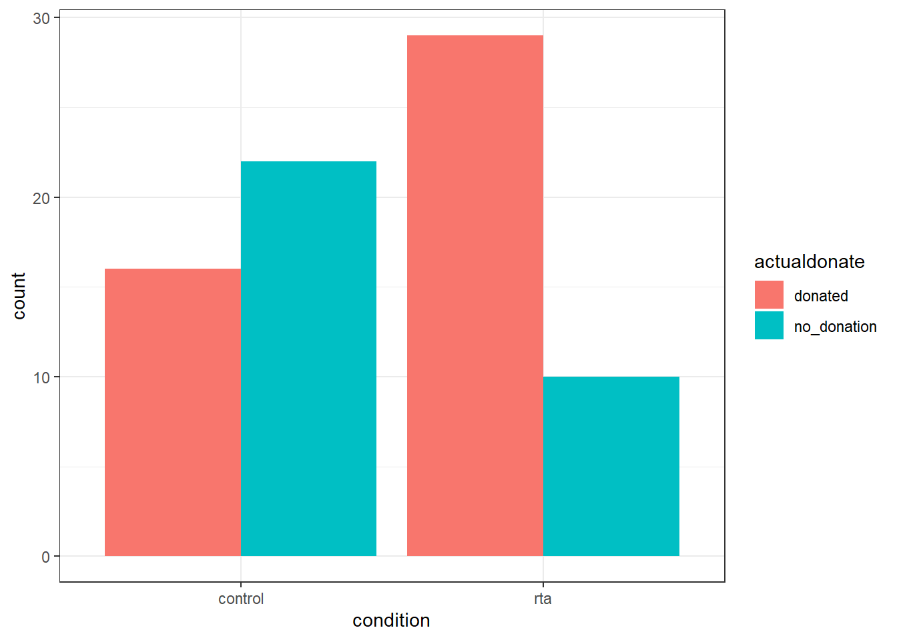
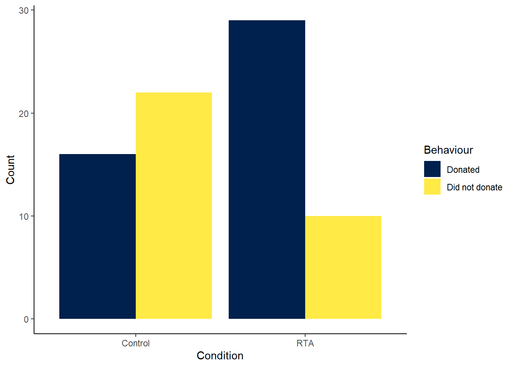
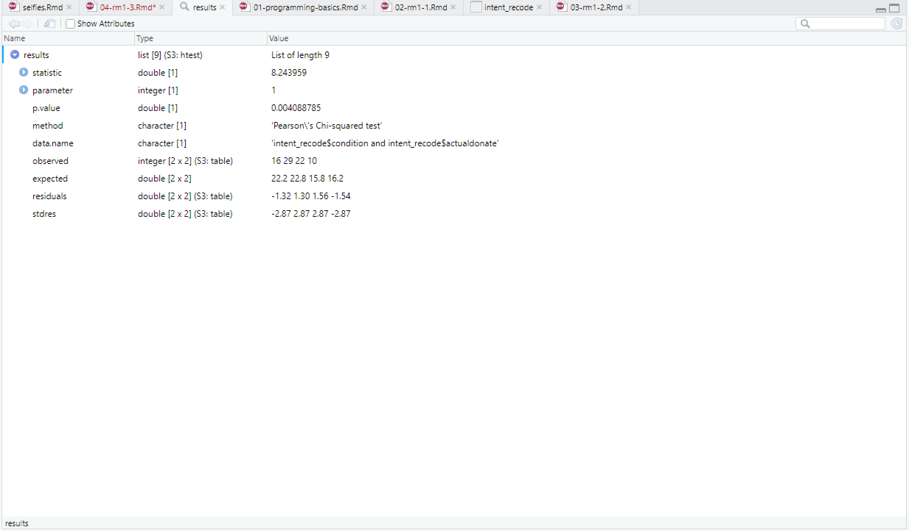

# Comparing categories

We have spent the chapters so far focusing on the basics of R and data wrangling. You may think that the tasks we ask you to do in R will get harder as this course progresses but that isn't true. The hardest part of learning R is at the very beginning, trying to learn the new terminology, figuring out how to load in data and wrangle it into the format you need. It may feel like you are still struggling so it's worth reflecting on just how far you've come in a short time.

You can now:

* Understand what functions, arguments, objects, variables, and tibbles are  
* Read data into R  
* Tidy data into an appropriate format  
* Calculate a range of descriptive statistics

That's amazing! Now we're going to move on to performing some simple descriptive comparisons and create a plot to visualise the data. 

### Reminders through association

For this chapter, we're going to use data from [Rogers, T. & Milkman, K. L. (2016). Reminders through association. Psychological Science, 27, 973-986](https://journals.sagepub.com/stoken/default+domain/6XgDSfr6ZHSDs47tx5bu/full). You can read the full paper online but the short version is that the authors looked at how people remember to follow through with the intention of doing something.  Although there are lots of potential reasons (e.g., some people may lack the self-control resources), Rogers and Milkman (2016) propose that some people fail to follow through simply because they forget about their good intentions. If this is the case, the authors argue, then having visual reminders to follow through on their intentions may help people remember to keep them. For example, a person may choose to put a sticker for their gym on their car window, so that every time they get in the car they remember to go to the gym. 

In Study 1, participants took part in an unrelated experiment but at the start of the task they were asked to return a small stack of paper clips to the reception of the building at the end of the study and if they did so the researchers would donate $1 to a charity. They were then asked if they intended to do this. Those in the reminder-through-association (RTA) condition read “Thank you! To remind you to pick up a paper clip, an elephant statuette will be sitting on the counter as you collect your payment.” This message was followed by a picture of the elephant statuette. Those in the control condition simply read “Thank you!”.

What we want to do is to determine whether those in the RTA condition were more likely to remember to return the paper-clips than those in the control condition and we'll do this by replicating the chi-square analysis that the authors used in their paper. 

### Activity 1: Set-up

Do the following. If you need help, consult Chapter \@ref(ref2) and Chapter \@ref(ref3).

* Open R Studio and set the working directory to your chapter folder. Ensure the environment is clear.   
* Open a new R Markdown document and save it in your working directory. Call the file "Comapring categories".    
* Download <a href="RTA_study1.csv" download>RTA_study1.csv</a> and save it in your chapter folder. Make sure that you do not change the file name at all.
* If you are working on your own computer, install the package `lsr`. Remember **do not install packages on university computers, they are already installed**.
* Delete the default R Markdown welcome text and insert a new code chunk that loads the packages `tidyverse` and `lsr` using the `library()` function and loads the data into an object named `intent_data` using `read_csv()`.


```r
library(NULL)
intent_data <- read_csv(NULL)
```

### Activity 2: Look at the data

Using your preferred method, look at the data. It is a fairly simple data file that contains four variables for 87 participants:

* `condition`: this variable indicates which condition participants were in, 1 =  reminder-through-association condition, 2 = control condition
* `intend`: this variable indicates whether participants said they were intending to return the paper-clips, 1 = yes, 0 = no
* `actualdonate`: this variable indicates whether participants actually ended up returning the paper-clips and therefore donating to charity, 1 = yes, 0 = no
* `id`: this variable indicates the participant ID number

### Activity 3: Wrangle and recode the data

We need to do a little bit of wrangling to get our data into the format we need. First, we need to remove all the participants who said that they did not intend to return the paper-clips (`intend = 0`) as we are only interested in whether people follow through on an intention. Second, to make the output easier to read, we're going to recode `condition` to have text labels rather than numerical values. 

* Use `filter()` to remove all participants who said that they did not intend to return the paper-clips
* Use `mutate()` and `recode()` to recode the values in `condition` to make 1 = rta and 2 = control and the values in `actualdonate` to 1 = donated and  0 = no_donation. If you need help with this, consult Chapter \@ref(recode). 
* You can do this in two separate steps, or you can use pipes. Regardless of how you do it, save the final output to an object named `intent_recode`.

The solutions are at the end of this chapter but make sure you try it yourself and ask your peers and tutor for help first.


```r
intent_recode <-
```


<div class='solution'><button>Helpful hint</button>


You will need to put both sides of each recode argument (i.e., 1 and rta) in quotation marks, even though 1 and 2 are numbers, they actually represent categories rather than numerical data.

</div>
 

<br>

`intent_recode` should have data from 77 participants and should look something like this:


 condition    intend    actualdonate    id 
-----------  --------  --------------  ----
    rta         1         donated       1  
    rta         1         donated       2  
    rta         1         donated       3  
    rta         1         donated       4  
    rta         1         donated       5  
    rta         1         donated       6  

<div class="warn">
<p>There are several different packages that have a function called <code>recode()</code> and <code>select()</code>. At the moment, we haven’t loaded them so there won’t be any problems however, in the future you should remember these as potentially problematic functions. To avoid any issues you can specify exactly which package you want the function to come from using <code>dplyr::recode()</code> and <code>dplyr::select()</code>. Remember this - it may save you a lot of time in the future!</p>
</div>

### Activity 4: Descriptive statistics

Next you need to calculate descriptive statistics. For frequency data these are simply counts so we can use the function `count()` rather than having to use `summarise`. We want to know how many participants are in each group (rta - donated, rta - didn't donate, control - donated, control - didn't donate) so we will need to use `group_by` to display the results for all combinations of `condition` and `actualdonate`.

* Replace the NULLs in the below code to calculate the number of participants in each category and save it to an object named `intent_counts`. 


```r
intent_counts <- intent_recode %>%
  group_by(NULL, NULL) %>%
  count()
```

How many participants in the control condition didn't donate? <input class='solveme nospaces' size='2' data-answer='["22"]'/>  
How many participants in the control condition donated? <input class='solveme nospaces' size='2' data-answer='["16"]'/>  
How many participants in the rta condition didn't donate? <input class='solveme nospaces' size='2' data-answer='["10"]'/>  
How many participants in the rta condition donated? <input class='solveme nospaces' size='2' data-answer='["29"]'/>  

You may also want to calculate the percentage of people who donated in each condition, if so you can adapt the code like this:


```r
intent_percent <- intent_recode %>%
  group_by(condition, actualdonate) %>%
  count() %>%
  ungroup() %>% # ungroups the code
  group_by(condition) %>% # then groups it again but just by condition
  mutate(percent_condition = n/sum(n) * 100)
```


 condition    actualdonate    n     percent_condition 
-----------  --------------  ----  -------------------
  control       donated       16          42.11       
  control     no_donation     22          57.89       
    rta         donated       29          74.36       
    rta       no_donation     10          25.64       

### `ggplot2()`

Now you have calculated how many participants are in each cell (or combination of the categories), however, it is also useful to create a visualisation of the data - the old saying is true, a picture is worth a thousand words. To make our data visualisations we're going to use the package `ggplot2()` which was loaded as part of the `tidyverse`.

`ggplot()` builds plots by combining layers (see Figure \@ref(fig:img-layers))). If you're used to making plots in Excel this might seem a bit odd at first, however, it means that you can customise each layer and R is capable of making very complex and beautiful figures ([this website](https://www.data-to-viz.com/) gives you a good sense of what's possible).

<div class="figure" style="text-align: center">

<p class="caption">(\#fig:img-layers)ggplot2 layers from Field et al. (2012)</p>
</div>

### Activity 5: Bar plot {#bar}

We want to create a simple bar plot of our count data.  

* Type the below code into a new R chunk and run it.   
* The first line (or layer) sets up the base of the graph: the data to use and the aesthetics (what will go on the x and y axis, how the plot will be grouped).    
* `aes()` can take both an `x` and `y` argument, however, with a bar plot you are just asking R to count the number of data points in each group so you don't need to specify this.  
* `fill` will separate the data into each level of the grouping variable and give it a different colour. In this case, there is a different coloured bar for each level of `actualdonate`.  
* The next layer adds a **geom** or a shape, in this case we use `geom_bar()` as we want to draw a bar plot.  
* `position = "dodge"` places the bars next to each other, rather than on top of each other. Try removing this argument and just running the code with `geom_bar()` to see what happens.   


```r
ggplot(data = intent_recode, aes(x = condition, fill = actualdonate)) +
  geom_bar(position = "dodge")
```

<div class="figure" style="text-align: center">

<p class="caption">(\#fig:layer1)Bar plot of RTA Study 1 data</p>
</div>

<div class="warning">
<p>In R terms, <code>ggplot2</code> is a fairly old package. As a result, the use of pipes wasn’t included when it was originally written. As you can see in the code above, the layers of the code are separated by <code>+</code> rather than <code>%&gt;%</code>. In this case, <code>+</code> is doing essentially the same job as a pipe - be careful not to confuse them.</p>
</div>

As you can see, the plot makes it much easier to visualise the data - participants in the RTA condition appear to have been more likely to remember to donate than those in the control condition.

### Activity 6: Make the plot pretty

As mentioned, `ggplot2` allows you to customise all aspects of your plots, so let's tidy ours up a little bit. We're going to do the following:  

* Edit the labels on the x-axis, y-axis and fill  
* Change the colours of the bars to colour-blind friendly options with `scale_fill_viridis_d()`  
* Change the theme of the plot to change how it looks visually


```r
ggplot(data = intent_recode, aes(x = condition, fill = actualdonate)) +
  geom_bar(position = "dodge") +
  scale_x_discrete(name = "Condition", labels = c("Control", "RTA")) +
  scale_y_continuous(name = "Count") +
  scale_fill_viridis_d(name = "Behaviour", labels = c("Donated", "Did not donate"), option = "E")+
  theme_classic()
```

<div class="figure" style="text-align: center">

<p class="caption">(\#fig:plot-edits)Prettier bar plot of RTA Study</p>
</div>

There are a few things to note about the code we just added on: 

* The first two lines are the same code as we used in Activity 4, what we've done now is add on extra layers.   
* `scale_fill_viridis_d()` has multiple options for colours, try replacing "E" with a letter from A - D and see which one you prefer.
*The `d` in `scale_fill_viridis_d()` stands for discrete, because we have a categorical variable. There is also a `scale_fill_viridis_c()` that you would use if your fill variable was continuous.
* There are multiple themes that you can apply. If you type `theme_` the auto-complete will show you the options - try a few out and see which one you prefer.   
* If you want more information on any of these functions, remember you can look at the help documentation by typing `?function`.  

### Activity 7: Chi-square

So, let's finally run that chi-square analysis to see whether our intuition from the plot holds up and there is a significant association between the grouping variables. As promised, the code is quite simple - type the below code into a new R chunk and run it.


```r
results <- chisq.test(x = intent_recode$condition, # the first grouping variable
                      y = intent_recode$actualdonate, # the second grouping variable
                      correct = FALSE) # whether we want to apply the continuity correction
results
```

```
## 
## 	Pearson's Chi-squared test
## 
## data:  intent_recode$condition and intent_recode$actualdonate
## X-squared = 8.244, df = 1, p-value = 0.004089
```

This code looks a little different to code you've used up until this point as it comes from Base R. The x and y variables use the notation `object$variable` so our x variable could be read as "use the variable `condition` from the object `intent_recode`. The reason that we chose not to apply the continuity correction is because this is what the analysis in the original paper did.

1. What is the chi-square statistic? <input class='solveme nospaces' size='5' data-answer='["8.244"]'/>
2. Is the p-value significant? <select class='solveme' data-answer='["Yes"]'> <option></option> <option>Yes</option> <option>No</option></select>  
3. What are the degrees of freedom for the test? <input class='solveme nospaces' size='1' data-answer='["1"]'/>  


<div class='solution'><button>Explain these answers</button>

1. The chi-square statistic is noted in the output as X-squared. Refer to the lecture for more information on how this number is calculated.  
2. The traditional cut-off for significance is p < .05. This means that if your p-value is smaller than .05 there is a statistically significant association, that is, you would be unlikely to observe this pattern of data by chance if the null hypothesis was true. If p is larger than .05 it means that there is a higher probability that any difference you see would be likely to occur even if the null hypothesis was true. Pay attention to the decimal places, they make a huge difference!  
3. Degrees of freedom are noted as `df` in the output. Refer to the lecture for more information on what they are and how they are calculated.
    
    

</div>


<br>

Go and find the results section in the original paper, do your numbers match the ones they report?

### Activity 8: Additional analysis information

You may have noticed that when you ran the chi-square an object appeared in the environment that saved the results of the analysis. This object is a **list** which is a bit different to the type of objects we've worked with so far. Lists don't just contain one data table or a vector of numbers or characters, they can contain multiple different types of information and multiple different tables. We can see that our object `results` is a list of 9, which means it has 9 components. Click on `results` in the environment pane to view the contents of the list (you could also type `str(results)`).

<div class="figure" style="text-align: center">

<p class="caption">(\#fig:img-lists)Contents of a list</p>
</div>

Each of these components can be viewed separately using the same `object$variable` notation we used above. For example, if we wanted to view the observed frequencies (refer to the lecture), we would run the following code:


```r
results$observed
```


           donated    no_donation 
--------  ---------  -------------
control      16           22      
rta          29           10      

### Assumption checks

The assumptions for chi-square are as follows:

1. The data in the cells should be frequencies, or counts of cases rather than percentages or some other transformation of the data.

2. The levels (or categories) of the variables are mutually exclusive. That is, a particular participant fits into one and only one group of each of the variables.

3. Each subject may contribute data to one and only one cell in the χ2. If, for example, the same subjects are tested over time such that the comparisons are of the same subjects at Time 1, Time 2, Time 3, etc., then χ2 may not be used.

4. The study groups must be independent. This means that a different test must be used if the two groups are related. For example, a different test must be used if the researcher’s data consists of paired samples, such as in studies in which a parent is paired with his or her child.

5. There are 2 variables, and both are measured as categories, usually at the nominal level. While Chi-square has no rule about limiting the number of cells (by limiting the number of categories for each variable), a very large number of cells (over 20) can make it difficult to meet assumption #6 below, and to interpret the meaning of the results.

6. The expected cell frequencies should be greater than 5. 

### Activity 9: Check the expected frequencies

We know that assumptions 1-5 have been met because we know the design of the study and the type of data we have fits these criteria. The final assumption we need to test is that all expected frequencies are greater than 5.  

* Using the same `object$variable` code as in Activity 7, view the expected frequencies

Does the data meet assumption 6? <select class='solveme' data-answer='["Yes - all expected frequencies are > 5"]'> <option></option> <option>Yes - all expected frequencies are > 5</option> <option>No - one or more expected frequencies are < 5</option></select>

### Activity 10: Effect size {#cramer}

Although it wasn't in the original paper, as our last step we will calculate an effect size so that we have a standardised measure of how large the association between our grouping variable is, the effect size measure for chi-square is Cramer's V that you covered in the lecture.

To calculate Cramer's V we're going to use the function `cramersv()` from the `lsr` package. This function is very easy to use - you copy and paste the code you gave to `chisq.test()` in Activity 7.


```r
eff_size <- cramersV(x = intent_recode$condition, y = intent_recode$actualdonate, correct = FALSE)
eff_size
```

```
## [1] 0.327207
```

### Activity 11: Write-up

Now that you've run all of the analyses you can use inline coding to help you write up your results. This isn't something you're going to be tested on in this course but it's a really cool feature of Markdown so for each statistical test we'll show you the code that does it so that you can use it in the future if you wanted to. We're going to replicate the exact write-up of the results from the original paper (with the addition of the effect size). 

In the **white-space** in your Markdown document, copy and paste the following (do not change anything). Note that this will only work if you have called your variables **exactly** the same as the examples in this book:


```r
Those in the reminder-through-association condition performed the intended behavior at a significantly higher rate (`r round(pluck(intent_percent$percent_condition, 3),0)`%, `r pluck(intent_percent$n, 3)` out of `r pluck(intent_percent$n, 3) + pluck(intent_percent$n, 4)`) than did those in the control condition (`r round(pluck(intent_percent$percent_condition, 1),0)`, `r pluck(intent_percent$n, 1)` out of `r pluck(intent_percent$n, 1) + pluck(intent_percent$n, 2)`)), χ2(`r results$parameter`, N = `r length(intent_recode$id)`) = `r round(results$statistic,2)`, p = `r round(results$p.value, 3)`, V = `r round(eff_size, 2)`.
```

This will knit as:

> Those in the reminder-through-association condition performed the intended behaviour at a significantly higher rate (74%, 29 out of 39) than did those in the control condition (42, 16 out of 38)), χ2(1, N = 77) = 8.24, p = 0.004,V = 0.33.

If you're feeling comfortable with R at this point, push yourself to reverse-engineer what each bit of this inline code is doing so that you could use it yourself (remember the `?help` function).

#### Finished!

And you're done! The second and final R Portfolio for RM1 will be available on Moodle and again will only assess you on code we have covered in this book. If you need to, take the time over the break to revise what we've covered so far - if you can get comfortable with the content of the last few chapters, RM2 won't pose a problem. If you're OK with, or even enjoying R so far then please feel free to work through this book at your own pace ahead of the scheduled content

### Activity solutions

#### Activity 1


<div class='solution'><button>Activity 1</button>


```r
library(tidyverse)
intent_data <- read_csv("RTA_study1.csv")
```

</div>
  

**click the tab to see the solution**
<br>

#### Activity 3


<div class='solution'><button>Activity 3</button>


```r
# solution using pipes

intent_recode <- intent_data %>%
  filter(intend == 1) %>%
  mutate(condition = recode(condition, "1" = "rta", "2" = "control"),
         actualdonate = recode(actualdonate, "1" = "donated", "0" = "no_donation"))

# solution using separate steps

intent_filter <- filter(intent_data, intend == 1)
intent_recode <- mutate(intent_filter, condition = recode(condition, "1" = "rta", "2" = "control"),
                        actualdonate = recode(actualdonate, "1" = "donated", "0" = "no_donation"))
```

</div>
  

**click the tab to see the solution**
<br>

#### Activity 9


<div class='solution'><button>Activity 9</button>


```r
results$expected
```

</div>
  

**click the tab to see the solution**
<br>

### Test yourself

** This question is currently borked

1. You have a dataset where gender has been coded numerically. You want to recode this to use text labels. Which code will work? <select class='solveme' data-answer='["mutate(gender = recode(gender, \"1\" = \"male\", \"2\" = \"female\", \"3\" = \"nonbinary\"))"]'> <option></option> <option>mutate(gender = recode(gender, "male" = "1", "female" = "2", "nonbinary" = "3"))</option> <option>mutate(gender = recode(gender, male = 1, "female = 2, nonbinary = 3))</option> <option>mutate(gender = recode(gender, "1" = "male", "2" = "female", "3" = "nonbinary"))</option></select>


<div class='solution'><button>Explain this answer</button>

The first option has the new and old codes in the wrong position, the second option is missing quotation marks, the third option is correct.
    

</div>
 

<br>

2. From the below code, what would the plot have on the x-axis? <select class='solveme' data-answer='["gender"]'> <option></option> <option>exp_data</option> <option>gender</option> <option>score</option></select>


```r
ggplot(data = exp_data, aes(gender, score))
```

3. From the below code, how would the bars in the plot be positioned? <select class='solveme' data-answer='["On top of each other"]'> <option></option> <option>On top of each other</option> <option>Next to each other</option></select>  


```r
ggplot(data, aes(x = condition, fill = actualdonate)) +
  geom_bar()
```


<div class='solution'><button>Explain this answer</button>


</div>
 

<br>

4. Which of the following is not an argument of `chisq.test()` (you may need to look at the help documentation to answer this question)? <select class='solveme' data-answer='["continuity"]'> <option></option> <option>x</option> <option>y</option> <option>p</option> <option>continuity</option></select>
  
