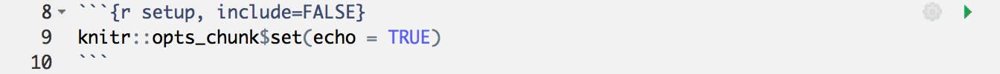
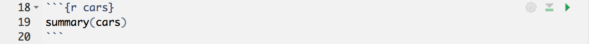
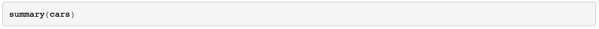
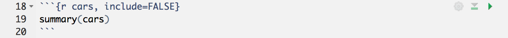
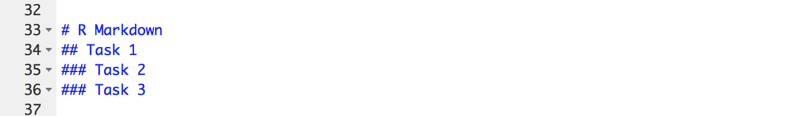

# Week 5: R Markdown

A key goal of any researcher is to carry out an experiment and to tell others about it. One of the main ways we as Psychologists do this is through publication of a journal article. There are numerous ways that people combine different software to create a journal article, but a more recent innovation in the field is to create reports and articles through R Markdown. If you like, you can see an example from a research team in our school in [this recent PLOS article](http://journals.plos.org/plosone/article?id=10.1371/journal.pone.0185093). A link within the article methods section ([this one](https://osf.io/eb9dq/)) allows you to see the one file that creates the whole manuscript. You wont be writing full journal articles just yet but as in RM1 you will use R Markdown to complete your portfolio R exercises and you will also use R Markdown to submit your mini-project pre-registration so we want to ensure that you are familiar and comfortable with the format.

### Advantages of using R Markdown

1. The output is one file that includes figures, text and citations. No additional files are needed so it's easy to keep all your work in one place. 

2. R code can be put directly into a R Markdown report so it is not necessary to keep your writing (e.g. a Word document) and your analysis (e.g. your R script) separate.  

3. Including the R code directly lets others see how you did your analysis - this is a good thing for science! It is both reproducible and open!  

4. You write your report in normal text so it's not necessary that you learn any new coding such as HTML.  

If at any point you are unsure about how to do something remember to think about where you can get help. There is an **R Markdown Cheatsheet** on the top menu under `Help >> Cheatsheets` or do what we do, Google it. For example, if I forget how to put words in bold, I could simply go to Google and type "**rmarkdown bold**" and no doubt get a lot of useful hints. You can also refer to Chapter \@ref(ref2).

### Activity 1: Create a new Markdown document

Some of the information contained in these activities will repeat what we have already shown you, however, repetition of the basics is not a bad thing and we're also going to be adding in a few new details and features.

* Create a new R Markdown file (`.Rmd`) by opening R Studio, and then on the top menu, selecting `File >> New File >> R Markdown...`. You should now see the following dialogue box:  

(\#fig:img-dialog).Rmd dialog box

* Click `Document` on the left-hand panel and then give your document a **Title**. This is your file so call it what you want but make sure it is informative to you and your reader. Put your student ID in the **Author** field. For now we will focus on making an **HTML** output, so make sure that is selected as shown and then hit `OK` when you have done so. You should now have an .Rmd file open in R Studio.

### Activity 2: Setting up the new Markdown document

The first thing you will see in your R Markdown file is a header section enclosed at the top and bottom by `---`, that lists the title, author, date and output format (html here). Like this:  

(\#fig:img-headers).Rmd header

By default the file header includes the above info shown but there are many other options available for different functions and formatting that you can look at if you would like to push yourself:
* [Additional HTML options](http://rmarkdown.rstudio.com/html_document_format.html)  
* [Additional .pdf options](http://rmarkdown.rstudio.com/pdf_document_format.html)  

**BUT WAIT**, what if you got your GUID wrong? How would you change this? The long way would be to close the file and start again. The shorter way would be to just correct the info in the header - just remember to keep between the quotes.

### Activity 3: New code chunks

Immediately below the header information you will see the standard default **code chunk**. 

(\#fig:img-default-chunk)Default chunk

In R Markdown you can type any text you want directly in the document just as you would in a word document. However, if you want to include code you need to include it in a **code chunk**. Code chunks start with a line that contains three backwards apostrophes (these are called grave accents - often in the top-left of keyboards) and then includes a set of curly brackets with the letter r inside: 

\`\`\`{r}

\`\`\`

You will **always** need both of these parts to create a code chunk:  

* The three back ticks are the part of the Rmd file that says this is code being inserted into my document. 
* The \`{r}\` part says that you are specifically including R code. 
    
The standard default code chunk provides some basic set-up options for your R Markdown file for when it `knits` your work. For now, it is best to leave this particular code chunk alone. Instead we will show you how to use R Markdown by editing the code chunks that come after this default chunk. 

The next code chunk in your file will look like this below.

(\#fig:img-chunk1)Chunk 1

You can see on the first line of the example chunk above (line 18) that the word `cars` is included after the letter `r` within the curly brackets. This is simply the **name** or the **label** for the code chunk and it really could have been called anything. For example, you could have called this code chunk `cars1` and a later chunk `cars2` to show it was the first and second chunk relating to cars. You don't need to include a label, you can just start your code chunk with `{r}` and it will work fine. However, if you do put in names for the chunks **do not use the same name twice** as this will cause your script to crash when you knit it, e.g. Do not use `data` and `data`; instead maybe use `personality_data` and `participant_info` or whatever makes sense to what you are doing in the chunk.

Remember knitting just means converting or rendering your file as a pdf, webpage, etc.. Crashing means that you had an error in your code that stopped your knitting from working or finishing. You can usually find the problem line of code from the error message you’ll see.

The second line (line 19) in the above **code chunk** is the r code we have written: `summary(cars)`. In this case, we are just asking for a `summary()` of the inbuilt dataset `cars`. R Studio has a lot of inbuilt datasets for you to practice on, `cars` is one of these.

The third line (line 20) closes off the code chunk, again with the three backwards apostrophes. This means that whatever is contained between the first and third lines will be code that will run.  

### Activity 4: Knit your code

Now would be a good time to try knitting your file to see what the code chunks do. You can do this using the **Knit button** at the top of the R Studio screen:

(\#fig:img-knitting)Knitting

When you click `Knit`, if you haven't already saved the Rmd file it will ask you to save. Just like in RM1, create a new folder for each lab, call the file `RM2Psych_Chapter5_Preclass.Rmd` and save it in your RM2 Chapter 5 folder. When working in the Psychology labs or the University Library you need to save in a location or drive space that you have full access to and can save files to. The best one on campus is your `M:` drive. If using your own device then anywhere you can save the file should work.

After saving the file a webpage should appear. The first thing to notice is that some lines in the code chunks have disappeared: the \`\`\`{r} and the closing \`\`\` in your code chunk have gone.

(\#fig:img-summary)Displaying code

Whenever you knit an R Markdown file these lines will disappear leaving only the code within. You'll also notice that the output of the code is also now showing in your webpage. In the next section we will show you how to control showing the data or not through adding rules.

(\#fig:img-summary2)Code and output

### Activity 5: Adding rules to code chunks

It can often be a good idea or even necessary to show the data or the outcome of a test in your report, for example if you were writing a report and wanted to include a table of results. But what if your code displayed a table that was 10,000 lines long? In that case you might want to not show the output and only show the code. You can do this by including a rule within the first line of your code chunk - your \`\`\`{r name, rule = option} line. You have already seen a rule before in the standard default chunk, the `include` rule, but there are a number of others.  

**To hide the output but show the code** use the `results = "hide"` rule:

(\#fig:img-hide)Hiding output from knitted output

* Add this rule into your example code chunk, as shown above, and knit the file again. What happens? Note that there is a comma separating the name of the chunk and the rule. You should now see the code only and not the data.

Alternatively, you can **hide the code, but show the output** by using the `echo = FALSE` rule:   

(\#fig:img-echo)Hiding code from knitted output

* In your template .Rmd file the rule echo is set to `FALSE` meaning to show the figure and not the code. Change the rule in your code to `echo` and set it as `TRUE`, then knit the file again. What happens?  

The "echo = FALSE" option is useful for commands like <code>library()</code> when you are just calling a package into the library but don’t necessarily want to display that in your final report or in your final HTML file. Another example might be if you wanted to make a plot but didn’t want to include the code, you just want to show the plot in your report.

 
  
You might want to **hide both the code AND the output** by using the `include` rule:

(\#fig:img-include)Hiding both code and output

* Change the rule to your example code chunk, as shown above, to `include = FALSE` and then knit the file again*. What happens? Note that here the code still runs. It just does not show you anything. 

Finally, you can use the `eval` rule which specifies whether or not you want the code chunk you have written to be evaluated when you knit the R Markdown file. Evaluated means to run or carry out the code. Here, the `eval = FALSE` rule will stop the code from being evaluated. The code will be shown because there is no rule stopping it but there will be no output because it won't get evaluated because of the `eval` rule being `FALSE`. 

(\#fig:img-eval)Stopping code evaluation

This might be useful in cases where you want to show the code relating to how you programmed your stimuli for an experiment, but you don't necessarily want it to run as part of the R Markdown file. 

### Activity 8: Formatting the R Markdown File

When you're not writing in code chunks you can format your document in lots of different ways just like you would in a Word document. The [RMarkdown cheatsheet](https://www.rstudio.com/wp-content/uploads/2015/02/rmarkdown-cheatsheet.pdf) provides lots of information about how to do this but we will show you a couple of things that you might want to try out. 

For example, we can make some text **bold** by including two \*\* (two asterisks) at the start and end of the text we want to present in bold font. 

(\#fig:img-bold)Bold formatting

* Write some text in your Rmd file and put it in bold. Knit the file to check it worked.   

* You can also use italics by putting a single \* (asterisk) at the start and end of the word or sentence. Try this now.  

Finally, you might want to add headings and sub-headings to your file. For example, maybe you are writing a Psychology journal article and want to put in a header for the Introduction, Methods, Results, or Discussion sections. We do this using the # (hash-tag) symbol.

(\#fig:img-hashtag)Hashtag headings

* Type the four main headings found in a Psychology journal article in your R Markdown file, typing each one in a separate line. These are mentioned above. Knit the file. What do these look like? 

* Now add a different number of #'s before each heading, with a space between the heading and the hashtag (e.g. # Introduction) and knit the file again. What do you notice about the different number of hash-tags?  

### Test yourself

You've got a large dataset of thousands of participant's personality and happiness scores that you want to analyse and present in R Markdown.

1. You want to show the code you are running in your analysis but not show the output as this would be too much to display. Note that you want the code to run. Type in the box (e.g. `rule = "set"`) how you would set the `results` rule to do this? <input class='solveme nospaces' size='20' data-answer='["results = \"hide\""]'/>

2. You create a plot of happiness versus neuroticism scores but you want to hide the code and only show the output. How can you do this? <select class='solveme' data-answer='["echo = FALSE"]'> <option></option> <option>echo = TRUE</option> <option>include = FALSE</option> <option>code = HIDE</option> <option>echo = FALSE</option></select>

<button>Explain these answers</button>

The first answer should be results = "hide" as you want to show the code and run the code but not necessarily show the output of the code. Remember that "hide" needs to be in quotation marks.
    
In the second question, "include = FALSE" technically would hide the code, but this also hides the output! "echo = FALSE" allows you to still see your plot while hiding the code you want hidden. "code = HIDE" - if only it were that simple! The aim of these questions aren't to help you memorise these codes (no one can do that!), they're to help you gain a better understanding of how to apply these codes when you come across them in the future.

  
   

3. True or False: writing `echo = TRUE` has the same effect on the output of a code as if you had no echo rule at all: <select class='solveme' data-answer='["TRUE"]'> <option></option> <option>TRUE</option> <option>FALSE</option></select>

<button>Explain this</button>

All of the rules have a default mode. For example, `echo`, `include`, and `eval` are usually by default set to `TRUE`. As a result, if you don't declare any `echo` rule, i.e. you don't declare `echo = FALSE`, then it is the same as declaring `echo = TRUE`. So no rule means that you are wanting that rule set as `TRUE`.

  
   

4. True or False: there is no difference between the rules `results = "hide"` and `eval = FALSE` as they both hide the output: <select class='solveme' data-answer='["FALSE"]'> <option></option> <option>TRUE</option> <option>FALSE</option></select>

<button>Explain this</button>

In the first rule, `results = "hide"`, the code is evaluated and results are produced but the output is hidden. In the second rule, `eval = FALSE`, the code is not evaluated and therefore no results or output has been produced. If you need your output for a later part of the code then you would use the `results` rule. If you don't need the output and just want to show the code as an example then you would use the `eval` rule.

  

 

5. If \* puts words into italics, and \*\* puts words into bold, type in the box what might you put before (and technically after) a word to put it into italics with bold? <input class='solveme nospaces' size='3' data-answer='["***"]'/>

6. True or False: The **more** '#'s you include, the **smaller** the header is: <select class='solveme' data-answer='["TRUE"]'> <option></option> <option>TRUE</option> <option>FALSE</option></select>  

<button>Explain this</button>

If * at the start and end of the word puts it in italics (e.g. *italics*) and ** puts it in bold (e.g. **bold**), then putting three *** at the start and end will put it in italics with bold (e.g. ***italics-bold***).
    
It is true that the more #'s you use, the smaller the heading is. Word and other document writers use different headings as well. Here, # gives the biggest heading, and it gets smaller and smaller with every extra #.

    

  
  

