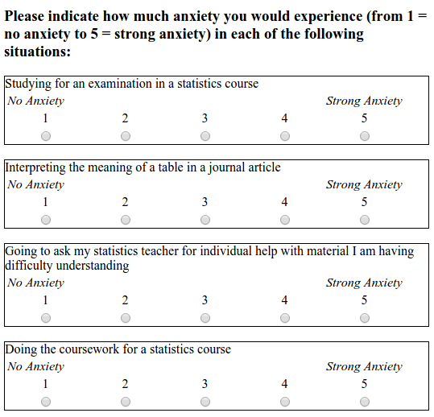
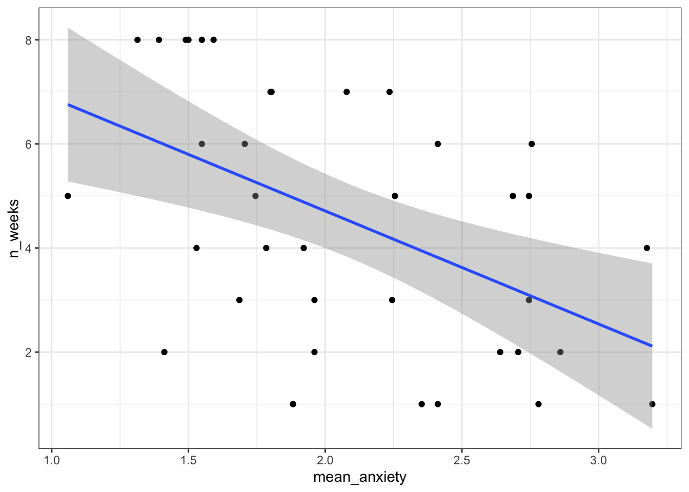
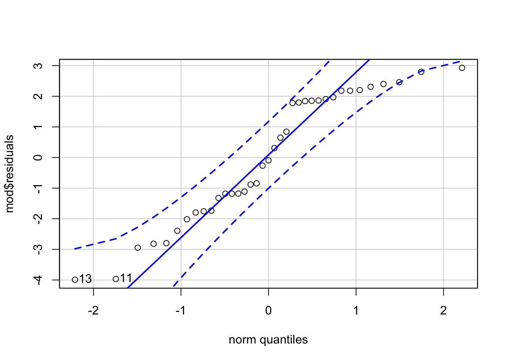

# Regression

In this activity, you will be working with real data and using regression to explore the question of whether there is a relationship between statistics anxiety and engagement in course activities.  The hypothesis is that students who are more anxious about statistics are less likely to engage in course-related activities. This avoidance behaviour could ultimately be responsible for lower performance for these students (although we won't be examining the assessment scores in this activity).

We are going to analyse data from the STARS Statistics Anxiety Survey, which was administered to students in the third-year statistics course in Psychology at the University of Glasgow. All the responses have been anonymised by associating the responses for each student with an arbitrary ID number (integer).

The STARS survey (Cruise, Cash, & Bolton, 1985) is a 51-item questionnaire, with each response on a 1 to 5 scale, with higher numbers indicating greater anxiety.

Cruise, R. J., Cash, R. W., & Bolton, D. L. (1985). Development and validation of an instrument to measure statistical anxiety. *Proceedings of the American Statistical Association, Section on Statistical Education*, Las Vegas, NV.



As a measure of engagement in the course, we will use data from Moodle usage analytics. Over the course of the term, there were eight optional weekly on-line sessions that students could attend for extra support. The variable `n_weeks` in the `psess.csv` file tells you how many (out of eight) a given student attended.

Our hypothesis was that greater anxiety would be reflected in lower engagement.  Answer the following question.

If our hypothesis is correct then there should be <select class='solveme' data-answer='["a negative"]'> <option></option> <option>a positive</option> <option>no</option> <option>a negative</option></select> correlation between students' mean anxiety levels and `n_weeks`.

## Activity 1: Setup

Do the following. If you need help, consult Chapter @\ref(ref3) and Chapter \@(ref2).

* Open R Studio and set the working directory to your Week 12 folder. Ensure the environment is clear.   
* Open a new R Markdown document and save it in your working directory. Call the file "Week 12".    
* Download <a href="L3_stars.csv" download>L3_stars.csv</a> and <a href="psess.csv" download>psess.csv</a> and save them in your Week 12 folder. Make sure that you do not change the file name at all.    
* Delete the default R Markdown welcome text and insert a new code chunk that loads `pwr`, `car`, `broom`, and `tidyverse` using the `library()` function.
* Load the two CSV datasets into variables called `stars` and `engage` using `read_csv()`.


## Activity 2: Tidy the data

* Take a look at both of the datasets you loaded in (you can use just type the name to output them out to the console).

The next thing we need to do is to calculate a mean anxiety score for each student (recall that individual students are identified by the `ID` variable).

Recall the difference between *wide* and *tidy* data. In wide data, each row represents an individual case, with observations for that case in separate columns; in tidy data, each row represents a single observation, and the observations are grouped together into cases based on the value of a variable (for these data, the `ID` variable).

* The STARS data are currently in <select class='solveme' data-answer='["wide"]'> <option></option> <option>wide</option> <option>tidy</option></select> format.

Before we calculate means, you need to use `gather()` to restructure the STARS data into the appropriate "tidy" format; i.e., so that it looks like the table below.


 ID    Question    Score 
----  ----------  -------
 3       Q01         1   
 3       Q02         1   
 3       Q03         1   
 3       Q04         1   
 3       Q05         1   
 3       Q06         1   

* Write and run the code to do tidy the STARS data, and store the resulting table as `stars2`.


## Activity 3: Calculate mean anxiety for each student

* Now that you've got the data into a tidy format, use `summarise()` and `group_by()` to calculate mean anxiety scores (`mean_anxiety`) for each student (`ID`). Store the resulting table in a variable named `stars_means`. 


## Activity 4: Join the datasets together

* In order to perform the regression analysis, combine the data from `stars_means` with `engage` using `inner_join()`. Call the resulting table `joined`. It should look like this:


## Activity 5: Calculate descriptives for the variables overall

It is also useful to calculate descriptives statistics for the sample overall so that you can check that the sample scores are what you were expecting (e.g., are they comparable to previous studies and samples?). This is also useful for the write-up.

* Run the below code. Read each line and ensure you understand what is being calculated.


```r
descriptives <- joined %>%
  summarise(mean_anx = mean(mean_anxiety, na.rm = TRUE),
            min_anx = mean(mean_anxiety,na.rm = TRUE) - qnorm(0.975)*sd(mean_anxiety,na.rm = TRUE)/sqrt(n()), 
            max_anx = mean(mean_anxiety,na.rm = TRUE) + qnorm(0.975)*sd(mean_anxiety,na.rm = TRUE)/sqrt(n()),
            sd_anx = sd(mean_anxiety, na.rm = TRUE),
            mean_weeks = mean(n_weeks, na.rm = TRUE),
            min_weeks = mean(n_weeks) - qnorm(0.975)*sd(n_weeks,na.rm = TRUE)/sqrt(n()), 
            max_weeks = mean(n_weeks) + qnorm(0.975)*sd(n_weeks,na.rm = TRUE)/sqrt(n()),
            sd_weeks = sd(n_weeks, na.rm = TRUE))
```


## Activity 6: Visualisations

* Now that youwe have all of the variables in one place, write the code to reproduce the exact scatterplot below (using ggplot2).

<div class="figure" style="text-align: center">

<p class="caption">(\#fig:scatter)Scatteplot of mean anxiety and attendance</p>
</div>

* According to the scatterplot, <select class='solveme' data-answer='["as anxiety increases, engagement decreases"]'> <option></option> <option>there is no apparent relationship</option> <option>as anxiety increases, engagement decreases</option> <option>as anxiety increases, engagement increases</option></select>


## Activity 7: Run the regression

The `lm()` function from Base R is the main function to estimate a *L*inear *M*odel (hence the function name `lm`). `lm()` uses formula syntax that you have seen before, i.e., `DV ~ predictor`.  

* Use the `lm()` function to predict `n_weeks` (DV) from `mean_anxiety` (predictor).  Store the result of the call to `lm()` in the variable `mod`.  To see the results, use `summary(mod)`.


```r
mod <- lm(n_weeks ~ mean_anxiety, joined)
mod_summary <- summary(mod)
```

Answer the following questions about the model. You may wish to refer to the lecture notes to help you answer these questions.

1. The estimate of the y-intercept for the model, rounded to three decimal places, is <input class='solveme nospaces' size='5' data-answer='["9.057"]'/>
2. To three decimal places, if the GLM for this model is $Y_i = \beta_0 + \beta_1 X_i + e_i$, then $\beta_1$ is <input class='solveme nospaces' size='6' data-answer='["-2.173"]'/>
3. To three decimal places, for each unit increase in anxiety, `n_weeks` decreases by <input class='solveme nospaces' size='5' data-answer='["2.173"]'/>
4. To two decimal places, what is the overall F-ratio of the model? <input class='solveme nospaces' size='5' data-answer='["11.99"]'/>
5. Is the overall model significant? <select class='solveme' data-answer='["Yes"]'> <option></option> <option>Yes</option> <option>No</option></select>
6. What proportion of the variance does the model explain? <input class='solveme nospaces' size='5' data-answer='["23.39"]'/>


<div class='solution'><button>Explain these answers</button>

1. In the summary table, this is the estimate of the intercept.
2. In the summary table, this is the estimate of mean_anxiety, i.e., the slope.
3. In the summary table, this is also the estimate of mean_anxiety, the slope is how much it decreases so you just remove the - sign. 
4. In the summary table, the F-ratio is noted as he F-statistic.
5. The overall model p.value is .001428 which is less than .05, therefore significant. 
6. The variance explained is determined by R-squared, you simply multiple it by 100 to get the percent. You should always use the adjusted R-squared value.
    

</div>
  
<br>

## Activity 8: Assumption checking

It's now time to check the assumptions, which for regression are a little bit more involved than they were for ANOVA.

1. The outcome/DV is a interval/ratio level data 
2. The predictor variable is interval/ratio or categorical (with two levels)
3. All values of the outcome variable are independent (i.e., each score should come from a different participant)
4. The predictors have non-zero variance
5. The relationship between outcome and predictor is linear
6. The residuals should be normally distributed
7. There should be homoscedasticity (homogeneity of variance, but for the residuals)

Assumptions 1-3 are nice and easy. We know this from the data we have and the design of the study. Assumption 4 simply means that there is some spread in the data - for example, there's no point running a regression with age as a variable if all your participants are 20 years old. We can check this using the scatterplot we created in Activity 4 and we can see that this assumption is met, we do indeed have a spread of scores. 

Assumption 5 could also be checked with the scatterplot but there are some nice regression-specific functions from `car` that we can use.

* Run the below code. It will produce the scatterplot with a linear line and the line that best fits the data. If these two lines are quite similar (they will never be perfect) then you can assume linearity.


```r
crPlots(mod)
```

Assumption 6 can be tested as we have done before with a qqplot and a Shapiro-Wilk test.


```r
qqPlot(mod$residuals)
```

<div class="figure" style="text-align: center">

<p class="caption">(\#fig:normality)qqplot for residuals</p>
</div>

```r
shapiro.test(mod$residuals)
```

```
## [1] 13 11
## 
## 	Shapiro-Wilk normality test
## 
## data:  mod$residuals
## W = 0.91652, p-value = 0.008764
```

The qqplot doesn't look too bad, on the basis of this alone we would probably assume normality. However, the Shapiro-Wilk test is significant which suggests something isn't quite right. The Shaprio-Wilk has been criticised for rejecting the null hypothesis (i.e., concluding that the data are not normal) too often and it's argued that if the qqplot and the Shapiro test disagree, it's better to rely on the qqplot. There is a good discussion [about it here](https://stats.stackexchange.com/questions/2492/is-normality-testing-essentially-useless) if you'd like to know more. For now, we will proceed cautiously and check the final assumption before we make a decision about what to do.

The final assumption of homoscedasticity means that the error in the model is fairly constant at all points (i.e., if you looked at the scatterplot, the data points wouldn't be bunched together at one end and spread out at the other). We can test this using the non-constant error variance test from `car`.

* Run the below code. If the test is significant, the assumption has been violated. Based upon the results, can we assume homoscedasticity? <select class='solveme' data-answer='["Yes"]'> <option></option> <option>Yes</option> <option>No</option></select>


```r
ncvTest(mod)
```

Returning to the issue of normality, all of the other assumptions have been met and the qqplot suggests that any deviation from normality is very mild. Based upon this evidence, it seems justified to proceed with the original regression.

## Activity 9: Power and effect size

First we can calculate the minimum effect size we were able to detect given the sample size and design of the study using `pwr.f2.test()`. As usual, we fill in all the information we have and set the effect size argument, in this case `f2`, to `NULL`.


```r
pwr.f2.test(u = 1, v = 35, f2 = NULL, sig.level = .05, power = .8)
```

* Based on the power analysis, what is the minimum effect size we were able to detect rounded to 2 decimal places? <input class='solveme nospaces' size='0.22' data-answer='[".22"]'/>  
* According to Cohen's guidelines, this would be a <select class='solveme' data-answer='["Medium"]'> <option></option> <option>Small</option> <option>Medium</option> <option>Large</option></select> effect.

There is no formula to calculate our observed f^2^, we must do it manually using the formula from the lecture.


```r
f2 <- mod_summary$adj.r.squared/(1 - mod_summary$adj.r.squared)
```

* Is the observed effect size larger than the minimum effect size we could detect? <select class='solveme' data-answer='["Yes, our study is sufficiently powered"]'> <option></option> <option>Yes, our study is sufficiently powered</option> <option>No, our study is underpowered</option></select>

## Activity 10: Write-up

We need to manually calculate the p-value for the inline coding as you can't extract it from the `lm()` model. Run the below code to do this.


```r
f <-mod_summary$fstatistic
mod_p <- pf(f[1], f[2], f[3], lower=FALSE) 
```

Now, copy and paste the below code into **white-space** and knit the document.


```r
A simple linear regression was performed with engagment (M = `r descriptives$mean_weeks %>% round(2)`, SD = `r descriptives$sd_anx %>% round(2)`) as the outcome variable and statistics anxiety (M = `r descriptives$mean_anx %>% round(2)`, SD = `r descriptives$sd_anx %>% round(2)`) as the predictor variable. The results of the regression indicated that the model significantly predicted course engagement (F(`r mod_summary$fstatistic[2]`, `r mod_summary$fstatistic[3]`) = `r mod_summary$fstatistic[1] %>% round(2)`, p < .001, Adjusted R2 = `r mod_summary$adj.r.squared %>% round(2)`, f2 = .63), accounting for `r (mod_summary$adj.r.squared %>% round(2))*100`% of the variance. Anxiety was a significant positive predictor (β = `r mod$coefficients[2] %>% round(2)`, p < `mod_p %>% round(3)`.
)
```

A simple linear regression was performed with engagement (M = 4.54, SD = 0.56) as the outcome variable and statistics anxiety (M = 2.08, SD = 0.56) as the predictor variable. The results of the regression indicated that the model significantly predicted course engagement (F(1, 35) = 11.99, p < .001, Adjusted R2 = 0.23, f^2^ = .63), accounting for 23% of the variance. Anxiety was a significant positive predictor (β = -2.17, p < 0.001.
)


## Activity solutions

### Activity 1

<div class="solution"><button>Activity 1</button>

```r
library("pwr")
library("rcompanion")
library("car")
library("broom")
library("afex")
library("emmeans")
library("tidyverse")
```
</div>

** Click tab to see solution **

### Activity 2

<div class="solution"><button>Activity 2</button>

```r
library("pwr")
stars2 <- gather(stars, "Question", "Score", Q01:Q51) %>%
  arrange(ID)
head(stars2) %>% knitr::kable(align = 'c')
```
</div>

** Click tab to see solution **

### Activity 3

<div class="solution"><button>Activity 3</button>

```r
stars_means <- stars2 %>%
  group_by(ID) %>%
  summarise(mean_anxiety = mean(Score, na.rm = TRUE),
            min = mean(Score) - qnorm(0.975)*sd(Score)/sqrt(n()), 
            max = mean(Score) + qnorm(0.975)*sd(Score)/sqrt(n()),
            sd = sd(Score))
```
</div>

** Click tab to see solution **

### Activity 4

<div class="solution"><button>Activity 4</button>

```r
joined <- inner_join(stars_means, engage, "ID")
```
</div>

** Click tab to see solution **

### Activity 5

<div class="solution"><button>Activity 5</button>

```r
ggplot(joined, aes(mean_anxiety, n_weeks)) +
  geom_point() +
  geom_smooth(method = "lm")
```
</div>

** Click tab to see solution **


