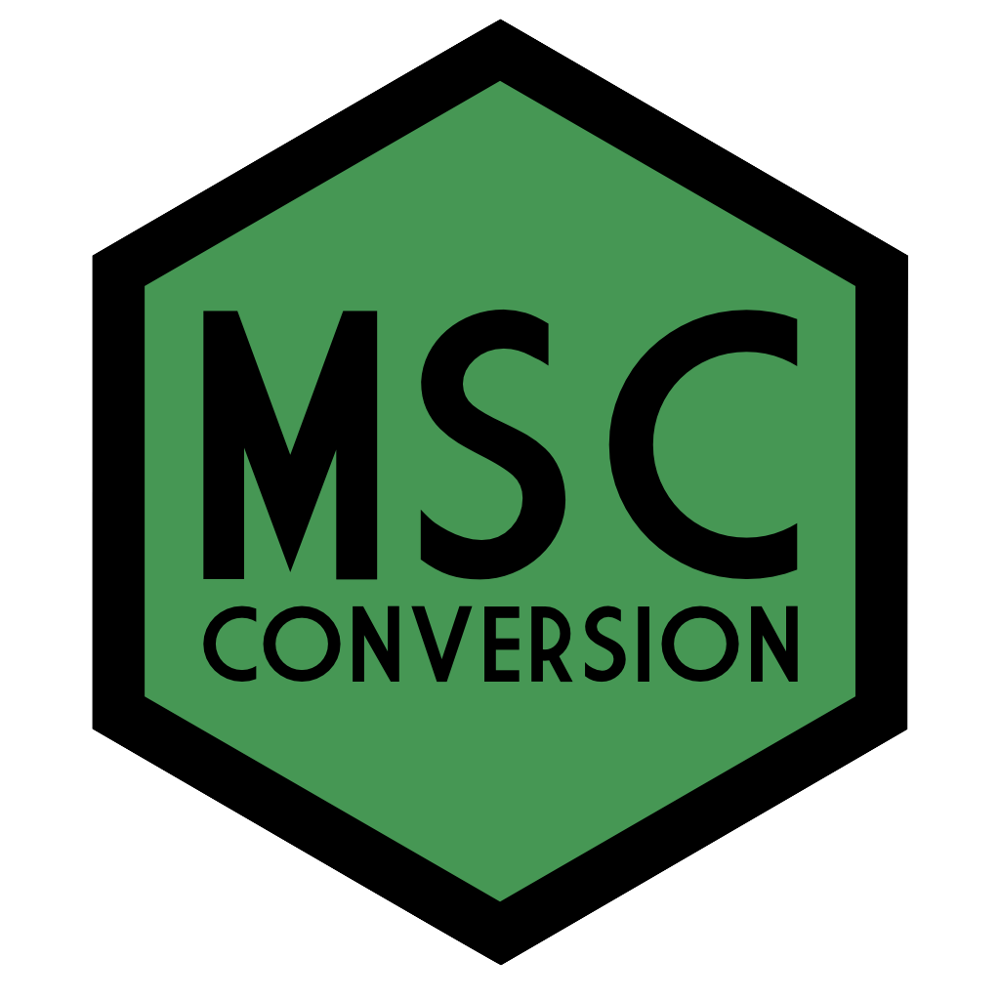

--- 
title: "MSc Conversion in Psychological Studies"
date: "2020-04-02"
bibliography:
- book.bib
- packages.bib
description: This book contains the materials for the one-year MSc Conversion in Psychological Studies/Science.
documentclass: book
link-citations: yes
site: bookdown::bookdown_site
biblio-style: apalike
---

# Overview {-}

In RM2 you will learn core data skills that allow you to manipulate and analyse quantitative data, a key component of an accredited psychology programme. In addition to this book, there are video walkthroughs available on Moodle and you can use Teams to ask any R related questions that you have.

The ability to work with quantitative data is a key skill for psychologists and by using R as our tool we can also promote reproducible research practices. Although it may seem like writing a programming script is more time-consuming than other point-and-click software you may have used, this is not the case! Once you have a script you can easily re-run your analysis without having to go through each step again manually which is a) easier and b) less likely to result in errors if you do something slightly different or forget one of the steps. 

Crucially, with an analysis script other researchers can also see how you got from the raw data to the statistics you report in your final paper. Sharing  analysis scripts online on sites such as the [Open Science Framework](https://osf.io/) is now seen as an important open science practice. Even if you don't continue with quantitative research in the future, the skills you develop on this course will allow you to evaluate quantitative research and to understand what goes on behind the scenes with data before the conclusions are presented.

## How to use this book

For each session there will be a chapter of the book to work through as an activity. **It is crucial that you work through this book consistently throughout the term**. You will learn R much more easily if you work on it each week and give yourself time to build and practice your skills. If you are comfortable with R and/or have programming experience, please feel free to work through this book at your own pace and complete more advanced chapters.

## Intended Learning Outcomes

By the end of this course students will be able to:

* Clean and wrangle data into appropriate forms for analysis
* Visualise data using a range of plots
* Conduct and interpret a core set of statistical tests (t-test, correlation, ANOVA, regression)
